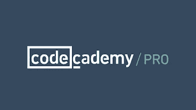
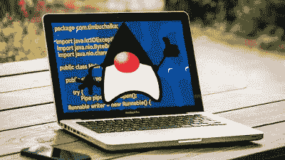

# CodeCademy Java 课程回顾【学习 Java 的最佳免费课程】

> 原文：<https://medium.com/javarevisited/how-to-learn-java-for-free-on-codecademy-in-2022-is-it-worth-it-560269849ade?source=collection_archive---------1----------------------->

## CodeCademy 是一个交互式学习平台，提供学习 Java、Python 和 JavaScript 3 种热门技能的免费课程。这篇文章回顾了 CodeCademy 的免费 Java 课程。

大家好，如果你想学习 Java 并且想知道学习 Java 的最好方法是什么，那么你来对地方了。过去，我曾分享过学习 Java 编程的最佳[书籍](/swlh/top-10-java-books-for-programmers-all-time-great-82b0ee0b831a)、[课程](/javarevisited/10-free-courses-to-learn-java-in-2019-22d1f33a3915)和[网站](https://javarevisited.blogspot.com/2018/07/top-5-websites-to-learn-coding-in-java.html)，在本文中，我将分享另一个免费在线学习 Java 的绝佳资源。

你可能不知道，CodeCademy 有一个免费的 Java 课程，非常适合初学者，已经有将近 230 万学生注册。这说明了 Java 的流行吗？

鉴于 Java 提供了一个很好的就业前景，而且学习 Java 的理由不止一个，我对注册学生的数量并不感到惊讶。CodeCademy 一直是从一开始就学习新编程语言或技术的绝佳资源。

我第一次使用 CodeCademy 是通过他们的免费 JavaScript 课程来学习 JavaScript，然后几个月前我用它来提高我的 T2 Python 和 Linux 命令技能。

虽然 [**Codecademy 的免费 Java 课程**](https://www.pntrs.com/t/TUJGR0lLR0JHRklJSkhCR0ZISk1N?url=https%3A%2F%2Fwww.codecademy.com%2Flearn%2Flearn-java) 对于任何一个懂 Java 的人来说都太基础了，但是如果你不懂 Java 又想学的话还是很棒的。它也终结了 StackOverflow、Reddit、Java 论坛上关于像 CodeCademy 学习 Java 这样的*网站的众多问题。你现在有 CodeCademy 本身教 Java。书本是知识和学习的唯一来源的日子一去不复返了。如今，互联网上充满了互动的网站和教程，它们将帮助你更快地学习。他们也很有魅力，所以你不会觉得无聊。顺便说一句，并不是所有的都像 CodeCademy 一样质量很好，所以总是要做一些研究，选择最好的。

简而言之，如果你想学习一门新的技术或者编程语言，比如 [Java](https://www.java67.com/2018/08/top-10-free-java-courses-for-beginners-experienced-developers.html) 或者 [JavaScript](/javarevisited/12-free-courses-to-learn-javascript-and-es6-for-beginners-and-experienced-developers-aa35874c9a32) ，先查一下 CodeCademy 有没有什么课程；如果是的话，那你就不用再进一步搜索了，直接抓起，马上开始学习。*

# 为什么要从 CodeCademy 学 Java？

老实说，我是 CodeCademy 的超级粉丝，所以你会发现我的理由有失偏颇，但我喜欢它，就像我喜欢 Head First 系列一样，它们都是学习新编程语言的绝佳资源。结合使用 [Head First Java](http://www.amazon.com/dp/0596009208/?tag=javamysqlanta-20) 和 CodeCademy 是在线学习 Java 的最佳资源，尤其是如果你是 Java 新手或完全的初学者。

我为什么喜欢 CodeCademy，因为它是互动的。当我从 [**CodeCademy**](https://bit.ly/codecademypro) 学习时，我可以用我不知道的编程语言编程几个小时，因为我实际上正在学习，我也擅长自己做事情，但 CodeCademy 提供了学习的动力。

在这个来自 [CodeCademy](https://javarevisited.blogspot.com/2019/09/codecademy-vs-udemy-vs-onemonth-which-is-better-for-learning-code.html) 的免费在线互动学习 Java 课程中，你不仅会学到 Java 基础知识，还会学到面向对象编程、数据结构以及如何调试 Java 程序，这是 Java 程序员的一项关键技能。

我还收到了许多读者的反馈，他们抱怨说，当他们试图自己学习一门新的编程语言时，他们感到停滞不前，无法跨越最初的几个障碍，如设置、语法和语义。CodeCademy 可以帮助你。

你不需要[设置好你的 Java 环境](http://javarevisited.blogspot.com/2013/02/how-to-install-jdk-7-on-windows-8-java-32bit-64.html)来编写一个简单的 Java 程序；你当然可以，但是一旦你有了一些感觉和信心。你可以去 CodeCademy 开始学习 Java，而不用担心任何事情，这是最棒的部分。我想这也符合 Java 的座右铭，即让应用程序开发人员专注于业务逻辑，所有系统的事情最好留给 JVM。

如果你对某件事感到困惑或困惑，或者想了解更多关于某个概念的知识，如[路径](http://java67.blogspot.com/2012/08/what-is-path-and-classpath-in-java-difference.html)、[类路径](http://javarevisited.blogspot.com/2013/02/windows-8-set-path-and-classpath-java-windows-7.html)、 [JAVA_HOME](http://javarevisited.blogspot.com/2012/02/how-to-set-javahome-environment-in.html) 、 [JDK 或 JRE](http://javarevisited.blogspot.com/2011/12/jre-jvm-jdk-jit-in-java-programming.html) ，那么你可以在这里寻求帮助。超过 230 万人参加了这个课程，这是一个令人印象深刻的巨大证明，证明你不会在这个课程上浪费时间。

虽然他们的免费会员资格足以让你学习 Java，但如果你喜欢 CodeCademy，你也可以考虑他们的 [**Pro 会员资格**](https://bit.ly/codecademypro) ，它提供了访问项目、评估、测验以及更多互动和高级材料的机会，以学习新的技术技能。它的费用大约是每月 16 美元，并提供他们所有的课程和项目。

# 2023 年学 Java 还有哪些网站？

如果出于某种原因，你不喜欢 CodeCademy，或者你已经在 CodeCademy 上了一门课，并正在寻找一些更具互动性的学习课程，那么我建议你查看 Udemy 上最好的在线 Java 课程，如 [**完整的 Java Masterclass**](https://click.linksynergy.com/fs-bin/click?id=JVFxdTr9V80&subid=0&offerid=323058.1&type=10&tmpid=14538&RD_PARM1=https%3A%2F%2Fwww.udemy.com%2Fjava-the-complete-java-developer-course%2F) ，它提供了 Java 基础知识的良好概述，也是最新的课程。它涵盖了最近版本中的新 Java 特性。

顺便说一下，Udemy 还为 Java 程序员提供了更高级的课程，如**[**Spring Framework 5:初学者到大师**](https://click.linksynergy.com/fs-bin/click?id=JVFxdTr9V80&subid=0&offerid=323058.1&type=10&tmpid=14538&RD_PARM1=https%3A%2F%2Fwww.udemy.com%2Fspring-framework-5-beginner-to-guru%2F) 学习 Spring Framework 的最新版本。**

**他们也有许多 Java 程序的免费课程，你可以参加。甚至他们的付费课程也非常便宜，我在他们不时进行的 Udemy 销售上以每门课程 10 美元的价格买了很多。您也可以在 [**5 个网站上阅读我的文章，在线学习 Java**](http://javarevisited.blogspot.com/2015/06/2-websites-to-learn-coding-in-java-online-free.html)。它为您提供了更多免费在线学习 Java 的资源。**

**</javarevisited/10-best-places-to-learn-java-online-for-free-ce5e713ab5b2>  

互联网上有很多关于 Java 的免费信息，就像你可以在线阅读或下载 PDF 格式的关于 Java 的免费书籍[一样，其中也包括用 Java 思考。有几个 Java 论坛](http://java67.blogspot.com/2013/11/10-free-java-programing-books-download-PDF-HTML.html)，你可以在那里发表你的疑问并寻求帮助。

那都是家伙。对于所有想学习 Java 的人来说，这是一个好消息。你现在可以去 CodeCademy[**创建你的免费账户**](https://bit.ly/codecademyhome) 并开始学习 Java。由于书籍是学习的重要组成部分，您也可以购买 Head First Java 第二版来进一步促进您的学习。

<https://bit.ly/codecademyhome>  

您可能喜欢的其他免费 Java 编程资源

*   [2023 年 Java 开发者路线图](https://javarevisited.blogspot.com/2019/10/the-java-developer-roadmap.html)
*   [成为全栈 Java 开发人员的前 5 门课程](https://javarevisited.blogspot.com/2020/04/top-5-courses-to-become-full-stack-java-developer-with-Angular-and-Reactjs.html#axzz6Nq9yk7Sc)
*   2023 年 Java 开发人员可以学到的 10 件事
*   [面向 Java 开发者的 5 门免费 Spring 框架课程](http://www.java67.com/2017/11/top-5-free-core-spring-mvc-courses-learn-online.html)
*   [2023 年学习 Web 开发的五大课程](https://javarevisited.blogspot.com/2018/02/top-5-online-courses-to-learn-web-development.html)
*   [面向 Java 开发者的 10 门免费 Spring Boot 课程](/javarevisited/10-free-spring-boot-tutorials-and-courses-for-java-developers-53dfe084587e)
*   [学习大数据和 Apache Spark 的 5 门课程](http://javarevisited.blogspot.com/2017/12/top-5-courses-to-learn-big-data-and.html)
*   [面向 Web 开发人员的十大 JavaScript 教程和课程](https://javarevisited.blogspot.com/2018/06/top-10-courses-to-learn-javascript-in.html)
*   [2023 年学习 Spring Boot 的 5 大课程](https://javarevisited.blogspot.com/2018/05/top-5-courses-to-learn-spring-boot-in.html)
*   [5 门免费的数据结构与算法课程](https://javarevisited.blogspot.com/2018/01/top-5-free-data-structure-and-algorithm-courses-java--c-programmers.html)
*   [面向程序员和开发人员的 5 门免费 Linux 课程](http://www.java67.com/2018/02/5-free-linux-unix-courses-for-programmers-learn-online.html)
*   [学习 React JS 框架的 5 门免费课程](http://www.java67.com/2018/02/5-free-react-courses-for-web-developers.html)
*   [2023 年每个 Java 开发者都应该学习的 10 个工具](https://www.java67.com/2018/04/10-tools-java-developers-should-learn.html)
*   [深入学习 Spring 的 10 个最佳在线课程](/javarevisited/10-best-online-courses-to-learn-spring-framework-in-2020-f7f73599c2fd)

感谢您阅读本文。如果你喜欢这些免费的 Java 编程课程，请与你的朋友和同事分享。如果您有任何问题或反馈，请留言。

**P.S.** —如果你不介意投资一些钱来学习像 Java 这样有价值的技能，那么你可能也想看看这个关于学习 Java 编程的 [**10 门最佳课程的列表**](/javarevisited/top-5-java-online-courses-for-beginners-best-of-lot-1e1e240a758) 。我精心挑选了最好的 Java 课程，让你深入学习所有核心的 Java 概念。

<https://javarevisited.blogspot.com/2018/05/top-5-java-courses-for-beginners-to-learn-online.html> **