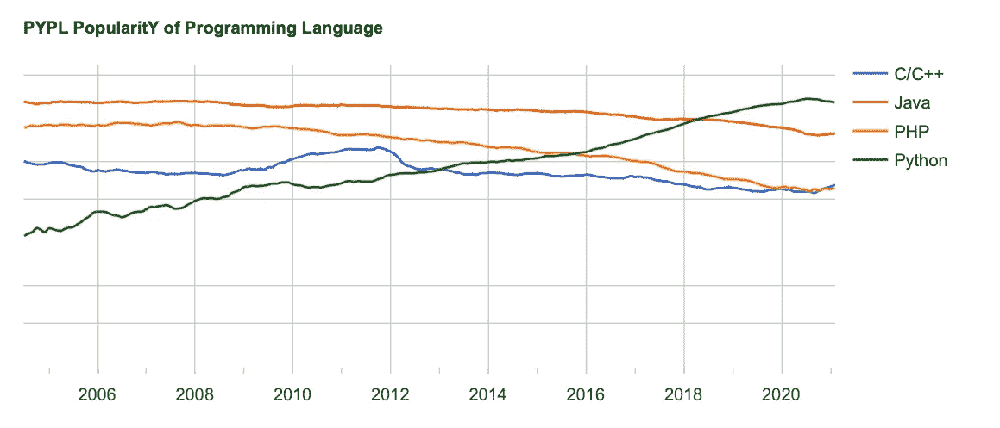
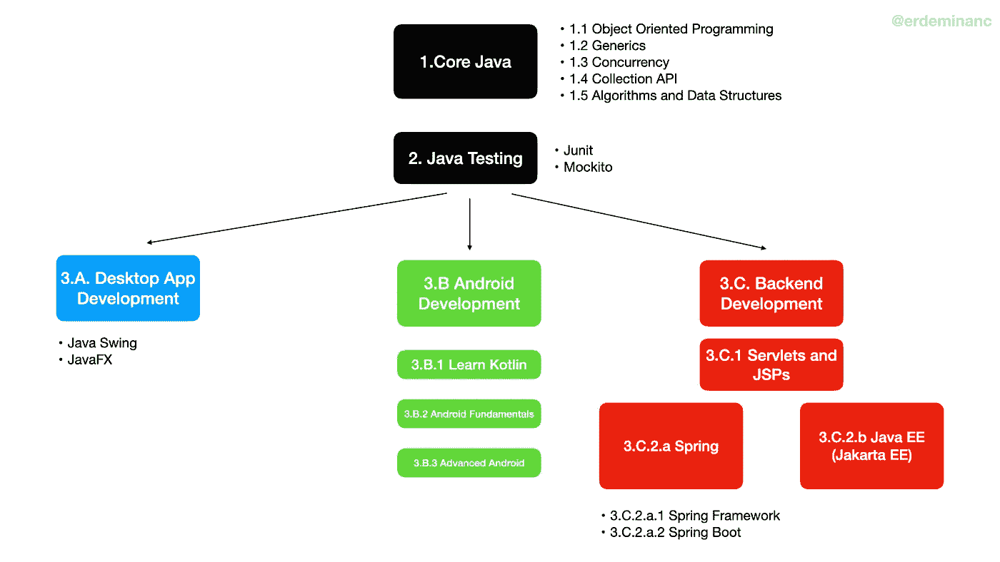
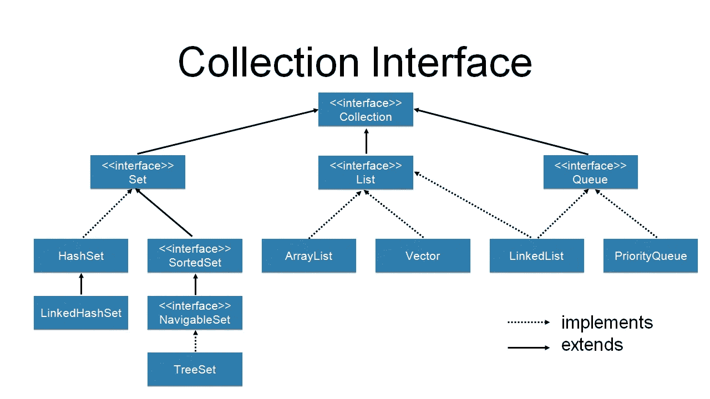

# 2021 年如何免费学习 Java？

> 原文：<https://medium.com/javarevisited/how-to-learn-java-in-2021-for-free-96cc239b292a?source=collection_archive---------3----------------------->

成为一名软件开发人员已经成为一种有吸引力的工作偏好。业界对 Java 开发人员的需求仍然很高。人们很容易迷失在寻找[该学什么](/swlh/10-things-java-developer-should-learn-in-2019-5e0cf388e07f)中，这就是为什么我想列出 2021 年免费资源与 **Java 学习路线图。在这篇文章中，你会发现从 Youtube、 [Coursera](/javarevisited/18-coursera-courses-you-can-join-in-2020-to-learn-from-the-worlds-top-tech-companies-google-74af46967d1e?source=---------35----------------------------) 或大学免费资源中精选的资源，但更重要的是，一个好的路线图是学习一门新语言/技术的关键。**

> 所以让我们开始吧！..

Java 的第一个版本于 1996 年 1 月 23 日发布，至今仍被许多现代科技公司、银行、软件公司和企业家广泛使用。Java 在过去的 25 年里仍然如此受欢迎，因为；

*   它设计得很好，它吸取了其他语言的精华，丢弃了有问题的部分。
*   有一个非常非常大的社区，而且还在增长。
*   可供 Java 使用的[库](https://javarevisited.blogspot.com/2018/01/top-20-libraries-and-apis-for-java-programmers.html)、[框架、](/javarevisited/top-10-frameworks-full-stack-java-developers-can-learn-in-2020-5995021401e5)和[工具](https://www.java67.com/2018/04/10-tools-java-developers-should-learn.html)数量惊人。
*   许多公司在他们的代码库中大量采用了，这是很难替代的。

基于谷歌搜索教程的编程语言流行度( [https://pypl.github.io](https://pypl.github.io) )

从上面的图表中我们可以看到，2021 年，许多新开发人员都在寻找学习 Java 的机会，然而今天的 Java 社区、工具和框架已经非常庞大。人们很容易在寻找学习内容的过程中迷失方向，因此你会在 2021 年找到一份令人惊叹的 Java 学习路线图。

# **2021 年 Java 学习路线图**

# 1.核心 Java

框架、技术听起来可能很吸引人，但是你绝对应该从学习语言本身开始。

**主题涵盖:** JDK，编译 Java 代码，Java 语法，包，变量，逻辑&比较运算符，if 语句，数组，for 循环，增强 for 循环，while 循环，用户输入，方法，类，对象，打印

## 1.1 面向对象编程

不用担心 [OOP](https://javarevisited.blogspot.com/2018/08/5-object-oriented-programming-and-design-courses-for-Java-programmers.html#axzz6fvDCikIM) 的流行语，非常好理解。

**涵盖的主题:**封装、抽象、继承、多态

## 1.2 仿制药

也有关于[仿制药](https://javarevisited.blogspot.com/2011/09/generics-java-example-tutorial.html)的视频资源，不过我目前找到的最好的教程是甲骨文的。

转到:[泛型教程](https://docs.oracle.com/javase/tutorial/java/generics/index.html)

## 1.3 并发性

在这个主题中你会发现一些奇怪的词，但是理解线程、[并发和多线程](/javarevisited/8-best-multithreading-and-concurrency-courses-for-experienced-java-developers-8acfd3b25094)背后的思想是很重要的。[这里你会发现一个很好的 Yotube 并发播放列表](https://www.youtube.com/playlist?list=PLL8woMHwr36EDxjUoCzboZjedsnhLP1j4)。

**要涵盖的主题:**并发和多线程

另外，如果你是编程新手，理解线程如何工作就足够了，但是你应该回来深入理解并发性。

## 1.4 收集 API

当你在学习[采集 API](/javarevisited/7-best-java-collections-and-stream-api-courses-for-beginners-in-2020-3ad18d52c38) 的时候，把上面的图像做成你最好的朋友。:)

在本节中，您应该了解集合之间的差异。(哪个保持排序或保持唯一元素等。)在完成这一部分之后，您应该对为您的用例选择正确的集合有一个大致的了解。

下面你会发现一个关于集合 API 的简短教程。

[https://www.youtube.com/watch?v=yiB_AFCVUH0](https://www.youtube.com/watch?v=yiB_AFCVUH0)

**要涵盖的主题:**集合、列表、队列、数组列表、哈希集合、链接列表

## 1.5 算法和数据结构

这个主题在专家之间是一个有争议的问题，因为在日常生活中，你不会从头开始编写排序算法或实现数据结构。然而，[学习**算法和数据结构**](/hackernoon/10-data-structure-algorithms-and-programming-courses-to-crack-any-coding-interview-e1c50b30b927) 肯定会让你成为更好的程序员。如果你是编程新手，你将在努力解决算法和数据结构问题的同时提高你的编程技能。

我找到的关于这个话题的最佳资源是 Coursera 上的[数据结构和算法专门化](https://www.coursera.org/specializations/data-structures-algorithms)。我也学完了这门课，所以强烈推荐。

没有实施，学习就什么都不是。这就是为什么你应该在 [HackerRank](https://www.hackerrank.com/) 和 [Leetcode](https://leetcode.com/) 上测试自己的算法和数据结构问题。

除了让你成为一名优秀的程序员，算法和数据结构在求职面试中也至关重要。如果你正在寻找一本准备工作面试的好书，我建议你阅读 Gayle Laakmann McDowell 的《破解编码面试》中的问题。

# 2.Java 测试

照片由[国家癌症研究所](https://unsplash.com/@nci?utm_source=medium&utm_medium=referral)在 [Unsplash](https://unsplash.com?utm_source=medium&utm_medium=referral) 上拍摄

好了，你学会了如何编码，现在是时候测试它是否如你预期的那样工作了。

还有其他的测试框架，但是业界最流行的是 JUnit。

1.  测试自动化大学 6 月 5 日的免费课程。

2.[简单的模仿介绍](https://www.youtube.com/watch?v=HsQ9OwKA79s&t=8s)

在研究并编写了代码的样本测试之后，我建议你阅读关于测试驱动开发的文章。(确保您了解 TDD、BDD 和 ATDD 之间的区别)

**涵盖的主题:** JUnit、Mockito

# **下一步去哪里？**

一旦你完成了 Java 测试，你会发现不同的途径。这些是不同的专业知识，所以你不需要知道所有的。然而，有一个总的看法是件好事。

**3.A .桌面应用开发**

**3.B .安卓开发**

**3.C .后端开发**

我不会特别推荐这些途径中的任何一个，所以你应该听听自己想发展什么，并在 Linkedin、Glassdoor 等不同途径上寻找工作机会。

# **3.A .桌面应用开发**

由[亚历山大·沙托夫](https://unsplash.com/@alexbemore?utm_source=medium&utm_medium=referral)在 [Unsplash](https://unsplash.com?utm_source=medium&utm_medium=referral) 上拍摄的照片

Java Swing 和 [JavaFX](/javarevisited/6-free-courses-to-learn-servlet-jsp-and-java-fx-in-2020-best-of-lot-720201c84f63) 是可用的选项，尽管桌面应用程序在过去几年被 web 应用程序所取代。桌面应用程序并没有完全消亡，因为我们每天都在使用许多桌面应用程序，如 Trello、Slack、Zoom、Office 应用程序等等。

Java Swing 是一项古老的技术，但是我相信它仍然是现代应用程序开发的良好起点。[查看这个 Youtube 教程，了解基本知识。](https://www.youtube.com/watch?v=Kmgo00avvEw)

声明式应用程序开发是一个热门话题，它代表以编程方式声明 UI。你可能想尝试一下 Flutter 和 Jetpack Compose。

# 3.B. Android 开发

Denny Müller 在 [Unsplash](https://unsplash.com?utm_source=medium&utm_medium=referral) 上拍摄的照片

Android 占据了近 70%的移动市场，这给 Android 开发者带来了巨大的需求。

直到 2019 年宣布在 Android 上对 [Kotlin](/javarevisited/top-5-courses-to-learn-kotlin-in-2020-dfc3fa7706d8?source=---------16------------------) 的一流支持，谷歌才首选 Java 作为主要编程。今天，为 Android 开发编写 Kotlin 代码是一个流行的选择，因此初学者应该更喜欢这条道路。

Kotlin 与 Java 有相似的语法，它也可以在 Java 虚拟机上工作，因此 Java 开发人员在学习 Kotlin 编程方面有所不同。(ps。我花了一周时间)

## 3.B.1 学习科特林

[Jetbrains 提供的面向 Java 开发者的 Kotlin](https://www.coursera.org/learn/kotlin-for-java-developers)课程，是这种语言本身的创造者公司，是我迄今为止见过的[最好的 kot Lin 课程](/javarevisited/7-free-courses-to-learn-kotlin-in-2020-327c3872c1e1?source=collection_home---4------2-----------------------)。教师会讲述 Java 之间的差异和相似之处，这就是为什么 Java 更容易理解的原因。

## 3.B.2 Android Kotlin 基础知识

这部分是 Google 提供的一系列 codelabs，设计得非常好，涵盖了以下主题。

来源:developer.android.com

***第一课:打造你的第一个 app***

[开始第一课](https://codelabs.developers.google.com/codelabs/kotlin-android-training-install-studio/index.html?index=..%2F..android-kotlin-fundamentals#0)

***第二课:布局***

[开始第二课](https://codelabs.developers.google.com/codelabs/kotlin-android-training-linear-layout/index.html?index=..%2F..android-kotlin-fundamentals#0)

***第三课:导航***

[开始第三课](https://codelabs.developers.google.com/codelabs/kotlin-android-training-create-and-add-fragment/index.html?index=..%2F..android-kotlin-fundamentals#0)

***第四课:活动和片段生命周期***

[开始第四课](https://codelabs.developers.google.com/codelabs/kotlin-android-training-lifecycles-logging/index.html?index=..%2F..android-kotlin-fundamentals#0)

***第五课:架构组件***

开始第五课

***第六课:房间数据库和协程***

[开始第六课](https://codelabs.developers.google.com/codelabs/kotlin-android-training-room-database/index.html?index=..%2F..android-kotlin-fundamentals#0)

***第七课:回收查看***

[开始第七课](https://codelabs.developers.google.com/codelabs/kotlin-android-training-recyclerview-fundamentals/index.html?index=..%2F..android-kotlin-fundamentals#0)

***第八课:连接互联网***

[开始第八课](https://codelabs.developers.google.com/codelabs/kotlin-android-training-internet-data/index.html?index=..%2F..android-kotlin-fundamentals#0)

***第九课:知识库***

[开始第九课](https://codelabs.developers.google.com/codelabs/kotlin-android-training-repository/index.html?index=..%2F..android-kotlin-fundamentals#0)

***第十课:为每个人设计***

[开始第十课](https://codelabs.developers.google.com/codelabs/kotlin-android-training-styles-and-themes/index.html?index=..%2F..android-kotlin-fundamentals#0)

## 3.Kotlin 中的 B.3 高级 Android

完成 3 后。B.2，我的建议是写一个应用，部署在 Google Play 上。在编写代码时，你可能需要下面的主题，然后回来完成 Google 提供的 codelabs。

【developer.android.com】来源:T2

***第一课:通知***

[开始第一课](https://codelabs.developers.google.com/codelabs/advanced-android-kotlin-training-notifications/#0)

***第二课:高级图形***

[开始第二课](https://codelabs.developers.google.com/codelabs/advanced-andoid-kotlin-training-custom-views/#0)

***第三课:动画***

[开始第三课](https://codelabs.developers.google.com/codelabs/advanced-android-kotlin-training-property-animation)

***第四课:地理***

开始第四课

***第五课:测试和依赖注入***

[开始第五课](https://codelabs.developers.google.com/codelabs/advanced-android-kotlin-training-testing-basics/)

***第六课:登录***

[开始第六课](https://codelabs.developers.google.com/codelabs/advanced-android-kotlin-training-login)

# 3.C 后端开发

真实机构在 [Unsplash](https://unsplash.com?utm_source=medium&utm_medium=referral) 上拍摄的照片

Java 在服务器端开发方面非常强大，它有很多框架、工具和库，有一个庞大的社区。

## 3.C.1 Servlets 和 JSP

你可能永远不需要编写 [servlet 和 JSP 代码](/javarevisited/6-free-courses-to-learn-servlet-jsp-and-java-fx-in-2020-best-of-lot-720201c84f63)，但是，为了理解后端开发框架是如何工作的，你应该了解它们。

Telusko 是我在 Youtube 上最喜欢的导师之一，所以强烈推荐向他学习 servlets 和 JSP。

## 3.C.2 .弹簧

克里斯汀娜·帕普在 [Unsplash](https://unsplash.com?utm_source=medium&utm_medium=referral) 上的照片

[Spring](https://spring.io) 是最流行的 Java 框架，它使 Java 编程变得现代、简单和高效。Spring 有几乎任何你能想象到的项目，比如 web、云、数据、安全、集成等等。

**3。C.2.a.1 弹簧框架**

大多数人在理解春天的基础知识之前，就一头扎进了 Spring Boot。这是你应该避免的，因为除非你完全理解 Spring，否则你在配置项目或解决问题时可能会遇到困难。

***主题涵盖:*** *依赖注入、AOP、Bean、配置*

**3。Spring Boot**

Spring Boot 是一个开源的基于 Java 的框架，它有惊人的自动配置功能，并提供了一个嵌入式应用服务器。

你可以从[朋友代码](https://www.youtube.com/watch?v=9SGDpanrc8U)或[自由代码营](https://www.youtube.com/watch?v=vtPkZShrvXQ)频道观看《Spring Boot 》,这两个频道都是由同一个教练提供的。

## 3.C.2.b Java EE

Java EE 是由 Oracle 支持的社区驱动的企业软件。

Java EE 是 Spring 框架的可靠替代品，Spring 目前在开发人员中更受欢迎。我必须承认 Java EE 在那些年里发展了很多，Eclipse Foundation 将其重命名为 Jakarta EE，因为 Oracle 拥有“Java”品牌的权利。

我在 Youtube 上找到的一个很好的教程是 [rieckpil 的](https://www.youtube.com/channel/UCEbZTcePN9QwMr1Lr1SED0Q) [Jakarta EE 快速入门指南](https://www.youtube.com/watch?v=aiDcgEZY21I&list=PLFjB4VDnlT_1UH_Ncopre4nhCRNtBxohX)。

如果你使用了我上面的资源，请通过媒体([额尔登·i̇nanç](https://medium.com/u/f1a13b5135a6?source=post_page-----96cc239b292a--------------------------------))或[推特](https://twitter.com/erdeminanc))让我知道。

在 [Unsplash](https://unsplash.com?utm_source=medium&utm_medium=referral) 上 [Pablo Heimplatz](https://unsplash.com/@pabloheimplatz?utm_source=medium&utm_medium=referral) 拍摄的照片

干得好！