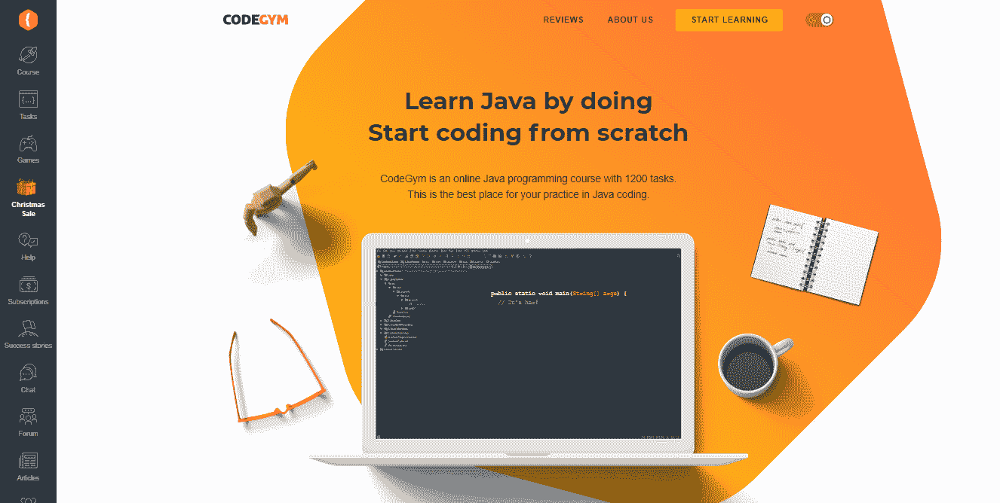
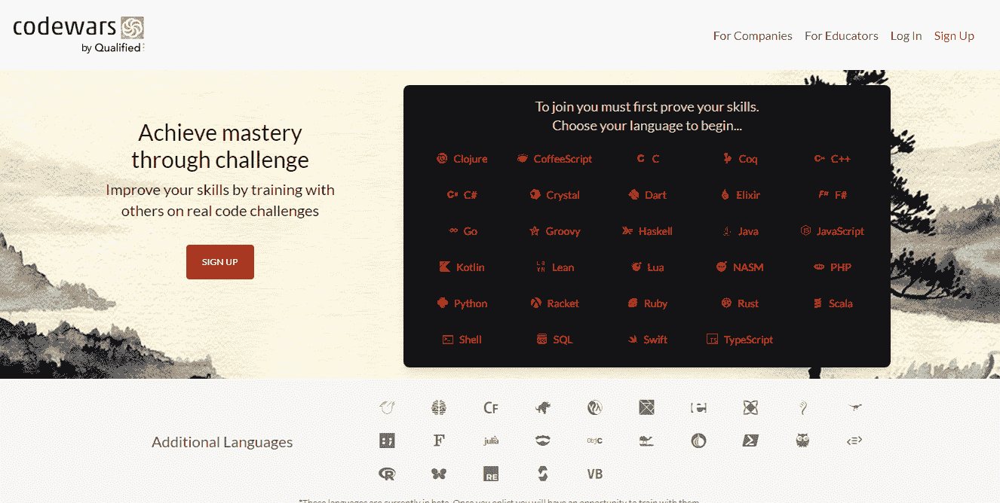
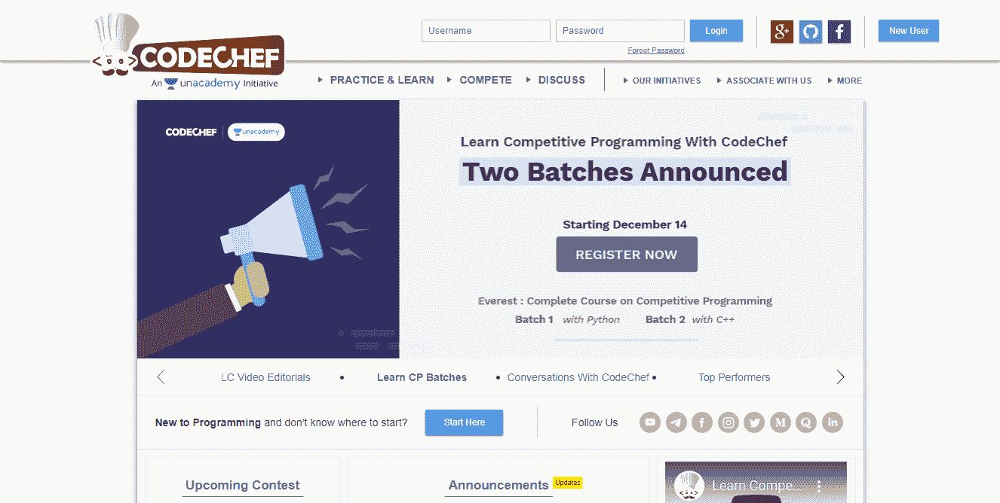
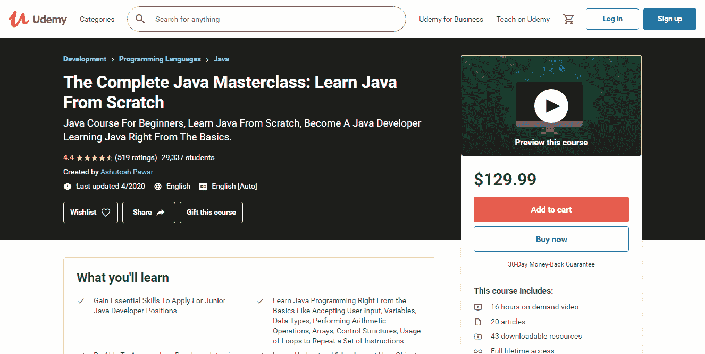
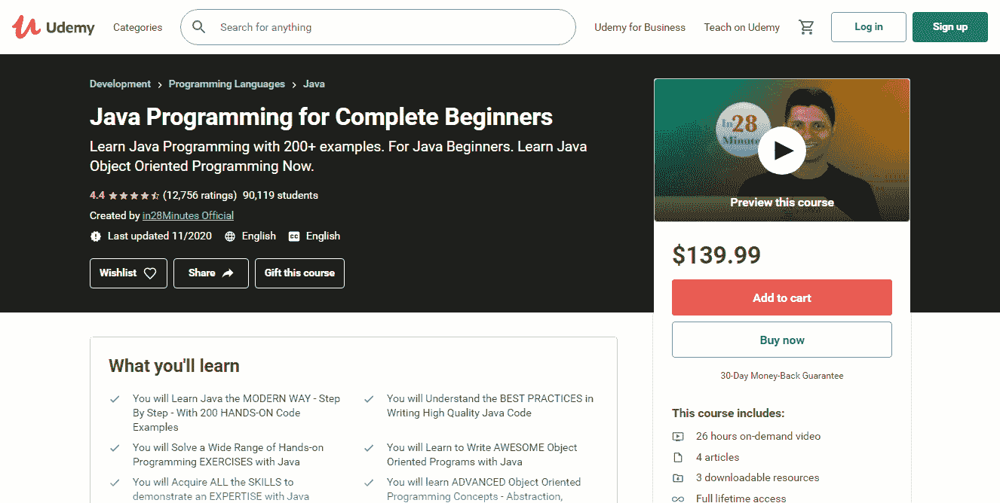
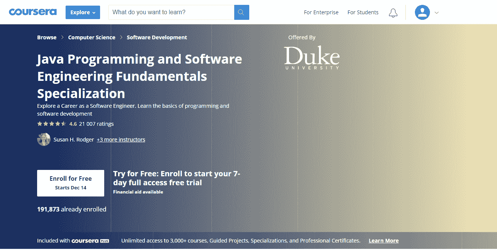

# 如何循序渐进地学习 Java:新手综合指南

> 原文：<https://medium.com/javarevisited/how-to-learn-java-step-by-step-a-comprehensive-guide-for-newbies-952454c2c301?source=collection_archive---------2----------------------->

麦克斯韦·尼尔森在 T2 的照片

Java 是一种广受欢迎的编程语言，通常用于构建小型和企业级的服务器端应用程序。如果你是一个没有编程背景的新人，想开始你的软件开发之旅，Java 是一个很好的起点。它对初学者很友好，并拥有一个庞大而繁荣的社区，你可以期待它的支持。另外，学习这门编程语言一定会让你成为未来的抢手专家。

在这篇文章中，我将解释如何一步一步地学习 Java，并成为一名熟练的开发人员。那么，我们开始吧。

# 1.选择在线资源开始

随着互联网技术的快速发展，学生不再仅仅局限于书本或线下教育。有许多在线课程、视频教程、播客和编码竞赛可以帮助您掌握最重要的 Java 概念和特性。我挑选了一些。所以，检查一下。

# 注重实践的课程

看起来 Java 程序员并没有被之前无数吸引人的课程宠坏。即使在线课程有很好的内容和足够的实践练习，它们也很难让学习者参与进来。幸运的是，事情正在发生变化，今天，有许多针对每个口味和预算的互动课程。大多数都带有令人兴奋的编码挑战、测验和游戏，鼓励新手继续练习编程语言。

我喜欢的一些课程被进一步列出。

## CodeGym

[CodeGym](https://codegym.cc) 是一门游戏化的 Java 编程课程，包含四个任务，每个任务十个级别。您将编写大量代码来一个接一个地完成任务。该计划还因其理论和实践的公平分享而闻名，以 1200+编码任务的形式呈现。完成每一项任务后，你可以让虚拟导师来验证。CodeGym 还拥有一个活跃的社区，允许您与同行交流和提问。

## 代码战争

[Codewars](https://www.codewars.com) 平台可以让新人掌握各种编程语言，包括 Java。该课程通过与其他开发人员一起接受名为“形”的挑战训练，帮助您提高技能。在完成越来越多的形之后，你会获得等级和荣誉。此外，您可以创建自己的形，并测试社区成员的知识。

## 赛博道场

像许多其他学习平台一样， [Cyber-Dojo](https://cyber-dojo.org/creator/home) 需要完成任务和练习，但它仍然有一个不同的目标。创建该课程是为了鼓励您提高技能，而不是尽快达到最终水平并完成游戏。你必须完成的所有任务都有详尽的描述，并提供了一个结果应该是怎样的例子。

## 厨师长

[CodeChef](https://www.codechef.com) 以其编码竞赛和挑战而闻名，参与者甚至可以赢得奖杯。然而，除了与其他开发者竞争，用户还可以访问与不同技术主题相关的论坛讨论，包括二分搜索法和算法。

# Coursera 和 Udemy 视频课程

## 完整的 Java Masterclass

这个[编程课程的名字](https://www.udemy.com/course/java-programming-course/)不言自明。你将熟悉 Java 从基础到更复杂的概念，如[多线程](/javarevisited/8-best-multithreading-and-concurrency-courses-for-experienced-java-developers-8acfd3b25094)、 [OOP](/javarevisited/7-best-online-courses-to-learn-object-oriented-design-pattern-in-java-749b6399af59) 、数组列表、泛型等。

## 面向完全初学者的 Java 编程

这门 [Java 编程课程](https://www.udemy.com/course/java-programming-tutorial-for-beginners/)非常适合之前没有编程专业知识的学生。它将解释如何一步一步地学习 Java，并向您介绍申请第一份全职工作所需的最重要的 Java 特性和概念。

## 杜克大学的 Java 认证

这个 [Coursera specialization](https://www.coursera.org/specializations/java-programming) 是为绝对初学者设计的，旨在教他们基本的编程概念。该计划包括 5 门课程，一门是与 [JavaScript](/javarevisited/10-best-online-courses-to-learn-javascript-in-2020-af5ed0801645) 、 [HTML](/javarevisited/10-best-html-and-css-courses-for-beginners-in-2021-6757eec00032) 、 [CSS](/javarevisited/top-5-advanced-css-courses-to-learn-flexbox-grid-and-sass-da8e37b09b1d) 相关的编程基础，其余四门是专门针对 Java 编程的。

# 与 Java 编程相关的 YouTube 频道

互联网上大多充斥着教具，书籍、网络课程、教程并不是唯一的来源。YouTube 是另一个有用的，重要的是，它是一个免费的资源，可以让你学习编码。YouTube 上与节目相关的频道似乎数不胜数，所以我只想重点介绍其中的几个:

*   德里克·巴纳斯
*   [用 Mosh 编程](https://www.youtube.com/user/programmingwithmosh)
*   [Java](https://www.youtube.com/user/java)
*   [Devoxx](https://www.youtube.com/channel/UCCBVCTuk6uJrN3iFV_3vurg/)

# 2.成为社区的一部分

向初学者推荐 Java 的原因之一是它不断发展壮大的社区提供了强有力的支持并有助于解决问题。所以，当开始[学习 Java](https://javarevisited.blogspot.com/2018/07/top-5-websites-to-learn-coding-in-java.html) 的时候，一定要加入社区，积极参与它的生活。与其他程序员交流和参观不同的技术活动会让你认识有用的人。

或者你可以从网上论坛开始，接触那里的开发者，甚至找一个导师。有一个教练不仅能让你对编程更有信心，还能鼓励你进步。

这里有一个论坛的候选名单:

*   [GitHub](https://github.com)
*   [堆栈溢出](https://stackoverflow.com)
*   [黑客新闻](https://news.ycombinator.com)
*   [站点点](https://www.sitepoint.com/community/)
*   Reddit 频道
*   r/编程
*   学习编程
*   r/代码在一起
*   r/编程工具
*   r/游戏开发
*   r/Prog articles
*   r/webdev
*   r/每日程序
*   r/java
*   r/javahelp

如果由于某种原因你没有找到导师，GitHub、StackOverflow、SourceForge 和其他论坛上有许多经验丰富的程序员随时准备帮助你并给出建议。即使你可以快速掌握信息并弄清楚代码是如何工作的，你仍然可以在自学过程中采用不好的做法。因此，外部帮助从来都不是多余的，而且可以指出一些可能的知识缺口。

一旦你对自己的技能更有信心，并且不用回头看任何人就能编码，那就是时候向其他新手开发者伸出援手了。除了别的以外，这是一个刷新你的知识和为你的声誉加分的好方法。

# 3.你精通 Java 基础知识吗？然后想想你自己的小项目

一旦你掌握了足够的知识，至少学会了 Java 语法、基本概念、 [OOP](/javarevisited/my-favorite-courses-to-learn-object-oriented-programming-and-design-in-2019-197bab351733?source=---------103------------------) 、[集合](/javarevisited/7-best-java-collections-and-stream-api-courses-for-beginners-in-2020-3ad18d52c38)等。，是时候考虑构建自己的小项目了。从头开始创造东西是获得更多经验的好方法。

如果你不知道要创建什么项目，就把它想象成能让你的生活更轻松的东西。即使你决定做一个你感兴趣的计算器或其他小项目，开发过程仍然会帮助你更好地了解新技术。

您可以尝试的其他项目包括:

*   游戏:流行的经典视频游戏的克隆，如扫雷，蛇，2048，甚至超级马里奥兄弟或 Flappy-Bird
*   学校，体育，食谱，库存和图书馆管理系统
*   计费系统
*   货币转换器
*   银行应用程序，等等

# 4.阅读别人的代码

除了自己写代码，我还建议你养成阅读其他开发者写的代码的习惯。GitHub 或 StackOverflow 拥有大量开源代码，您可以对其进行检查甚至逆向工程。当你或多或少理解了代码是如何工作的，继续前进，并尝试独立运行它。它将促进学习过程，并帮助你获得几乎所有你想知道的编程知识。

你对代码修改得越多，你就能找到越多解决问题的方法。因此，你练习和探索得越多，你就会成为越好的专家。

# 5.坚持老式的“铅笔代码”方法

手工编码是学习编程的有效方法。这种方法经常用于大学考试和技术面试，因为它显示了学生或程序员的熟练程度。

除此之外，手工编码是一种所谓的压力测试，可以揭示可能的知识差距。由于用于编写计算机程序的集成开发环境增加了许多功能，并简化了开发过程，专家们很容易会遗漏一些东西。这就是“铅笔代码”允许理解开发人员如何掌握结构和语法的地方。

所以，留出你的时间来尝试这种老式的做法。

# 6.使用附加工具获得更顺畅的学习路径

在线教育是好的，因为，除了别的以外，它给你提供了免费和方便的访问各种工具和网站的机会，这些工具和网站在各个方面都可以帮助你。我个人建议把接下来的三个工具放在列表里。

*   [LeetCode](https://leetcode.com/problemset/all/) 是一个网站，开发者在这里练习编码技能，为面试做准备，进入 FAANG 公司，或者提高员工薪酬。
*   [StayFocusd](https://chrome.google.com/webstore/detail/stayfocusd/laankejkbhbdhmipfmgcngdelahlfoji) 是一款专注应用，是谷歌 Chrome 的扩展形式，用于阻止个人电脑上的分心，保持专注，从而提高生产力。
*   [我的学习生活](https://www.mystudylife.com)是你的纸质计划器的电子版，旨在通过安排和制定时间表、设置未完成任务的通知等来帮助你管理你的学习生活。

# 包装东西

正如您所看到的，即使您以前没有任何经验，Java 也是您开始编程之路的舒适方式。有很多实用的，[互动课程](/javarevisited/top-5-java-online-courses-for-beginners-best-of-lot-1e1e240a758)，视频教程，YouTube 频道都会讲解如何一步一步的学习 Java。Java 也因其活跃的社区而闻名，这意味着您永远不会独自面对这些问题。

所以，如果你觉得 Java 是你的语言，那就开始学习吧。