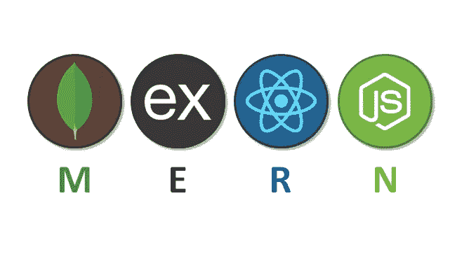
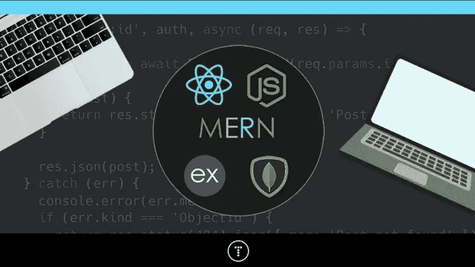
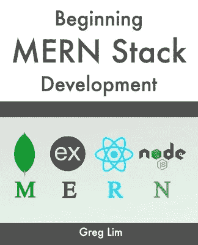

# 如何学习 2023 年的 MERN 堆栈？书籍、课程和项目

> 原文：<https://medium.com/javarevisited/how-to-learn-mern-stack-from-scratch-1784618eaffa?source=collection_archive---------0----------------------->

## 这些是学习 MERN 栈，并在 2023 年成为使用 JavaScript 编程语言的全栈 web 开发者的最佳书籍、课程和项目

大家好，如果你想在 2023 年学习 MERN 堆栈，但不知道从哪里开始，那么你来对地方了。之前，我已经分享了学习 MERN 堆栈 的 [**最佳课程，在这篇文章中，我将分享从头开始学习 MERN 堆栈的 3 种方法。如果你不知道 MERN 堆栈是世界上最流行和最广泛使用的 web 开发堆栈之一。**](/javarevisited/top-5-online-courses-to-learn-mern-stack-in-depth-9947230f194)

如果你不知道，MERN 堆栈在客户端使用 [React.js](https://javinpaul.medium.com/top-5-courses-to-learn-react-js-in-2019-best-of-lot-fa02cd96cdf0) ，而在服务器端使用 [Node.js 和 Express.js](https://javarevisited.blogspot.com/2018/01/top-5-nodejs-and-express-js-online-courses-for-web-developers.html) ，MongoDB 用作数据库。MERN 堆栈中使用的所有四种技术都被广泛使用，正因为如此，它们的组合也非常受欢迎。

根据 StackOverFlow 的 2023 年开发者调查，React.js 是最受欢迎的 web 框架，而 Express 在同一列表中排名第三。在同一调查中， [Node.js](/javarevisited/7-free-courses-to-learn-node-js-in-2020-2f1dd6722b49) 是第六大最受欢迎的编程语言，而 [MongoDB](/javarevisited/10-free-online-courses-to-learn-mongodb-and-nosql-942609611664) 是第四大最受欢迎的数据库。

所以，这些技术，当组合成 [MERN 栈](https://www.java67.com/2020/06/top-5-courses-to-learn-mern-stack-for-web-development.html)时，对全栈 web 开发非常有用。由于这些技术的流行，学习 MERN 堆栈是一个很好的选择。专业的 MERN 堆栈开发人员需求量很大，工资也很高。

这意味着[学习 MERN stack](https://javarevisited.blogspot.com/2022/05/3-ways-to-learn-mern-stack-in-depth-in.html) 不仅能让你成为一名更有能力的网络开发人员，还能为你打开在大公司和小公司(包括 FAANG)获得高薪前端工程师工作的大门。

# 2023 年从零开始学习 MERN 堆栈的 3 种方法

学习 MERN 堆栈有几种方法。一种是你一个接一个地学习每项技术，另一种是一起学习整个 MERN 堆栈。后一种方法很有挑战性，但是如果你对 [HTML](/javarevisited/10-best-html-and-css-courses-for-beginners-in-2021-6757eec00032) 、 [CSS](/javarevisited/10-best-css-online-courses-for-beginners-and-experienced-developers-54aa2e8c0253) ，尤其是 [JavaScript](/javarevisited/my-favorite-free-tutorials-and-courses-to-learn-javascript-8f4d0a71faf2) 有足够的了解，你可以去学习 MERN 堆栈。

在这篇文章中，我们将列出 2023 年学习 MERN 堆栈的不同方法。

## 1 在线课程

在线课程是开始学习新技术的最佳方式，MERN 堆栈也不例外。网上有几门 MERN 堆栈课程。有些是免费的，有些是付费的。

这里有几个最推荐和高评级的课程来学习 MERN 堆栈。比如 [**MERN 栈课程——MongoDB、Express、React、NodeJS**](https://click.linksynergy.com/deeplink?id=JVFxdTr9V80&mid=39197&murl=https%3A%2F%2Fwww.udemy.com%2Fcourse%2Fmern-stack-course-mongodb-express-react-and-nodejs%2F) 是网上学习 MERN 栈最好的课程之一。

本课程共有 19 个小时的视频内容，涵盖了成为专业 MERN 堆栈开发人员所需了解的所有重要概念。这包括 JWT 认证、带 ES6 的节点、React 挂钩、异步/等待、React 路由器 6 等等。

要分别学习 React、Node 和 MongoDB，可以参考下面列出的课程。

*   [**React —完整指南(包括挂钩、React 路由器、Redux**](https://click.linksynergy.com/deeplink?id=JVFxdTr9V80&mid=39197&murl=https%3A%2F%2Fwww.udemy.com%2Fcourse%2Freact-the-complete-guide-incl-redux%2F)
*   [**NodeJS —完整指南(MVC、REST APIs、GraphQL、Deno)**](https://click.linksynergy.com/deeplink?id=JVFxdTr9V80&mid=39197&murl=https%3A%2F%2Fwww.udemy.com%2Fcourse%2Fnodejs-the-complete-guide%2F)
*   [**MongoDB—2023**](https://click.linksynergy.com/deeplink?id=JVFxdTr9V80&mid=39197&murl=https%3A%2F%2Fwww.udemy.com%2Fcourse%2Fmongodb-the-complete-developers-guide%2F)完全开发者指南

你可以加入其中的一门或几门课程来深入学习 MERN 栈，如果你需要更多的选择，也可以参考我收集的 [*最佳 MERN 栈初学者课程*](https://www.java67.com/2020/06/top-5-courses-to-learn-mern-stack-for-web-development.html) 来入手。

## 2.书

书籍是学习像 MERN·斯塔克这样的大人物的绝佳来源。在这一部分，我们将列出有助于你学习 MERN 堆栈的书籍。

对于一个初学者来说，Greg Lim 写的《 [**初学 MERN 栈:构建和部署全栈 MongoDB，Express，React，node . js App》**](https://www.amazon.com/Beginning-MERN-Stack-MongoDB-Express-ebook/dp/B097JTNBNG?tag=javamysqlanta-20)是学习 MERN 栈的绝佳选择。这是一本有二十六章的巨著。在这本书里，你会发现与 MongoDB、React、Express 和 Node.js 相关的从基础层面的一切。

如果你想要一本基于项目的书，那么你可以选择 Nabendu Biswas 写的[**《面向初学者的 MERN 项目:使用 MongoDB、Express.js、React 和 Node 创建五个社交 Web app》**](https://www.amazon.com/MERN-Projects-Beginners-MongoDB-Express-js/dp/1484271378?tag=javamysqlanta-20)**。这本书将教你如何使用 MERN 堆栈创建五个优秀的 web 项目。**

****

## **3.建筑项目**

**MERN 堆栈用于开发全栈 web 应用程序。所以，一旦你学习完了 MERN 堆栈，你应该专注于使用 MERN 堆栈来构建全栈 web 项目。**

**最好的选择之一是构建一个有效的电子商务 web 应用程序。在这个应用程序中，你必须使用 React 和它的最新特性结合 CSS 来构建一个有吸引力的前端。然后在后端必须使用 Node.js，用 MongoDB 表示。如果您愿意，也可以使用其他库。**

**如果你需要一个基于项目的课程，这样你就可以和导师一起练习，那么如果你想使用 MERN 堆栈创建一个有效的电子商务网络应用程序，那么 [**MERN 电子商务从零开始**](https://javarevisited.blogspot.com/2020/12/top-5-project-based-courses-to-learn-java-python-javascript.html) 是一个很好的课程。**

****

**下面列出了使用 MERN 堆栈的其他项目想法。**

*   **类似 Instagram 的应用**
*   **旅行日志应用程序**
*   **任务管理工具**
*   **锻炼追踪应用程序**

**以上就是 2023 年学习 MERN 堆栈的**最佳方法。学习 MERN 堆栈可能是一个挑战，尤其是如果你是一个初学者。但是如果你有足够的 HTML、CSS 和 JavaScript 知识和优秀的资源，那么你可以很快学会 MEARN 堆栈。****

**在这篇文章中，我们列出了书籍和课程，这将有助于您轻松学习 MERN 堆栈。我们还为 [React](/javarevisited/6-best-websites-to-learn-react-js-coding-for-free-ba7ec5c43433) 、 [Node](https://javarevisited.blogspot.com/2018/01/top-5-nodejs-and-express-js-online-courses-for-web-developers.html) 和 [MongoDB](/javarevisited/10-free-online-courses-to-learn-mongodb-and-nosql-942609611664) 增加了单独的课程，以防你想单独学习这些技术。然后，我们添加了一些项目想法，一旦你学会了 MERN 堆栈，你就可以开始构建了。**

**简而言之，在 2023 年，参加一门课程，读一本书，做几个清单上的项目，从零开始学习 learn 斯塔克。**

**你可能喜欢的其他**网页设计和开发文章****

*   **[2023 年前端开发者路线图](https://javarevisited.blogspot.com/2019/02/the-2019-web-developer-roadmap.html)**
*   **[我最喜欢的学习顺风 CSS 的课程](https://javarevisited.blogspot.com/2022/03/top-5-courses-to-learn-tailwind-css-for.html)**
*   **[深入学习 CSS 的 5 大课程](https://javarevisited.blogspot.com/2020/09/top-5-css-cascading-style-sheet-courses-for-beginners.html)**
*   **[成为全栈式 Web 开发人员的 10 大在线课程](/@javinpaul/top-10-online-courses-to-become-a-fullstack-web-developer-in-2020-d608a6b63232)**
*   **[Java 和 Web 开发人员应该学习的 10 个框架](http://javarevisited.blogspot.sg/2018/01/10-frameworks-java-and-web-developers-should-learn.html)**
*   **[在线学习 React.js 的五大课程](https://javarevisited.blogspot.com/2018/08/top-5-react-js-and-redux-courses-to-learn-online.html)**
*   **[2023 年学习盖茨比的五大课程](https://javarevisited.blogspot.com/2020/09/top-5-online-courses-to-learn-gatsby-in.html)**
*   **[Web 开发人员学习 Angular 的 10 门免费课程](https://javarevisited.blogspot.com/2019/04/10-free-angular-and-react-courses-for.html)**
*   **[2023 年学习 JavaScript 的 12 门免费课程](/javarevisited/12-free-courses-to-learn-javascript-and-es6-for-beginners-and-experienced-developers-aa35874c9a32)**
*   **[学习 Node.js 和 Express.js 框架的前 5 门课程](http://javarevisited.blogspot.sg/2018/01/top-5-nodejs-and-express-js-online-courses-for-web-developers.html)**
*   **[面向初学者的五大 WordPress 课程](https://javarevisited.blogspot.com/2020/08/top-5-courses-to-learn-wordpress-in.html)**
*   **[10 个 JavaScript 教程 Web 开发者应该查看](https://javarevisited.blogspot.com/2018/06/top-10-courses-to-learn-javascript-in.html)**
*   **[2023 年学习 Web 开发的十大课程](https://dev.to/javinpaul/top-6-courses-to-learn-web-development-best-of-lot-2fae)**
*   **[10 门免费学习 Web 开发打字脚本的课程](/javarevisited/top-10-free-typescript-courses-to-learn-online-best-of-lot-44bce9da41d1)**
*   **[每个 Fullstack 开发者都应该知道的 10 个框架](https://javarevisited.blogspot.com/2019/01/10-web-development-frameworks-fullstack-developer-should-learn.html)**
*   **[2023 react . js 开发者路线图](https://javarevisited.blogspot.com/2018/10/the-2018-react-developer-roadmap.html)**
*   **[2023 年学习 Web 开发的五大课程](https://javarevisited.blogspot.com/2018/02/top-5-online-courses-to-learn-web-development.html)**
*   **[Web 开发的五大 Python 框架](https://javarevisited.blogspot.com/2019/04/top-5-python-web-development-frameworks.html)**

**感谢您阅读本文。如果你喜欢这些*最好的 MERN stack 在线培训课程*，那么请分享给你的朋友和同事。如果您有任何问题或反馈，请留言。

**P. S.** —如果你是初学者，并且正在寻找学习 MERN 堆栈的最佳 Coursera 课程，那么我建议你也看看这个[**React 专业化的全堆栈 Web 开发**](https://coursera.pxf.io/c/3294490/1164545/14726?u=https%3A%2F%2Fwww.coursera.org%2Fspecializations%2Ffull-stack-react) 。Coursera 上的课程。这是从零开始学习基于 React 的全栈开发的最佳课程之一。**

**<https://coursera.pxf.io/c/3294490/1164545/14726?u=https%3A%2F%2Fwww.coursera.org%2Fspecializations%2Ffull-stack-react> **