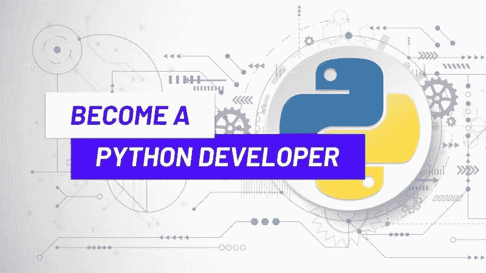
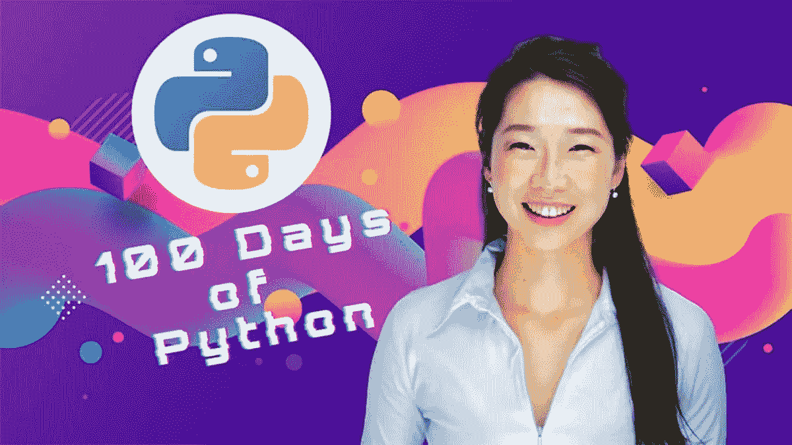
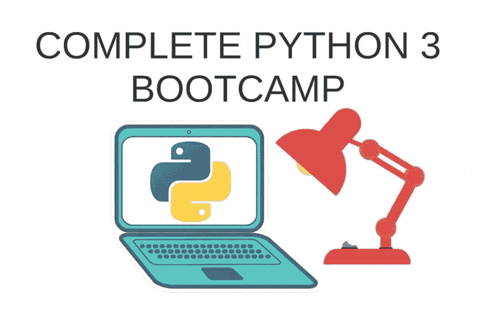
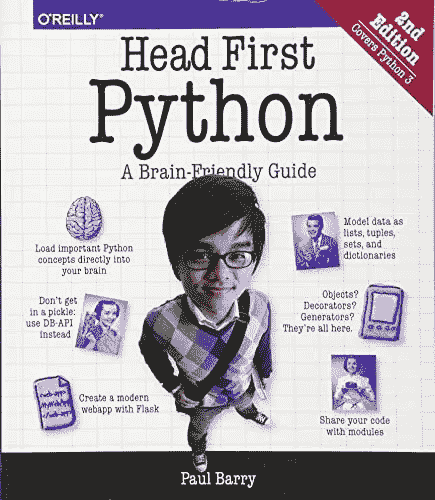
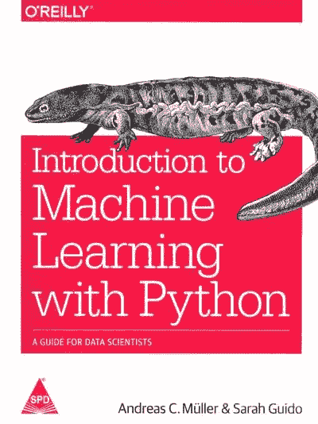
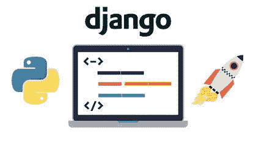

# 学习 Python 并在 2022 年成为 Python 开发者的 3 种最佳方式

> 原文：<https://medium.com/javarevisited/how-to-learn-python-in-2022-books-online-courses-and-projects-4a854ab5694e?source=collection_archive---------1----------------------->

## 这些是学习 Python 编程并在 2022 年成为 Python 开发者的最佳在线课程、书籍和项目

大家好，如果你想在 2022 年学习 Python 编程语言，这是目前最流行的编程语言之一，但不知道从哪里开始，那么你来对地方了。

在过去，我已经分享了许多 Python 资源，如 [**最佳 Python 书籍、**](https://javinpaul.medium.com/best-python-books-a93d1a0d842d) [免费 Python 课程](/swlh/5-free-python-courses-for-beginners-to-learn-online-e1ca90687caf)、[项目](/javarevisited/8-projects-you-can-buil-to-learn-python-in-2020-251dd5350d56)、[面试问题](https://javarevisited.blogspot.com/2021/05/python-interview-questions-answers-for-beginners.html)，甚至 [**学习 Python 的最佳地点**](https://javarevisited.blogspot.com/2019/09/5-websites-to-learn-python-for-free.html) ，在本文中，我将与您分享 2022 年从头开始学习 Python 编程的 3 种最佳方法。

这些是我掌握任何编程语言或框架的屡试不爽的方法，我用它们来学习 Java、Python、JavaScript 和许多其他技术。

一路上，我还会分享 2022 年学习 Python 的**最佳资源，如书籍、在线课程和项目**，你可以在 2022 年成为 Python 程序员。

Python 是一种高级的、解释的、动态类型的、面向对象的脚本语言。今天，Python 是使用最广泛的编程语言之一。

Python 受欢迎的主要原因之一是它易于学习和编码。Python 应用于多个领域，如 [web 开发](https://javarevisited.blogspot.com/2020/11/top-10-udemy-courses-you-can-buy-in.html)、[机器学习](https://javarevisited.blogspot.com/2020/05/why-python-is-best-programming-language.html)、[人工智能](https://becominghuman.ai/5-best-artificial-intelligence-courses-for-beginners-in-2020-38db08617b12)、[数据分析](/javarevisited/11-best-coursera-certifications-and-courses-for-data-science-and-analysis-in-2021-65ce1ac810a5)、[数据可视化](/javarevisited/8-best-data-visualization-tools-and-libraries-data-analysts-and-scientists-can-learn-d2734371df16)等等。

如上所述，与其他流行的编程语言如 Java 相比，Python 更容易学习和编码。这是要求初学者从 Python 开始的一个主要原因。它的语法很简单，是动态类型的，代码也很容易理解。

根据 Stack Overflow 开发者调查，Python 是仅次于 [JavaScript](https://www.java67.com/2020/10/best-javascript-courses-for.html) 和 [HTML/CSS](https://javarevisited.blogspot.com/2019/05/top-5-html-5-and-css-3-courses-for-web-developers.html) 的第三大流行编程语言。

此外，Python 开发人员的工资也很高。所以 2022 年学 Python 是一个极好的选择。在本文中，我们将列出 2022 年学习 Python 的 3 种最佳方式。如果你问我，我会建议你从在线课程开始，然后读这些书，然后完成一个项目。这样你会更好的学习 python。

在本文中，我列出了学习 Python 的最佳书籍和课程。此外，我还列出了你可以使用 Python 创建的项目(以及课程),并放入你的文件夹中。

# 如何在线学习 Python？2022 年成为 Python 程序员的最佳途径是什么？

加入在线课程，阅读 Python 书籍，构建 Python 项目，是 2022 年学习 Python 编程语言的最佳途径。这也是从头开始学习 Python 编程的 3 个最好方法。

在不浪费你更多时间的情况下，这里有 3 个你可以在 2022 年学习 Python 编程的最好方法。我还包括了一些相关资源，比如 2022 年你可以用来学习 python 的最佳书籍、最佳课程和最佳 Python 项目。

## 1.参加 Python 在线课程

参加课程是 2022 年学习 Python 编程的最好方式。参加课程有几个好处，但最重要的是主动学习，因为讲师将一步一步地向您展示如何编写代码以及如何运行 Python 程序。

大多数课程旨在介绍关键概念，这也有助于快速学习 Python。由于 Python 的流行，互联网上有几个学习 Python 的课程，但我强烈建议初学者从实践课程开始，如 Udemy 上 Angela Yu 的 [**100 天的代码——完整的 Python Pro Bootcamp 2022**](https://click.linksynergy.com/deeplink?id=JVFxdTr9V80&mid=39197&murl=https%3A%2F%2Fwww.udemy.com%2Fcourse%2F100-days-of-code%2F) 。

这个课程提倡边做边学，这也是学习 Python 编程语言的最好方法，也是 Udemy 上最好的 Python 课程之一，是 Udemy select 和 Udemy for Business 项目的一部分。到目前为止，已经有超过 60 万人加入了这个 Python 课程，它有着极好的评论和评级。

顺便说一句，对于那些想探索更多，想从不同的老师那里学习的人来说，还有更多的课程。例如，如果你想深入研究 Python 概念，那么你可以在 Udemy 上选择 Tim Buchalaka 和他的团队举办的 [**学习 Python 编程大师班**](https://click.linksynergy.com/deeplink?id=CuIbQrBnhiw&mid=39197&murl=https%3A%2F%2Fwww.udemy.com%2Fcourse%2Fpython-the-complete-python-developer-course%2F) 。

这是一个庞大的课程，总视频内容超过 60 小时。本课程面向绝对初学者，涵盖了所有必要的概念，从程序流控制、列表、元组等基础概念开始，到面向对象编程和数据库等高级概念。

如果你想快速学习 Python，那么你可以选择 [**2022 完整 Python Bootcamp 从零到 Python 中的英雄**](https://click.linksynergy.com/deeplink?id=CuIbQrBnhiw&mid=39197&murl=https%3A%2F%2Fwww.udemy.com%2Fcourse%2Fcomplete-python-bootcamp%2F) **。本课程相对较小，但涵盖了你需要学习的所有重要概念。这也是 Udemy 上最好的 Python 课程之一**

## 2.阅读 Python 书籍

通过读书来学习 Python 是学习这种强大的编程语言的另一个好方法。事实上，这是我几年前的首选方式，但现在我选择在线课程，在进入书本之前学习一门新的编程语言或技术。

有几本书可以用来学习 Python。[通过书籍学习 Python](https://javinpaul.medium.com/best-python-books-a93d1a0d842d)是一个很好的选择，因为书籍提供了深入的知识，要掌握 Python，你需要深入钻研 Python 概念。

[**【学习 Python】**](https://www.amazon.com/Learning-Python-5th-Mark-Lutz/dp/1449355730?tag=javamysqlanta-20)马克·卢茨的《学习 Python》是初学者学习 Python 的绝佳选择。这本书包含了核心 Python 概念的深刻知识，并鼓励学习者编写高效和高质量的代码。在这本书里，你会发现从初级到高级的所有必要的 Python 概念。

另一本适合初学者的优秀书籍是 Paul Barry 写的“[**Head-first Python**”](https://www.amazon.com/Head-First-Python-Brain-Friendly-Guide/dp/1491919531?tag=javamysqlanta-20)。这本书也侧重于基本以及先进的概念。

对于使用 Python 进行 web 开发，您可以选择 Arun Ravindran 和 C Hillar Gastn 的“**学习使用 Python 进行 Web 开发:获得 Python 编程和 Django Web 开发的实践经验**”。

而如果你想用 Python 学习机器学习，那么你可以选择由 Sarah Guido 和 Andreas C. Muller 撰写的[**用 Python 学习机器入门:数据科学家指南**](https://www.amazon.com/Introduction-Machine-Learning-Python-Scientists/dp/1449369413?tag=javamysqlanta-20) 。

## 3.构建 5 到 10 个 Python 项目

一旦你学习完 python，你就可以开始构建项目了。你可以从创建简单和[基本的 Python 项目](/javarevisited/8-projects-you-can-buil-to-learn-python-in-2020-251dd5350d56)开始，然后转移到更高级别的项目，比如 web 项目甚至机器学习项目。

您可以使用 Python 创建以下 GUI 项目。

*   使用 [Tkinter](/javarevisited/6-best-courses-to-learn-tkinter-and-pyqt-for-gui-development-in-python-664976674114) 创建日历
*   使用 Python 创建密码生成器应用程序
*   用 Python 创建闹钟应用程序
*   Python 中的蛇游戏
*   Python 中的二维码生成器和阅读器
*   建立一个网页抓取器来查找两个目的地之间的廉价航班

更高级别的项目包括 web 应用和机器学习项目。您可以使用诸如 Django 或 flask 之类的 Python 框架创建电子商务 web 应用程序。

您可以使用 Python 创建 web 项目。如果想学习使用 Python 进行 web 开发，可以学习 Django。 [**Python 和 Django 全栈 Web Developer boot camp**](https://click.linksynergy.com/deeplink?id=JVFxdTr9V80&mid=39197&murl=https%3A%2F%2Fwww.udemy.com%2Fcourse%2Fpython-and-django-full-stack-web-developer-bootcamp%2F)**是一门非常好的学习使用 Python 进行 Web 开发的课程。在这个项目中，您将学习使用 HTML、CSS、jQuery、Django 和 Python 创建一个 web 开发项目。**

****

**Python 因机器学习而出名，你应该使用 Python 来构建机器学习项目。 [**用 Python 完成的机器学习课程**](https://click.linksynergy.com/deeplink?id=JVFxdTr9V80&mid=39197&murl=https%3A%2F%2Fwww.udemy.com%2Fcourse%2Fmachine-learning-course-with-python%2F) 是一门优秀的课程，将帮助你使用 Python 创建多达 12 个机器学习项目。**

****

**以上是关于 2022 年学习 Python 的 3 种最佳方法。学习 Python 并不像很多人告诉你的那样困难，但关键是要找到最好的资源，否则你可能会迷失在 YouTube 和互联网的资源海洋中。**

**Python 是一种非常流行的编程语言，如果你计划在 2022 年学习 Python，那么你必须努力学习。可以通过书籍或者课程、项目来学习 Python。通过选择最好的资源，我已经为你做了一半的工作，现在轮到你开始学习和做事了。**

**祝您的 Python 之旅一切顺利，快速学习 Python，成为 Python 开发人员，并获得您一直想要的软件开发人员工作。**

**你可能喜欢的其他 **Python 教程和资源**:**

*   **[2022 年学习 Python 的 10 个理由](https://javarevisited.blogspot.com/2018/05/10-reasons-to-learn-python-programming.html)**
*   **[Python vs . Java——初学者应该学习哪种编程语言？](https://javarevisited.blogspot.com/2018/06/java-vs-python-which-programming-language-to-learn-first.html)**
*   **[5 Python 中的数据科学和机器学习课程](https://javarevisited.blogspot.com/2018/03/top-5-data-science-and-machine-learning-online-courses-to-learn-online.html)**
*   **[初学 Python 的 5 大课程](https://javarevisited.blogspot.com/2018/03/top-5-courses-to-learn-python-in-2018.html)**
*   **[深入学习 Python 的 10 门免费在线课程](https://javarevisited.blogspot.com/2018/12/10-free-python-courses-for-programmers.html)**
*   **[面向数据科学和机器学习的 8 大 Python 库](https://javarevisited.blogspot.com/2018/10/top-8-python-libraries-for-data-science-machine-learning.html)**
*   **[完整的 Web 开发者路线图](https://hackernoon.com/the-2019-web-developer-roadmap-ab89ac3c380e)**
*   **[Python 开发者的五大 Web 开发框架](https://javarevisited.blogspot.com/2019/04/top-5-python-web-development-frameworks.html)**
*   **Python 和 JavaScript，从哪个开始比较好？**
*   **[面向程序员的 10 本免费 Python 编程书籍](http://www.java67.com/2017/05/top-7-free-python-programming-books-pdf-online-download.html)**
*   **[2022 年学习 Python 可以加入的 10 个 Python 班](/better-programming/top-5-courses-to-learn-python-in-2018-best-of-lot-26644a99e7ec)**
*   **[面向初学者的 10 门免费 Python 课程](https://hackernoon.com/10-free-python-programming-courses-for-beginners-to-learn-online-38312f3b9912)**
*   **[2022 年学习 Python 可以做的 8 个项目](/javarevisited/8-projects-you-can-buil-to-learn-python-in-2020-251dd5350d56)**
*   **[我最喜欢的 Django 初学者在线课程](/javarevisited/7-free-courses-to-learn-django-framework-in-python-bd50acc8484)**
*   **[2022 年面向初学者的 10 门免费数据科学课程](/javarevisited/10-free-data-science-online-courses-for-beginners-a5fe78c2cb7b)**

**感谢您阅读本文。如果你喜欢这些*2022 年学习 Python 编程的 3 个最好方法*，那么请分享给你的朋友和同事。如果您有任何建议或反馈或任何其他文本想要与我们分享，请留言。**

****附言——**如果你想学习 Python，但是需要免费的资源，比如免费的书籍和免费的在线课程，那么你也可以看看这份清单 [**10 门最好的免费 Python 课程**](https://javarevisited.blogspot.com/2018/12/10-free-python-courses-for-programmers.html) 以便在 2022 年从头开始学习 Python。这是学习 Python 和创建您的应用程序和游戏的最完整和最实用的课程之一。**