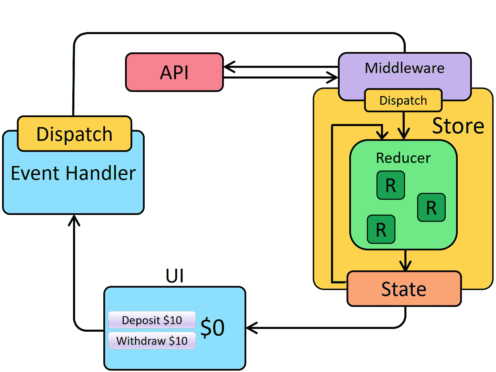
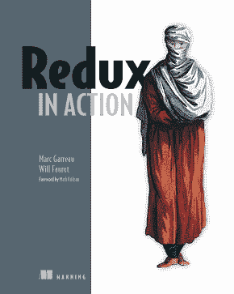

# 如何深入学习 React.js 和 Redux？

> 原文：<https://medium.com/javarevisited/how-to-learn-react-js-and-redux-in-depth-2fddf8b5694b?source=collection_archive---------0----------------------->

## 这里有 3 个深入学习 React 和 Redux 的最佳方法——参加 React 课程，阅读一本书，并构建几个项目来深入学习 React。

大家好，如果你想深入学习 React.js 和 Redux 并寻找最佳资源，那么你来对地方了。之前，我已经分享了 [best React 课程、](https://javinpaul.medium.com/top-5-courses-to-learn-react-js-in-2019-best-of-lot-fa02cd96cdf0) [书籍](/javarevisited/5-best-react-js-books-for-beginners-and-experienced-web-developers-e7b90b1ab9d2)、[网站](/javarevisited/6-best-websites-to-learn-react-js-coding-for-free-ba7ec5c43433)和[项目](/javarevisited/5-projects-you-can-build-to-learn-react-native-in-2022-c7111aceddd)，在这篇文章中，我将分享 3 种方法来结合所有这 3 样东西来深入学习 React 和 Redux。

状态是反应式开发的一个非常重要的部分。简而言之，状态是一个普通的 JavaScript 对象，它控制 React 组件的行为。如果你想成为一名[专业的 React 开发者](https://javarevisited.blogspot.com/2018/10/the-2018-react-developer-roadmap.html)，那么你必须明白如何高效地使用状态。

React 提供了对管理状态的内置支持，但是当应用程序增长时，管理状态变得很困难。因此，全局状态是为整个应用程序创建的，为了管理这样的全局状态，使用了第三方状态管理库。

说到状态管理， [Redux](https://javarevisited.blogspot.com/2018/08/top-5-react-js-and-redux-courses-to-learn-online.html) 是与 React 一起使用的最流行的状态管理库。如果你是一个 React 开发者，那么 Redux 的知识是你所期望的。

理解 React 可能很难，尤其是如果你是初学者。但是选择一门好的课程，用例子恰当地解释 Redux 的基础知识，可以让你成为一个高效的 React + Redux 开发者。

过去，我曾分享过[最佳 React 在线课程](https://javinpaul.medium.com/top-5-courses-to-learn-react-js-in-2019-best-of-lot-fa02cd96cdf0)、[书籍](/javarevisited/5-best-react-js-books-for-beginners-and-experienced-web-developers-e7b90b1ab9d2)和[学习 React.js 的最佳地点](/javarevisited/6-best-websites-to-learn-react-js-coding-for-free-ba7ec5c43433)，它们帮助了许多人学习和掌握 React，在本文中，我们将列出使用 Redux 学习 React 的三大方法。

你可以使用这些步骤，不仅从零开始学习 Redux，还可以掌握 Redux，并在 2023 年成为更好的 React 开发者。

顺便说一句，如果你已经下定决心在 2023 年成为一名 React 开发者，并且正在寻找一个最好的资源，比如一个可以教你 React 开发者需要知道的一切的在线课程，那么我也建议你去看看 Udemy 上 Maximillian Schwarzmuller 的[**React-完整指南(包括钩子、React 路由器、Redux)**](https://click.linksynergy.com/deeplink?id=CuIbQrBnhiw&mid=39197&murl=https%3A%2F%2Fwww.udemy.com%2Fcourse%2Freact-the-complete-guide-incl-redux%2F) 课程。

他最近更新了这个课程，这个 40 小时的课程是最好的资源之一。我强烈推荐给每一个想深入学习 React 的开发者。

# 2023 年如何学习 Redux？最佳书籍、课程和项目

下面是 2023 年从零开始学习 React 和 Redux 的三种主要方式。你可以从在线课程开始，然后进入书籍和构建项目，深入学习 Redux。

## 1.加入最好的 Redux 课程

在线课程是开始学习新技术的最佳方式，Redux 也不例外。当你看到有人在做你想做的事情时，你会学到更多，而在线课程为你提供了这样的机会。它可以让你在家里向专家在线学习，而且只需要很少的费用。

说到 Redux，有很多很棒的资源。你搜索一下，会在网上找到几门 React 和 Redux 相关的课程。并不是所有的都真的有用。在这一部分，我们将列出一些最好的在线课程。

Stephen Grider 在 Udemy 上开设的[**Modern React with Redux**](https://click.linksynergy.com/deeplink?id=CuIbQrBnhiw&mid=39197&murl=https%3A%2F%2Fwww.udemy.com%2Fcourse%2Freact-redux%2F)课程是学习 Modern React with Redux 的最佳课程之一。这是一个巨大的课程，视频内容总计 50 个小时。在本课程中，您将学习什么是 React 和 Redux，以及如何一起使用它们进行有效的状态管理。

此外，本课程还包含所有其他重要的 React 概念，如路由、webpack 和钩子。所以基本上，这是一个整体的 React + Redux 课程，足够你学习和掌握 React 和 Redux 了。

另一门学习 [**Redux with React 的优秀课程是 2023 年完成 React Developer(w/Redux，Hooks，GraphQL)**](https://academy.zerotomastery.io/a/aff_565yhxdn/external?affcode=441520_zytgk2dn) 。它比上述课程相对较短，但包含了您需要学习的关于 Redux with React 的所有内容。

顺便说一句，你需要一个 [**ZTM 会员**](https://academy.zerotomastery.io/a/aff_c0gnlvf7/external?affcode=441520_zytgk2dn) 才能观看这个课程，这个课程每月花费大约 29 美元，但也提供了许多超级吸引人和有用的课程，如 Python 课程和 JavaScript 面试课程。

如果你像每个伟大的网络开发者一样是一个不断学习的人，那么我建议你去申请会员资格，而不是购买一门课程，你不仅会省钱，而且会使学习变得容易，因为你不需要每次想学习新东西的时候都去购买课程。

<https://academy.zerotomastery.io/a/aff_c0gnlvf7/external?affcode=441520_zytgk2dn>  

## 2.React Redux 图书

有几本书可以帮助您了解什么是 Redux，以及如何将它与 React 一起使用以实现高效的状态管理。

[《学习 Redux》](https://www.amazon.com/Learning-React-Functional-Development-Redux/dp/1491954620?tag=javamysqlanta-20)Daniel Bugl 的《学习 Redux》是最好的专门学习 Redux 的书籍之一。在这本书里，你会学到什么是 Redux，为什么要和 React 一起使用。

这本书深入研究了 Redux，并通过例子详细解释了每个概念。另一本学习 Redux 的优秀书籍是马克·加罗和威尔·福罗特的[**《Redux in Action】**](https://www.amazon.com/Redux-Action-Marc-Garreau/dp/1617294977?tag=javamysqlanta-20)。

学习 Redux 是不够的。您需要学习如何通过 React 有效地使用它。[“学习 React:使用 React 和 Redux 进行功能性 Web 开发”](https://www.amazon.com/Learning-React-Functional-Development-Redux/dp/1491954620?tag=javamysqlanta-20)由亚历克斯·班克斯和伊夫·波尔切洛撰写，是学习 React 和 Redux 的最佳书籍之一。在这本书里，你不仅会学到 React 和它的基本原理，还会学到如何使用 React 和 Redux。

## 3.构建 Redux 项目

Redux 项目只能用 React 创建，因为 Redux 本身只是一个状态管理库。所以可以从构建基本的前端 React 项目开始，用它安装 Redux 进行全局状态管理。

您可以从创建一个包含几个 React 组件的简单 React 项目开始。您必须以这样一种方式设计项目，即组件依赖于单个状态。

例如，您可以创建一个具有表单的组件，当提交该表单时，输入的值将用于其他组件。

一旦您熟悉了如何使用 React with Redux，您就可以创建一个 MERN 堆栈项目，就像电子商务网站或社交媒体网站一样。

这些项目是巨大的，有几个组成部分和相互依赖的状态。所以你可以在这些项目中使用 Redux。如果你想使用 MERN 堆栈和 Redux 创建一个有效的电子商务网络应用程序，那么<https://click.linksynergy.com/deeplink?id=JVFxdTr9V80&mid=39197&murl=https%3A%2F%2Fwww.udemy.com%2Fcourse%2Fmern-ecommerce%2F>**MERN 电子商务是一个极好的课程。**

**

反应组件生命周期** 

**以上就是**如何在 2023 年学习 React 和 Redux**的全部内容。如前所述，学习 Redux 对于 React 开发者来说非常重要。Redux 可能很难，但是通过适当的资源，你可以学会它。**

**在本文中，我提到了一些有用的书籍和课程，它们将帮助您了解什么是 Redux 以及如何使用 React。此外，我们还提到了学习 Redux 后可以构建的项目。**

**其他**反应和重复你可能喜欢的资源****

*   **[官方 Redux 入门指南](https://redux.js.org/introduction/getting-started)**
*   **[Web 开发人员应该知道的 10 个 JavaScript 框架](http://www.java67.com/2019/01/top-10-javascript-frameworks-and-libraries-for-web-developers.html)**
*   **[面向初学者的 10 门免费打字在线课程](/javarevisited/top-10-free-typescript-courses-to-learn-online-best-of-lot-44bce9da41d1)**
*   **[我最喜欢的学习 React Hooks 的免费课程](/javarevisited/top-10-free-courses-to-learn-react-js-c14edbd3b35f?source=---------10------------------)**
*   **[初学者学习 React.js 的 6 个最佳网站](/javarevisited/6-best-websites-to-learn-react-js-coding-for-free-ba7ec5c43433)**
*   **[30 个反应 1 至 3 年经验的面试问题与答案](https://javarevisited.blogspot.com/2021/09/reactjs-interview-questions-answers.html)**
*   **你可以建立 5 个项目来更好地学习反应**
*   **[初学者学习 React Native 的 10 门免费课程](/javarevisited/my-favorite-free-react-native-courses-for-beginners-in-2020-4629f5274eb6)**
*   **[6 针对初学者的 React 原生项目创意](https://javarevisited.blogspot.com/2021/05/5-projects-you-can-do-to-learn-react-native.html)**
*   **[我最喜欢的初学者 React 课程](https://www.java67.com/2022/03/top-5-reactjs-courses-for-beginners-to.html)**

**感谢您阅读本文。如果你喜欢这个关于 2023 年学习 React 和 Redux 的最佳方法的教程，那么请与你的朋友和同事分享。如果您有任何问题或反馈，请留言。**

****附言——**如果你渴望在 2023 年成为一名 React 开发人员，并且正在寻找一个在线课程这样的最佳资源，可以教你一名 React 开发人员需要知道的一切，那么我也推荐你去参加由 Maximillian Schwarzmuller 在 Udemy 上开设的[**React-完整指南(包括钩子、React 路由器、Redux)**](https://click.linksynergy.com/deeplink?id=CuIbQrBnhiw&mid=39197&murl=https%3A%2F%2Fwww.udemy.com%2Fcourse%2Freact-the-complete-guide-incl-redux%2F) 课程。他最近更新了这个课程，这是最好的资源之一。你也可以在这里查看我的评论**

**</javarevisited/is-react-the-complete-guide-incl-hooks-react-router-redux-on-udemy-worth-it-review-abbe51c33b65>  

而且，如果你正在寻找学习 REact.js 的免费课程，那么你也可以查看我之前的一篇关于最好的免费 REact 课程的文章。

</javarevisited/10-free-angular-and-react-js-courses-from-udemy-and-coursera-best-of-lot-e67f7d811e6b> **