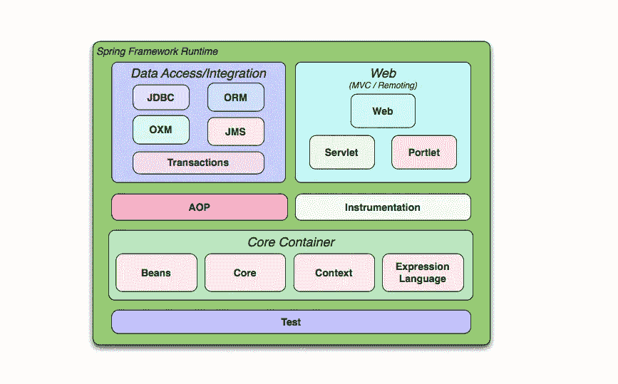
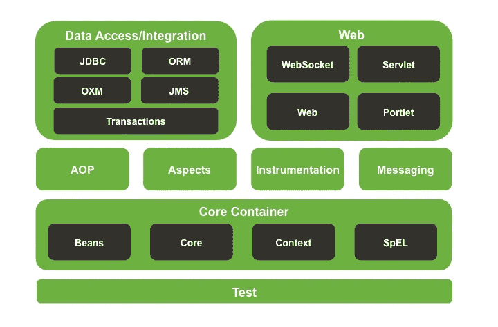
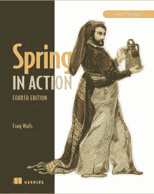
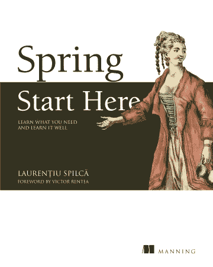
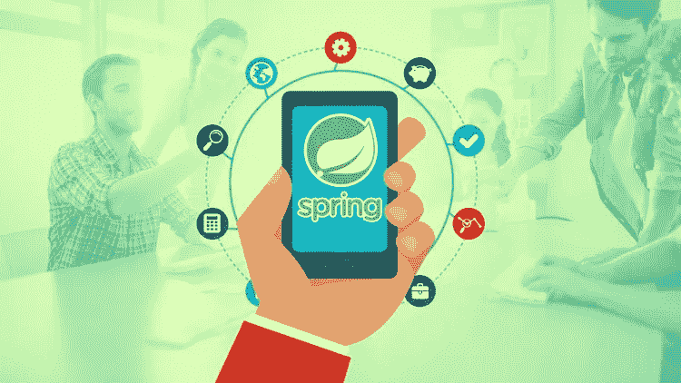
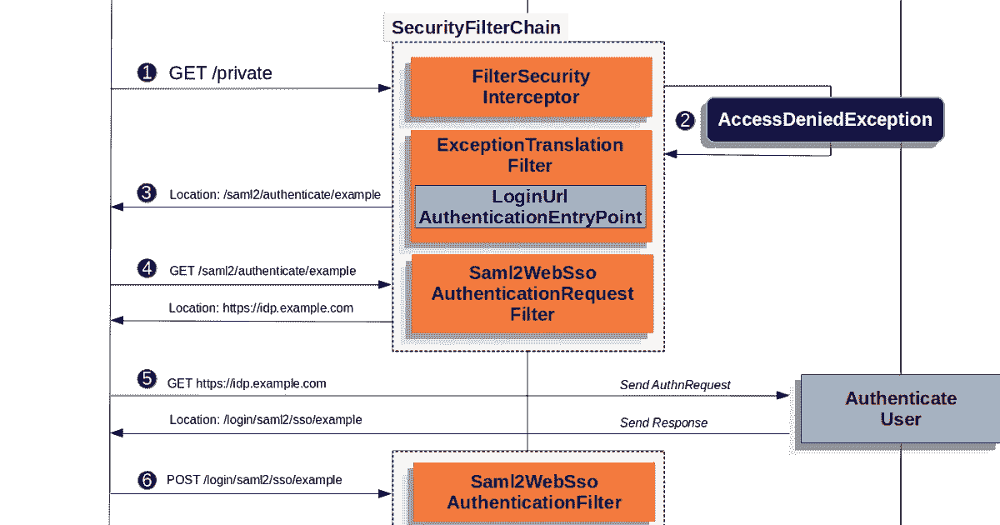

# 如何学习 Spring 框架，Spring MVC，2023 年的 Spring Boot？[最佳资源]

> 原文：<https://medium.com/javarevisited/how-to-learn-spring-framework-spring-mvc-spring-boot-and-spring-security-best-resources-202e7f6ab3c8?source=collection_archive---------0----------------------->

## 这里有 3 个学习 Spring 框架及其重要模块的最佳方法，比如 Spring MVC、Spring Boot 和 Spring Security，以及相关的资源、书籍和课程。

image_credit — spring.io

大家好，如果你是一名 Java 开发人员，并且想学习 Spring 框架，那么你来对地方了。在本文中，我将通过推荐的书籍和课程来分享深入学习 spring 框架的三种最佳方法，但在此之前，让我们先了解一下什么是 Spring 框架，以及 Java 开发人员为什么要学习 Spring 框架？

嗯，Spring 是一个框架，通过遵循一些最佳实践来帮助你开发 Java 应用程序，特别是[依赖注入](http://javarevisited.blogspot.sg/2015/06/difference-between-dependency-injection.html)和[控制反转](http://javarevisited.blogspot.sg/2012/12/inversion-of-control-dependency-injection-design-pattern-spring-example-tutorial.html)的原则。

按照这个原则，框架在运行时提供它们，而不是类请求它的依赖。遵循这些原则可以提高您的代码质量，因为它减少了应用程序不同部分之间的耦合，如模块和类之间的耦合，这使得测试和开发更加容易。

由于这个优点和其他一些有用的特性， [Spring framework](/javarevisited/3-best-spring-professionals-certification-books-and-courses-for-java-developers-935296c3709) 已经成为开发 Java 应用程序的标准方法，包括核心 Java 和 Java Web 应用程序，特别是使用 [Spring MVC](https://javarevisited.blogspot.com/2020/08/top-5-courses-to-learn-spring-mvc-for.html) ，它实现了另一种流行的 MVC 设计模式，使得使用 Java 技术开发 Web 应用程序更加容易。

说到学习一项新技术或新框架，我的 3 点行动是**加入一门课程、** **读一本书、**和**建立一个项目**。在过去的几年里，我一直遵循这个原则来学习一些东西，并且效果很好。从一门课程开始，你需要有一个良好的开端，因为这通常是一个非常困难的开端。那时你不知道如何建立项目，如何运行项目，需要什么[库](http://javarevisited.blogspot.sg/2018/01/top-20-libraries-and-apis-for-java-programmers.html)，如何调试，如何检查日志等等。一旦你参加了一个好的课程，你会有一个技术专家向你解释这些基础知识。一旦你站稳了脚跟，是时候深入下去，跟着一本书开始做项目了。这样，你可以通过自己探索来深入学习技术，而不是像在课程中一样，由别人来指导你。

对了，和 Java 一样，春天也是广阔的。有几个模块像 [Spring Core](http://javarevisited.blogspot.sg/2017/11/difference-between-component-service.html#axzz559dyoLSA) 、 [Spring MVC](http://javarevisited.blogspot.sg/2017/10/differences-between-requestparam-and-pathvariable-annotations-spring-mvc.html) 、 [Spring Security](http://www.java67.com/2017/12/top-5-spring-security-online-training-courses.html) 、Spring Data 和 Spring Boot，你需要决定你想学什么。

# 2023 年如何学习 Spring 框架？

由于大部分开发人员都想学习 Spring MVC，所以我建议你先从 Spring Core 开始，然后按照 Spring MVC 部分学习。

## 1.弹簧芯

Spring core 是核心框架，它提供了实现依赖注入和控制反转所需的容器。它还提供了一个方便的库，有很多有用的功能，类似于 Apache commons，但最重要的是，你总是需要 Spring core，因为 Spring MVC 和 Spring Security 都建立在它的基础上。现在最大的问题是读哪本书，参加哪门课程？嗯，当谈到加入一门课程时，你应该总是看它最后更新的时间，以及有多少学生已经加入了它。

这说明了课程的内容和受欢迎程度，在这个参数上，我发现 [**Spring 框架大师班**](https://click.linksynergy.com/fs-bin/click?id=JVFxdTr9V80&subid=0&offerid=323058.1&type=10&tmpid=14538&RD_PARM1=https%3A%2F%2Fwww.udemy.com%2Fspring-tutorial-for-beginners%2F) 是最好的开始课程。

它受到了超过 53，483 名学生的信任，并且是最新的。它还深入介绍了 Spring 的框架，包括 Spring core、Spring JDBC、 [Spring Boot](/javarevisited/10-free-spring-boot-tutorials-and-courses-for-java-developers-53dfe084587e?source=collection_home---4------7-----------------------) ，以及如何使用 Eclipse 设置和开发 Spring 应用程序、单元测试，以及使用 Java 和 XML 配置来配置 Spring 应用程序。如果你刚刚开始使用 [Spring 框架](/javarevisited/top-10-free-courses-to-learn-spring-framework-for-java-developers-639db9348d25)，那么这可能是最好的开始。

说到书，嗯，关于 Spring framework 的书有很多，我也读过几本，但是我发现最有用和最新的书是 [**Spring in Action 第五版**](https://www.amazon.com/Spring-Action-Craig-Walls/dp/1617294942?tag=javamysqlanta-20) ，它涵盖了 Spring 5。

这本书涵盖了大部分 Spring 相关的东西，比如 Spring Core、Spring MVC，甚至 Spring Security 的某些部分，因此我建议每一个想学习 Spring 的 Java 开发人员阅读这本书。

有些人觉得这本书不如我好，如果你需要替代的话，你也可以看看全新的 Spring 框架书，[**【spring start here】**](https://www.amazon.com/Spring-Start-Here-Learn-learn/dp/1617298697?tag=javamysqlanta-20)作者是 laurențiu·斯皮克，他也是[*【spring security in action】*](https://www.amazon.com/Spring-Security-Action-Laurentiu-Spilca/dp/1617297739?tag=javamysqlanta-20)的作者

这本书将教你用 Spring 进行 Java 开发，重点是你将在你构建的 Java 应用程序中日常使用的核心概念。您还将学习如何将现有应用程序重构为 Spring，如何使用 Spring 工具进行 SQL 数据库请求和 REST 调用，以及如何使用 Spring 安全性来保护您的项目。

顺便说一句，如果你已经了解 Spring，并且对学习 Spring 5 中引入的新的反应式编程特性更感兴趣，那么 [**Spring Framework 5:初学者到大师**](https://click.linksynergy.com/fs-bin/click?id=JVFxdTr9V80&subid=0&offerid=323058.1&type=10&tmpid=14538&RD_PARM1=https%3A%2F%2Fwww.udemy.com%2Fspring-framework-5-beginner-to-guru%2F) 是一个更好的课程。它简短而简单，你可以用 Spring 5 快速更新自己。

## 2.2023 年春季 MVC 怎么学？

Spring MVC 是一个使用 Java 技术开发 web 应用程序的框架，遵循 MVC 设计模式，即模型视图控制器。这提供了功能或关注点的清晰分离，从而使得开发基于 Java 的 web 应用程序更加容易。

本课程将通过一步一步构建项目的方式教你 Spring MVC。确切地说，您将通过 25 个步骤一点一点地构建一个基本的 Todo 管理应用程序。

## 3.2023 年春安怎么学？

Spring Security 用于提供开箱即用的身份验证和授权支持。由于大多数 Java web 应用程序需要登录和访问控制机制，你会发现 [Spring MVC](/javarevisited/my-favorite-spring-mvc-courses-for-java-developers-5ede7f85dd88) 和 [Spring Security](/javarevisited/3-best-spring-security-books-and-resources-for-java-programmers-653d05c8afd4) 一起使用。

该框架非常复杂，提供了几个特性来支持使用数据库、LDAP 或任何定制源的认证和授权。

Spring in Action 第六版书触及了 Spring 安全的一部分，但并没有提供全面的覆盖，我的意思是，它没有涵盖 OAuth 或 OAuth 2.0 以及许多高级概念，这些概念在欧根·帕拉斯基夫的 [**Spring 安全认证课程**](https://courses.baeldung.com/p/learn-spring-security-the-certification-class?utm_source=javarevisited&utm_medium=web&utm_campaign=lss&affcode=22136_bkwjs9xa) 中有所涉及。
它最近也更新了 Spring Security 5.0。

## 4.如何学习 2023 年的 Spring Boot

它是弹簧家族中相对较新的成员之一。顾名思义，这个框架有助于引导过程。使用 [Spring](/javarevisited/10-advanced-spring-boot-courses-for-experienced-java-developers-5e57606816bd) 最困难的事情之一是从安装和项目开始，你需要用 XML 创建大量的配置，或者在 Java 类中使用大量的注释，然后创建一个 WAR 文件并部署到 web 服务器来运行它。

启动 Spring 应用程序没有简单的方法，就像你通过编写 *main()方法*来启动 Java 应用程序一样。Spring boot 通过简化引导过程解决了这个问题。

它还提供了嵌入 web 服务器的选项，以便快速开发。简而言之，Spring Boot 给了你 Spring 框架的所有功能，却没有它的所有复杂性。

首先，您可以参加 Udemy 的[**Spring Boot 和春云大师微服务**](https://click.linksynergy.com/fs-bin/click?id=JVFxdTr9V80&subid=0&offerid=323058.1&type=10&tmpid=14538&RD_PARM1=https%3A%2F%2Fwww.udemy.com%2Fmicroservices-with-spring-boot-and-spring-cloud%2F) 课程，这是一个很棒的课程，有几个实际操作的例子。您不仅将学习 Spring boot，还将学习 Spring MVC 来开发 web 部件，学习安全性来保护您的应用程序，学习 JDBC 来连接数据库，甚至学习如何探索您的服务，如 REST 和微服务。

顺便说一句，如果你对学习 Spring Boot 2.0，Spring Boot 的最新版本更感兴趣，那么我建议你看看这些[**Spring Boot 高级课程**](https://dev.to/javinpaul/top-10-courses-to-learn-spring-boot-and-microservices-for-java-programmers-3hjg) ，它们不仅涵盖了春天 5，也涵盖了 Spring Boot 2。

说到书，到目前为止，我只读过 [**和**](https://www.amazon.com/Spring-Boot-Action-Craig-Walls/dp/1617292540?tag=javamysqlanta-20)Spring Boot 的作品，并发现这是一个很好的资源。我打算学习更多关于 Spring Boot 的书籍，如果我找到一本好书，我会和大家分享。

 [## Spring Boot 在行动

### Amazon.com 的 Spring Boot 在行动。*符合条件的优惠可享受免费*运输。Spring Boot 在行动

www.amazon.com](https://www.amazon.com/Spring-Boot-Action-Craig-Walls/dp/1617292540?tag=javamysqlanta-20) 

这是关于如何在 2023 年学习 Spring 框架及其不同部分，如 Spring core、Spring MVC、Spring Security 和 Spring Boot。正如我所说的，对于一个 Java 开发人员来说，了解 Spring 对于提高他获得工作或更好机会的机会是非常重要的，当你必须学习一个新东西时，3 点行动我指的是参加一门课程、阅读一本书和建立一个项目真的很有效。

其他 **Spring** **和 Java 资源**你可能喜欢

*   [学习 Spring Core 和 Spring MVC 的 5 门免费课程](http://www.java67.com/2017/11/top-5-free-core-spring-mvc-courses-learn-online.html)
*   [2023 年学习 Spring Boot 的 10 门免费课程](/javarevisited/10-free-spring-boot-tutorials-and-courses-for-java-developers-53dfe084587e)
*   [Spring MVC 在 Java 内部是如何工作的？](http://javarevisited.blogspot.sg/2017/06/how-spring-mvc-framework-works-web-flow.html)
*   [dispatcher servlet 在 Spring MVC 中的作用是什么？](http://www.java67.com/2017/06/what-is-use-of-dispatcherservlet-in-spring-mvc.html)
*   [Java 开发人员应该学习的 5 个基本框架](/javarevisited/5-essential-frameworks-every-java-developer-should-learn-6ed83315f1fb)
*   [面向 Java 开发人员的 10 门最佳 Spring 框架课程](/javarevisited/10-best-online-courses-to-learn-spring-framework-in-2020-f7f73599c2fd)
*   [深入了解 Spring Boot 的五大课程](http://www.java67.com/2018/06/5-best-courses-to-learn-spring-boot-in.html)
*   Java 程序员应该在 2023 年学会的 10 件事
*   [学习 Java Spring Boot 的 10 门高级课程](/javarevisited/10-advanced-spring-boot-courses-for-experienced-java-developers-5e57606816bd)
*   [使用 Spring Boot 学习 Java 微服务的 5 门课程](https://javarevisited.blogspot.com/2018/02/top-5-spring-microservices-courses-with-spring-boot-and-spring-cloud.html)
*   每个程序员都应该知道的 10 个工具
*   Java 和 Web 开发人员应该学习的 10 个框架
*   [针对有经验的 Java 开发人员的 Spring 和 Hibernate 培训课程](http://javarevisited.blogspot.sg/2016/12/top-5-spring-and-hibernate-training-courses-java-jee-programmers.html)
*   [5 个先进的 Spring Boot 经验丰富的开发者应该读读](https://javarevisited.blogspot.com/2018/04/5-spring-framework-books-experienced-Java-developers-2018.html)
*   [学习 Spring Security 和 OAuth2 的 10 大课程](/javarevisited/top-10-courses-to-learn-spring-security-and-oauth2-with-spring-boot-for-java-developers-8f0222d6066d)

感谢您阅读本文。如果你喜欢这些方法和学习 Spring Core 和 Spring MVC 的最佳资源，请与你的朋友和同事分享。如果您有任何问题或反馈，请留言。

**P. S.** —如果你热衷于深入学习 Spring 框架，尤其是 Spring core 和 Spring Boot，但正在寻找一个免费的在线培训课程，那么你也可以在 Udemy 上查看这个[**Spring Boot 2 和 Spring 框架 5**](https://click.linksynergy.com/deeplink?id=JVFxdTr9V80&mid=39197&murl=https%3A%2F%2Fwww.udemy.com%2Fcourse%2Fintroduction-to-spring-boot-2-and-spring-framework-5%2F) 的介绍课程。这是一门非常棒的课程，而且完全免费，你只需要一个免费的 Udemy 帐户就可以进入这门课程。

 [## Java 开发人员 2023 年学习 Spring Boot 的 5 大课程——最佳课程

### 大家好，如果你有兴趣学习 Spring Boot 并寻找一些优秀的资源，如书籍…

javarevisited.blogspot.com](https://javarevisited.blogspot.com/2018/05/top-5-courses-to-learn-spring-boot-in.html)