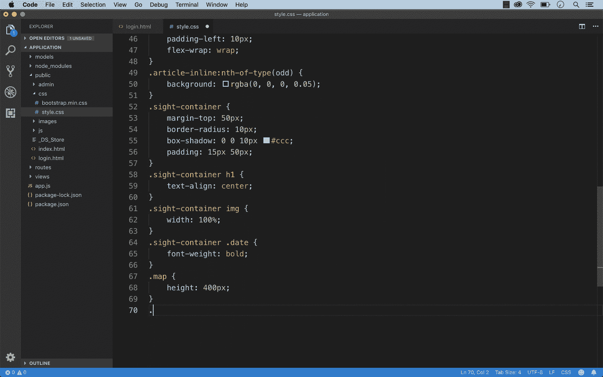
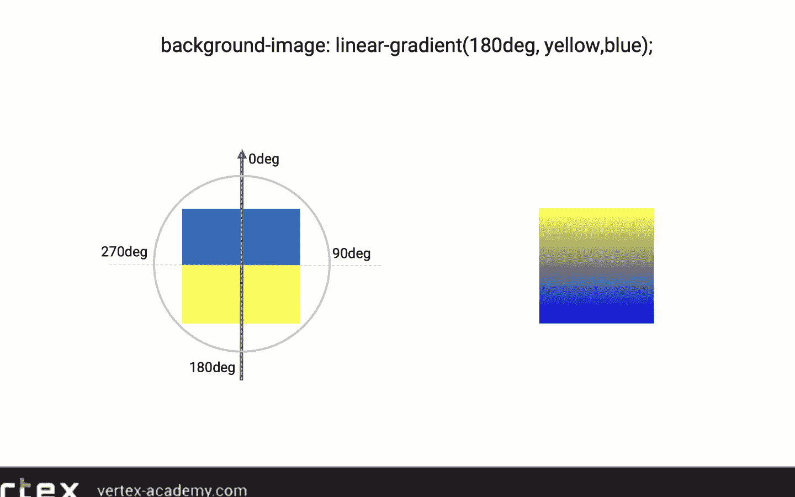
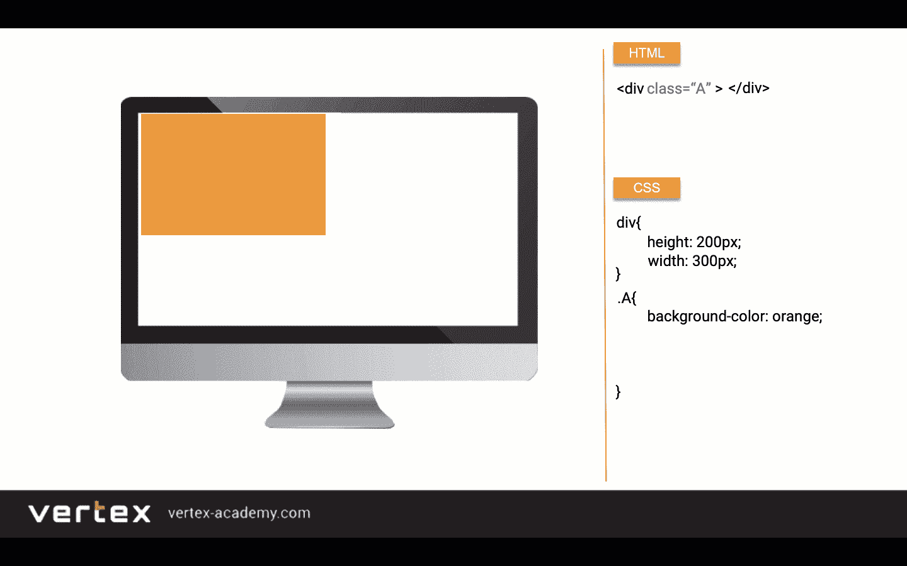

# 如何快速学习 Web 开发？

> 原文：<https://medium.com/javarevisited/how-to-learn-web-development-fast-cc0270b3284c?source=collection_archive---------1----------------------->

大家好，学习 web 开发有很多令人信服的理由，比如:

1.  大幅提高你的收入
2.  选择你想为哪家大型科技公司工作
3.  作为一名自由职业者，你可以自由地计划你的工作日

但是，要成为一名 web 开发人员，我需要做些什么呢？幸运的是，学习 web 开发和快速学习有很多种选择，在线课程可能是最好的开始方式。

然而，正如不是所有的交通工具都一样，**也不是所有的路线和方法都具有相同的质量，这就是为什么选择正确的路线对成功非常重要。**

虽然课程很多，但我推荐你从 Udemy 上的 [**以结果为导向的 Web 开发者课程——boot camp 2020**](https://click.linksynergy.com/deeplink?id=JVFxdTr9V80&mid=39197&murl=https%3A%2F%2Fwww.udemy.com%2Fcourse%2Fresult-oriented-web-developer-course%2F)课程开始。对于那些想快速学习 web 开发的人来说，这是最好的课程之一，但是你不会很容易在 Udemy 上找到它，因为没有多少人加入它，这就是像这样的一篇文章可以帮助你的地方。此外，没有编程经验是必要的。

<https://click.linksynergy.com/deeplink?id=JVFxdTr9V80&mid=39197&murl=https%3A%2F%2Fwww.udemy.com%2Fcourse%2Fresult-oriented-web-developer-course%2F>  

不言而喻，虽然滑板、自行车和汽车会把你带到目的地，但它们之间有重要的区别:**即速度和便利性**。学习 web 开发也不例外。

因此，首先，你需要问自己这个问题，“**我想多快到达，例如，得到我的第一份工作，成为一名网站开发人员？**”

如果你是一个不确定从哪里开始学习 web 开发的初学者，或者如果你发现 web 开发在过去是一个很难学习的过程，那么这篇文章就是为你准备的。

# **快速学习 Web 开发的 5 种方法**

让我们来看看关于如何学习 web 开发以及如何继续前进的 5 个技巧，即使事情变得很艰难。一路上，你会听说最好的 web 开发课程之一，[**Vertex Academy**](https://click.linksynergy.com/deeplink?id=JVFxdTr9V80&mid=39197&murl=https%3A%2F%2Fwww.udemy.com%2Fcourse%2Fresult-oriented-web-developer-course%2F)的面向结果的 Web 开发课程 。这门课程将教你从零开始以一种成功的、可持续的方式进行网络开发。

## **1。在你开始编码之前，用视觉学习理论**

快速学习 web 开发的秘诀之一是使用视觉和动画来辅助理论学习。

不幸的是，在许多课程中，理论只能通过在文本编辑器中编写代码来解释，也就是说，当他们解释理论和概念时，只能看着讲师在黑屏上写代码。

但这种方法忽略了一个事实，即大多数人类是通过视觉学习的( [*大约 65%*](https://www.forbes.com/sites/tjmccue/2013/01/08/what-is-an-infographic-and-ways-to-make-it-go-viral/#27d07f0f7272) )，通过看到步骤和结果。实际上，它在路上设置了一个减速带，减缓了你学习 web 开发的速度，因为它缺乏对编码世界的沉浸感，而这只有视觉和动画才能带来。看到代码的编写和结果，才能真正理解代码的含义。

Vertex Academy 在制作[***面向结果的 Web 开发人员课程***](https://click.linksynergy.com/deeplink?id=JVFxdTr9V80&mid=39197&murl=https%3A%2F%2Fwww.udemy.com%2Fcourse%2Fresult-oriented-web-developer-course%2F)*方面做得非常出色，该课程通过非常详细的动画幻灯片和视觉效果来解释理论。只有在你理解了这个概念之后，你才亲自去尝试，看看它在实践中的效果如何。**这种方法会显著改变你的学习进度**。*

*先在动画幻灯片上一步一步地实际看看它是如何工作的不是很有帮助吗？*

****

*大多数人( [65%](https://www.forbes.com/sites/tjmccue/2013/01/08/what-is-an-infographic-and-ways-to-make-it-go-viral/#27d07f0f7272) )是视觉学习者。这就是为什么这种视觉学习方法有助于更快地学习 web 开发。*

## ***2。** **理论联系实际***

*首先，仅仅看理论课是不够的。为了以最有效的方式学习 web 开发，你不仅应该看着老师写代码，还应该在你的电脑上重复他们。其次，你必须用解决方案做大量不同的练习来练习解决编码任务，并且能够检查你的解决方案。这也是包含在 [**所有顶点学院的课程**](https://click.linksynergy.com/deeplink?id=JVFxdTr9V80&mid=39197&murl=https%3A%2F%2Fwww.udemy.com%2Fuser%2Ff8d5433a-2f80-45d1-9eff-db4bae354197%2F) **中的一个特色。***

*<https://click.linksynergy.com/deeplink?id=JVFxdTr9V80&mid=39197&murl=https%3A%2F%2Fwww.udemy.com%2Fuser%2Ff8d5433a-2f80-45d1-9eff-db4bae354197%2F>  

## **3。** **构建真实世界的项目**

大多数课程都没有展示如何从零开始构建真实世界的项目。通常，项目被称为现实世界的项目，但通常只是复杂的作业或编码练习。那些想要学习 web 开发的人需要从头开始构建真实世界的项目，这样他们就可以获得真正的 web 开发技能，并有(简历)高质量的项目上传到他们的作品集。

例如，在 [**面向结果的 Web 开发人员课程**](https://click.linksynergy.com/deeplink?id=JVFxdTr9V80&mid=39197&murl=https%3A%2F%2Fwww.udemy.com%2Fcourse%2Fresult-oriented-web-developer-course%2F) 中，您将构建 CNN 网站、Gotham 项目、ExotiCar、Let's Travel Advanced 项目等的克隆。

## **4。确保你选择的课程提供个人支持。这是必不可少的。**

当你在学习 web 开发时，你肯定会有很多问题，你需要有人能够清楚、准确、及时地回答这些问题。

顶级课程通过在合理的响应时间内给出可理解的、详细的答案，为学生提供最好的支持。在这一点上，你可以肯定，在 [**以结果为导向的 Web 开发人员课程**](https://click.linksynergy.com/deeplink?id=JVFxdTr9V80&mid=39197&murl=https%3A%2F%2Fwww.udemy.com%2Fcourse%2Fresult-oriented-web-developer-course%2F) 中，你会发现这种高质量的支持，因为 Vertex Academy 的教师关注的是他们学生的结果。这是**第一要务**！

## **5。向专业的网页开发导师学习**

确保你选择的教师是专业的开发人员，他们知道作为一个初级的 web 开发人员你需要学习哪些技术，这样你才能在 web 开发领域找到一份工作。

Vertex Academy 是一个真正的国际开发团队，几乎遍布世界各地。他们用所有流行的编程语言编写，如 [JavaScript](/javarevisited/my-favorite-free-tutorials-and-courses-to-learn-javascript-8f4d0a71faf2) 、 [Python](/swlh/5-free-python-courses-for-beginners-to-learn-online-e1ca90687caf) 、 [Java](/javarevisited/top-5-java-online-courses-for-beginners-best-of-lot-1e1e240a758) 、 [PHP](/javarevisited/top-10-free-courses-to-learn-php-and-mysql-for-web-development-e96e69982675) 、C#等。并拥有一系列不同的、备受尊敬的大学的学位。他们还为著名的科技公司工作，专门为 IT 公司培养 web 开发人员，并举办专业的 web 开发训练营。在尽可能短的时间内从零开始教开发人员是他们的热情所在。Vertex Academy 独特的教学方法将帮助您快速学习 web 开发。

今天就报名参加 [**以结果为导向的网页开发课程**](https://click.linksynergy.com/deeplink?id=JVFxdTr9V80&mid=39197&murl=https%3A%2F%2Fwww.udemy.com%2Fcourse%2Fresult-oriented-web-developer-course%2F) ，以超乎你想象的速度获得你作为网页开发人员的第一份工作。

<https://click.linksynergy.com/deeplink?id=JVFxdTr9V80&mid=39197&murl=https%3A%2F%2Fwww.udemy.com%2Fcourse%2Fresult-oriented-web-developer-course%2F>  

**来自 Udemy 点评:**

*“精品课程。这应该是任何考虑 web 开发的人都应该学习的第一门课程。—金贵*

*“内容和教学上都很有价值！一切都解释得非常直截了当和易懂…我觉得我在短时间内学到了很多。回答问题也非常快，解释得非常非常好！我希望我在大学里有这么好的教授！:-)" —阿兰*

非常棒的课程，强烈推荐给希望学习 web 开发的初学者。这是我上过的最有条理的网络开发课程。”—阿尔沙德·侯赛因

*“喜欢这门课！感觉在这门课上投入了大量的精力，教学方法以及幻灯片和项目都很棒。我开始时只知道一点点基础知识，但现在我觉得我对它的工作原理有了全面的了解。谢谢你，Vertex Academy，我学到了很多，特别感谢你快速友好地回答问题，你是最棒的。”—瑞纳*

其他 **Web 开发文章**你可能喜欢
[2020 前端和后端开发者路线图](https://javarevisited.blogspot.com/2019/02/the-2019-web-developer-roadmap.html)
[2020 年你可以学习的 10 种编程语言](http://www.java67.com/2017/12/10-programming-languages-to-learn-in.html)
[2020 年 DevOps 工程师路线图](https://javarevisited.blogspot.com/2018/09/the-2018-devops-roadmap-your-guide-to-become-DevOps-Engineer.html#axzz61d5FPRru)
[2020 年 Java 和 Web 开发者应该学习的 10 个框架](http://javarevisited.blogspot.sg/2018/01/10-frameworks-java-and-web-developers-should-learn.html)
[2020 年 Java 开发者路线图](https://javarevisited.blogspot.com/2019/10/the-java-developer-roadmap.html)
[Java 程序员应该学的 10 件事](https://javarevisited.blogspot.com/2017/12/10-things-java-programmers-should-learn.html#axzz5atl0BngO) [2020 年学习 Python 的 10 个理由](https://javarevisited.blogspot.com/2018/05/10-reasons-to-learn-python-programming.html)
[2020 年学习 HTML 5 和 CSS 的前 5 门课程](https://javarevisited.blogspot.com/2019/05/top-5-html-5-and-css-3-courses-for-web-developers.html)
[2020 年学习的 10 个 JavaScript 框架和库](https://www.java67.com/2019/01/top-10-javascript-frameworks-and-libraries-for-web-developers.html)

感谢阅读本文至今。 如果你觉得这些文章有用，请与你的朋友和同事分享。如果您有任何问题或反馈，请留言。如果你有任何其他的工具、技术、框架、库和技能是 Web 开发者应该学习的，欢迎发表评论。

<https://javarevisited.blogspot.com/2019/02/the-2019-web-developer-roadmap.html> *