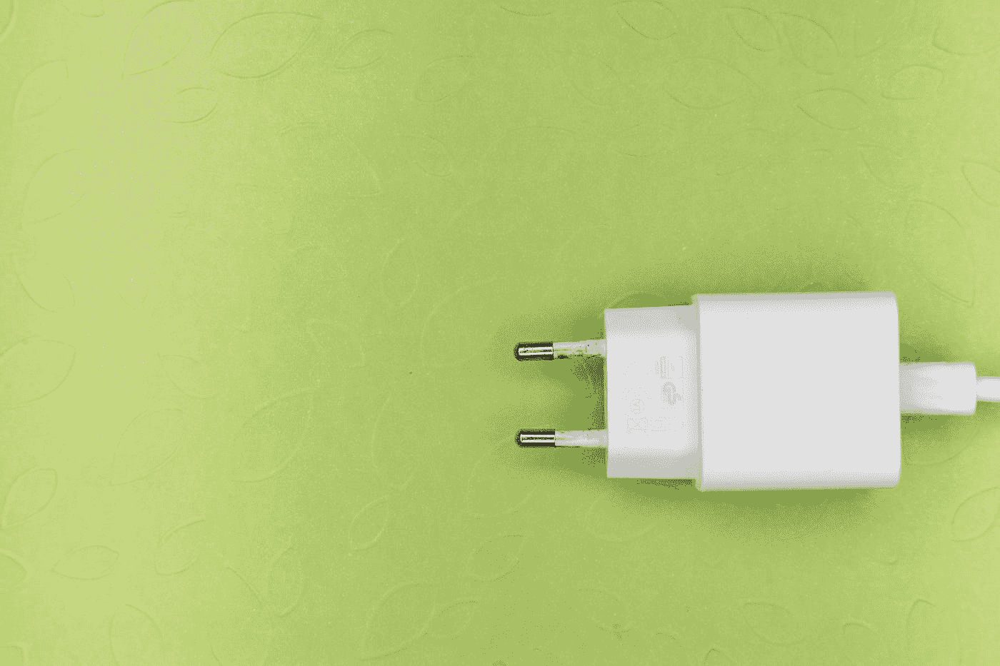

# 如何使用 Maven 制作一个基本插件

> 原文：<https://medium.com/javarevisited/how-to-make-a-basic-plugin-using-maven-c71c507ce09c?source=collection_archive---------4----------------------->

在这篇文章中，你将看到如何从基础开始创建一个 maven 插件。制作一个 maven 插件是现成的特性。大多数情况下，maven 中都有现成的插件可以满足您的需求。你很少创建自己的定制 maven 插件。在这里，我们将探索 maven 插件的基础。

由[马库斯·温克勒](https://unsplash.com/@markuswinkler?utm_source=medium&utm_medium=referral)在 [Unsplash](https://unsplash.com?utm_source=medium&utm_medium=referral) 上拍摄

我希望你很少看到有人在写 maven 插件。因为有现成的…