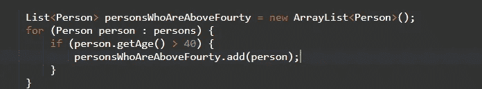
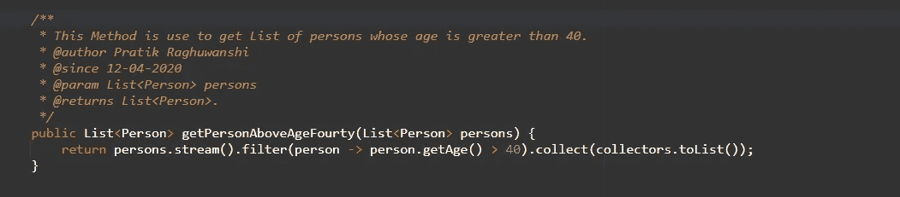

# 用 Java 编写可读代码的实用技巧

> 原文：<https://medium.com/javarevisited/how-to-make-your-code-to-readable-code-627084f84c28?source=collection_archive---------1----------------------->

## 让 Java 代码更具可读性的一些实用技巧

程序员们好，

按照我的想法，每个懂编程语言的人都是程序员，但是写代码和写可读的代码有更大的区别。

> 可读的代码是易于维护、易于阅读、易于调试、易于重用、尺寸小、适当重构、文档完善并有适当注释等的东西。

所以让我们从一些简单而有趣的实践开始，这些实践让你混乱的代码变得可读。

## 1.尝试使用流而不是循环

流的最大优点是可读性， [JAVA 8](/javarevisited/top-5-courses-to-learn-new-features-of-java-8-to-java-13-107eb51d2a13) 带来了令人兴奋的惊喜，其中最大和最有用的惊喜之一就是流。Stream 为用户提供了许多方法，帮助我们减少代码行数，我们举一个简单的例子。

假设我有一个班级成员，他有姓名、年龄、联系电话、地址等基本信息。因此，我创建了一个名为`Person` 的类，其中包含所有这些字段及其 getter setter 和一个无参数构造函数，问题陈述是我想要年龄在 40 岁以上的`Persons` ,按照传统方式，我们将按以下方式进行。

这里的人员是具有人员数据的人员类型列表

这是 6 行代码，我们可以把它变成可读性很好的单行代码，是的，对于流来说也是可能的。

这里，stream 的 filter 方法过滤掉年龄大于 40 岁的人，并将他们收集到一个列表中

## 2.尽可能地重构你的代码

重构是使你的代码更易维护的一项重要技术，当你用一种方法编写你的整个逻辑时，它确实是杂乱而整洁的。重构的经验法则是函数应该有且只有一个目的。当我们将大代码分割成小块的函数时，调试和测试都很容易，这有助于避免应用程序中的代码重复。

## 3.文档和注释

*“注释是表达代码意图的艺术”*

实际上，文档和注释是一个硬币的两面，两者的目的是相似的，只是为了描述你的代码，一个新的程序员在你的公司或你的领域可以通过阅读上面的文档来理解你的功能的目的。文档只不过是写在函数或类上面的块级注释，用来描述函数或类的使用。

当函数中编写了一些复杂的逻辑时，行内注释非常有用。

最后，结论很简单，你的代码可读性仅仅依赖于一些点，比如代码的长度，代码的重构，这样它会变得易于维护和调试，最后但同样重要的是注释和文档。

感谢阅读！