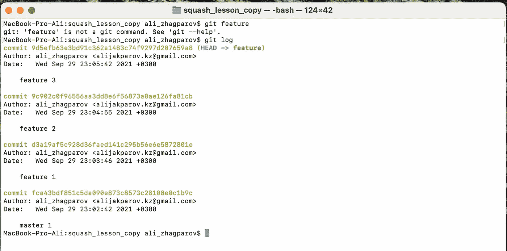
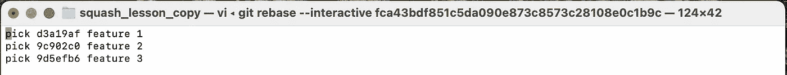
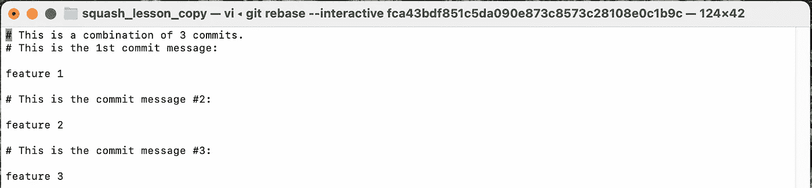
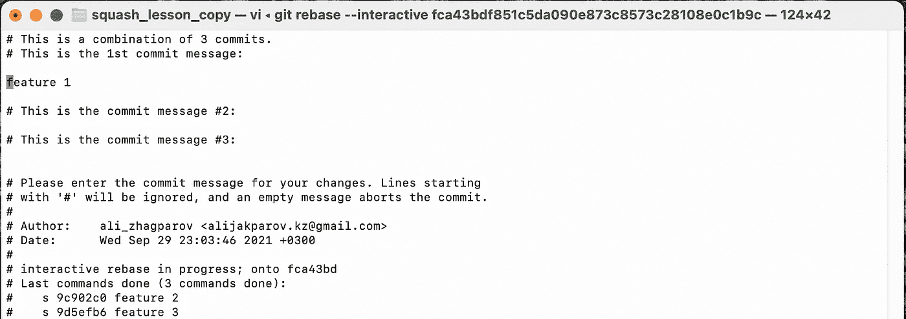
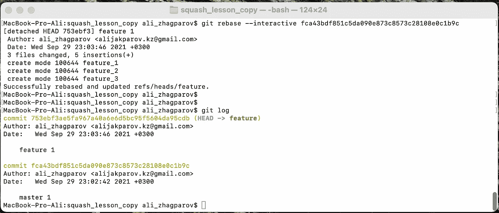

# 如何合并你所有的历史

> 原文：<https://medium.com/javarevisited/how-to-merge-all-your-history-27d4ee08043c?source=collection_archive---------3----------------------->

有时可能会出现创建了太多提交的情况，如果将它们压缩成 1 个会更好。

在 git 中，我们没有 squash 命令；相反，您可以使用带有附加交互标志的 git rebase 。

> 例如，我们的分支看起来像这样。

要进行适当的挤压，您需要指定您将开始的提交

1.  使用设置提交哈希挤压 git

> git rebase -交互式 FCA 43 BDF 851 C5 da 090 e 873 c 8573 c 28108 E0 C1 b 9 c

2.用指定提交挤压 git*头*

> git rebase -交互式 HEAD~3

如果我们想挤压提交，只需将 pick 改为***s**或*挤压*然后保存即可。之后，您需要像这样设置提交消息:***

******

***然后保存它，之后您需要指定提交消息***

******

***那样地***

******

***在 rebase 操作的最后，你会得到下面的结果。***

******