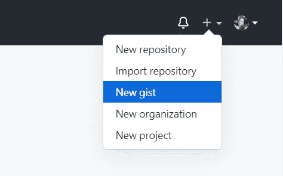
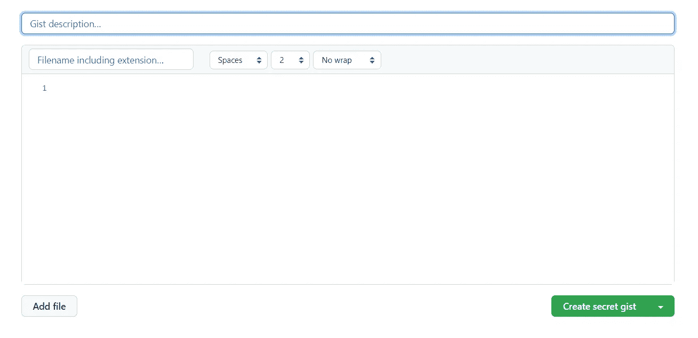
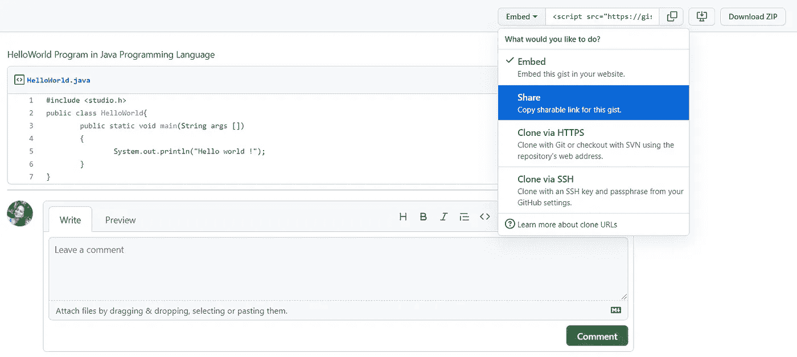
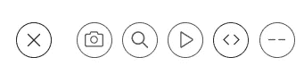
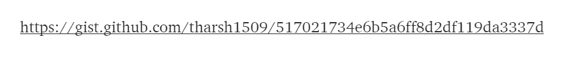

# 如何在媒体文章中发布代码？

> 原文：<https://medium.com/javarevisited/how-to-post-code-in-medium-article-c64bd9ad9bd7?source=collection_archive---------2----------------------->

在这篇文章中，我将讨论如何将代码添加到你的媒体文章中。这并不难，但是如果我们不知道这个简单的问题，我们就不能添加代码。让我们来看看。

## 方法 1

如果你想在媒体上添加简单的代码，那就按 ctrl+alt+6 (windows)。通过点击这里，您可以添加简单的代码。

ctrl+alt+6

粘贴您的代码。

## 方法 2

如果你想添加长代码，那么最好在你的中型文章中添加 GitHub 代码。

1.  打开你的 GitHub 账户，选择**“新要点”。**

选择“新要点”。

2.你现在可以看到这个屏幕。

3.根据您的需要填写字段。设置一个**公共要点**并创建它。

创建公共要点。

4.创建完成后，选择**“分享”**，获得创建要点的链接。
选择“分享”并复制链接。

5.转到您的文章编辑工作区，单击+号并选择**“添加嵌入式”。**

选择“添加嵌入内容”

6.它会要求嵌入链接。

7.现在复制你已经复制的链接，然后按回车键。

**最后，你可以看到这个。**

希望这有所帮助。分享你的想法吧！