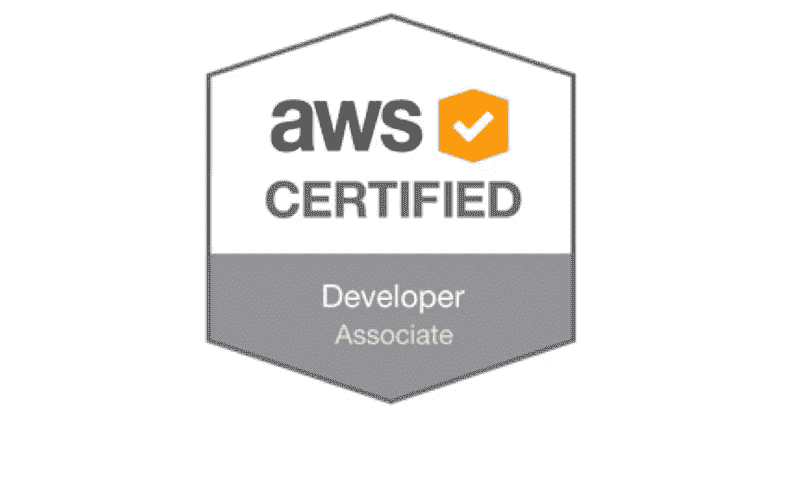
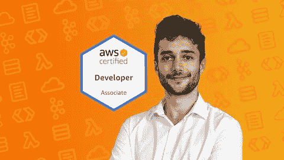
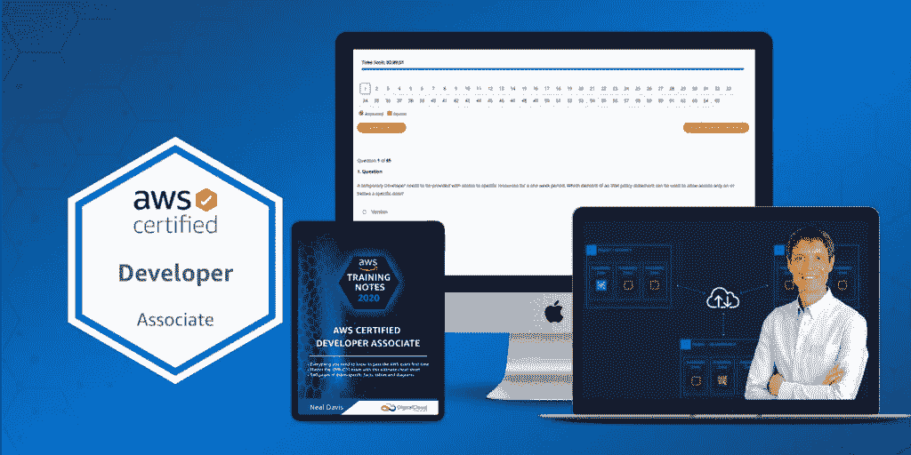
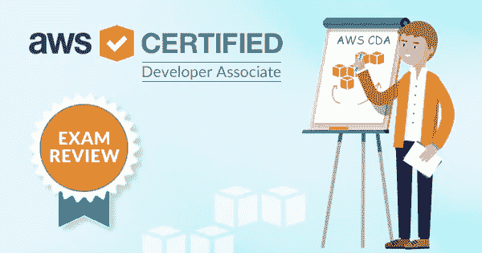
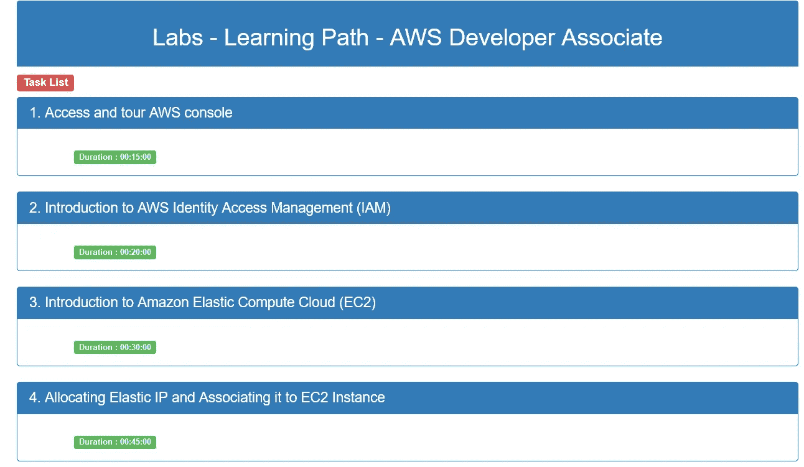

# 如何准备 2023 年的 AWS 开发者助理认证(DVA-C02)考试

> 原文：<https://medium.com/javarevisited/how-to-prepare-for-aws-developer-associate-certification-dva-c01-exam-f65313b32309?source=collection_archive---------0----------------------->

## 关于如何准备 2023 年 AWS 认证开发人员助理考试的分步指南，包括书籍、课程、模拟测试和技巧等资源。

大家好，如果你正在准备 2023 年的 AWS 开发人员助理认证，并在寻找通过考试的最佳书籍、课程和整体指导，那么你来对地方了。

之前我已经分享了 [**最佳 AWS 开发者课程**](/javarevisited/top-5-online-courses-to-become-aws-certified-developer-associate-in-2020-best-of-lot-9b22baf84ca8) 和 [**模拟测试**](/javarevisited/6-best-aws-developer-associate-dva-c001-certification-practice-test-mock-exams-and-dumps-9e24573f509a) ，今天我要分享的是通过这项久负盛名的 AWS 云认证的整体指南和完整资源。

毫无疑问，AWS 认证是非常有价值的，它不仅为系统管理员和解决方案架构师，也为开发人员和 DevOps 工程师打开了许多机会之门。

*AWS Certified Developer Associate certification*考试面向软件开发人员和 Web 开发人员，它测试您在 AWS 上开发和部署软件应用程序以及使用数据库、无服务器架构和 AWS API 的能力。

即使知识和经验是不可替代的，如果你不知道如何在 AWS 控制台上工作，你的认证也不是很有用，但 [AWS 云认证](https://javarevisited.blogspot.com/2020/09/top-10-aws-certifications-for-cloud-professionals.html)有很多有形和无形的好处，特别是 AWS 认证开发人员助理考试。

例如，它让您有机会深入了解 AWS 服务和平台。它还为您的知识和云技能提供了应有的认可。它允许你在简历和 LinkedIn 中加入 AWS，这带来了很多机会，因为招聘人员和公司总是在寻找经过认证的 AWS 专业人员。

但是， [AWS 开发者认证](https://javarevisited.blogspot.com/2020/07/top-5-aws-certified-developer-associate-practice-tests-mock-exams.html)或任何其他认证最重要的好处是它给你的知识。我个人在准备认证时学到了很多，这也是我深入学习新技术的首选方式。

一旦你掌握了基础知识，就去申请认证，在这个过程中你会学到很多，并成为该技术的专家。我已经尝试用这种方法学习了 [Java](/javarevisited/5-best-core-java-books-for-beginners-20e3f723e3a) 、 [Spring](/javarevisited/10-best-spring-framework-books-for-java-developers-360284c37036) 以及其他几种技术，可以说效果不错。

一旦你开始准备 [AWS 认证](/javarevisited/top-5-aws-training-courses-to-crack-amazon-web-service-solutions-architect-associate-certification-3f4affa8f660?source=collection_home---4------0-----------------------)，你显然会开始阅读更多关于不同的 AWS 服务及其优缺点的信息，在 Youtube 上观看更多的在线课程和教程，进行更多的动手实验，并开始解决更多的实践问题，所有这些活动都会带来大量与 AWS 相关的知识和经验，不仅在认证方面，而且在面试和日常工作中也很有用。

# 如何准备 2023 年 AWS 开发者助理考试

自去年以来，我一直非常关注[云计算](/javarevisited/5-best-cloud-computing-courses-to-learn-in-2020-f5f091159401) g、[机器学习](/javarevisited/10-best-coursera-certifications-courses-for-machine-learning-and-artificial-intelligence-256d9a125822)和[大数据](/javarevisited/top-5-big-data-frameworks-java-developers-can-learn-in-2021-9a3e20437c8c)，并阅读了许多关于助理级 AWS 认证的信息，如解决方案架构师、云开发人员和系统管理员。

我也在帮助我的一些读者完成他们的 [AWS](https://javarevisited.blogspot.com/2020/05/top-5-amazon-web-services-aws-courses-for-beginners-and-experienced-programmers.html) 、 [Azure](https://javarevisited.blogspot.com/2020/09/top-5-courses-to-learn-microsoft-azure.html) 和 [Google cloud](https://javarevisited.blogspot.com/2019/07/top-5-google-cloud-platform-gcp-courses-certifications-online.html) 认证之旅，我很高兴他们中的许多人在第一次尝试中就成功了，现在我与你们分享同样的蓝图。

这是我和我的许多朋友和读者经过反复试验的蓝图。我按照这个蓝图得到了不同的 [Oracle](/javarevisited/top-7-practice-tests-and-mock-exams-to-prepare-for-oracles-java-certifications-ocajp-and-ocpjp-36502d4ca061) 、 [Java](https://javarevisited.blogspot.com/2019/12/how-to-crack-java-se-11-certification.html) 、 [Spring Professional](/javarevisited/top-5-spring-professional-certification-exam-resources-for-java-developers-3ef9fa42fe13?source=---------38------------------) 、SQL Server、 [Data Science](/javarevisited/my-favorite-data-science-and-machine-learning-courses-from-coursera-udemy-and-pluralsight-eafc73acc73f) 和 AWS 认证。

这几乎是一个三点公式，你需要选择一门好的课程，做大量的动手实验，然后尽可能多地解决练习题。如果你诚实地遵循这三个步骤，你一定会在你的 [AWS 开发者助理考试](/javarevisited/top-5-online-courses-to-become-aws-certified-developer-associate-in-2020-best-of-lot-9b22baf84ca8)中获得 800+的分数。

该蓝图将帮助您不仅在 AWS 认证中获得成功，而且在任何 IT 认证中获得成功，您需要做的就是为每个部分选择正确的资源。我的意思是为 AWS 认证开发人员助理考试选择最好的在线课程，选择最好的书籍和[模拟测试](https://javarevisited.blogspot.com/2020/07/top-5-aws-certified-developer-associate-practice-tests-mock-exams.html)，这就是本文将帮助你的地方。

在本文中，我将分享您的资源，帮助您顺利通过 AWS 认证开发人员助理考试。

## 1.在线课程

在线课程是开始准备 AWS 认证的最佳资源，这里的关键是选择正确的课程，这些课程不仅涵盖考试主题，还教会你实用的东西，这样你就可以学习现实工作中所需的 AWS 技能。对于 AWS 开发人员助理考试，我推荐以下在线培训课程，其中一些是免费的，其他的也很实惠，你只需花 10 美元就可以在每月举行的 Udemy sales 上购买。

**1.1。** [**夏羽马瑞克的 AWS 认证开发人员助理课程**](https://click.linksynergy.com/deeplink?id=JVFxdTr9V80&mid=39197&murl=https%3A%2F%2Fwww.udemy.com%2Fcourse%2Faws-certified-developer-associate-dva-c01%2F)
这是通过 AWS 开发人员助理考试的最佳在线课程。由已经通过所有 AWS 认证的 AWS 专家[夏羽·马瑞克](https://click.linksynergy.com/deeplink?id=JVFxdTr9V80&mid=39197&murl=https%3A%2F%2Fwww.udemy.com%2Fuser%2Fstephane-maarek%2F)创建，本课程将教你通过这一享有盛誉的云认证所需的一切。

如果你只能上一门课，那就买下这门，你不会后悔的，它值得你花时间和金钱。超过 5 万人已经加入了这个课程。

以下是加入本课程的链接— [**终极 AWS 认证开发人员助理课程**](https://click.linksynergy.com/deeplink?id=JVFxdTr9V80&mid=39197&murl=https%3A%2F%2Fwww.udemy.com%2Fcourse%2Faws-certified-developer-associate-dva-c01%2F)

**2。** [**AWS 认证开发者助理考试培训 DVA-C02**](https://click.linksynergy.com/deeplink?id=CuIbQrBnhiw&mid=39197&murl=https%3A%2F%2Fwww.udemy.com%2Fcourse%2Faws-certified-developer-associate-exam-training%2F)
这是为准备 AWS 开发者助理考试而开设的又一门优质在线课程。

该课程由 Neal Davis 和领先的云培训组织之一 Digital Cloud Training 共同创建，结构合理，深度足以通过考试。

本课程由 Neal Davis 创建，如果您是 AWS 的完全初学者，那么这是您学习 AWS 并通过这一重要认证的完美课程。

以下是参加本课程的链接— [**AWS 认证开发人员—助理**](https://click.linksynergy.com/deeplink?id=JVFxdTr9V80&mid=39197&murl=https%3A%2F%2Fwww.udemy.com%2Fcourse%2Faws-certified-developer-associate%2F)

## 2.书

除了在线课程之外，我强烈建议你获得一份学习指南，详细了解考试主题。虽然这本书提供了最全面的覆盖面，但它们通常不是最新的，因为几乎不可能每 6 个月更新一次考试主题和 AWS 认证大纲。

因此，我在这里没有任何推荐，除了 [**AWS: The Good Parts**](https://gumroad.com/a/703100019/MsVlG) 这是我最喜欢的一本书，用来学习必须经受住时间的考验并将保持相当长一段时间的基本 AWS 服务。

这不像其他任何基于文档和规范的书，而是来自真实的经验。两位作者都在亚马逊工作了 15 年，对 AWS 了如指掌。我强烈推荐这本书给任何想学习 AWS 的人，尤其是准备认证的人。

## 3.模拟测试和实践测试

现在，这是 AWS 认证之旅的第三块拼图。模拟考试是你准备工作中最重要的部分，因为它们可以用来评估你的准备水平。你也可以用它们来发现你的强项和弱项，并在真正考试前加以改进。我通常从一个主题式的测试开始，看看我是否准备好了一个完整的模拟测试，然后继续努力。当你在模拟考试和练习卷中持续获得 80%的分数时，你就为真正的考试做好了准备。如果你需要建议，这里有 *AWS 开发人员助理实践测试*可以用来充分证明你的准备。

## 3.1.WhizLabs ( [834 个问题](https://shrsl.com/25qjc))

当谈到实践测试和 AWS 模拟器时，我相信 Whizlabs，他们的实践测试通常质量很高，并且很好地涵盖了考试主题。他们的解释也很有启发性，我从他们身上学到了很多。

[来自 Whizlabs](https://shrsl.com/25qjc) 的 AWS 开发人员助理实践测试包含 834 个独特的问题，分为 12 个完整的测试，足以准备这次考试。

为了从这个模拟测试中获得最大收益，请在真实的考试环境中进行全长测试，例如安静的房间和时间限制。这将帮助你真正评估你的准备水平。

下面是参加这个模拟测试的链接— [Whizlabs AWS 开发者测试](https://shrsl.com/25qjc)

## 3.2 Udemy AWS 实践测试

除了在线课程，Udemy 还有一些作为在线课程出售的模拟测试，您可以用来准备 AWS 解决方案架构师考试。在 Udemy 上的众多 AWS 开发者实践测试中，我推荐这两个，都是最新的测试:

**3.1。Jon Bonson 的 AWS 开发者助理模拟测试(** [**260 题**](https://click.linksynergy.com/deeplink?id=JVFxdTr9V80&mid=39197&murl=https%3A%2F%2Fwww.udemy.com%2Fcourse%2Faws-certified-developer-associate-practice-exams-amazon%2F) **)**
这是另一个值得推荐的 Udemy 上的 AWS 开发者助理模拟测试。本课程包含 6 个模拟测试，每个 65 个问题，这对您的最终准备很有帮助。如果你在这次模拟考试中一直获得 80+的分数，那么你就为真正的考试做好了准备。

<https://click.linksynergy.com/deeplink?id=JVFxdTr9V80&mid=39197&murl=https%3A%2F%2Fwww.udemy.com%2Fcourse%2Faws-certified-developer-associate-practice-exams-amazon%2F>  

**3.2。大卫·梅耶尔的 AWS 开发人员助理练习题(** [**987 题**](https://www.certification-questions.com/practice-exam/amazon/aws-certified-developer-associate?affiliateCode=fcff36fd-557a-4713-abf6-973e9924770f&utm_source=Javin&utm_medium=affiliate&utm_campaign=affiliate) **)**

这是 AWS 练习题的另一个大列表，实际上，它们是考试垃圾，意味着它们是过去考试的真题，如果你真的想获得 900+的分数。这个模拟测试有 987 个问题和 20 个考试测试，这使它成为所有 AWS 练习试卷的母亲。做了之后就不需要别的了。

<https://www.certification-questions.com/practice-exam/amazon/aws-certified-developer-associate?affiliateCode=fcff36fd-557a-4713-abf6-973e9924770f&utm_source=Javin&utm_medium=affiliate&utm_campaign=affiliate>  

**3.3。夏羽·马瑞克的 AWS 开发人员模拟测试(** [**293 题**](https://click.linksynergy.com/deeplink?id=JVFxdTr9V80&mid=39197&murl=https%3A%2F%2Fwww.udemy.com%2Fcourse%2Faws-certified-developer-associate-practice-tests-dva-c01%2F) )
高质量和基于场景的问题，在真实的 AWS 测试中表现出色。有时比实际的例子更难。在参加真正的考试之前，这是磨练你的速度和准确性的完美考试。我向所有认真想一次通过考试并获得高分的人强烈推荐这个考试。

<https://click.linksynergy.com/deeplink?id=JVFxdTr9V80&mid=39197&murl=https%3A%2F%2Fwww.udemy.com%2Fcourse%2Faws-certified-developer-associate-practice-tests-dva-c01%2F>  

## 4.动手实验

如果你渴望成为 AWS 云的 AWS 认证开发人员，在 AWS 控制台内练习是非常重要的。总的来说，我建议学生参加一个有实践实验室的课程，并开设一个 AWS 免费层帐户。

因为，你只记得你做了那些东西，这些 AWS 实践会议将帮助你理解和记住你正在阅读的服务，如 [EC2](https://javarevisited.blogspot.com/2020/08/top-5-courses-to-learn-amazon-aws-ec-2.html) 、 [S3](https://www.java67.com/2020/08/top-5-courses-to-learn-aws-s3-and-dynamoDB-in-depth.html) 、DynamoDB、IAM 等等。您可以在 AWS 门户网站注册一个免费的 AWS 帐户。

Whilzlabs 也有许多针对 AWS、Azure 和 GCP 的实践实验室，以及专注于不同 AWS 认证的实验室，如 AWS developer associate，您可以使用 [**Whizlabs 订阅**](https://shareasale.com/r.cfm?b=1551042&u=880419&m=43514&urllink=&afftrack=) 访问它们，它提供对所有在线培训课程的完整访问，并对不同认证进行实践测试，每年仅需 99 美元(现在有 50%的折扣)。

我强烈推荐这个订阅计划，因为 Whizlabs 有最好的材料来准备 IT 认证。

## 5.白皮书

如果你对 800+的核心不满意，并希望获得 900+的分数，那么我也建议你阅读亚马逊和 AWS 提供的白皮书和案例研究。这些是你在互联网上任何地方都能找到的最深入、最实用的内容。

如果你想更进一步，你也可以阅读 AWS 文档，因为它提供了最新的信息，这当然是一个重要的因素，因为 AWS 仍在发展，有数百个更新要赶上。

或者，你也可以在 ACloudGuru 上注册 AWS weekly，这是了解 AWS 最新变化的好方法。

这里是阅读 AWS 白皮书的链接

<https://aws.amazon.com/whitepapers/>  

## AWS 开发人员助理认证的 5 个技巧

现在，您已经知道如何准备 AWS 开发人员认证、书籍、课程和实践测试，是时候了解一些实用的技巧了，这些技巧不仅可以加快您的准备，还可以避免考试中的愚蠢错误，并在第一次尝试中通过考试。

1。AWS 认证开发人员助理认证考试的及格分数每天都在变化。它可能是 60%或 72%甚至更多，但是你应该总是准备 75%在第一次尝试时通过考试。
2
。AWS 开发者助理考试需要准备多长时间？嗯，准备时间大部分取决于经验水平。如果你有一些 AWS 的经验，那么 2-3 周的准备就足够了，但是如果你是一个完全的 AWS 初学者，那么 4-6 周是一个合理的时间。

3。如果你不想成为纸上认证的 AWS 开发人员或解决方案架构师，动手实验练习是必不可少的。您将通过认证学习和获得的所有东西也需要实践经验的支持。对于日常工作中不积极使用 AWS 的人来说，这甚至更重要。简而言之，获得一个[免费 AWS 账户](https://aws.amazon.com/)打开并尝试打破东西，并学会了如何修复它们。

4。出于我上面提到的原因，参加最新的课程，包括实验室练习。由于 AWS 仍在不断发展，每天都有新的功能出现，因此选择不是最新的课程非常重要，不仅要考虑认证大纲和课程，还要考虑 AWS 功能以及如何在 AWS 中以最佳和最新的方式做事。

5。尽可能多地解决练习题。这是迄今为止对我来说最重要的提示。因为你要参加一个考试，你需要在有限的时间内解决问题，你必须练习阅读、理解和快速解决这些问题。我知道很多人仅仅因为时间的压力就错了 10 到 15 道题。

模拟测试和练习题也有助于巩固你的知识，突出你学习中的差距。例如，你可以使用它们来找到你的强项和弱项，然后在真正的考试之前更好地覆盖它们。

以上就是关于**如何通过 AWS 解决方案架构师助理级别考试**。AWS 认证，尤其是解决方案架构师认证非常重要。这不仅给了你 AWS 的认可，也为你的面试和进一步的工作做好了准备。

AWS 认证专业人员也是薪酬最高的专业人员，年薪从 12 万美元到 13 万美元不等，随着越来越多的公司转向云，云开发人员和架构师有很多机会。

您可能想了解的其他 **AWS 认证资源**

*   [如何破解 AWS 解决方案架构师助理考试](https://javarevisited.blogspot.com/2019/08/how-to-crack-aws-certified-solution-architect-exam.html)
*   [破解 AWS 解决方案架构师助理认证的 5 大课程](https://javarevisited.blogspot.com/2019/05/top-5-courses-to-crack-aws-solutions-architect-associate-certification-exam-SAA-C01.html#axzz5rHwAwycj)
*   [10 大 AWS 认证云从业者在线课程](/javarevisited/10-best-aws-certified-cloud-practitioner-clf-c01-online-courses-and-practice-test-to-crack-ecc0f913091e)
*   [5 门最适合初学者的 Azure 基础课程](/javarevisited/5-best-azure-fundamentals-courses-to-pass-az-900-certification-exam-in-2020-9e602aea035d)
*   [面向 Java 开发人员的五大 AWS 和云课程](https://javarevisited.blogspot.com/2020/05/top-5-cloud-courses-for-java-and-spring-boot-developers.html)
*   [我最喜欢的深入学习 AWS 的课程](/javarevisited/top-10-courses-to-learn-amazon-web-services-aws-cloud-in-2020-best-and-free-317f10d7c21d)
*   [5 次免费的 AWS 解决方案架构师助理实践测试、转储和模拟考试](https://javarevisited.blogspot.com/2019/08/top-5-free-aws-solution-architect-Associate-certification-dumps-practice-questions.html)
*   [成为 AWS DevOps 工程师专家的 5 门课程](https://javarevisited.blogspot.com/2020/04/top-5-course-to-crack-aws-certified-devops-engineer-professional-exam-certification.html)
*   [成为 AWS 解决方案架构师专家的前 5 门课程](https://javarevisited.blogspot.com/2020/04/top-5-course-to-crack-aws-solution-architect-professional-sap-c01-certification-exam.html)
*   [学习亚马逊网络服务的 5 门免费课程](https://www.java67.com/2018/05/top-5-amazon-web-services-or-aws-courses-to-learn-online.html)
*   [破解 AWS DevOps 工程师考试的前 5 门课程](https://javarevisited.blogspot.com/2020/04/top-5-course-to-crack-aws-certified-devops-engineer-professional-exam-certification.html)
*   [破解 AWS 解决方案架构师专业考试的前 5 门课程](https://javarevisited.blogspot.com/2020/04/top-5-course-to-crack-aws-solution-architect-professional-sap-c01-certification-exam.html)
*   [如何通过 Azure 基础知识考试(AZ-900)](https://javarevisited.blogspot.com/2020/04/how-to-crack-microsoft-azure-fundamentals-certification-az-900-exam.html)
*   [AWS 云从业者五大模拟测试和考试转储(CLF-C01)](https://javarevisited.blogspot.com/2020/03/top-5-aws-certified-cloud-practitioner-mock-test-practice-questions.html)
*   [通过 AWS 云从业者考试的 5 门最佳课程](https://javarevisited.blogspot.com/2020/02/top-5-courses-to-crack-aws-certified-cloud-practitioner-exam-certification-clf-c01.html)
*   [如何准备 AWS 解决方案架构师认证](/javarevisited/top-10-courses-to-learn-amazon-web-services-aws-cloud-in-2020-best-and-free-317f10d7c21d)
*   [官方 AWS 开发者助理考试指南](https://d1.awsstatic.com/training-and-certification/docs-dev-associate/AWS-Certified-Developer-Associate_Exam-Guide.pdf)
*   [AWS 认证开发人员助理(DVA-C02)样题](https://d1.awsstatic.com/training-and-certification/docs-dev-associate/AWS-Certified-Developer-Associate_Sample-Questions.pdf)

感谢您阅读本文。如果您喜欢 AWS 开发人员助理认证路线图和指南，请与您的朋友和同事分享。

**P. S.** —如果你渴望通过 AWS 认证开发人员助理认证，但负担不起这些资源，而不是寻找免费资源来准备这一声望很高的认证，那么你也可以在 Udemy 上查看这个 [**免费的 AWS 开发人员助理培训**](https://click.linksynergy.com/deeplink?id=JVFxdTr9V80&mid=39197&murl=https%3A%2F%2Fwww.udemy.com%2Fcourse%2Faws-developer-associate-training%2F) 。这是完全免费的，你只需要一个 Udemy 帐户就可以参加这个 AWS 培训课程。

<https://click.linksynergy.com/deeplink?id=JVFxdTr9V80&mid=39197&murl=https%3A%2F%2Fwww.udemy.com%2Fcourse%2Faws-developer-associate-training%2F> 