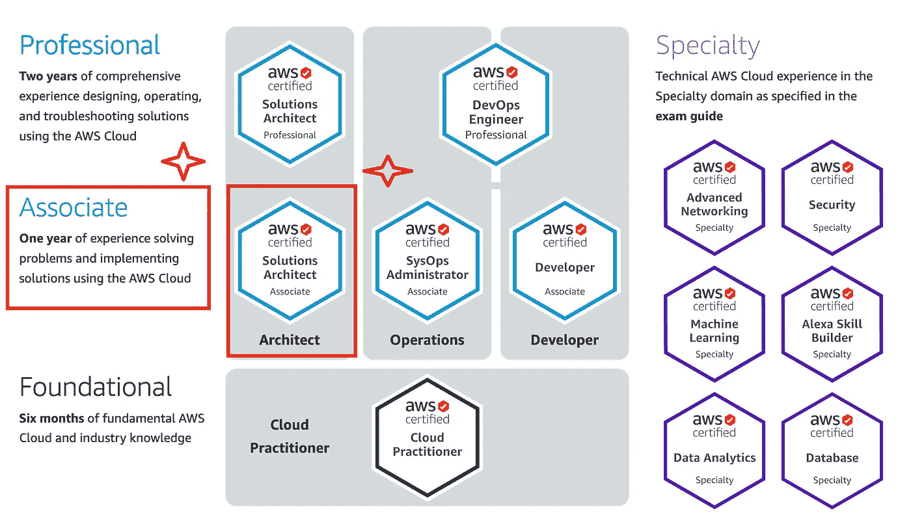
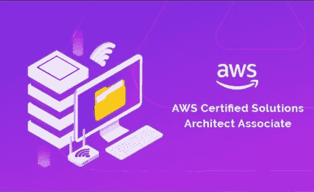
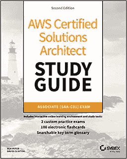
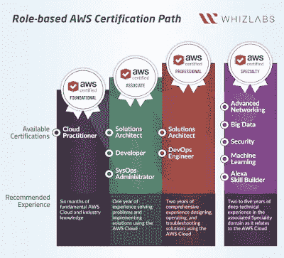
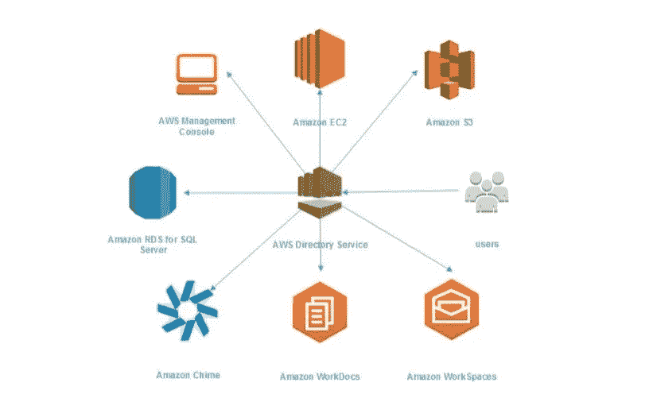

# 如何准备 2023 年的 AWS 解决方案架构师助理认证(SAA-C03 和 SAA-C02)考试

> 原文：<https://medium.com/javarevisited/how-to-prepare-for-aws-solution-architect-associate-certification-saa-c01-saa-c02-exam-in-2021-a6e7e7e771fc?source=collection_archive---------0----------------------->

## 您在 2023 年成为 AWS 认证解决方案架构师的完整指南，其中包含资源链接和在考试中获得高分的提示。

AWS 认证路线图

大家好，如果你渴望在 2023 年成为 AWS 认证的解决方案架构师，并寻找如何准备这一声望很高的认证的指导，那么你来对地方了。早些时候，我已经分享了 [**最佳 AWS 解决方案架构师课程**](/javarevisited/top-5-aws-training-courses-to-crack-amazon-web-service-solutions-architect-associate-certification-3f4affa8f660?source=collection_home---4------0-----------------------) 和 [**实践测试**](/javarevisited/6-best-aws-solution-architect-associate-certification-practice-test-mock-exams-and-dumps-240c269dab4f) ，在本文中，我将分享我在首次尝试中破解这一有价值的 AWS 认证考试的过程。

毫无疑问，AWS 认证非常珍贵，它不仅为系统管理员，也为[开发人员](/javarevisited/10-things-aspiring-web-developers-should-learn-in-2021-6747bfbfc12e)和 [DevOps 工程师](/hackernoon/the-2018-devops-roadmap-31588d8670cb)打开了许多机会之门。

尽管知识和经验是不可替代的，但 [AWS 认证](https://javarevisited.blogspot.com/2019/05/top-5-courses-to-crack-aws-solutions-architect-associate-certification-exam-SAA-C01.html#axzz5rHwAwycj)有很多有形和无形的好处，主要是 AWS 认证解决方案架构师助理。

如果你不知道如何在 AWS 控制台上工作，你的认证是没有用的，但如果你知道，但仍在努力找工作，那么 AWS 认证可以帮助你。

首先，它给你认可。它可以让你在简历和 LinkedIn 中加入 AWS，也可以让你获得很多机会，因为如果技能匹配，招聘人员和公司更喜欢认证的专业人士而不是非认证的专业人士。

但是， [AWS 认证](/javarevisited/10-best-aws-certified-cloud-practitioner-clf-c01-online-courses-and-practice-test-to-crack-ecc0f913091e)或任何其他认证**最重要的好处是它给你的知识**。我个人在准备认证的过程中学到了很多，这也是我深入发现新技术的首选方式。

一旦你开始准备 AWS 认证，你显然会开始阅读更多的相关资料，观看更多的在线课程，进行更多的动手实验，并开始解决更多的实践问题，所有这些活动都会提供大量的知识和经验。

自去年以来，我一直非常关注[云计算](https://javarevisited.blogspot.com/2019/07/top-5-online-courses-to-learn-cloud-computing-aws.html)、 [DevOps](https://dev.to/javinpaul/top-10-devops-training-courses-for-programmers-and-software-developers-195n) 、[机器学习](https://hackernoon.com/10-machine-learning-data-science-and-deep-learning-courses-for-programmers-7edc56078cde)和[大数据](/javarevisited/top-10-courses-to-learn-big-data-and-hadoop-best-of-lot-23ef8691633f)，并阅读了许多关于解决方案架构师、云开发人员和 sysops 管理员等助理级别 AWS 认证的资料。我还帮助我的一些读者完成了 AWS 认证之旅，现在他们已经成功通过了，我有一个蓝图要与你们分享。

这是我和我的很多朋友、读者经过反复试验的蓝图。我按照这个蓝图通过了 Oracle、 [Java](/javarevisited/7-best-online-courses-to-prepare-for-oracles-java-se-8-certification-ocajp-8-and-ocpjp-8-2fd0d6779a9e) 、 [Spring](/javarevisited/spring-professional-certification-vmware-edu-1202-the-ultimate-guide-to-pass-spring-11dab8d311c3) 、 [SQL Server](/javarevisited/5-best-courses-to-learn-microsoft-sql-server-in-depth-e9f11b73c14a) 、[数据科学](/javarevisited/my-favorite-data-science-and-machine-learning-courses-from-coursera-udemy-and-pluralsight-eafc73acc73f)、 [AWS 认证](https://www.java67.com/2020/09/top-10-cloud-certification-you-can-aim.html)等几个认证。

这几乎是一个**三点公式**，你需要选择一门优秀的课程，做大量的动手实验，然后解决尽可能多的练习题。如果你诚实地遵循这三个步骤，你很有可能在 AWS 解决方案架构师考试中获得 **800+** 的分数。

# 如何准备 AWS 认证解决方案架构师助理考试

这份蓝图不仅能帮助你获得 AWS 认证，还能帮助你获得任何 [IT 认证](/javarevisited/10-best-aws-google-cloud-and-azure-courses-and-certification-from-coursera-to-join-in-2021-5c5e2029a8e7)，你所需要做的就是为每个部分挑选合适的资源。我的意思是，为 *AWS 认证解决方案架构师助理考试*选择最好的在线课程，并选择最好的书籍和模拟测试，这就是本文将帮助你的地方。

在本文中，我将分享您的资源，帮助您顺利通过 AWS 认证解决方案架构师助理考试。

## 1.参加在线课程

开始准备 AWS 认证的最好方法是参加一个高质量的课程。幸运的是，有很多有用的资源，特别是 Udemy 和 Cloud Guru 上的。

以下是我为准备 2023 年 AWS 解决方案架构师助理认证的人推荐的一些课程:

**#1:** [**终极 AWS 认证解决方案架构师助理 2023**](https://click.linksynergy.com/deeplink?id=JVFxdTr9V80&mid=39197&murl=https%3A%2F%2Fwww.udemy.com%2Faws-certified-solutions-architect-associate-saa-c01%2F)

这是我向所有准备参加 Udemy 上的 AWS 解决方案架构师助理级别考试的人推荐的终极课程。它是由夏羽·马瑞克创建的，他是我最喜欢的导师之一，也是 AWS 认证的解决方案架构师和开发人员。

<https://click.linksynergy.com/deeplink?id=JVFxdTr9V80&mid=39197&murl=https%3A%2F%2Fwww.udemy.com%2Faws-certified-solutions-architect-associate-saa-c01%2F>  

他以 **984/1000 的分数通过了，**这说明了很多。我也是他的[阿帕奇卡夫卡课程](/javarevisited/top-10-apache-kafka-online-training-courses-and-certifications-621f3c13b38c)的忠实粉丝，这是一个非常深入和实用的学习卡夫卡的资源。说到这门课程，它也是最新最全面的，已经有超过 3 万名学生从中受益。

**# 2:**[**whiz labs 举办的 AWS 认证解决方案架构师助理考试**](https://www.shareasale.com/r.cfm?b=1023388&u=880419&m=43514&urllink=&afftrack=)
本课程就像是 AWS 认证的一站式商店。它涵盖了你通过考试所需要的一切，而且太深入了。它还包括 711 道练习题、69 个实验和超过 28.5 小时的点播讲座。

我强烈推荐任何准备 AWS 解决方案架构师认证或想要深入学习 AWS 服务和概念的人学习本课程。

**#3:** [**AWS 认证解决方案架构师助理培训 SAA-C03 Neal Davis**](https://click.linksynergy.com/deeplink?id=JVFxdTr9V80&mid=39197&murl=https%3A%2F%2Fwww.udemy.com%2Fcourse%2Faws-certified-solutions-architect-associate-hands-on%2F&u1=JAVAREVISITED)

我是 Neal Davis 和他的数字云培训的忠实粉丝，顾名思义，他们真的是云、无服务器和 AWS 认证方面的专家。

所有和我交谈过的人都推荐这个认证课程，这充分说明了它的有用性。即使在 Udemy，这门课程也受到了近 50 万学生的信任，这太棒了。

# 2.阅读一本书或学习指南

我真的很喜欢书来准备任何认证，但是有了 AWS，问题是亚马逊一直在高速的改变 AWS 认证以及 AWS 本身。这意味着任何一本书在控制台、功能和服务方面都会很快过时。这是我使用任何一本书进行 AWS 认证的最大问题。

不过，如果你正在寻找一本仍然有一些价值的书，那么我建议你浏览一下由 Joe Baron、Hisham Baz、Tim Bixler、Biff Gaut、Kevin E. Kelly、Sean Senior 和 John Stamper 编写的 [A **WS 认证解决方案架构师官方学习指南**](https://www.amazon.com/Certified-Solutions-Architect-Official-Study-ebook/dp/B01M6W6WYD/?tag=javamysqlanta-20) 。

这本书是为较老的 AWS 解决方案架构师认证而写的，但它也涵盖了 AWS 的一些基础知识，这是许多在线课程所没有涵盖的。你可以结合云专家的 AWS 课程[使用这本书，仍然可以学到很多东西。

顺便说一句，如果你正在寻找一本更新的书来准备 AWS 认证解决方案架构师助理，那么你也可以查看本·派珀和大卫·柯林顿的](https://click.linksynergy.com/deeplink?id=JVFxdTr9V80&mid=39197&murl=https%3A%2F%2Fwww.udemy.com%2Faws-certified-solutions-architect-associate%2F) [**AWS 认证解决方案架构师学习指南:助理 SAA-C01 考试第二版**](https://www.amazon.com/Certified-Solutions-Architect-Study-Guide-dp-111950421X/dp/111950421X?tag=javamysqlanta-20) 。这本书还包括 2 个实践考试和 100 个电子抽认卡，便于复习。

我推荐的另一本书是一本关于 AWS 的经典书籍，它采用了不同的方法来解释 AWS 服务。书名叫[**AWS**](https://gumroad.com/a/703100019/MsVlG)的好部分。这本书的作者是丹尼尔·瓦萨洛，他曾在 AWS 工作过，拥有 AWS 服务的第一手经验。

不像任何其他参考书，它没有涵盖所有的 AWS 或其所有的怪癖。相反，它会帮助你认识到不使用 AWS 的哪些特性是愚蠢的。几乎不需要考虑替代方案的特性。这些功能已经通过了时间的考验，成为互联网上大多数事物的支柱。

这里是了解这本书的链接—[**AWS**](https://gumroad.com/a/703100019/MsVlG)的精彩部分

# 3.解答模拟测试

也被称为实践测试或考试模拟器，这是通过考试或取得好成绩的最大区别。

模拟考试有几个好处，比如。他们训练你在有限的时间内解决问题，这真的很重要。我知道很多人因为时间压力，刚刚答错了 5 到 10 道题。
2
。模拟测试也有助于你巩固和加强你的学习，因为当你回答问题时，你的大脑在工作。它回忆和分析概念来回答问题，这有助于你更长时间地记住这个想法，也能更好地理解它。

3。模拟测试也有助于你了解自己的准备水平。如果你参加了 Whizlabs 考试，却发现**只考了 50%，**那么你还没有为考试做好准备，你需要更多的学习和练习。同样，他们也帮助你找到你的薄弱环节，我的意思是，你需要更多的关注。

既然你知道模拟测试是必不可少的，下面是我为 AWS 解决方案架构师助理考试推荐的一些*模拟测试*

## 3.1 Udemy AWS 实践测试

除了在线课程，Udemy 还有一些作为在线课程出售的模拟测试，您可以用来准备 AWS 解决方案架构师考试。在 Udemy 上的许多 AWS SAA-C01 和 AWS SAA-C02 模拟测试中，我推荐这两个，它们都是最新的测试:

**3.1.1** 你可以用它们来准备你的 SAA-C02 考试。

这些模拟考试由[斯特凡·玛瑞克](https://medium.com/u/98189c4cef0?source=post_page-----a6e7e7e771fc--------------------------------)和阿布舍克·辛格共同编写，他们带来了通过 **18 项美国焊接学会认证**的集体经验。

<https://click.linksynergy.com/deeplink?id=JVFxdTr9V80&mid=39197&murl=https%3A%2F%2Fwww.udemy.com%2Fcourse%2Fpractice-exams-aws-certified-solutions-architect-associate%2F>  

**3.1.2 Jon Bonson 的 AWS 解决方案架构师实践测试(** [**390 题**](https://click.linksynergy.com/deeplink?id=JVFxdTr9V80&mid=39197&murl=https%3A%2F%2Fwww.udemy.com%2Faws-certified-solutions-architect-associate-amazon-practice-exams%2F) **)**

本课程包含 6 道模拟试题，每道 65 题，为你的最后准备做准备。

<https://click.linksynergy.com/deeplink?id=JVFxdTr9V80&mid=39197&murl=https%3A%2F%2Fwww.udemy.com%2Faws-certified-solutions-architect-associate-amazon-practice-exams%2F>  

**3.1.3 云大师的 AWS 架构师模拟测试(** [**195 题**](https://click.linksynergy.com/deeplink?id=JVFxdTr9V80&mid=39197&murl=https%3A%2F%2Fwww.udemy.com%2Faws-certified-solutions-architect-associate-practice-tests%2F) **)**

这是 Udemy 上另一个优秀的 AWS 解决方案架构师助理考试模拟测试。它来自 Cloud guru，包含 3 个模拟测试，每个测试有 65 个问题。这比前几部稍微有点棘手，但值得一试。

<https://click.linksynergy.com/deeplink?id=JVFxdTr9V80&mid=39197&murl=https%3A%2F%2Fwww.udemy.com%2Faws-certified-solutions-architect-associate-practice-tests%2F>  

## 3.2 David Mayer 的 AWS 转储( [987 个问题](https://www.certification-questions.com/buy-dumps-exams/aws-certified-solutions-architect-associate-dumps?affiliateCode=fcff36fd-557a-4713-abf6-973e9924770f&utm_source=Javin&utm_medium=affiliate&utm_campaign=affiliate))

如果你真的想获得 900+的分数，这是 AWS 练习题的另一个大列表。这个模拟测试有 987 个问题和 20 个考试测试，这使它成为所有 AWS 练习试卷的母亲。做了之后就不需要别的了。

<https://www.certification-questions.com/buy-dumps-exams/aws-certified-solutions-architect-associate-dumps?affiliateCode=fcff36fd-557a-4713-abf6-973e9924770f&utm_source=Javin&utm_medium=affiliate&utm_campaign=affiliate>  

## 3.3 WhizLabs ( [620 个问题](http://shrsl.com/1pid8))

包括针对 AWS 解决方案架构师助理考试实践的 6 次全程模拟考试和 620 个独特问题。它既有全面的测试，也有主题明智的测试，以改善你的薄弱环节。除此之外，每个问题都有解释，这对你的学习有进一步的帮助。

# 4.在动手 AWS 实验室工作

如果你渴望成为 AWS 云的解决方案架构师，在 AWS 控制台内的实践是非常重要的。总的来说，我建议学生参加一个有实践实验室的课程，并开设一个 AWS 免费层帐户。

在线实验室提供了在真实环境中使用 AWS 的实践机会。与模拟或演示不同，实验室使用一步一步的说明和实际的 AWS 控制台来帮助您掌握流行的 AWS 服务和真实世界的场景，如启动虚拟机或数据库、在云端保存文件等场景。

因为你只记得你做过的事情，这些 AWS 实践课程将帮助你理解和记住你正在阅读的服务，如[【EC2】](https://javarevisited.blogspot.com/2020/08/top-5-courses-to-learn-amazon-aws-ec-2.html#axzz6jJUGNBwM)、、DynamoDB、IAM 等。

QwikLABS 提供 19 个免费的 AWS 入门实验室，通常不到 30 分钟即可完成。

如何开始

1.  去 qwikLABS.com
2.  第一次？创建一个帐户。否则，请登录。
3.  选择一个免费的入门实验室，然后单击“注册”

你可以在这里注册一个免费的 AWS 账户。

# 5.阅读 AWS 白皮书

如果你是一个对 800+核心不满意并希望获得 900+分数的人，那么我也建议你**阅读 AWS** 提供的白皮书和案例研究。这些是你在互联网上任何地方都能找到的最深入、最实用的内容。

如果你想更进一步，你也可以阅读 AWS 文档，因为它提供了最新的信息，鉴于 [AWS](/javarevisited/top-15-online-courses-to-learn-docker-kubernetes-and-aws-for-fullstack-developers-and-devops-d8cc4f16e773) 仍在发展，这无疑是一个重要因素，并且有数百个更新要赶上。

或者，你也可以在 ACloudGuru 上注册 AWS weekly，这是一个了解 AWS 最新变化的好方法。这里是[链接](https://aws.amazon.com/whitepapers)阅读 AWS 白皮书

# 首次通过 AWS 认证的 5 个技巧

现在，您已经熟悉了准备 AWS 解决方案架构师认证的流程，是时候看看一些提示了，它们可以帮助您在第一次尝试时就通过这个著名的考试。这不仅意味着节省你的时间和金钱，也意味着失望。

1.  AWS 认证解决方案架构师考试的及格分数每天都在变化。它可能是 60%或 72%甚至更多，但是你应该总是准备 75%在第一次尝试时通过考试。
2.  准备 [AWS 解决方案架构师助理](https://dev.to/javinpaul/top-5-courses-to-pass-amazon-aws-certified-solutions-architect-associate-exam-saa-c01-in-2020-56g7)考试需要多少时间？嗯，准备时间大部分取决于经验水平。如果你有一些 AWS 经验，那么 2-3 周的准备就足够了，但是如果你是一个完全的 AWS 初学者，那么 4-6 周是一个合理的时间。
3.  如果你不想成为论文认证的 [AWS 开发者](/javarevisited/6-best-aws-developer-associate-dva-c001-certification-practice-test-mock-exams-and-dumps-9e24573f509a)或[解决方案架构师](/javarevisited/6-best-courses-for-aws-certified-solution-architect-professional-exam-in-2020-df5850a9279a)，动手实验练习是必须的。您将通过认证学习和获得的所有东西也需要实践经验的支持。对于那些日常工作中不积极使用 AWS 的人来说，这甚至更为重要。简而言之，获得一个免费的 AWS 帐户，尝试打破东西，并学习如何修复它们。
4.  出于我上面提到的原因，参加最新的课程，包括实验室练习。由于 AWS 仍在不断发展，每天都有新的功能出现，因此选择不是最新的课程至关重要，不仅是在认证大纲和课程方面，还包括 AWS 功能以及如何在 [AWS](/javarevisited/top-10-courses-to-learn-amazon-web-services-aws-cloud-in-2020-best-and-free-317f10d7c21d) 中以最佳和最新的方式做事。
5.  尽可能多地解决练习题。这是迄今为止，我给出的最重要的提示。因为你要参加一个考试，你需要在有限的时间内解决问题，你必须练习阅读、理解和快速解决这些问题。我知道很多人仅仅因为时间的压力就做错了 10 到 15 道题。模拟考试和[练习题](https://javarevisited.blogspot.com/2020/07/top-5-aws-certified-developer-associate-practice-tests-mock-exams.html)也有助于巩固你的知识，突出你学习中的差距。例如，你可以使用它们来找到你的强项和弱项，然后在真正的考试之前更好地覆盖它们。

以上就是关于**如何通过 AWS 解决方案架构师助理级别考试**的全部内容。AWS 认证，尤其是解决方案架构师，非常重要。这不仅给了你 AWS 的认可，也为你的面试和进一步的工作做好了准备。

AWS 解决方案架构师也是薪酬最高的专业人士，年薪从 12 万美元到 13 万美元不等，随着越来越多的公司转向云，云开发人员和架构师有很多机会。

面向 **IT 专业人员**和 Java 程序员的其他**认证资源**

*   [通过 AWS 解决方案架构师助理考试的 5 次免费模拟测试](https://javarevisited.blogspot.com/2019/08/top-5-free-aws-solution-architect-Associate-certification-dumps-practice-questions.html)
*   [如何破解甲骨文 2023 年 Java 认证](https://medium.freecodecamp.org/how-to-pass-oracles-java-certifications-a-practical-guide-for-developers-e9b607ba6173)
*   [Pivotal 的 Spring 认证对工作和职业生涯有帮助吗？](https://javarevisited.blogspot.com/2017/07/does-spring-certification-help-in-job-and-career.html)
*   [如何通过 Spring Core Professional 5.0 认证](https://javarevisited.blogspot.com/2018/08/how-to-crack-spring-core-professional-certification-exam-java-latest.html)
*   [通过微软 Azure 基础考试的前 5 门课程](https://javarevisited.blogspot.com/2020/02/top-5-courses-to-crack-az-900-microsoft-azure-fundamentals-certification-exam.html)
*   [学习数据结构和算法的 10 门免费课程](http://www.java67.com/2019/02/top-10-free-algorithms-and-data.html)
*   [2023 年网络开发者路线图](https://hackernoon.com/the-2019-web-developer-roadmap-ab89ac3c380e)
*   [破解 AZ-900 认证的五大模拟测试](https://javarevisited.blogspot.com/2020/02/top-5-AZ-900-exam-Azure-Fundamentals-certification-practice-tests-and-mock-exams-to.html)
*   [如何在 2023 年成为 DevOps 工程师](https://javarevisited.blogspot.com/2018/09/the-2018-devops-roadmap-your-guide-to-become-DevOps-Engineer.html)
*   [每个软件开发人员都应该学习的 10 件事](https://dev.to/javinpaul/10-things-every-software-developer-should-know-39pe)
*   [学习 Linux 命令行的 5 门免费课程](https://hackernoon.com/top-5-free-linux-courses-for-programmers-4a433b4edade)
*   [通过 Azure Technologies (AZ-300)考试的前 5 门课程](https://javarevisited.blogspot.com/2019/07/top-5-courses-to-crack-azure-architecture-technologies-certification-az-300-exam.html)
*   [OCAJP 和 OCPJP 考试 10 道免费样题](http://www.java67.com/2017/05/10-free-java-8-certification-sample-questions-OCAJP8-OCPJP8-Mock-Exams.html)

感谢您阅读本文。如果您喜欢认证路线图和指南，请与您的朋友和同事分享。

**p . s .**——如果你是云与 AWS 的新手，正在寻找一些学习亚马逊 Web 服务的免费课程，那么你也可以在 HackerNoon 上查看这个针对初学者的 [**免费 AWS 课程列表。**](https://hackernoon.com/top-5-amazon-web-services-or-aws-courses-to-learn-online-free-and-best-of-lot-d94e192054b7)

<https://dev.to/javinpaul/top-10-free-courses-to-learn-aws-in-2020-529e> 