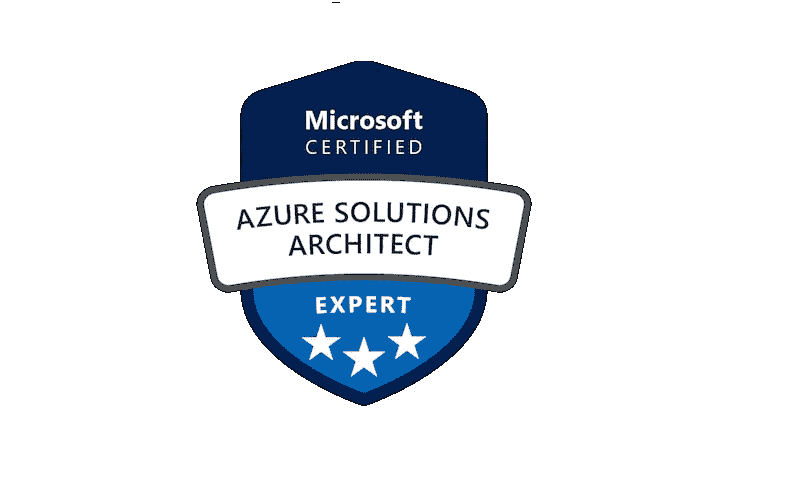
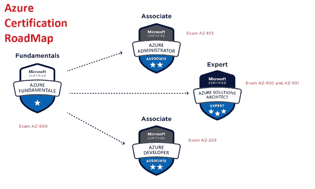
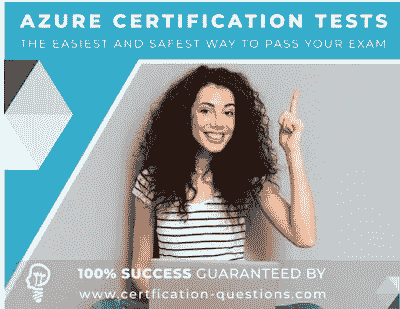

# 如何准备 2023 年 Azure Technologies 架构师认证考试

> 原文：<https://medium.com/javarevisited/how-to-prepare-for-azure-technologies-architect-certification-az-303-304-exam-5a2207c9058b?source=collection_archive---------0----------------------->

## 关于如何准备 Azure 架构师认证 AZ-303 的技巧和指南，包括在线课程、书籍和练习测试。

大家好，如果你想成为微软 Azure 认证解决方案架构师，并且想知道如何准备这个著名的考试，那么你来对地方了。

早些时候，我已经分享了一些通过 [AZ 104](/javarevisited/7-best-courses-for-az-104-microsoft-azure-administrator-associate-certification-exam-in-2021-7b620d61dcd8) 、 [AZ-900](/javarevisited/5-best-azure-fundamentals-courses-to-pass-az-900-certification-exam-in-2020-9e602aea035d) 或[微软 Azure 基础考试](/javarevisited/7-free-microsoft-azure-fundamentals-az-900-online-courses-for-beginners-in-2021-efd01d8be403)的技巧、课程和练习测试，今天，我将谈论 AZ-303 或 Azure 解决方案架构师认证考试。

基于新的 Azure 基于角色的认证路径，微软 AZ-303 考试是成为微软认证 Azure 解决方案架构师的主要步骤。

该考试要求有经验的考生具备包括 [Azure 开发](/javarevisited/10-best-microsoft-azure-courses-for-beginners-and-experienced-developers-d41a454834c0)、 [Azure 管理](/javarevisited/7-best-courses-for-az-104-microsoft-azure-administrator-associate-certification-exam-in-2021-7b620d61dcd8)和 [DevOps](/javarevisited/13-best-courses-to-learn-devops-for-senior-developers-in-2020-a2997ff7c33c) 在内的角色技能。此外，他们必须至少在其中一个领域拥有专家级技能。

然而，观察这些要求，你们中的一些人可能会认为，如果没有多年的准备，通过微软 AZ-303 架构师技术考试是完全不可能的。

这不是真的。如果你有上述领域的经验，使用正确的策略和可靠的 AZ-303 Architect Technologies 考试材料，你可以轻松通过考试。

# 如何破解 2023 年微软 Azure 解决方案架构师(AZ-303/304)考试

在过去，我已经分享了一些[在线课程](https://javarevisited.blogspot.com/2019/07/top-5-courses-to-crack-azure-architecture-technologies-certification-az-300-exam.html#axzz6Jmqe2ebo)和[实践](https://www.certification-questions.com/practice-exam/microsoft/az-300?affiliateCode=fcff36fd-557a-4713-abf6-973e9924770f&utm_source=Javin&utm_medium=affiliate&utm_campaign=affiliate)测试来破解微软 Azure 解决方案架构师考试，今天，我将为您提供如何准备和通过这个久负盛名的考试
T5 的完整指南。在这里，我的意图是为您提供这个考试与 AZ-303 考试准备策略和适当的学习材料。

## 1.AZ-303 考试的基本先决条件

AZ-303 考试的合格标准是如此的清晰，以至于人们只需阅读考试说明就很容易理解。

如果你想参加这个考试，你需要具备 Azure 解决方案架构师的技能，能够为感兴趣的各方提供建议，并将业务需求转化为可伸缩、可靠、安全的解决方案。

该考试的申请人必须在身份识别、可视化、网络、业务连续性、预算、数据管理、治理和灾难恢复方面拥有丰富的经验和技能。

正如我已经讨论过的，他/她必须具备 [Azure 开发](https://javarevisited.blogspot.com/2020/06/top-5-course-to-crack-Microsoft-Azure-Developer-Certification-Exam-AZ-203.html)、 [Azure 管理](https://javarevisited.blogspot.com/2020/04/how-to-crack-microsoft-az-103-azure-administrator-associate-exam-certification.html)和 [DevOps](https://javarevisited.blogspot.com/2018/09/10-devops-courses-for-experienced-java-developers.html) 方面的高级知识，并且至少需要在其中一个领域具备专家级技能。所以在你开始准备 AZ-303 考试之前，确保你在每种情况下都符合上述标准。

## 2.Azure 解决方案架构师 AZ-303 考试的所有信息

Azure 考试 AZ-303 是 Azure 解决方案专家中微软认证的一部分。在这次考试中，你可以期待 40 到 60 个问题。本次考试将有不同类型的问题格式。

本次考试可以提问的题型包括活动屏、复习屏、最佳答案、品牌复习、构建列表、简答题、案例分析、重复答案的选项、拖放、多选和活动区。

不正确的答案没有坏处。如果你给出了错误的答案，你就不能得到问题的全部或部分要点。在离开考场之前，还计划对答案进行复习。

## 3.考试费

如果你住在美国，参加这个考试要花 165 美元。但是，该价格可能会因地点和许多其他因素而有所不同。如果您是 Microsoft Certified Trainer、Microsoft Partner Network 计划的成员或 Microsoft Imagine Academy 计划的成员，您可能有资格享受折扣。此外，如果学生能够提供有效的课程，他们可以从这种费用减免中受益。

## 4.得分

完成考试几分钟后，您将获得显示通过/失败状态的考试结果。然而，获得一个完整的仪表板可能需要几天时间。

此打印的记分卡包含各种元素，如通过/失败状态、总体考试分数、关键能力领域的表现以及解释结果的方式。

通过考试需要 700 分。任何大于或等于 700 的分数将被标记为“通过”；否则“失败”。

## 5.重考政策

如果考生第一次考试不及格，至少要等 24 小时后才能复试。如果第二次出现这种情况，考生必须等待至少 14 天才能重复考试。

因此，一年最多允许参加 5 次考试。如果考生通过了考试，在正常情况下不能恢复考试。

## 6.考试取消政策

如果您在预约前至少 6 天取消或重新安排考试，将不会产生额外费用。如果在 5 个工作日内取消/延期，将适用最低价格。

如果您未能参加考试，或者如果您没有在预约前至少 24 小时取消/重新安排考试，您将失去在注册 [AZ 考试 300](https://javarevisited.blogspot.com/2019/07/top-5-courses-to-crack-azure-architecture-technologies-certification-az-300-exam.html) 时花费的所有考试费用。

## 7.了解 AZ-303 考试目标

在开始准备 AZ-303 考试之前，你应该知道总共 5 个目标或主题。这些目标旨在有效地分析考生考试所需的技能和经验。

*   实施和监控 Azure 基础架构(50–55%)
*   实施管理和安全解决方案(25–30%)
*   实施应用解决方案(10–15%)
*   实施和管理数据平台(10–15%)

# Azure 解决方案架构师 AZ-303 考试的最佳准备材料

有正确的准备材料可以增加成功的机会。因此，我们在这里汇集了最好的资源，以帮助您准备并通过 AZ-303 考试。让我们继续寻找最好的 AZ-303 备考资料。

## 1.微软 AZ-303 考试学习门户

这个门户网站是微软 AZ-303 架构师技术考试准备之旅的完美起点。在准备 AZ-303 考试时，您可能需要多次访问这个[门户](https://docs.microsoft.com/en-us/learn/certifications/exams/az-303)，因为它包含了参加考试所需的大部分 AZ-303 建筑师技术考试学习材料。

在这里，您可以找到基本的考试要求、考试日程安排的链接、考试中讨论的技巧、讨论用户对考试的关注点的学习小组、考试相关的政策和更新，以及许多其他备考选项的链接。

因为考试注册链接只能从这个页面进入，所以在准备 AZ-303 考试的任何阶段，你都不能想到跳过这个页面。

除了上面介绍的事实，这个门户网站可以被认为是最可靠的 [**微软 AZ-303 考试**](/javarevisited/7-best-free-azure-solution-architect-resources-to-crack-az-303-or-az304-exam-f2b525eba09b)**的备考指南，作为所有考试日期、价格变化等的最新更新。将首先出现在此门户网站上。**

**因此，当您得知本次考试的模块、价格或考试时间表发生变化时，请务必确认该门户网站上的信息。**

## **2.获得讲师指导的培训或在线课程**

**如果您需要面授培训来准备 Microsoft AZ-303 Architect Technologies 考试，您可以从 Microsoft AZ-303 学习门户获得。**

**全部培训选项分为 6 个模块，以方便准备 AZ-303 考试。这种培训的可用性因国家而异。**

**因此，当您需要这 6 门课程中的一门课程的教师培训时，请在您所在的地区寻找微软学习伙伴。如果你负担不起面授培训，那么在线课程是很好的选择，因为它们价格合理，你可以在任何地方学习。**

**以下是为 Azure 技术架构师 AZ 303 考试推荐的在线课程**

1.  **[**AZ-303 Azure 架构技术考试备考 2023**](https://click.linksynergy.com/deeplink?id=CuIbQrBnhiw&mid=39197&murl=https%3A%2F%2Fwww.udemy.com%2Fcourse%2F70534-azure%2F)【Udemy 课程】**

** [## AZ-303 Azure 架构技术考试准备 2023

### AZ-303 Azure Architect Technologies 考试的完整准备。免费升级:本课程还包含…

udemy.com](https://click.linksynergy.com/deeplink?id=CuIbQrBnhiw&mid=39197&murl=https%3A%2F%2Fwww.udemy.com%2Fcourse%2F70534-azure%2F)** 

**2. [**AZ-303 Azure 建筑师技术认证 2023**](https://click.linksynergy.com/deeplink?id=CuIbQrBnhiw&mid=39197&murl=https%3A%2F%2Fwww.udemy.com%2Fcourse%2Faz-102-azure-administrator-certification-transition%2F)【Udemy】**

** [## AZ-303 Azure Architect 技术认证 2023

### 添加了几个新的视频，包括 Azure 存储帐户-使用文件和表格服务 Azure 存储…

udemy.com](https://click.linksynergy.com/deeplink?id=CuIbQrBnhiw&mid=39197&murl=https%3A%2F%2Fwww.udemy.com%2Fcourse%2Faz-102-azure-administrator-certification-transition%2F) 

**3。**[**AZ-303 Azure Architect Technologies 2023 年模拟考试**](https://www.udemy.com/course/az-303-microsoft-azure-architect-technologies-practice-tests/?referralCode=18AD34BDD3A084AFA4AA) 【我的课程】

 [## AZ-303 Azure Architect Technologies 的 2023 年模拟测试

### 我们是一个拥有扎实技术技能的团队，对在线教学充满热情。我一直在把我对 Java 的想法写在…

www.udemy.com](https://www.udemy.com/course/az-303-microsoft-azure-architect-technologies-practice-tests/?referralCode=18AD34BDD3A084AFA4AA) 

## 3.最佳 Azure 技术架构师 AZ-303 书籍和参考资料

由于这是一个新的考试，您可能没有找到足够的 AZ-303 书籍或参考资源来准备 Azure 认证考试。然而，一旦你在这一领域看到了类似的书，一定要使用顾客评论和卖家信息来验证它的真实性。这种类型的验证非常重要，因为许多自称的书籍经常说服读者遵循贫民窟，而不是对模型或测试程序进行实际分析。

以下准备 AZ-303 考试的头脑风暴也可能导致禁止完成考试或尝试 Azure 中的其他考试。因此，在准备 AZ-303 考试时，一定不要遵循这些错误。

## 11.学习小组和论坛

有许多微软论坛可以帮助用户准备 Azure 认证考试。其中一些论坛也适用于 AZ-303 考试的考生。

由于论坛上的评论不会花你一分钱，所以这是准备 AZ-303 考试最简单的方法之一。在论坛里，你可以毫无顾虑地提出你的问题。你会收到很多有经验的人的回复。微软在其 AZ-303 学习门户上组织了一个官方学习小组。当您进入微软门户网站的 AZ-303 页面时，您可以在页面的下半部分看到研究小组。在此页面上，您可以对已回答和未回答的问题进行排序。

不过，你也可以在本节看到 [**考试转储**](https://www.certification-questions.com/practice-exam/microsoft/az-303?affiliateCode=fcff36fd-557a-4713-abf6-973e9924770f&utm_source=Javin&utm_medium=affiliate&utm_campaign=affiliate) 。所以一定要仔细检查每一个答案，避免那些答案。

 [## 微软 AZ-303 模拟测试|

### 每个问题都有详细的解释。我们的网络模拟器和移动应用程序不仅仅是为了练习，而是…

www.certification-questions.com](https://www.certification-questions.com/practice-exam/microsoft/az-303?affiliateCode=fcff36fd-557a-4713-abf6-973e9924770f&utm_source=Javin&utm_medium=affiliate&utm_campaign=affiliate) 

## 12.最佳 Azure 技术架构师 AZ-303 模拟器和实践测试

微软为考生用于 Azure 认证考试的大多数考试提供了样本测试。不幸的是，它目前不适用于 AZ-303。因此，为了更好地准备，有一个样本测试和一个好的模拟器是非常重要的。

不用担心，大卫·梅尔提供了 [**微软 AZ-303 考试模拟器**](https://www.certification-questions.com/practice-exam/microsoft/az-303?affiliateCode=fcff36fd-557a-4713-abf6-973e9924770f&utm_source=Javin&utm_medium=affiliate&utm_campaign=affiliate) ，其中既包括样本测试，也包括全长测试。本模拟器中的问题旨在让您对考试中可能出现的每种类型的问题有一个最好的了解。你可以用这个模拟器练习，以确保最好的考试成绩。

你也可以试试这些 [**免费 10 题**](https://www.certification-questions.com/microsoft-dumps/az-303.html?affiliateCode=fcff36fd-557a-4713-abf6-973e9924770f&utm_source=Javin&utm_medium=affiliate&utm_campaign=affiliate) 然后购买一个高级版准备考试，检查自己的准备水平。

Udemy 也有一些不错的 AZ-303 模拟测试，你可以用它来更好地准备，这里有一个 Udemy 的最佳 AZ 303 模拟测试列表，其中也包括我的一门课程:

1.  [AZ-303:微软 Azure 架构师技术实践测试](https://click.linksynergy.com/deeplink?id=CuIbQrBnhiw&mid=39197&murl=https%3A%2F%2Fwww.udemy.com%2Fcourse%2Faz-303-microsoft-azure-architect-technologies-practice-test%2F)【319 道题】
2.  [AZ-303 —微软 Azure 架构师实践测试 2023](https://click.linksynergy.com/deeplink?id=CuIbQrBnhiw&mid=39197&murl=https%3A%2F%2Fwww.udemy.com%2Fcourse%2Fmicrosoft-azure-architect-technologies-practice-tests%2F)【162 个问题】
3.  [AZ-303 Azure Architect 技术 2023 年模拟测试](https://www.udemy.com/course/az-303-microsoft-azure-architect-technologies-practice-tests/?referralCode=18AD34BDD3A084AFA4AA)【250 道题】

 [## AZ-303 Azure Architect Technologies 的 2023 年模拟测试

### 我们是一个拥有扎实技术技能的团队，对在线教学充满热情。我一直在把我对 Java 的想法写在…

www.udemy.com](https://www.udemy.com/course/az-303-microsoft-azure-architect-technologies-practice-tests/?referralCode=18AD34BDD3A084AFA4AA) 

以上就是**2023 年如何破解微软 Azure Technologies 解决方案架构师云认证**的全部内容。如果你想开始与微软 Azure 或任何其他云平台合作，那么这是一个非常好的证书，可以添加到你的简历中。

越来越多的公司正在寻找经过认证的 Azure 解决方案架构师，但市场上并不多。我的朋友们在 Linkedin 个人资料上一放证书，招聘人员就会蜂拥而至。

其他**IT 专业人士**和 Java 程序员认证资源

*   [2023 年如何破解 AZ-900 认证](https://javarevisited.blogspot.com/2020/04/how-to-crack-microsoft-azure-fundamentals-certification-az-900-exam.html)
*   [微软 Azure 基础知识前 5 名模拟测试](https://javarevisited.blogspot.com/2020/02/top-5-AZ-900-exam-Azure-Fundamentals-certification-practice-tests-and-mock-exams-to.html)
*   [破解 AWS 解决方案架构师认证的 5 大课程](https://javarevisited.blogspot.com/2019/05/top-5-courses-to-crack-aws-solutions-architect-associate-certification-exam-SAA-C01.html#axzz5rHwAwycj)
*   [破解 Azure 管理员认证的 5 门最佳课程(AZ-103/104)](/javarevisited/7-best-courses-for-az-104-microsoft-azure-administrator-associate-certification-exam-in-2021-7b620d61dcd8)
*   [破解 Azure 云架构师(AZ-303)考试的前 5 门课程](https://javarevisited.blogspot.com/2019/07/top-5-courses-to-crack-azure-architecture-technologies-certification-az-300-exam.html#axzz6E6VuRMsx)
*   [如何在 2023 年通过 Azure 管理员认证](https://javarevisited.blogspot.com/2020/04/how-to-crack-microsoft-az-103-azure-administrator-associate-exam-certification.html)
*   [通过 Azure 开发人员助理认证(AZ-203)的 5 门课程](/javarevisited/7-best-az-204-online-courses-for-microsoft-azure-developer-associate-certification-exam-in-2021-1bee42a03e7c)
*   [通过 Azure 云架构考试的前 5 门课程](https://javarevisited.blogspot.com/2019/07/top-5-courses-to-crack-azure-architecture-technologies-certification-az-300-exam.html)
*   [2023 年通过 AZ-900 认证的前 5 名课程](https://javarevisited.blogspot.com/2020/02/top-5-courses-to-crack-az-900-microsoft-azure-fundamentals-certification-exam.html)
*   [学习 Docker 和 Kubernetes 的十大课程](https://dev.to/javinpaul/top-10-courses-to-learn-docker-and-kubernetes-for-programmers-4lg0)
*   [如何破解甲骨文 2023 年 Java 认证？](https://medium.freecodecamp.org/how-to-pass-oracles-java-certifications-a-practical-guide-for-developers-e9b607ba6173)
*   [10 门数据科学和机器学习认证课程](https://dev.to/javinpaul/10-data-science-and-machine-learning-courses-for-programmers-looking-to-switch-career-57kd)

感谢您阅读本文。如果你喜欢这篇文章，请与你的朋友和同事分享。如果您有任何问题或反馈，请留言。

**P. S.** —如果你需要更多的练习，那么你也可以查看 [**Whizlab 的微软 Azure 考试 AZ-303 认证准备材料**](http://shrsl.com/2ylv3) ，其中包含全长测试和部分测验，以评估你的准备情况。

 [## 微软 Azure 考试 AZ-303 认证- Whizlabs

### 作为专家级认证考试，通过 AZ-303 考试不是那么容易的。但是如果你下定决心并且…

www.whizlabs.com](https://www.whizlabs.com/microsoft-azure-certification-az-303/?sscid=51k5_9b33h)**