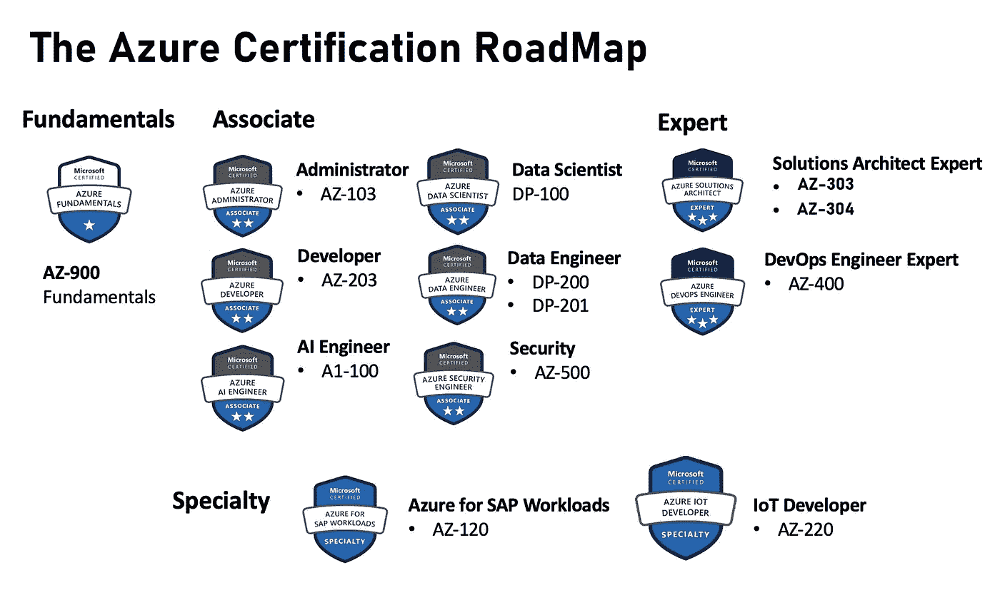
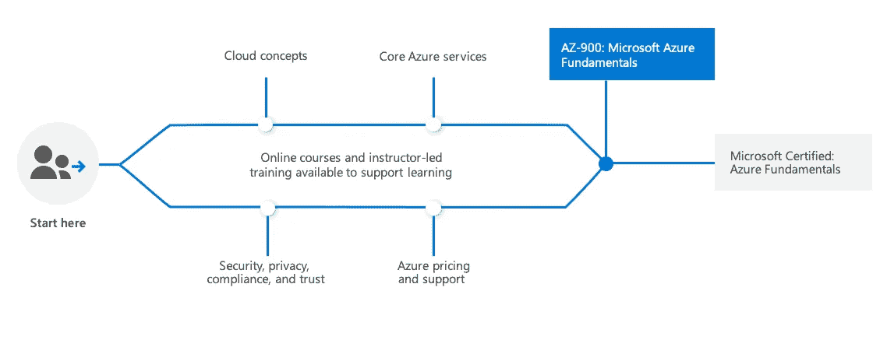
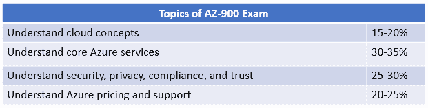
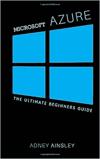
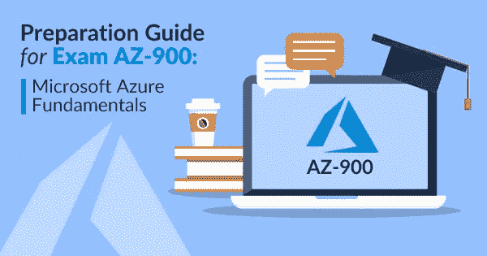

# 如何准备 2023 年微软 Azure 基础认证(AZ-900)考试

> 原文：<https://medium.com/javarevisited/how-to-prepare-for-microsoft-azure-fundamentals-certification-az-900-exam-in-2021-4a258b3006a?source=collection_archive---------0----------------------->

## 2023 年成为 Azure 认证工程师的完整指南，包含资源链接和在考试中获得高分的提示。

你好，如果你的目标是 2023 年的微软 Azure 基础认证，但不确定如何准备，那么你来对地方了。早些时候，我已经分享了 [**最佳云计算课程**](/javarevisited/5-best-cloud-computing-courses-to-learn-in-2020-f5f091159401) 和 [**最佳 Azure 课程**](/javarevisited/5-best-azure-fundamentals-courses-to-pass-az-900-certification-exam-in-2020-9e602aea035d) ，今天，我将分享一份准备 AZ-900 认证考试的完整指南，包括书籍、教程、指南、白皮书和在线课程的链接。

云计算技能很受欢迎，公司越来越多地寻找了解公共云平台并在其中工作过的人，如 [AWS](https://javarevisited.blogspot.com/2020/02/top-5-courses-to-crack-aws-certified-cloud-practitioner-exam-certification-clf-c01.html) 、 [GCP](https://javarevisited.blogspot.com/2020/02/top-5-courses-to-crack-aws-certified-cloud-practitioner-exam-certification-clf-c01.html) 和[微软 Azure](https://javarevisited.blogspot.com/2020/02/top-5-AZ-900-exam-Azure-Fundamentals-certification-practice-tests-and-mock-exams-to.html) 。

如果你正在寻找云计算入门，特别是在微软 Azure 方面，那么 [**AZ-900**](https://docs.microsoft.com/en-us/learn/certifications/exams/az-900) **或** [**Azure 基础认证**](/javarevisited/7-free-microsoft-azure-fundamentals-az-900-online-courses-for-beginners-in-2021-efd01d8be403) 可能是最好的入门方式。

你不仅会学到 Azure，还会学到基本的云计算基础知识，比如存储、网络、计算和内存等等。

您还将了解 IaaS(基础设施即服务)、PaaS(平台即服务)和 SaaS(软件即服务)、销售和定价，这些对于技术和非技术 IT 专业人员都非常重要。

前面我已经分享了几个通过 AZ-900 或微软 Azure Fundamentals 考试的技巧， [**课程**](https://javarevisited.blogspot.com/2020/02/top-5-courses-to-crack-az-900-microsoft-azure-fundamentals-certification-exam.html) ， [**练习测试**](https://www.certification-questions.com/practice-exam/microsoft/az-900?affiliateCode=fcff36fd-557a-4713-abf6-973e9924770f&utm_source=Javin&utm_medium=affiliate&utm_campaign=affiliate) 而今天，我将谈论如何在 2023 年破解微软 Azure Fundamental certification(AZ-900)。

但是，在此之前，我们先了解一下什么是微软基础或者 AZ-900 认证考试？

微软在 Azure 新的基于角色的认证路径中建立了一个认证，具体来说就是“微软认证 Azure 基础”。

**该考试面向接受过非技术培训的人员，以及希望测试其 Azure 云服务基础知识的技术人员。**要获得该认证，必须通过 [AZ-900](https://javarevisited.blogspot.com/2020/02/top-5-AZ-900-exam-Azure-Fundamentals-certification-practice-tests-and-mock-exams-to.html) 考试。

# 如何准备 2023 年微软 Azure 基础(AZ-900)云认证

既然你知道什么是微软 Azure 基础认证以及为什么你应该获得它的认证，现在是时候制定一个计划来成功通过这个著名的考试了。

以下是您在 2023 年破解微软新 AZ-900 或 Azure Fundamentals 认证的分步指南:

## 1.微软基础 Azure AZ-900 考试要求

与许多其他微软基于角色的考试相比，Azure AZ-900 是一种轻松的考试。该考试不需要有经验的云专业人员或编程助理。

如果你是一个参与购买和销售云服务的个人，这篇评论将使你受益，即使它来自非技术经验。

此外，对于想要验证自己云服务或解决方案基础知识的人来说，这个考试也很有用。同样，如果考生在开始正式准备 [AZ-900 考试](https://javarevisited.blogspot.com/2020/04/how-to-crack-microsoft-azure-fundamentals-certification-az-900-exam.html)之前具备一般的计算机知识或经验将会很有帮助。

假设我们想从事 Azure 关键角色之一的职业，包括开发人员、解决方案架构师、管理员等。你不知道从哪里开始你的旅程。考试和证书来了。

这个考试可以确认你对 Azure 基础知识的掌握，让你有足够的能力承担未来的 Azure 认证活动。本保证可能会反映在同时进行 Microsoft Azure 认证考试的其他准备工作时的测试结果。

## 2.微软 Azure-900 的基本信息

我们建议您在开始准备 AZ-900 考试之前了解该考试的基本细节。微软对考试有明确的政策。

在这里，每种类型的考试都有具体的细节，具体取决于角色或职能。微软 MCSA 考试、基于角色的考试等将有几个细节。然而，让我们看看这些细节如何应用于我们的 AZ-900 考试。

## 3.考试结构

与大多数 Azure 考试一样，AZ-900 考试预计有 40 到 60 个问题，考试时间为 85 分钟。

还会有不同的问题格式，如案例分析、简短回答、重复答案选项、构建列表、热点、多项选择、品牌评论、评论屏幕、活动屏幕、更好的答案、拖放等。在你考试的时候

你可以回答任意数量的考试问题。回答错误不会受到惩罚。只是不要检查错误的答案，就这样。

## 4.考试报名费

在开始准备 AZ-900 考试之前，检查考试价格是强制性的。根据考试地点的不同，这些考试费用可能会有所变化。如果你住在美国，考试费用是 99 美元。

如果您是 Microsoft Imagine Academy 计划的成员、Microsoft Partner Network 计划的成员或 Microsoft Certified Trainer，您将享受优惠费率。学生也有权享受学费减免。

## 5.考试及格分数

你必须总共得 700 分才能通过这次考试。获得票数低于这个数字的候选人将被视为破产。你可以在考试结束几分钟后知道你的考试结果。然而，要获得详细的仪表板，您必须等待几天。

仪表板可以包含许多细节，包括一般考试成绩、通过/失败状态、显示考试关键领域成绩的条形图以及如何解释的说明。你考试的结果。

## 6.重考政策

许多考生在开始准备 [AZ-900 考试](https://www.java67.com/2020/09/5-free-courses-to-crack-azure-fundamentals-AZ-900-certification-exam.html)之前或准备期间对考试复读政策表示怀疑。如果您正在尝试该考试，并且第一次无法通过，则必须等待至少 24 小时才能重复该考试。

如果你第二次遇到这种情况，下次考试的等待时间可以增加到 14 天。这样你一年最多可以做 5 次。

## 7.取消考试的政策

如果您在考试前至少 6 个工作日取消或重新安排预约，将不会为取消预约开具发票。如果取消/重新安排发生在 5 个工作日内，您将被收取少量费用。

但是，如果您没有在 24 小时内重新安排/取消预约，或者如果您无法参加考试，所有考试费用将被没收。

# 如何破解 2023 年微软 Azure 基础 AZ-900 考试

想考 AZ-900 认证考试，做好准备是非常重要的。由于考试是新的，你需要按照正确的备考程序第一时间完成考试。下面是准备 AZ-900 考试的完整指南。

## 1.在线课程

在线培训课程在准备 Azure 基础知识或 AZ-900 认证考试中发挥着重要作用。虽然微软也提供官方培训，但它非常昂贵，而且有许多负担得起的选项可供准备 Azure Fundmatnals 或 AZ 900 考试的人选择。

以下是 Udemy 和 Pluralsight 为准备 Azure 基础知识或 AZ-900 认证考试而推荐的一些课程:

1.  [**AZ-900:微软 Azure 基础考试备考**](https://click.linksynergy.com/deeplink?id=JVFxdTr9V80&mid=39197&murl=https%3A%2F%2Fwww.udemy.com%2Fcourse%2Faz900-azure%2F)

这是最受欢迎的 Udemy 课程之一，用于准备 AZ-900 或 Azure Fundamentals 考试。该课程由 Scott Duffy 创建，现已更新，涵盖了最新的考试课程。该课程还包括一个更好准备的模拟测试。

<https://click.linksynergy.com/deeplink?id=JVFxdTr9V80&mid=39197&murl=https%3A%2F%2Fwww.udemy.com%2Fcourse%2Faz900-azure%2F>  

**2。** [**微软 Azure 基础 AZ-900 考试备考专业化**](https://click.linksynergy.com/deeplink?id=JVFxdTr9V80&mid=40328&murl=https%3A%2F%2Fwww.coursera.org%2Fspecializations%2Fmicrosoft-azure-fundamentals-az-900%3F)

这是另一个为微软 Azure 基础和 AZ -900 考试做准备的很棒的资源，因为这是由微软自己创建的，这意味着你将从资源本身学习。

这门[课程](https://click.linksynergy.com/deeplink?id=JVFxdTr9V80&mid=40328&murl=https%3A%2F%2Fwww.coursera.org%2Fspecializations%2Fmicrosoft-azure-fundamentals-az-900%3F)与考试主题紧密结合，涵盖了教学大纲上的所有内容，是 AZ-900 考试的最佳课程。您还将获得一张价值 50 美元的代金券，可用于以折扣价安排考试。

关于如何加入该课程，您可以直接加入该课程，也可以参加 [**Coursera Plus**](https://click.linksynergy.com/deeplink?id=JVFxdTr9V80&mid=40328&murl=https%3A%2F%2Fwww.coursera.org%2Fcourseraplus) ，这是一个订阅计划，可以加入 7000 多个 Coursera 课程和认证。

<https://click.linksynergy.com/deeplink?id=JVFxdTr9V80&mid=40328&murl=https%3A%2F%2Fwww.coursera.org%2Fspecializations%2Fmicrosoft-azure-fundamentals-az-900%3F>  

**3。** [**AZ-900 备考:微软 Azure 基础(2023 年 1 月)**](https://click.linksynergy.com/deeplink?id=JVFxdTr9V80&mid=39197&murl=https%3A%2F%2Fwww.udemy.com%2Fcourse%2Faz-900-azure-exam-prep-understanding-cloud-concepts%2F)

这是 Udemy 的另一个很棒的课程，我强烈推荐给想要参加 Azure 基础或 AZ 900 考试的开发者。本课程不仅是最新的，涵盖了所有的考试主题，还配有交互式实验、闪存卡和一个 50 题的模拟考试。

<https://click.linksynergy.com/deeplink?id=JVFxdTr9V80&mid=39197&murl=https%3A%2F%2Fwww.udemy.com%2Fcourse%2Faz-900-azure-exam-prep-understanding-cloud-concepts%2F>  

4. [**微软 Azure Fundamentals (AZ-900)在 Pluralsight 上的路径**](https://pluralsight.pxf.io/c/1193463/424552/7490?u=https%3A%2F%2Fwww.pluralsight.com%2Fcourses%2Fazure-fundamentals)

如果你是 Pluralsight 会员，那么你应该很高兴 Pluralsight 有一个完整的路径和一系列课程来准备 2023 年的 Azure 基础认证考试。

对于那些希望在 Azure 领域开始使用云服务和解决方案的人来说，这是一个很好的起点。

<https://pluralsight.pxf.io/c/1193463/424552/7490?u=https%3A%2F%2Fwww.pluralsight.com%2Fcourses%2Fazure-fundamentals>  

顺便说一下，你需要一个[**Pluralsight 会员**](https://pluralsight.pxf.io/c/1193463/424552/7490?u=https%3A%2F%2Fwww.pluralsight.com%2Flearn) 才能加入这个课程，费用大约是每月 29 美元或每年 299 美元(14%的折扣)。我向所有程序员强烈推荐这个订阅，因为它提供了超过 7000 个在线课程的即时访问，以学习任何技术技能。或者，你也可以使用他们的 [10 天免费通行证](https://pluralsight.pxf.io/c/1193463/424552/7490?u=https%3A%2F%2Fwww.pluralsight.com%2Flearn)免费观看这个课程。

<https://pluralsight.pxf.io/c/1193463/424552/7490?u=https%3A%2F%2Fwww.pluralsight.com%2Flearn>  

## 2.书籍和阅读材料

如果你有一本可靠的 Azure book，你在准备 [AZ-900 考试](/javarevisited/5-best-azure-fundamentals-courses-to-pass-az-900-certification-exam-in-2020-9e602aea035d)时的影响力会非常高。但不幸的是，大多数可用的 Azure 书籍都没有达到必要读者的期望或符合行业标准。

不过，我们分享了一些 Azure 书籍，对准备 AZ-900 考试很有帮助。

1.  [微软 Azure 初学者版:微软 Azure 入门:](https://www.amazon.com/Microsoft-Azure-Beginners-Getting-Started/dp/1978385641?tag=javamysqlanta-20)
2.  [Azure:微软 Azure 初学者教程:](https://azure.microsoft.com/en-us/get-started/)
3.  [Azure:微软 Azure 教程终极初学者指南:](https://www.amazon.com/Azure-Microsoft-Tutorial-Ultimate-Beginners/dp/1976521300?tag=javamysqlanta-20)

## 3.最佳考试模拟器和练习题

用模拟器练习是分析你在某个特定领域的技能和能力的最好方法。你也可以在 AZ-900 备考期间找到很多网站，声称他们可以为 AZ-900 考试提供最好的模拟器。

千万不要相信这些网站，因为它们不提供真实的考试环境和有效的试题。有时使用这些模拟器甚至会导致主考试失败。所以，在准备 AZ-900 考试的时候，要时刻牢记这些难点。

我强烈推荐大卫·梅耶尔的 [**微软 Azure Fundamentals AZ-900 模拟器**](https://www.certification-questions.com/practice-exam/microsoft/az-900?affiliateCode=fcff36fd-557a-4713-abf6-973e9924770f&utm_source=Javin&utm_medium=affiliate&utm_campaign=affiliate) 因为它们提供了真实的考试环境和有效的问题。

你也可以试试这些[免费的 10 个问题](https://www.certification-questions.com/microsoft-exam/az-900-dumps.html?affiliateCode=fcff36fd-557a-4713-abf6-973e9924770f&utm_source=Javin&utm_medium=affiliate&utm_campaign=affiliate)，然后购买一个高级版本来准备考试，检查你的准备水平。

如果你需要更多的选项，这里有更多来自 Udemy 和 Whizlabs 的 AZ-900 练习题。

1.  [**AZ-900:微软 Azure 基础原始练习测试**](https://click.linksynergy.com/deeplink?id=JVFxdTr9V80&mid=39197&murl=https%3A%2F%2Fwww.udemy.com%2Fcourse%2Faz900-azure-tests%2F)

AZ-900 Azure 基础知识考试的三个完整的定时模拟测试，150 个问题，100%原始材料

<https://click.linksynergy.com/deeplink?id=JVFxdTr9V80&mid=39197&murl=https%3A%2F%2Fwww.udemy.com%2Fcourse%2Faz900-azure-tests%2F>  

**2。** [**AZ-900 模拟测试|微软 Azure 基础| 1 月 21 日**](https://click.linksynergy.com/deeplink?id=JVFxdTr9V80&mid=39197&murl=https%3A%2F%2Fwww.udemy.com%2Fcourse%2Fmicrosoft-azure-az-900-certification-exam-practice-tests%2F)

这个模拟考试完全符合新的要求。针对考试的最新变化，增加了新的问题。它包含 6 个全长的实践测试，以建立速度和准确性。

<https://click.linksynergy.com/deeplink?id=JVFxdTr9V80&mid=39197&murl=https%3A%2F%2Fwww.udemy.com%2Fcourse%2Fmicrosoft-azure-az-900-certification-exam-practice-tests%2F>  

3. [**微软 Azure 考试 AZ-900 认证**](https://shrsl.com/25qjo)

这是我最喜欢的模拟测试之一。它的质量很高，并提供了深入的解释。它包含 6 个完整长度的模拟考试(325 个独特的问题)和 7 个部分测试(55 个独特的问题)。你还可以得到评估优点和缺点的报告。

以下是加入本次模拟考试的链接— [**微软 Azure 考试 AZ-900 认证**](https://shrsl.com/25qjo)

## 4.白皮书、分析师报告和电子书

在准备 AZ-900 考试时，这一步总是可以忽略的。这和相关书籍或文档一样重要，因为这些东西都是微软自己出版的。

从这些来源中，你可以找到许多相关的 Azure 文档。此外，请确保订阅 Azure 通知，以帮助您了解最新的 Azure 更新。

<https://azure.microsoft.com/en-us/resources/whitepapers/>  

## 5.微软在线学习平台

该门户网站是所有微软考试和认证的指挥中心。您可以在 Microsoft Learning 页面上找到所有 Microsoft 认证的列表。

没有任何困难，你也可以在这个门户上找到 AZ-900 页面。坦白说，这个门户应该是准备 AZ-900 考试的起点。

这是因为你可以在这个门户网站上找到你需要知道的关于这个考试的一切，包括注册考试的选项、关于 AZ-900 考试模块的详细信息、AZ-900 Microsoft Azure 基础知识学习材料的链接、考试先决条件、考试小组学习、考试链接、考试政策和结构等。

最重要的是，这是为数不多的几个可以获得考试日程、模块变化、价格变化等重要更新的地方之一。您可以在这个门户网站上找到有关 AZ-900 考试时间表的链接，几乎可以肯定的是，在准备 AZ-900 考试时，这个门户网站不可能不被注意到。

以上就是**2023 年如何破解微软 Azure Fundamentals (AZ-900)云认证**。如果你想开始使用微软 Azure 或任何其他云平台，那么这是一个非常好的开始认证。

你不仅会学到微软 Azure 的基础知识，还会学到适用于各种云提供商的云计算基础知识，如 [AWS](/javarevisited/top-10-courses-to-learn-amazon-web-services-aws-cloud-in-2020-best-and-free-317f10d7c21d) 、 [GCP](https://javarevisited.blogspot.com/2019/07/top-5-google-cloud-platform-gcp-courses-certifications-online.html) 和[微软 Azure](/javarevisited/my-favorite-free-microsoft-azure-cloud-courses-for-beginners-to-learn-in-2020-3418524bb531) 。

其他**IT 专业人员**和 Java 程序员认证资源

*   [程序员前 5 名 AZ-900 模拟测试](https://javarevisited.blogspot.com/2020/02/top-5-AZ-900-exam-Azure-Fundamentals-certification-practice-tests-and-mock-exams-to.html)
*   [如何破解 2023 年 AZ-103 Azure 行政考试](https://javarevisited.blogspot.com/2020/04/how-to-crack-microsoft-az-103-azure-administrator-associate-exam-certification.html)
*   [破解 Azure 云架构师(AZ-300)考试的前 5 门课程](https://javarevisited.blogspot.com/2019/07/top-5-courses-to-crack-azure-architecture-technologies-certification-az-300-exam.html#axzz6E6VuRMsx)
*   [如何准备 Azure 解决方案架构师(AZ-300)认证](https://javarevisited.blogspot.com/2020/04/how-to-crack-microsoft-azure-solution-architect-exam-az-300.html)
*   [破解 Azure 基础知识(AZ-900)考试的 5 大课程](https://javarevisited.blogspot.com/2020/02/top-5-courses-to-crack-az-900-microsoft-azure-fundamentals-certification-exam.html)
*   [学习 Docker 和 Kubernetes 的十大课程](https://dev.to/javinpaul/top-10-courses-to-learn-docker-and-kubernetes-for-programmers-4lg0)
*   [Pivotal 的春季认证对工作和事业有帮助吗？](https://javarevisited.blogspot.com/2017/07/does-spring-certification-help-in-job-and-career.html)
*   [如何破解甲骨文 2023 年 Java 认证？](https://medium.freecodecamp.org/how-to-pass-oracles-java-certifications-a-practical-guide-for-developers-e9b607ba6173)
*   [破解 Azure 管理员认证的 5 门最佳课程(AZ-103/104)](https://javarevisited.blogspot.com/2020/06/top-5-course-to-become-microsoft-azure-administrator-certification-exam.html)
*   [10 门数据科学和机器学习认证课程](https://dev.to/javinpaul/10-data-science-and-machine-learning-courses-for-programmers-looking-to-switch-career-57kd)
*   [每个软件开发人员都应该学会的 10 件事](https://dev.to/javinpaul/10-things-every-software-developer-should-know-39pe)
*   [如何通过 Spring Core Professional 5.0 认证](https://javarevisited.blogspot.com/2018/08/how-to-crack-spring-core-professional-certification-exam-java-latest.html)
*   [通过 Azure 开发人员助理认证(AZ-203)的 5 门在线课程](https://javarevisited.blogspot.com/2020/06/top-5-course-to-crack-Microsoft-Azure-Developer-Certification-Exam-AZ-203.html)
*   [10 门免费学习数据结构和算法的课程](http://www.java67.com/2019/02/top-10-free-algorithms-and-data.html)
*   [破解 AWS 解决方案架构师认证的前 5 门课程](https://javarevisited.blogspot.com/2019/05/top-5-courses-to-crack-aws-solutions-architect-associate-certification-exam-SAA-C01.html#axzz5rHwAwycj)
*   [通过谷歌助理云工程师认证的前 5 门课程](https://javarevisited.blogspot.com/2019/07/top-5-google-cloud-platform-gcp-courses-certifications-online.html)
*   [如何成为 DevOps 工程师？](https://javarevisited.blogspot.com/2018/09/the-2018-devops-roadmap-your-guide-to-become-DevOps-Engineer.html)
*   [OCAJP 和 OCPJP 考试 10 道免费样题](http://www.java67.com/2017/05/10-free-java-8-certification-sample-questions-OCAJP8-OCPJP8-Mock-Exams.html)

感谢您阅读本文。如果你喜欢这些 AZ-900 考试指南、书籍、课程、转储或练习测试，那么请与你的朋友和同事分享。如果您有任何问题或反馈，请留言。

**P. S. —** 如果你是 Azure 云平台的新手，正在寻找免费的在线培训课程来学习 Azure 基础知识并为 Azure 基础认证做准备，那么你还可以在 Udemy 上看到[**微软 Azure 概念**](https://click.linksynergy.com/deeplink?id=JVFxdTr9V80&mid=39197&murl=https%3A%2F%2Fwww.udemy.com%2Fcourse%2Flinux-academy-microsoft-azure-concepts%2F)——Linux academy 的免费课程。这是完全免费的，你只需要一个免费的 Udemya 帐户就可以在线参加这个课程。

<https://click.linksynergy.com/deeplink?id=JVFxdTr9V80&mid=39197&murl=https%3A%2F%2Fwww.udemy.com%2Fcourse%2Flinux-academy-microsoft-azure-concepts%2F> 