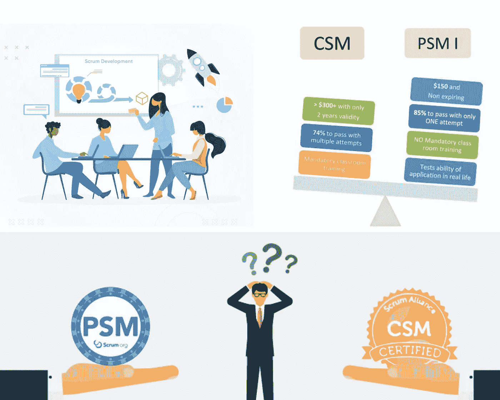

# 如何准备 Scrum Master 认证？

> 原文：<https://medium.com/javarevisited/how-to-prepare-for-scrum-master-certification-938e723bb957?source=collection_archive---------2----------------------->

大家好。在我之前的文章中，我详细地写了关于[敏捷](/javarevisited/5-best-agile-and-scrum-books-for-programmers-and-software-developers-2bbff0a1c976)和 [Scrum](/javarevisited/7-best-professional-scrum-master-psm-certification-training-courses-and-practice-tests-47f5bb4ef62e) 的内容。如果你想对 [*敏捷和 Scrum*](/javarevisited/7-best-agile-and-scrum-online-training-courses-3b191e9b65eb) 有一个完整的了解，请参考我下面的文章。