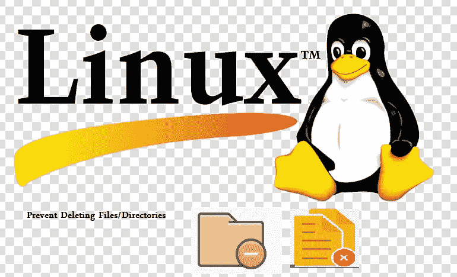

# 如何防止在 Unix 系统中意外删除文件/目录？

> 原文：<https://medium.com/javarevisited/how-to-prevent-deleting-files-directory-accidentally-in-unix-system-823fc82a3fac?source=collection_archive---------2----------------------->

[](https://github.com/sophea/bash-script-sample/blob/master/prevent_remove_file_folder_in_linux.txt) [## sophea/bash-脚本-示例

### Permalink GitHub 是 5000 多万开发人员的家园，他们一起工作来托管和审查代码、管理项目以及…

github.com](https://github.com/sophea/bash-script-sample/blob/master/prevent_remove_file_folder_in_linux.txt) 

默认情况下， **chattr** 命令在大多数现代 Linux 操作系统中都可用。 **chattr** 命令的默认语法是:

> chattr[操作员][开关][文件名]

chattr 有以下操作符。

```
The operator ‘+’ causes the selected attributes to be added to the existing attributes of the files.The operator ‘-‘ causes them to be removed.
The operator ‘=’ causes them to be the only attributes that the files have.Chattr has different attributes namely — aAcCdDeijsStTu. Each letter applies a particular attributes to a file.a — append only,
A — no atime updates,
c — compressed,
C — no copy on write,
d — no dump,
D — synchronous directory updates,
e — extent format,
i — immutable,
j — data journalling,
P — project hierarchy,
s — secure deletion,
S — synchronous updates,
t — no tail-merging,
T — top of directory hierarchy,
u — undeletable.See more with
$ man chattr
```

在这篇文章中，我将讨论一些常用的属性**【我】**和**【a】**来防止删除文件和目录

# 在 Linux 中防止文件被意外删除

例如，我们创建一个如下所示的虚拟文件

```
$ touch file.txt 
# or 
> file.txt
```

现在，我将应用**“I”**属性，使文件不可变。这意味着你不能删除，修改文件，即使你是文件的所有者和根用户。

```
$ sudo chattr +i file.txt
```

您可以使用以下命令检查文件属性:

```
$ lsattr file.txt— — i — — — — -e — — file.txt
```

现在，尝试以普通用户或使用 **sudo** 权限删除该文件。

```
$ rm file.txt
rm: cannot remove ‘file.txt’: Operation not permitted#try with sudo command:$ sudo rm file.txtrm: cannot remove ‘file.txt’: Operation not permitted
```

# 要撤销属性，只需使用"-i "开关，如下所示。

> $ sudo chattr -i file.txt

现在，不可变属性已经被移除。现在，您可以根据需要修改或删除该文件。

```
$ echo "Hello World!" >> file.txtdelete
$ rm file.txt//delete successfully
```

# 在 Linux 中防止文件夹被意外删除和修改

创建一个名为 dir1 的目录，并在该目录下创建一个名为 file.txt 的文件。

```
$mkdir dir1 && touch dir1/file.txt
```

现在，使用以下命令使该目录及其内容(file.txt)不可变:

> *$ sudo chattr -R +i dir1*

在哪里，

> -R 将使 dir1 及其内容递归地不可变。
> +i 使目录不可变。

```
Now, try to delete the directory either as a normal user or using **sudo** user.$ rm -fr dir1
$ sudo rm -fr dir1
You will get the following output:rm: cannot remove ‘dir1/file.txt’: Operation not permitted
```

## 要撤销属性，请运行:

```
$sudo chattr -R -i dir1
```

现在，您可以像往常一样删除或修改该目录的内容。

# **防止文件和文件夹被意外删除，但允许在 Linux 中追加操作**

我们现在知道如何防止文件和文件夹被意外删除和修改。

接下来，我们将防止删除文件和文件夹，但只允许以追加模式写入文件。也就是说你 ***不能编辑、修改文件中已有的数据，重命名文件，删除文件*** 。您只能在追加模式下打开文件进行写入。

要设置文件/目录的附加模式属性，我们需要执行以下操作:

> 对于文件:$ sudo **chattr +a file.txt**
> 
> 对于目录:$ sudo **chattr -R +a dir1**

设置了“a”属性的文件/文件夹只能在追加模式下打开进行写入。

向文件中添加一些内容，以检查它是否工作。

```
$ echo ‘Hello World!’ >> file.txt
$ echo ‘This is me!’ >> dir1/file.txtCheck the file contents using cat command:$ cat file.txt
$ cat dir1/file.txt$ rm file.txt
Output:rm: cannot remove ‘file.txt’: Operation not permitted
```

## 让我们尝试删除文件夹:

```
$ rm -fr dir1/
Or try with sudo:$ sudo rm -fr dir1/Sample output:
rm: cannot remove ‘dir1/file.txt’: Operation not permitted
```

## #要删除属性和，请运行以下命令:

```
For files:
$ sudo chattr -R -a file.txtFor directories: 
$ sudo chattr -R -a dir1/
```

现在，您可以像往常一样删除或修改文件和文件夹。

# 防止删除文件夹

你可以创造。锁定文件并将属性+i 设置到该文件。

```
$ mkdir dir1
$ touch dir1/.lock
$ chattr +i dir1/.lock##you can not delete the folder dir1 
$rm -rf dir1output : rm: cannot remove ‘dir1/.lock’: Operation not permitted
```

# 结论

希望这篇文章能帮助你获得知识。如果这篇文章有帮助，请支持按下**按钮**👏按钮，并与其他读者分享，以达到这个故事。

## 你可能喜欢的其他文章

[](/javarevisited/top-10-courses-to-learn-linux-command-line-in-2020-best-and-free-f3ee4a78d0c0) [## 2020 年学习 Linux 命令行的 10 大课程——最好的免费课程

### 有没有想过为什么命令行仍然在使用，即使有数百种人性化的图形用户界面和工具…

medium.com](/javarevisited/top-10-courses-to-learn-linux-command-line-in-2020-best-and-free-f3ee4a78d0c0) [](/javarevisited/top-15-online-courses-to-learn-docker-kubernetes-and-aws-for-fullstack-developers-and-devops-d8cc4f16e773) [## 为 Fullstack 开发人员和 DevOps 学习 Docker、Kubernetes 和 AWS 的 15 大在线课程…

### 大家好，你可能听说过 Docker 和 Kubernetes 周围的嗡嗡声。他们从根本上改变了发展…

medium.com](/javarevisited/top-15-online-courses-to-learn-docker-kubernetes-and-aws-for-fullstack-developers-and-devops-d8cc4f16e773) [](/javarevisited/10-free-python-tutorials-and-courses-from-google-microsoft-and-coursera-for-beginners-96b9ad20b4e6) [## 谷歌、微软和 Coursera 为初学者提供的 10 个免费 Python 教程和课程

### 大家好，如果你在这里，那么让我首先祝贺你做出了学习 Python 的正确决定…

medium.com](/javarevisited/10-free-python-tutorials-and-courses-from-google-microsoft-and-coursera-for-beginners-96b9ad20b4e6)