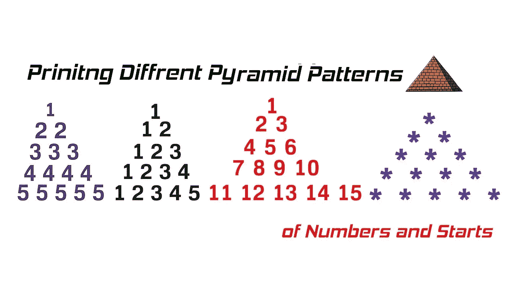

# 如何用 Java 打印数字的金字塔图案？[编码练习]

> 原文：<https://medium.com/javarevisited/how-to-print-pyramid-pattern-of-numbers-in-java-coding-exercise-b6d3c92314e8?source=collection_archive---------2----------------------->

## 想学编码？尝试用 Java 打印数字、字母、字母表和三角形的金字塔图案。

说到学习编码或编程，不仅学习编程语言很重要，学习编程本身也很重要，你向谁学习编程呢？