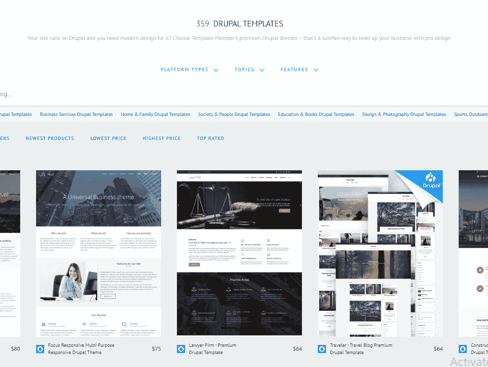
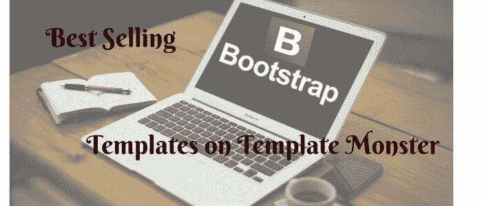
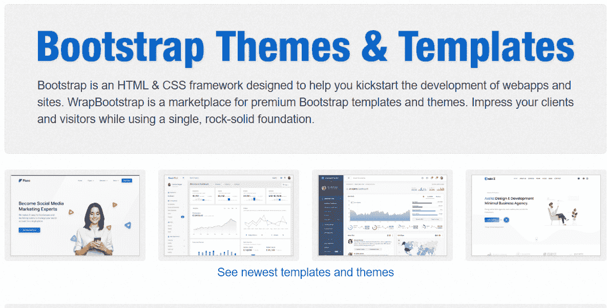
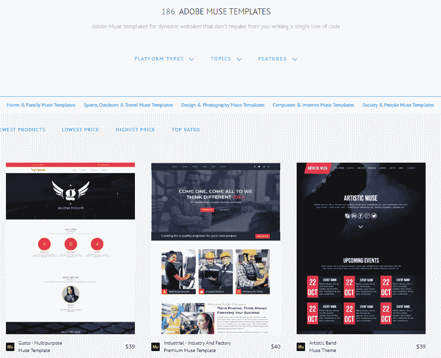
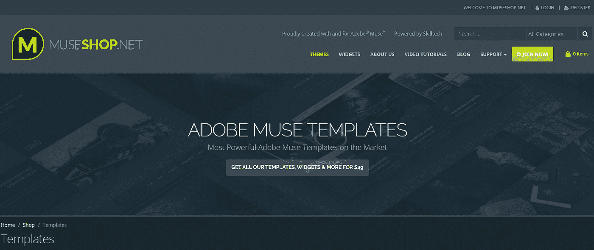
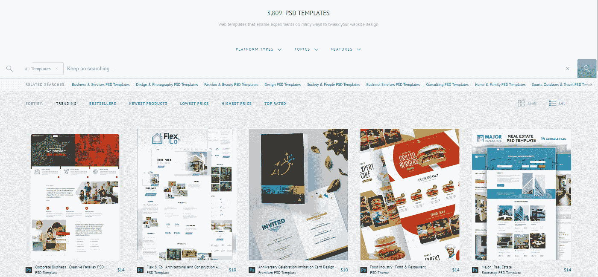
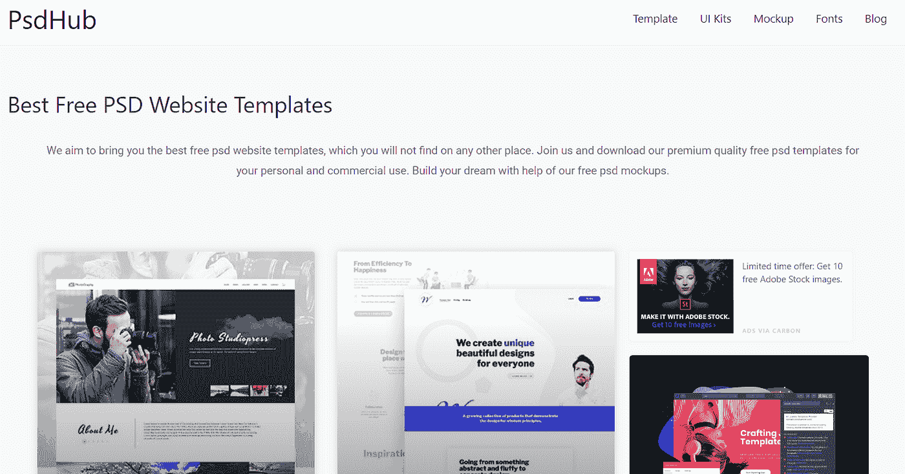

# 如何用模板重新设计你的网站？

> 原文：<https://medium.com/javarevisited/how-to-redesign-your-website-with-template-7ebcf6512abc?source=collection_archive---------0----------------------->

所以你决定是时候重新审视你的网站设计了。取决于你的方法，一个网站的重新设计可以是一个巨大的成功，也可能是悲惨的失败。确保成功的最好方法是计划好你的攻击路线。

如果你没有考虑你的目标，没有为你想要的成功制定策略，甚至没有考虑你为什么要重新设计，你可能会在这个过程中浪费很多宝贵的时间和资源。

这就是为什么我给你提供这篇关于用网站模板规划你的网站重新设计的文章。跟着做，选择最适合你的选项。

模板化网站对于注重成本的博客、个体用户、小企业和初创公司来说尤其常见。模板化站点通常只需要有限的 web 设计经验和很少的编程工作。

此外，有这么多的选择，你通常可以找到一个适合你的特殊设计口味的网站模板。

网站设计师，他们用模板创建自己的网站:

*   在网站上花更少的钱
*   花更少的时间构建网站，并快速启动和运行
*   更新和维护网站本身，或者放弃更新。

几乎所有的网站构建者和内容管理系统(CMS)平台都使用网站模板。它们是现成的网站，可以按原样使用，也可以定制。

网站模板旨在帮助您建立一个网站，最少或没有编码经验。让我们开始吧…

# HTML 模板

我想和你分享的第一种网站模板是 HTML 模板。

HTML 模板是一个预先构建的网站，由 HTML 页面组成，包括集成的图像、文本内容以及字体样式和 Javascript 的支持文件。最终用户将他们的信息、文本和图像插入到预先构建的设计中，然后上传到网络托管帐户，以便在互联网上查看。

这篇文章的目标是从一个模板构建一个简单而有用的网站，所以首先要做的是通过 NoviBuilder 团队的不同 [**HTML 模板**](https://novibuilder.com/html-templates-with-code/?aff=javarevisited) 浏览看起来合适的一个。售价 29 美元起。

或者你可以从 TemplateMonster Marketplace 中选择更多的 [**HTML 模板**](https://www.templatemonster.com/website-templates.php?aff=javarevisited) 。他们有 2500 多个模板，平均价格为 75 美元。

特点:

*   HTML 模板网站创建速度更快
*   简单的安装过程
*   网站定制更加灵活
*   当你为你的网站使用预建的 HTML 模板时，你只需要填补空白。你不需要做任何编码。
*   低要求——HTML 网站不需要安装有 [PHP](https://www.wpbeginner.com/glossary/php/) 或 [MySQL](https://www.wpbeginner.com/glossary/mysql/) 的服务器。
*   HTML 网页模板是搜索引擎友好的

网站模板通常由 [HTML](https://hackernoon.com/top-5-free-online-courses-to-learn-html-css-web-development-in-2020-ae8e7466dfa7) 和 [CSS](https://www.java67.com/2019/01/5-free-bootstrap-course-to-learn-online.html) 代码构建，允许任何人建立一个网站，而不必雇佣专业的网站开发者或设计师，尽管许多开发者确实使用网站模板为他们的客户创建网站。这使得任何人都可以建立一个价格合理的个人或商业网站，然后可以在搜索引擎中列出，这样用户就可以搜索你的特定产品或服务。

有了 [**最佳模板**](https://www.templatemonster.com/best-selling-website-templates/?aff=javarevisited) ，你就可以快速准备好一个功能齐全的静态或动态网站。即使你是一个新手，你仍然可以达到同样的专业水平。然而，掌握 HTML 和 CSS 的基本知识非常有帮助。

你刚刚下载了一个 HTML 模板，现在你必须在把它放到网上之前定制它。按照以下步骤逐步完成整个过程:

# Drupal 模板

此外，您可以使用 Drupal 模板提升您的业务。

Drupal 是免费的，有免费的 Drupal 模板，开源软件可以被个人或用户群体使用——甚至是那些缺乏技术技能的人——来轻松地创建和管理许多类型的网站。该应用程序包括一个内容管理平台和一个开发框架。

您可能正在刷新您当前的在线商店，或者您正在从头开始创建一个在线商店，这个 Drupal 商务模板的顶级集合将极大地帮助您。从 359 个主题中选择 [**高级 Drupal 模板**](https://www.templatemonster.com/drupal-themes.php?aff=javarevisited)64 美元起:

或者从$20 [**这里**](https://www.drupaldevelopersstudio.com/free-drupal-themes/) 查看高级 Drupal 模板:

特点:

*   灵活的自定义内容类型和视图
*   用于处理大量数据的灵活分类法
*   多语言就绪
*   快速编辑
*   内置 Web 服务
*   不需要编码技能
*   安装时间— 10 分钟

与其他 CMS 不同，Drupal 适合新手和有经验的用户。其中一个原因是功能范围非常小，可以一点一点地适应用户的需求..易于管理的 Drupal 软件内核可用于创建各种网络存在，从网站、博客到论坛。然而，**该程序最大的优势之一**是其显著的**扩展范围**。有无数的模块来调整网站的各个部分。

查看本教程的 [**Drupal 定制**](https://www.drupal.org/docs/8/extending-drupal-8/installing-themes) 。

# 引导主题

重新设计网站的下一个选择是选择引导主题。Bootstrap 4 是一个非常流行的 [HTML](https://javarevisited.blogspot.com/2019/05/top-5-html-5-and-css-3-courses-for-web-developers.html) 、 [CSS](https://dev.to/javinpaul/these-are-the-best-free-courses-to-learn-html-and-css-for-frontend-developers-2g8g) 和 [JavaScript](https://www.java67.com/2019/01/top-10-javascript-frameworks-and-libraries-for-web-developers.html) 框架，用于开发一个响应式网站和 web 应用程序。Bootstrap 4 是一个可以使用的免费开源前端框架。您可以使用模板引导网站构建器创建引导网站。你可以在 TemplateMonster 上下载惊人的 [**引导模板**。你将有 1300+主题，价格为 72 美元。](https://www.templatemonster.com/bootstrap-website-templates/?aff=javarevisited)

[来源](https://techibhai.com/best-bootstrap-templates/)

或者试试[**wrap bootstrap**](https://wrapbootstrap.com/)的模板。价格从 15 美元开始。

主要优势:

*   响应式设计
*   广泛的浏览器兼容性
*   通过使用可重用组件实现一致的设计
*   非常容易使用和快速学习
*   使用 JavaScript 的丰富可扩展性
*   对 jQuery 插件的内置支持
*   编程 JavaScript API
*   可用于任何 IDE 或编辑器，以及任何服务器端技术和语言

在 2011 年开源发布后，Bootstrap 非常迅速地流行起来，这不是没有原因的。Web 设计者和 web 开发人员喜欢 Bootstrap，因为它灵活且易于使用。对于那些寻求创建个人或商业网站的人来说，Bootstrap HTML5 网站模板是一个福音。他们提供增强任何网页或应用程序，同时使每个功能都具有移动响应能力。作为一个企业主，这可以大大提高你的生活质量。你不得不被绑在办公椅上的日子一去不复返了。你现在可以管理你的网站，写新帖子，甚至在旅行中拍卖产品。

**下面是全面的** [**自举基础知识指南**](https://www.toptal.com/front-end/what-is-bootstrap-a-short-tutorial-on-the-what-why-and-how) **。**

# Adobe Muse 模板

Adobe Muse 模板是为动态网站创建的，不需要您编写一行代码。

那么什么是 Adobe Muse 呢？这是一个程序的尝试，你可以利用它的各种工具来创建和发布专业的网站。使用自由形式的画布和布局工具。你可以从零开始建立一个网站，它可以像你想象的那样独特和有创意。剩下的就是用了。看看这些 [**Adobe Muse 模板**](https://www.templatemonster.com/adobe-muse-templates.php?aff=javarevisited) 。它们的价格从 38 美元起。

或者成为 MuseShop 的会员，从 [**这个庞大的列表**](https://www.museshop.net/product-category/templates/) 中下载他们的主题:

特点:

*   易用性
*   能够添加第三方字体到您的网站
*   访问成千上万的设计资产
*   浏览器内编辑
*   小工具
*   响应式设计

Adobe Muse 主题是任何想要设计起点的人的完美选择。您可以自定义模板以匹配您的品牌，并大大加快网站创建过程。为了让你开始，我们收集了一些最好的缪斯模板和主题。

> 查看关于如何编辑 Muse 模板的终极指南<https://www.templatemonster.com/help/how-to-edit-muse-templates.html?aff=javarevisited>**。**

# **PSD 模板**

**下一种类型的网站模板是 PSD 模板，它可以通过多种方式来调整你的网站重新设计。**

**很容易爱上一个网页模板设计，兴奋地下载它，在 Photoshop 上打开它，却发现它完全是一团糟，你找不到出路。好的网页模板在美学上是令人愉悦的，令人赏心悦目的。另一方面，优秀的网站模板将这种美感和可用性结合起来，创造出最好的吸引眼球和易于使用的模板。**

**无论你想要一个投资组合网站模板，个人博客模板，电子商务模板，还是餐馆模板，你都会找到这个最好的 [**PSD 模板**](https://www.templatemonster.com/psd-templates.php?aff=javarevisited) 列表，价格从 10 美元起。**

****

**或者查看 [PSDHub](https://www.psdhub.com/) :**

****

**特点:**

*   **利用 Photoshop 的所有功能(保留调整图层、蒙版、形状、剪辑路径、图层样式、混合模式、智能对象)。**
*   **Adobe 产品之间的紧密集成，可以直接将 Photoshop 文件导入 Illustrator、InDesign 等。**
*   **用图层打开保存的文件。**
*   **如果您需要保持透明度，这很有用。**
*   **您可以将 16 位/通道和高动态范围(HDR) 32 位/通道图像存储为 PSD 文件。**

**PSD 网站模板非常适合建立商业、投资组合和其他类型的网站。由于 Adobe Photoshop 是那些“容易使用，难以掌握”的程序之一，许多初学者和专业人士选择用 PSD 模板制作他们的第一个网站。这是因为 PSD web 模板易于设置、编辑和使用。但是，您需要从可靠的来源获得这些 web 模板。**

****和** [**本教程**](https://www.templatemonster.com/help/website-templates/psd-templates/psd-tutorials/?aff=javarevisited) 将帮助你非常快速地定制你的网站。**

**合适的网站模板可以让你的网站内容大放异彩，创造出色的用户体验，让你看起来像一个真正的专业人士。**

***您是否尝试过创建项目的模板？***