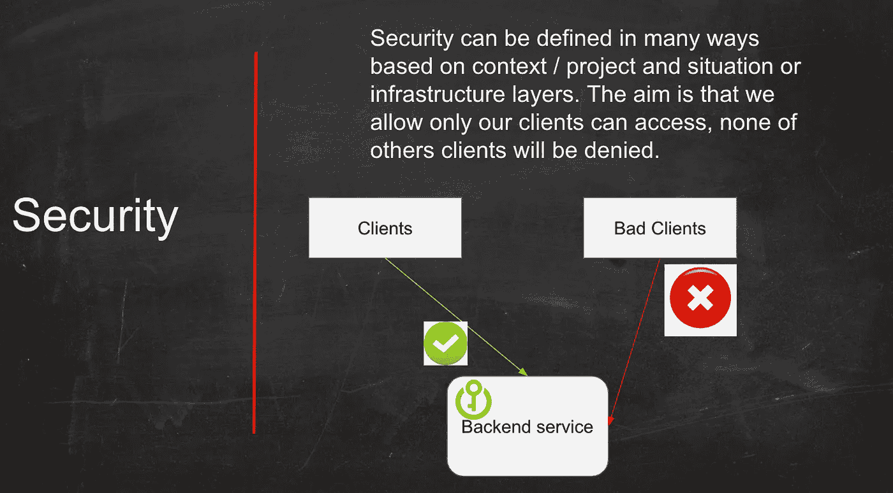
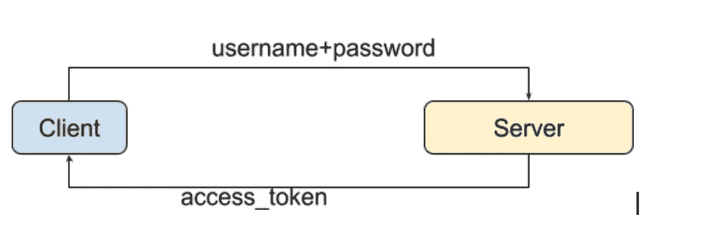

# 如何保护 Rest APIs

> 原文：<https://medium.com/javarevisited/how-to-secure-the-rest-apis-b682e21821a1?source=collection_archive---------1----------------------->



今天我们来谈谈保护你的 API 的安全性。在本文中，您将学习和理解如何使用各种安全模式构建和保护 API。

我们将讨论如何在 REST APIs 中实现安全性的最佳实践。

# REST-API

REST(表述性状态转移)是真正的“web 服务”API。REST APIs 基于 URIs 和 HTTP 协议，并使用 [JSON](https://www.upwork.com/hiring/development/what-is-json/) 作为数据格式，这是超级浏览器兼容的。REST APIs 很容易构建和扩展。rest-API 是一种用于 web 服务的现代架构模型。它不同于以前的协议 HTTP 和 SOAP XML。

# 安全性

安全性是构建 RESTful web 服务的主要关注点。

在 RESTful web 服务中，有很多方法可以通过用户认证和授权来实现安全性。

我们将要讨论的主要安全类型如下:

*   API 密钥
*   基本认证
*   Oauth2
*   Oauth2 + JWT

为了使我们的讨论更加具体，让我们假设我们构建了一个简单的微服务后端应用程序，客户端用户向我们的后端服务发出请求，抛出 REST-API。我们将解释如何使用上述上下文保护 API 的用例。

# **API 键**

这是应用安全性和保护 API 的最简单的方法。

**何时使用:**适合为第三方服务集成和受限访问设计 API，而非公共访问目的。例如，您的公司提供 SMS 网关作为 web 服务，其他公司希望使用您的服务。

**如何使用:**验证 api-key 请求参数或请求头。

**工作原理:**创建 Servlet 过滤器安全性和验证，将请求参数 api_key 和 X-API-Key 作为报头，并将 IPs 地址列入白名单(可选)。因此，每个用户发出一个请求，过滤器安全性将首先进行检查和验证，然后才进入 API 控制器部分。

```
ex : curl 'http://localhost:8080/api/test?api_key=xxxxxx'  -H 'Connection: keep-alive' --compressed/****SecurityFilter.java***/package com.sma.spring.security;import java.io.IOException;
import java.util.ArrayList;
import java.util.List;import javax.servlet.Filter;
import javax.servlet.FilterChain;
import javax.servlet.FilterConfig;
import javax.servlet.ServletException;
import javax.servlet.ServletRequest;
import javax.servlet.ServletResponse;
import javax.servlet.http.HttpServletRequest;
import javax.servlet.http.HttpServletResponse;import org.slf4j.Logger;
import org.slf4j.LoggerFactory;/**
 * [@author](http://twitter.com/author) Sophea <a href='sopheamak@gmail.com'> sophea </a>
 */
public class SecurityFilter implements Filter {
    private static final Logger LOG = LoggerFactory.getLogger(SecurityFilter.class);
    /**api_key by request parameter*/
    private static final String API_KEY_PARAM = "api_key";
    /**X-API-Key as request Header*/
    private static final String HEADER_NAME_API_KEY = "X-API-Key";

    /**whilelistIps*/
    private static final List<String>  WHITELISTED_IPS = new ArrayList<>();

    /**value - you can define either in config or read from db*/
    private static final String API_KEY_VALUE = "sd3209Sdkl2DF3dfzsDGEsZ8476"; [@Override](http://twitter.com/Override)
    public void init(FilterConfig arg0) throws ServletException {
        LOG.info("init Security filter");

        /**initialize ip address either or you get fromconfig*/
        //WHITELISTED_IPS.add("127.0.0.1");
        WHITELISTED_IPS.add("192.168.0.1");
        WHITELISTED_IPS.add("10.1.2.29");
    }

    [@Override](http://twitter.com/Override)
    public void doFilter(ServletRequest req, ServletResponse resp, FilterChain chain) throws IOException, ServletException {

        HttpServletRequest request = (HttpServletRequest) req;
        HttpServletResponse response = (HttpServletResponse) resp;
        final String requestUri = request.getRequestURI();

        LOG.debug(">> Request method {} - URI : {}",request.getMethod(), requestUri);

        LOG.debug(String.format(">> Client's IP address: %s, api_key: %s, X-API-Key: %s", request.getRemoteAddr(), request.getParameter(API_KEY_PARAM),
                request.getHeader(HEADER_NAME_API_KEY)));
        //check request api_key present ?
        if (! (verifyApiKey(request) || verifyIpAddress(request.getRemoteAddr()))) {
            LOG.error("Either the client's IP address is not allowed, API key is invalid");
            response.sendError(HttpServletResponse.SC_FORBIDDEN, "Either the client's IP address is not allowed, API key is invalid");
            return;
        }

        chain.doFilter(req, resp);
    }
    /**
     * verify api key either request param or request Header
     * [@param](http://twitter.com/param) request
     * [@return](http://twitter.com/return)
     */
    private boolean verifyApiKey(HttpServletRequest request) {
        return API_KEY_VALUE.equals(request.getHeader(HEADER_NAME_API_KEY))
                || API_KEY_VALUE.equals(request.getParameter(API_KEY_PARAM));
    }

    /**
     * verify api key either request param or request Header
     * [@param](http://twitter.com/param) request
     * [@return](http://twitter.com/return)
     */
    private boolean verifyIpAddress(String ipAddress) {
        return WHITELISTED_IPS.contains(ipAddress);
    }

    [@Override](http://twitter.com/Override)
    public void destroy() {}}
```

[](https://www.java67.com/2018/02/3-books-and-courses-to-learn-restful-web-services-with-spring.html) [## 使用 Spring 和 Java 学习 RESTful Web 服务的 3 本书和课程

### 大家好，如果你知道 Spring 框架，那么你很有可能听说过经典的 Spring…

www.java67.com](https://www.java67.com/2018/02/3-books-and-courses-to-learn-restful-web-services-with-spring.html) 

# **基本认证**

也是简单的申请方式之一。

**何时使用:**适合为第三方服务集成和有限访问而非公共访问目的设计 API，它与 API-KEY 非常相似

**使用方法:**请求头授权基本模式(用户名+密码+ Base64 算法编码

**工作原理:**一个简单的方法是创建 Servlet 过滤器安全和验证**授权** **基本**模式。因此，每个用户发出一个请求，过滤器安全性将首先进行检查和验证，然后才进入 API 控制器部分

```
ex : curl 'http://localhost:8080/api/test' --user  'bill:abc123'  -H 'Connection: keep-alive' --compressed final String authorization = request.getHeader("Authorization");
// Get encoded user and password, comes after "BASIC "
// Decode it, using any base 64 decoder
String authValue = new String(Base64.decodeBase64(authorization.substring("BASIC".length())));
String username = getClientUsername(authValue);
String secret = getClientPassword(authValue)private String getClientUsername(final String authValue) {
        String username = authValue;
        final int endIndex = authValue.indexOf(':');
        if (-1 < endIndex) {
            username = authValue.substring(0, endIndex);
        }
        return username;
}

private String getClientPassword(final String authValue) {
        String password = authValue;
        final int beginIndex = authValue.indexOf(':');
        if (-1 < beginIndex) {
            password = authValue.substring(beginIndex + 1);
        }
        return password;
}
```

[](https://javarevisited.blogspot.com/2018/01/how-http-basic-authentication-works-in.html) [## Http 基本认证在 Spring Security 中是如何工作的？

### 在上一篇文章中，您已经学习了如何在基于 Spring 安全的 Java 中启用 Http 基本认证…

javarevisited.blogspot.com](https://javarevisited.blogspot.com/2018/01/how-http-basic-authentication-works-in.html) 

# **Oauth2**

这是一种标准且受欢迎的使用方式。

**何时使用:**当用户在网站、电子商务、移动后端等环境中拥有自己的密码时。

**使用方法:**用户名+密码+ access_token +到期令牌

**工作原理:**Oauth 2.0 标准的主要思想是，用户使用用户名和密码成功登录系统后，服务器将返回令牌(访问令牌和刷新令牌)。在访问令牌中，服务器可以与当前用户交换登录信息，如用户配置文件、角色、权限等。



oauth2

# **Oauth2 + JWT**

**何时使用:**好像和上面的 Oauth2 上下文差不多。

**使用方法:**用户名+密码+ JSON map+ Base64 +私钥+有效期

**工作原理:**当用户第一次使用用户名+密码登录时，系统将交换回访问令牌，这个令牌代表一个 JSON 映射，包含所有用户信息，如用户配置文件、角色和权限，用 Base64 编码，用私钥签名。

与 Oauth2 的主要区别在于，我们将用户信息状态存储在令牌中，而服务是无状态的。这意味着服务器可以将令牌解密为用户信息状态，并且不需要使用该令牌从数据库中进行额外的查找。这对于减少服务器上的负载是一个巨大的好处。

这种方法在全世界被广泛使用。

# 带其他证券的红利:OTP，2FA

**OTP(一次性密码):**可用于短信验证或密码算法

**2FA(双因素认证):**有两个步骤:

1 —用户名+密码—通过

2—身份认证的第二个因素可以是智能手机，这是一种几乎每个人每天都随身携带的个人物品。要使用智能手机进行 2FA，您需要下载并安装一个验证器应用程序。以下是一些受支持的应用程序示例:

*   [**谷歌认证器**](http://support.google.com/accounts/bin/answer.py?hl=en&answer=1066447)
*   [**掇移动**](http://guide.duosecurity.com/third-party-accounts)
*   [亚马逊 AWS MFA](http://www.amazon.com/gp/product/B0061MU68M)

上面的这些模型使你的系统更加安全，最终它们仍然在成功认证后作为令牌交换回来。

# 结论

我希望这篇文章可以帮助你，扩大你的证券知识。

如果这篇文章是有帮助的，请支持按下**按钮**并帮助其他读者到达这个故事。

我期待着反馈和评论。

[](https://javarevisited.blogspot.com/2018/02/top-5-restful-web-services-with-spring-courses-for-experienced-java-programmers.html#axzz61O27yGjY) [## 前 5 名 RESTful Web 服务，为有经验的开发人员提供 Spring 和 Java 课程

### 在上一篇文章中，我已经分享了一些用 Spring 框架学习微服务开发的课程，今天，我将…

javarevisited.blogspot.com](https://javarevisited.blogspot.com/2018/02/top-5-restful-web-services-with-spring-courses-for-experienced-java-programmers.html#axzz61O27yGjY) [](https://www.java67.com/2017/12/top-5-spring-security-online-training-courses.html) [## 面向 Java 开发人员的 5 大春季安全在线培训课程

### 安全性是现代 web 应用程序最重要的方面之一，无论是 Java web 应用程序。NET，或者…

www.java67.com](https://www.java67.com/2017/12/top-5-spring-security-online-training-courses.html)