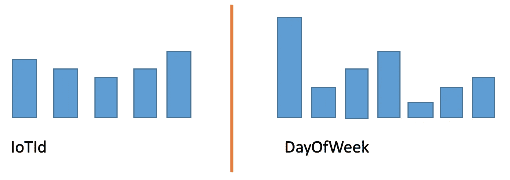

# 如何在 Azure Cosmos DB 中选择分区键？分区关键策略？

> 原文：<https://medium.com/javarevisited/how-to-select-a-partition-key-in-azure-cosmos-db-partition-key-strategies-f44ba134790e?source=collection_archive---------4----------------------->

在本文中，我们将讨论在选择分区键时必须考虑的因素。如果你还不熟悉 Azure Cosmos DB，我已经分享了另一篇关于它的关键信息的文章。

[真诚媒体](https://unsplash.com/@sincerelymedia?utm_source=unsplash&utm_medium=referral&utm_content=creditCopyText)在 [Unsplash](https://unsplash.com/s/photos/database?utm_source=unsplash&utm_medium=referral&utm_content=creditCopyText) 上拍摄的照片

# **通用指南**

让我们来看看分区键的一些原理。

## 1.不可变属性

是一个值不变的属性。如果一个属性是您的分区键，您不能更新该属性的值。

## 2.高基数

属性应该具有广泛的可能值和独特的。这将有助于确保逻辑分区尽可能小，从而允许更多的请求单元(RU)消耗。

## **3。跨逻辑分区均匀分布数据**

类似于第 2 点，这有助于确保在物理分区上均匀的 RU 消耗和存储分布。

# 要注意的其他检查点

## 不会导致逻辑分区超过 20GB

每个逻辑分区最多只能增长到 20GB。

## **事务范围在单个逻辑分区内**

如果您需要 Azure Cosmos DB 中的[多项 ACID 事务](https://docs.microsoft.com/en-us/azure/cosmos-db/database-transactions-optimistic-concurrency#multi-item-transactions)，您将需要使用[存储过程或触发器](https://docs.microsoft.com/en-us/azure/cosmos-db/how-to-write-stored-procedures-triggers-udfs#stored-procedures)。所有基于 JavaScript 的存储过程和触发器都限定在一个逻辑分区内。

因此，如果使用 itemId 作为分区键，就不可能通过存储过程/触发器进行批量导入。然而，这并不是完全不可能的，你可以看看他们的[批量执行器库](https://docs.microsoft.com/en-us/azure/cosmos-db/bulk-executor-overview)，这两个库都可用。NET 和 Java。

## **调配的吞吐量均匀分布在物理分区中**

容器的吞吐量均匀地分布在物理分区中。如果您的分区键没有将数据均匀地分布在不同的物理分区中，一些分区就有可能变得“热”起来，并且可能会发生速率限制(即节流)。如果您预计总数据大小将需要多个物理分区，这一点很重要。

> “热”分区是指有太多的请求指向一小部分分区。

你的分区键给了你最小的逻辑分区吗？使用较小的逻辑分区，您可以避免对另一个物理分区的不必要的需求，这样您所提供的吞吐量就必须在不同的物理分区之间共享。下图展示了在一个数据总量为 100 GB 的示例中，根据逻辑分区的大小需要多少物理分区的差异。

## 有跨分区查询吗？

确定应用程序所需的查询非常重要。同样，如果您有大量数据，建议您尽可能避免跨分区查询。在这种情况下，跨分区查询将导致高 RU 成本。

# 读/写重型系统

总体而言，根据您需要的数据库类型，您可能会侧重于要满足的不同条件:

*   Read heavy system
    -分区键存在于所有(如果不是大多数)查询中(以防止跨分区查询)
    -分发并发查询
*   写繁重系统
    ——将并发写分布在大范围的值上

# 例子

我们来看一下使用物联网场景的两种分区键选择。

1.  通过 IoTId
2.  到一周前

数据示例

在左侧，每个物联网设备的数据量似乎大致相同。如果您的查询总是通过 IoTId，这将有助于您直接进入相应的分区。但是，如果您预见到任何设备的数据将超过最大逻辑分区大小(20GB)，您必须考虑一个计划。

在右侧，使用一周中的某一天，如果在特定的几天碰巧有更多的数据，可能会有问题(如第一个条形所示)。这将导致数据的不均匀分布，从而产生我们不想要的“热”分区。

# 我的所有属性都不适合作为分区键

你可以考虑使用[合成分区键](https://docs.microsoft.com/en-us/azure/cosmos-db/sql/synthetic-partition-keys)。合成分区键是组合属性以形成分区键的概念。

你所要做的就是包括那个地层的另一个属性。例如/partitionKey = itemId + month

# 结论

以上解决了在决定分区键时应该考虑的大部分因素。您可能找不到满足所有这些条件的完美分区键，但是只要满足其中的大多数条件(基于您的应用程序需求，即大多数常用查询)，它就应该为您提供“最佳”性能。

祝你好运，并祝你在 Azure Cosmos DB 的旅程愉快！😁

感谢您的阅读！