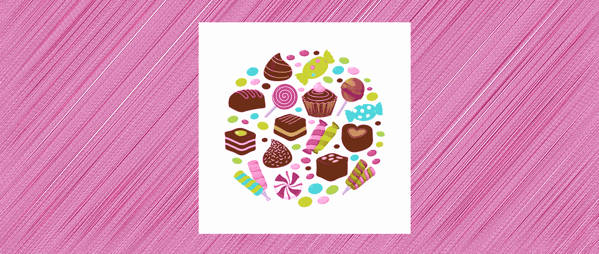
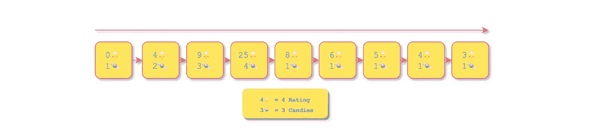
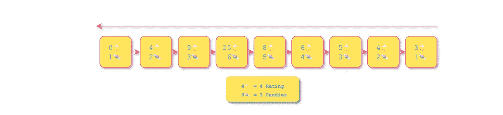
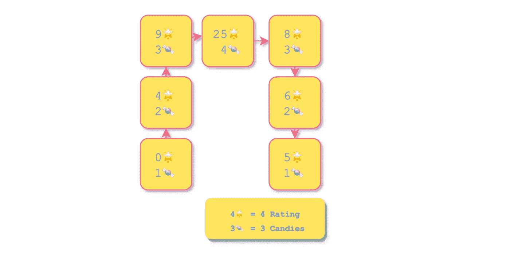
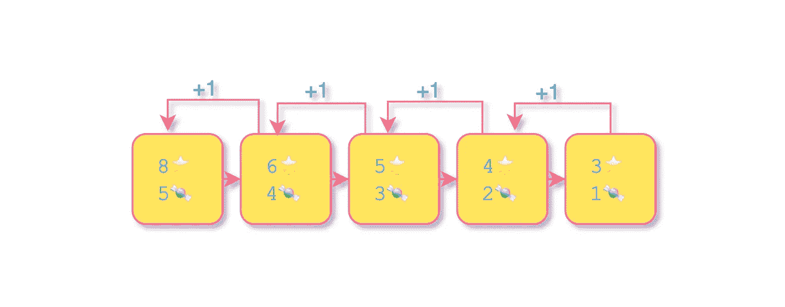
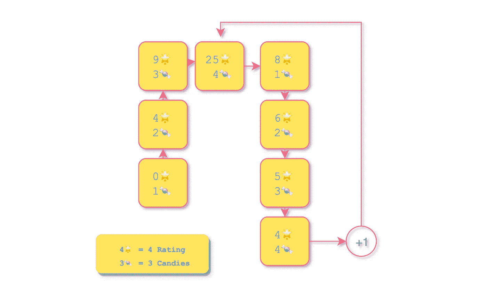
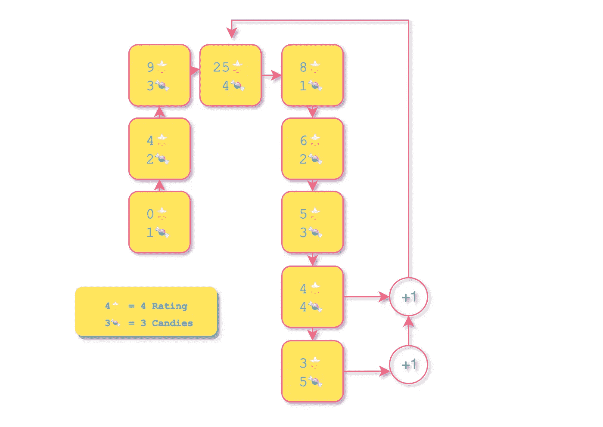

# 破解最小糖果分配问题

> 原文：<https://medium.com/javarevisited/how-to-solve-the-minimum-candy-distribution-problem-4c868740f16a?source=collection_archive---------1----------------------->



图片由 [Freepik](https://www.freepik.com/premium-vector/colourful-fruit-candies-chocolate-sweets-flat-icons-circle-design_4080058.htm#:~:text=Copy%20link)

# 问题陈述

有 N 个孩子站在一条线上，每个孩子都有一个评分值。你给这些孩子糖果，同时确保每个孩子必须至少有一个糖果，评分高的孩子比他们的邻居得到更多的糖果。你必须给的最少糖果是多少？

## 示例:

*   输入:[1，0，2] |输出:5 { **分布** : [2，1，2] }
*   输入:[1，2，2] |输出:4 { **分布** : [2，1，1] }
*   输入:[0，2，0，6，6] |输出:7 { **分配** :[1，2，1，2，1] }

# 解决办法🍬—时间和空间复杂度 O(n)

基本上每个孩子都要评估**两个** **邻居(上一个孩子和下一个孩子)**才能找到他/她应该得到的糖果数:

*   如果孩子的糖果比邻居的多，那么孩子应该比邻居得到更多的糖果。
*   如果孩子的评级低于或等于邻居的评级，则邻居可以被忽略，因为这对所讨论的孩子的糖果计数没有影响。

[算法](/hackernoon/50-data-structure-and-algorithms-interview-questions-for-programmers-b4b1ac61f5b0)的具体步骤及其代码如下:

[](https://www.java67.com/2018/06/data-structure-and-algorithm-interview-questions-programmers.html)

向前遍历

*   向前遍历:从第一个孩子开始遍历评级，并在途中更新下一个孩子的糖果计数。如果当前孩子的评分小于下一个孩子的评分，那么下一个孩子的糖果数必须至少比当前孩子的糖果数多1。

[](https://medium.com/javarevisited/7-free-books-to-learn-data-structure-and-algorithms-in-java-346b2d70db10)

向后遍历

*   向后遍历:从最后一个孩子开始遍历评级，并在途中更新前一个孩子的糖果计数。如果当前孩子的评分低于前一个孩子的评分，则前一个孩子的糖果数必须至少比当前孩子的糖果数多1。
*   数糖果:计算每个孩子的糖果总数。

```
**// Language: Java
// Time Complexity: O(n) 3 Linear traversals.
// Space Complexity: O(n) Array of candies.**public int candy(int[] ratings) {
      if (ratings.length < 2) {
        return ratings.length;
      }

      int[] candies = new int[ratings.length];
      Arrays.fill(candies, 1);

     ** // ** Step 1: Forward ****
      for (int i=0; i<ratings.length-1; i++) {
        if (ratings[i] >= ratings[i+1]) {
          continue;
        }         
        candies[i+1] = candies[i] + 1;    
      }

      **// ** Step 2: Backward ****
      for (int i=ratings.length-1; i>0; i--) {
        if (ratings[i] >= ratings[i-1]) {
          continue;
        }
        candies[i-1] = Math.max(candies[i] + 1, candies[i-1]);   
      }

      **// ** Step 3: Count Candies ****
      int count = 0;
      for (int i=0; i<candies.length; i++) {
        count += candies[i];
      }

      return count;     
 }
```

这是一个完全可以接受的解决方案，但是我们可以通过优化下一节中的[算法](/hackernoon/10-data-structure-algorithms-and-programming-courses-to-crack-any-coding-interview-e1c50b30b927?source=user_profile---------8-----------------------)来节省一些空间。

# 🍬空间的最优化— O(n) -> O(1)

## 基础知识介绍

让我们将输入[0，4，9，25，8，6，5]的分布可视化如下:

[](https://medium.com/javarevisited/20-array-coding-problems-and-questions-from-programming-interviews-869b475b9121)

评分[0，4，9，25，8，6，5]

以下是一些重要的观察结果:

*   📈**【0，4，9，25】的上坡**(递增数字)的
    长度=4。
*   向上倾斜中的糖果数是 10=1+2+3+4，这是 n =长度=4 (n*n+1/2)的连续递增数的总和
*   📉**对于【25，8，6，5】的向下斜坡**(递减数字)的长度=4。
*   向下倾斜中的糖果数是 10=4+3+2+1，这是 n =长度=4 (n*n+1/2)的连续递增数的总和
*   两个斜坡的**峰**是中间的孩子，等级为 25。

## 峰值的糖果计数

**等斜率** 糖果计数为额定值 25(峰值)为 4。这是最长斜坡的长度。在本例中，其左侧和右侧的两个斜坡的长度都是 4。

这是有道理的，因为更长的斜率意味着更多的 1，以确保孩子比邻居得到更多的糖果。最终，在坡顶的孩子将得到最大数量的糖果。

[](https://hackernoon.com/10-data-structure-algorithms-books-every-programmer-should-read-d50487313127)

对于等级[8，6，5，4，3]，峰值为等级 8 的 1 的凸起

让我们**沿着[0，4，9，25，8，6，5]向下的斜坡向上走**，做一些糖果作业:

1.  评分 5: 1 糖果；这是最低金额。
2.  评分 6: 2 糖果>评分 5。
3.  评分 8: 3 糖果>评分 6。
4.  评分 25: 4 糖果>评分 8。

然而，问题是关于糖果的总数，并不要求我们像上面的步骤那样找到糖果/孩子的分配。

记住这一点，让我们**沿着**相同的下坡[0，4，9，25，8，6，5]走下去，做一些糖果分配:

1.  评分 25: 4 糖果>评分 9。
2.  评分 8: 1 糖果；这是最低金额。
    这对 peak 的糖果数量没有影响，因为它应该至少有 1+1=2 颗糖果，而它已经有 4 颗了。
3.  评级 6: 2 糖果；下坡**(无峰值)**有 2 个子【8，6】。理想情况下，等级 6 应该有 1 颗糖果，等级 8 应该有 2 颗糖果，以保持更高等级=更多糖果的约束。因为我们不关心确切的儿童糖果对，这种交换是无害的。
    这对 peak 的糖果数量没有影响，因为它应该至少有 2+1=3 颗糖果，而它已经有 4 颗了。
4.  评分 5: 3 糖果；向下的斜坡有 3 个子斜坡[8，6，5]。
    理想情况下，等级 5 应该有 1 颗糖果，等级 6 应该有 2 颗糖果，等级 8 应该有 3 颗糖果，以保持等级越高=糖果越多的限制。因为我们不关心确切的儿童糖果对，这种交换是无害的。
    这对 peak 的糖果数量没有影响，因为它应该至少有 3+1=4 颗糖果，而它已经有 4 颗了。

上述方法的好处是向下倾斜的长度简单地决定了给孩子的糖果量。

**不等斜率** 让我们在最后加上一个评分为 4 的孩子。

[](https://medium.com/javarevisited/top-10-free-data-structure-and-algorithms-courses-for-beginners-best-of-lot-ad807cc55f7a?source=collection_home---4------0-----------------------)

评分[0，4，9，25，8，6，5，4]

除了以上部分中的步骤之外，将 4 颗糖果分配给等级 4，因为向下的斜坡现在有 4 个子级[8，6，5，4]。

这会影响评级为 25 时的峰值吗？它有 4 颗糖果。给定它前面长度为 4 的斜率，它应该有 5 个糖果来维持更高等级=更多糖果的约束。

那么我们如何解决这个问题呢？

我们求出**斜率差:**如果这个向下斜率的大小大于等于向上斜率(4 ≥ 4)，那么糖果计数加 1(斜率差)。凸起为 1 时，4 在峰值时基本上会变成 5。

让我们在最后添加另一个评分为 3 的孩子。

[](https://medium.com/javarevisited/7-best-courses-to-learn-data-structure-and-algorithms-d5379ae2588?source=---------18------------------)

评分[0，4，9，25，8，6，5，4，3]

除了上面的步骤，分配 5 个糖果到等级 3，因为向下的斜坡现在有 5 个孩子[8，6，5，4，3]。

因为向下斜率的大小大于向上斜率(5≥4)，所以整个糖果数加 1。凸起为 1 时，5 在峰值时基本上会变成 6。

该算法的代码如下:

```
**// Language: Java
// Time Complexity: O(n) Linear traversal.
// Space Complexity: O(1) Constant space for variables.**public int candy(int[] ratings) {
      if (ratings.length < 2) {
          return ratings.length;
      }

      int count = 1;
      int upSlopeLength = 0;
      int upSlope = 0;
      int downSlope = 0;

      for (int i=1; i<ratings.length; i++) {
          int previous = ratings[i-1];
          int me = ratings[i];

          // **** Equal Ratings ****   
          if (me == previous) {
              upSlope = 0;
              downSlope = 0;
              upSlopeLength = 0;
              count += 1;
          // **** Upward Slope **** } else if (me > previous) {
              upSlope = upSlope == 0 ? 1 : upSlope;
              upSlope += 1;
              downSlope = 0;
              count += upSlope;
              upSlopeLength = upSlope;
          // **** Downward Slope ****
          } else {
              upSlope = 0;
              downSlope += 1;
              int slopeDiff = 
                (downSlope + 1 - upSlopeLength) > 0 ? 1 : 0;
              count += downSlope + slopeDiff;         
          }     
      }
      return count;  
}
```

如果你觉得这篇文章有用，**请帮助我接触更多的开发学习者！**

通过“鼓掌”来展示一些❤👏在页面的左边距(在桌面上)或底部(在手机上)。通过连续点击，您可以这样做多达 **50** 次！

# 阿努姆·马利克

在 [Twitter](https://twitter.com/anumsarmadmalik) 上关注 NMTechBytes，获取我的每日技术信息:)

## 特别感谢:

*   [一次通过的简单解决方案](https://leetcode.com/problems/candy/discuss/135698/Simple-solution-with-one-pass-using-O(1)-space)
*   [LeetCode 糖果问题](https://leetcode.com/problems/candy/submissions/)