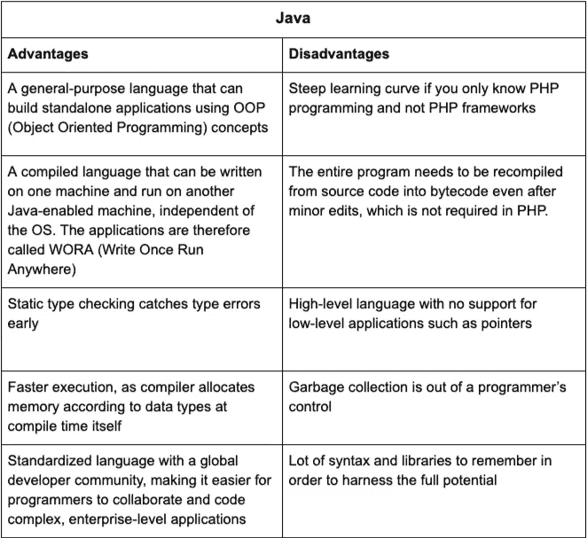

# 如何从 PHP 转换到 Java，为什么这仍然是一个好主意

> 原文：<https://medium.com/javarevisited/how-to-switch-from-php-to-java-and-why-its-still-a-good-idea-de0f309da757?source=collection_archive---------0----------------------->

PHP(超文本处理器)和 Java 是统治互联网的两种最常见的编程语言。尽管这些本质上是不同的，也不意味着可以直接替代对方，但几十年来，界限已经变得模糊了。在当今世界，这两者都为构建 web 应用程序提供了可靠的框架。

如果您已经是一名多年的 PHP 程序员，并且希望通过探索 Java 世界来扩展您的视野，那么您将踏上一段充满挑战的迷人旅程。在我们探讨 PHP 程序员转换到 Java 的好处和面临的挑战之前，让我们对两者做一个简单的比较。

# Java 和 PHP——利弊

这两种语言既有相似之处，也有不同之处。以下是两者的利弊。作为一名 PHP 程序员，你会发现这很有趣，因为这个鸟瞰 [Java 世界](/javarevisited/10-free-courses-to-learn-java-in-2019-22d1f33a3915)的视图将帮助你理解会发生什么，并评估转换到 [Java](/javarevisited/top-5-java-online-courses-for-beginners-best-of-lot-1e1e240a758) 所要付出的努力。

# 学习 Java 的挑战、好处和动机

## 学习 Java 的挑战

Java 是一种高度标准化但详尽的语言。它在世界各地有一个庞大的开发者社区，还有大量的[在线论坛](https://javarevisited.blogspot.com/2015/01/top-5-java-forums-for-programmers.html)可以互相帮助。与其他语言不同，花一两年时间学习 Java 不会让你成为专家。这是一个漫长的旅程，你必须坚持不懈，耐心等待。

对于一个有扎实 PHP 背景的开发者来说，Java 会显得更有条理、更全面、更直接。你需要花时间去理解它的[库](https://dzone.com/articles/20-useful-open-source-libraries-for-java-programme)的层次结构和世界各地开发者遵循的惯例。起初，这可能会令人望而生畏，但从长远来看，这将是一个巨大的推动，因为您会发现与全球开发人员合作并构建复杂的企业级应用程序是很容易的。

# 学习 Java 的职业益处

职业发展是程序员考虑转向 Java 的一个重要动机。由于它是构建复杂商业软件的首选语言，就业市场通常对 Java 程序员很热情。中级开发人员将能够支付他/她的账单，并且在获得专业知识后会有一个更有回报的职业生涯。

下面是随着你在 [Java 编程](https://javarevisited.blogspot.com/2018/07/top-5-websites-to-learn-coding-in-java.html)旅程中的进步，你将收获的职业回报:

*   你可以通过在线培训、参加训练营或获得相关的计算机科学学士学位来获得初级职位。
*   您可以将您的档案从 Java 开发人员切换到界面设计人员或应用程序测试人员。
*   当你与架构师、[网络开发人员和工程师一起工作时，你会改进你的沟通并学习新的协作工具。](https://hackernoon.com/the-2019-web-developer-roadmap-ab89ac3c380e)
*   Java 驱动着数十亿台设备和许多流行网站，如脸书和亚马逊。解决现实世界问题和简化人们生活的工作满足感让你的工作充满激情。
*   Java 拥有全球公认的认证，如 OCAJP 的[和 OCPJP 的](/javarevisited/java-certifications-how-to-crack-it-practical-tips-to-prepare-ocajp-and-ocpjp-exams-538f6fe36b37)[认证，你可以将这些认证添加到你的投资组合中，爬上职业阶梯。](https://javarevisited.blogspot.com/2019/10/top-5-books-courses-to-crack-oracles-java-se-11-certification-OCAJP11.html)
*   你有机会晋升到高级职位，如架构师或技术经理。
*   你正在学习另一种[编程语言](https://dev.to/javinpaul/top-5-programming-languages-every-software-developer-should-learn-3o3o)，这让你成为一个多才多艺的开发者。
*   考虑到它的局限性， **PHP 并不是构建大型应用程序的首选语言**，它的受欢迎程度也在慢慢下降，因为它主要是一种服务器端脚本语言。

# 一个 PHP 背景如何学习 Java？

开发人员社区普遍认为学习编程比学习编程语言更复杂。如果你足够了解 PHP，你就已经知道如何编程了。因此，您已经有了一个良好的开端，转换到 Java 不会像一个完全的编程新手那样困难。

[Java](https://dzone.com/articles/5-websites-to-learn-java-programming-for-free) 不仅仅是一种编程语言。除了语法和[库](https://javarevisited.blogspot.com/2018/01/top-20-libraries-and-apis-for-java-programmers.html)，你需要习惯编程的“java 方式”。它将帮助你掌握全球遵循的惯例，并微调你的技能。PHP 与 Java 的相似之处结束于服务器端编程讨论。

这里有一些技巧可以帮助你以系统的方式处理 Java 的浩瀚:

*   Java 有一个完整的宇宙——设定现实的期望，不要期望在一两年内成为大师。
*   从基础扎实开始。
*   Java 附带了一些对语言有深刻理解的伟大工具——[Eclipse](/javarevisited/top-10-courses-to-learn-eclipse-junit-and-mockito-for-java-developers-4de1e8d62b96)、 [NetBeans](http://javarevisited.blogspot.sg/2017/03/10-tools-used-by-java-programming-Developers.html#axzz55lrMRnNC) 、 [IntelliJ](https://itnext.io/top-5-intellijidea-and-android-studio-courses-for-java-and-android-programmers-afcc27309b60) 。从其中一艘开始，而不是同时驾驶两艘船。
*   一边走一边练习编码。避免让自己陷入理论超载的陷阱，因为真正的学习是通过弄脏你的手来进行的。

这里有一些宝贵的资源可以帮助你开始:

[**CodeGym**](https://codegym.cc/) 是一个学习 Java 的便捷在线资源，课程的 80%都集中在动手实践上。与虚拟导师互动的课程，可提供即时评估和反馈。

[**Java 访问了**](https://javarevisited.blogspot.com)—结构良好的资源，包含 Java 教程、有用的文章和建议。Javarevisited 对任何决定学习 Java 的人都会有帮助。

[**W3schools**](https://www.w3schools.com/java/)**—这是另一个学习 Java 的综合在线资源，最棒的是它可以免费使用。该课程设计系统，从零开始，以便初学者可以很容易地掌握概念。**

**[**Head First Java**](https://www.oreilly.com/library/view/head-first-java/0596009208/)**(作者 Bert Bates 和 Kathy Sierra)——这本书一直是学习 Java 的黄金标准，被世界各地的开发者推荐。不管你选择从哪种媒介开始学习 Java，我们都强烈推荐这本书作为现成的参考资料。****

****[**Quora 上列出的资源**](https://www.quora.com/Which-is-the-best-source-to-learn-java-programming) — Quora 是一个充满活力的交流思想的平台，而[这个关于 java 资源的帖子](https://www.quora.com/Which-is-the-best-source-to-learn-java-programming)信息量非常大，尤其是对初学者来说。****

****Reddit — [这个 Reddit 论坛](https://www.reddit.com/r/learnjava/comments/br8cie/where_is_the_best_place_to_learn_java_seriously/)回答了许多关于初学者学习 java 的问题。它包括你应该参考的资源和你应该采取的方法，以给自己最好的进步机会。****

****收集有用的资源只是故事的一部分。如果您想成为一名 java 开发人员，您必须采用一种方法来帮助您最大限度地利用您所拥有的资源。****

****这篇关于学习 java 的最佳方法的 Quora 帖子将对第一次踏入 java 世界的初学者有所帮助。许多有经验的程序员分享了他们的建议，这对你获得专业知识大有帮助。****

# ****结论****

********

****Java 是一种真正的全球性技能，在未来的许多年里，这种技能都有可能保持需求。这将是一个伟大的除了你的编程曲目。Java 开发人员要求更高的报酬，因为他们有很多机会与大企业合作。耐心度过学习曲线就好，不要让 Java 的浩瀚压倒你，结果会很棒！****

****你可能喜欢的其他学习 Java 的有用资源****

****[2019 年 Java 开发者路线图](https://javarevisited.blogspot.com/2019/10/the-java-developer-roadmap.html)
[学习 Java 时要避免的 10 个错误](/javarevisited/10-deadly-mistakes-to-avoid-when-learning-java-aead894e64f4)
[从零开始学习 Java 的 10 个免费课程](http://www.java67.com/2018/08/top-10-free-java-courses-for-beginners-experienced-developers.html)
[深入学习 Java 的 10 本书](https://medium.freecodecamp.org/must-read-books-to-learn-java-programming-327a3768ea2f)
[10 个工具每个 Java 开发者都应该知道的](http://www.java67.com/2018/04/10-tools-java-developers-should-learn.html)
[学习 Java 编程语言的 10 个理由](http://javarevisited.blogspot.sg/2013/04/10-reasons-to-learn-java-programming.html)
[2019 年 Java 和 Web 开发者应该学习的 10 个框架](http://javarevisited.blogspot.sg/2018/01/10-frameworks-java-and-web-developers-should-learn.html)
2019 年
[要学习的 5 大 Java 框架 2019 年](http://javarevisited.blogspot.sg/2018/04/top-5-java-frameworks-to-learn-in-2018_27.html)
[每个 Java 开发者都应该知道的 10 个测试库](https://javarevisited.blogspot.sg/2018/01/10-unit-testing-and-integration-tools-for-java-programmers.html)****

****祝您的 Java 之旅一切顺利！！****