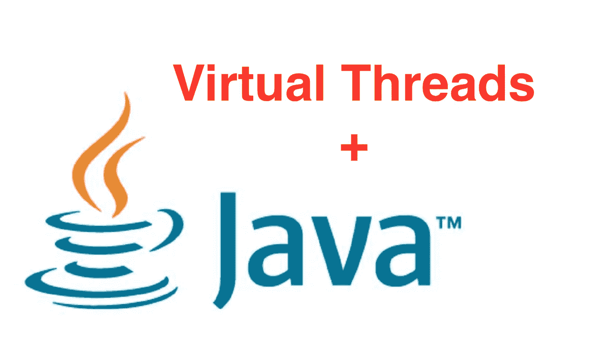
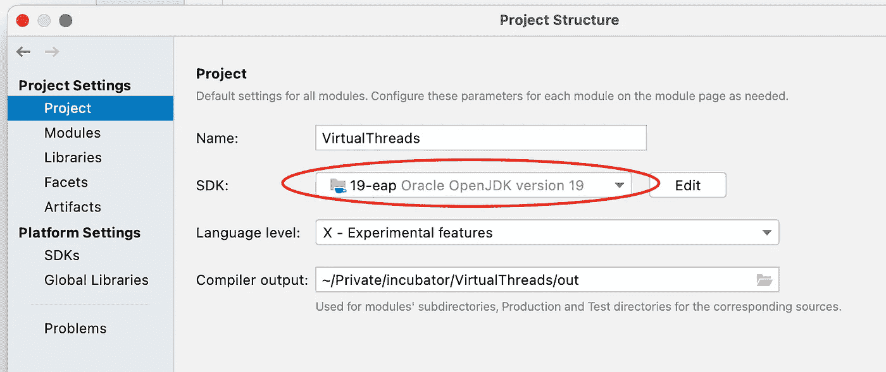
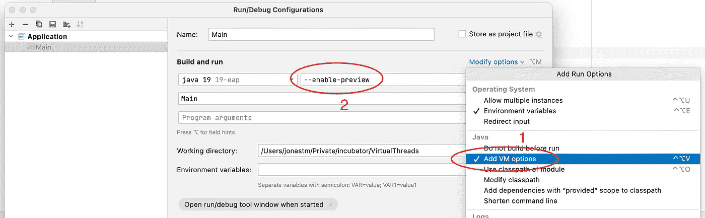

# 如何测试 Java 虚拟线程(Project Loom)

> 原文：<https://medium.com/javarevisited/how-to-test-out-java-virtual-threads-project-loom-2029428aeada?source=collection_archive---------1----------------------->

在当前的 Java 版本中，可以创建的线程数量非常有限，更不用说[创建新线程](https://www.java67.com/2019/06/right-way-to-create-start-and-stop-new-thread-java-example-tutorial.html)的开销了。这是因为 Java 中的一个线程对应于操作系统上的一个本机线程。通常使用某种线程池来调度许多任务的执行。对于 IO 繁重的任务，这仍然是非常低效的。

为了克服这个问题， [Project Loom](https://openjdk.java.net/projects/loom/) 引入了*虚拟线程*和 [JEP 425](https://openjdk.java.net/jeps/425) 。这些是线程**的轻量级版本**，其行为就像普通的 Java 线程一样，**但是你可以创建任意多的线程**。它们不绑定到某个操作系统线程，但是可以连接到操作系统线程或从操作系统线程分离。

为了测试你的程序是否能从新的虚拟线程中获益以及获益多少，你必须从官方 OpenJDK 站点[安装 JDK 19(早期访问),或者如果你使用 SDKMAN！通过
`sdk install java 19.ea.XXX-open` ( *用当前版本*替换 XXX)安装即可。这是因为 JDK 19 包括](https://jdk.java.net/19/) [JEP 425](https://openjdk.java.net/jeps/425) 作为[预览功能](https://openjdk.java.net/jeps/12)。

如果尚未设置，请将 JDK 19 eap 设置为您的默认 JDK。在命令行中检查版本时，应该会显示类似如下的内容:

> $ Java-version
> open JDK version " 19-ea " 2022–09–20

现在来测试一下，你可以创建你的第一个程序，如下图*Main.java*:

由于虚拟线程是一个预览特性，当编译你的程序时，你需要添加特殊的标志`—- enable-preview`和`--release`。
在命令行中，执行以下命令:

`javac --enable-preview --release 19 Main.java`

这将把你的程序编译成 Java 字节码。这现在可以通过再次使用预览标志来执行:

`java --enable-preview Main`

输出应该类似于:

> 来自 virtual thread[# 21]/runnable @ ForkJoinPool-1-worker-1 的 Hello World

现在是时候转换你自己的程序来使用虚拟线程了。如果您已经在使用 [executor 服务模式](https://javarevisited.blogspot.com/2013/07/how-to-create-thread-pools-in-java-executors-framework-example-tutorial.html)来调度任务，那么您可以通过使用新的 util 函数*executors . newvirtualthreadpertaskmexecutor()来轻松替换您的 executor 定义。*这创建了一个总是启动一个新的轻量级线程而不是有限大小的线程池(不再需要)的执行器。

如果您还想使用[智能集成环境](/javarevisited/7-best-courses-to-learn-intellij-idea-for-beginners-and-experienced-java-programmers-2e9aa9bb0c05)中的预览功能，请务必将您的项目设置为使用*文件- >项目结构- > SDK* 下的 JDK 19

然后在 IDE 的 Java 编译器首选项中添加编译器参数:

(发布标志通常已经在第一个复选框中自动设置)

要运行程序，首先添加 [VM 选项](https://www.java67.com/2016/08/10-jvm-options-for-java-production-application.html)，然后设置预览标志，编辑运行配置。

现在，您应该能够在 IntelliJ IDE 中运行虚拟线程了。

下一步做什么？看看 [JEP 428 结构化并发](https://openjdk.java.net/jeps/428)，它也即将推出，使处理并发任务变得更容易。

</javarevisited/the-java-programmer-roadmap-f9db163ef2c2> 