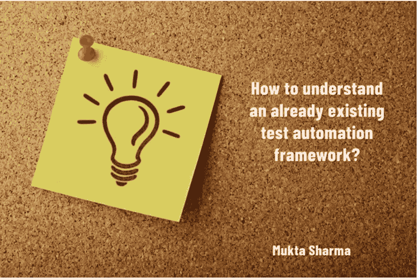

# 如何理解一个已经存在的测试自动化框架，以及我们如何对现有的测试自动化框架做出贡献？

> 原文：<https://medium.com/javarevisited/how-to-understand-an-already-existing-test-automation-framework-and-how-can-we-contribute-towards-4b219fb6619a?source=collection_archive---------2----------------------->

形象设计:穆克塔·夏尔马

✅假设你加入了一家新公司和一个新团队，那里已经有一个现成的测试自动化框架。例如，用于创建自动化框架的技术栈是通过使用 selenium、Java、Maven、svn、bitbucket 等。等。