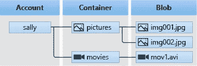
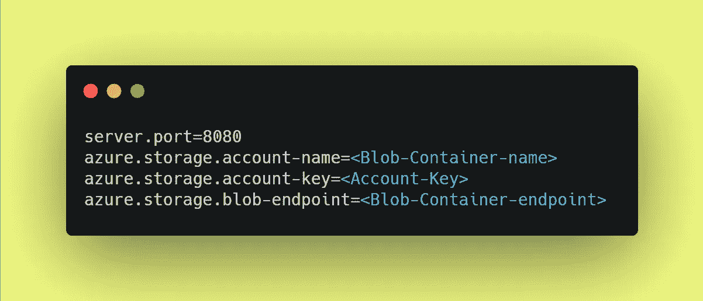
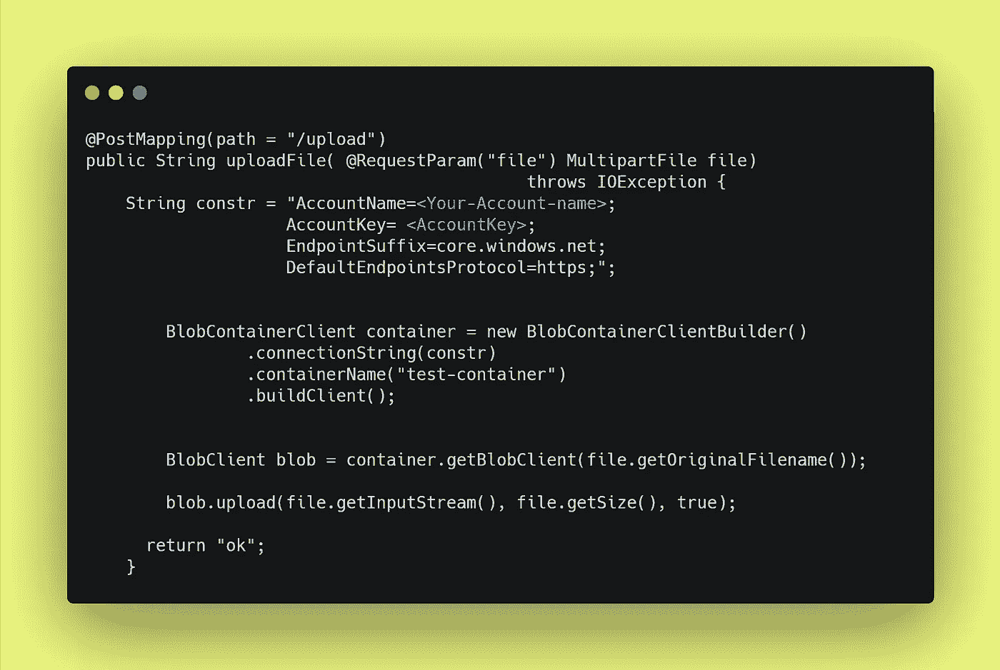
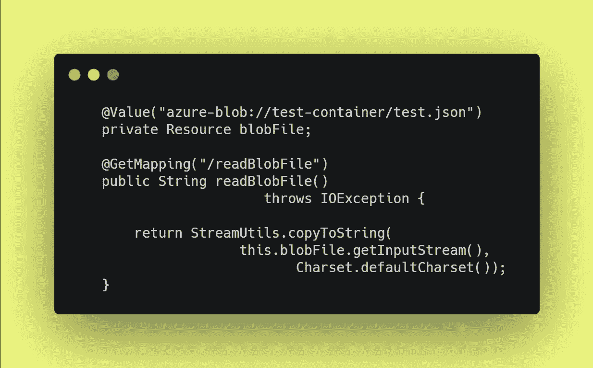
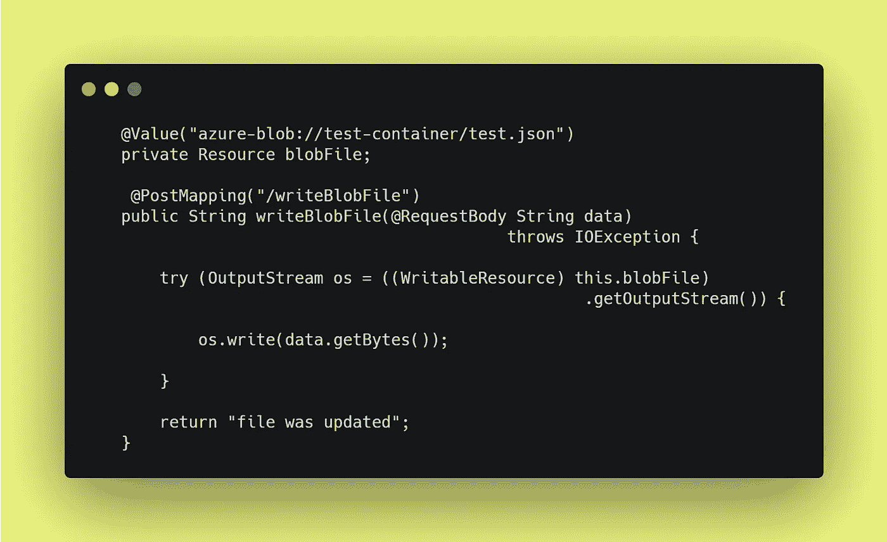
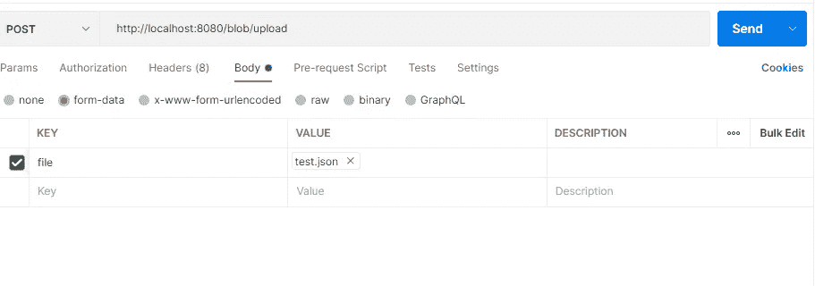
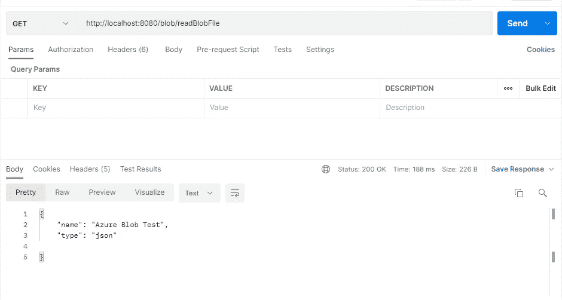

# 如何使用 Spring Boot 将文件上传到 Azure Blob？

> 原文：<https://medium.com/javarevisited/how-to-upload-file-to-azure-blob-using-spring-boot-8f0125b7f8af?source=collection_archive---------0----------------------->

## 云蓝色

你好👋我是罗汉·卡达姆😊

今天，云正在成为任何软件开发的标准。我们在编程周期的每个方面都使用了云，无论是将我们的代码上传到 Github 或 Gitlab，还是使用 Google Drive 或 Dropbox 或上传我们的个人文件。在本文中，我们将了解如何使用**实现文件**上传到 Azure Blob。****

**

如何使用 Spring Boot 将文件上传到 Azure Blob？** 

## **Blob 存储是什么意思？**

**Blob 存储是微软 Azure 中的一项功能，允许开发人员在微软的云平台中存储非结构化数据。这些数据可以从世界任何地方访问，可以包括音频、视频和文本。Blobs 被分组到绑定到用户帐户的“容器”中。可以使用任何编程语言来操作 Blobs。Blobs 被拥有大量音频和视频数据的流媒体公司广泛使用。**

## **为什么使用 Blob 存储？**

**Blob 存储非常适合于:**

*   **直接在设备上访问图像或文档。**
*   **为分布式访问存储文件。**
*   **流式视频和音频。**
*   **为备份和恢复灾难恢复存储数据，并存档。**
*   **存储数据以供内部或 Azure 托管的服务进行分析**

## **如何实现 blob 存储？**

**Blob 存储目前被业界广泛用于开发用户友好的应用程序。它以存储文件、图像和二进制数据而闻名。今天我们将使用 spring boot 和编程语言 Java 来实现 Azure Blob。在的这一部分，我们将介绍相同的读取、写入和上传操作。**

## **第一步:如何生成 Spring Boot 项目？**

** [## 弹簧初始化 r

### Initializr 生成的 spring boot 项目正好是你快速启动所需要的！

start.spring.io](https://start.spring.io/) 

## 步骤 2:我应该包括哪些依赖项？

属国

## 第 3 步:我的 Azure 会有什么配置？

当我们谈到配置时，我们需要三个主要部分

1.  Blob 容器名称
2.  帐户密钥—秘密密钥
3.  Blob 容器端点

致谢:微软

注意:-需要从 Azure 网站获取以上内容。

## 步骤 4:-需要为上传和读取文件创建一个控制器端点。

**1→如何上传文件到 Azure Blob 存储？**

将文件上传到 Blob 存储

**2→如何从 Azure Blob 存储中读取文件？**

从 Blob 存储中读取文件

**3→如何将文件写入 Azure Blob 存储？**

从存储中写入 Blob

## 步骤 5:邮递员端点上传文件。

azure _ blob _ 上传文件

## 步骤 6:读取文件的邮递员端点。

azure blob read 文件

## 结论:-

在这篇文章中，我们试图回答许多与 Azure Blob 相关的问题，以及如何使用 Spring boot 实现它。Blob 存储已被广泛用于存储非结构化数据，如文本、图像或二进制数据等。许多财富 500 强公司使用 blob 存储为其用户提供服务。

请分享和喜欢💖如果你觉得文章有用。在媒体上关注我，在推特上关注我，在 T2 关注我，在 T4 关注我

## 参考书目:-

 [## 如何将 Spring Boot 入门版用于 Azure 存储

### 本文将带您使用 Spring Initializr 创建一个定制应用程序，然后添加 Azure 存储…

docs.microsoft.com](https://docs.microsoft.com/en-us/azure/developer/java/spring-framework/configure-spring-boot-starter-java-app-with-azure-storage) 

谢谢观众们——罗汉·卡达姆**