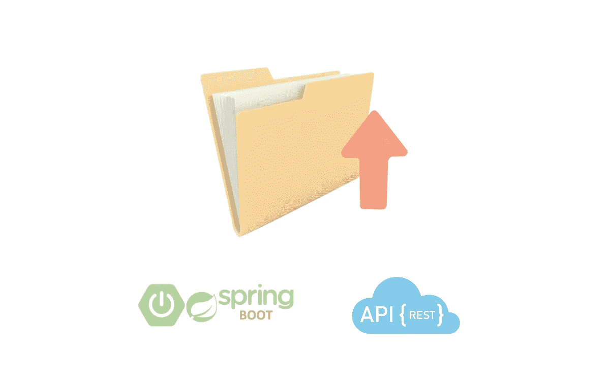

# 如何上传文件到 Spring Boot 的本地目录

> 原文：<https://medium.com/javarevisited/how-to-upload-files-to-local-directory-in-spring-boot-c8c33f8239d3?source=collection_archive---------1----------------------->

在这篇文章中，我将向你展示如何上传文件到 Spring Boot 的本地目录。

# 初步的

这个帖子是上一篇文章的延续…