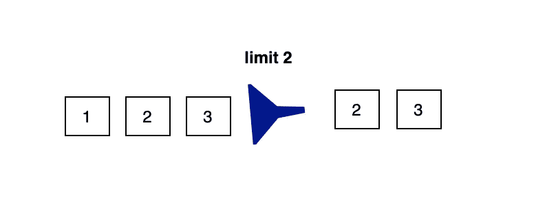

# 如何使用 Java Streams Skip()和 Limit()操作

> 原文：<https://medium.com/javarevisited/how-to-use-java-streams-skip-and-limit-operation-235106559b96?source=collection_archive---------1----------------------->

## Java 流上 Skip() & Limit()操作的用例

> 最初发表于<https://asyncq.com/how-to-use-java-8-streams-skip-and-limit-operation>

********

## **介绍**