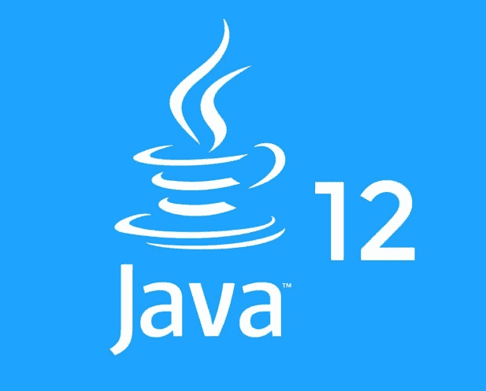
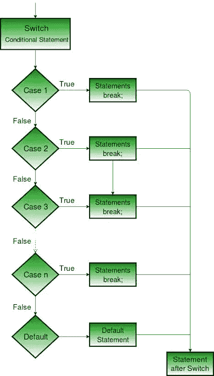

# 如何在 Java 12 中使用新的开关表达式

> 原文：<https://medium.com/javarevisited/how-to-use-new-switch-expressions-in-java-12-8510ab9f83c3?source=collection_archive---------1----------------------->

虽然我之前做过一些 Java 12 的练习，但是现在已经可以写了。在本帖中，我将告诉你 [Java 12](https://www.oracle.com/technetwork/java/javase/downloads/jdk12-downloads-5295953.html) 中的一些特别之处。Tataaaaaa:)新增*开关表情。*

[](https://medium.com/javarevisited/top-5-courses-to-learn-new-features-of-java-8-to-java-13-107eb51d2a13?source=collection_home---4------4-----------------------)

Java 12

让我们开始我们的话题，不要再浪费时间了。

# Java 12 想用 Switch 表达式做什么？

在 **JEP** ( [325](https://openjdk.java.net/jeps/325) )中列出的目的如下:

*   扩展开关，使它们可以是语句或表达式。
*   允许“传统”或“简化”的范围/控制流行为。
*   帮助准备例如模式匹配(**JEP**305)。



switch 语句流程图

# 添加了什么？

*   `case L -> expression;`的表达式标签

您可以使用新的开关标签“`case L ->`”来表示如果标签匹配，则只执行标签右边的代码，而不必区分不同的大小写。您可以用它来编写更清晰、更易读的代码。此外，你不必担心忘记写声明的`break`。

一个例子是:

```
switch (day) {
    case MONDAY:
    case FRIDAY:
    case SUNDAY:
        System.out.println(6);
        break;
    case TUESDAY:
        System.out.println(7);
        break;
    case THURSDAY:
    case SATURDAY:
        System.out.println(8);
        break;
    case WEDNESDAY:
        System.out.println(9);
        break;
}
```

如上所述，这是一个传统的 switch 语句。它在 Java 12 中变成了新的 switch 表达式，如下所示。

```
switch (day) {
    case MONDAY, FRIDAY, SUNDAY -> System.out.println(6);
    case TUESDAY                -> System.out.println(7);
    case THURSDAY, SATURDAY     -> System.out.println(8);
    case WEDNESDAY              -> System.out.println(9);
}
```

也可以从 Java 12 中的 switch 语句返回值。

```
int j = switch (day) {
    case MONDAY  -> 0;
    case TUESDAY -> 1;
    default      -> {
        int k = day.toString().length();
        int result = f(k);
        break result;
    }
};
```

在 Java 12 发布之前，不能在两种完全不同的情况下使用相同的变量名。

```
int j = switch (day) {
case MONDAY:
String temp1 = "first";
break temp1.length();
case TUESDAY:
String temp2 = "second";
break temp2.length();
default:
String defaultTemp = "none";
break defaultTemp.length();
}
```

现在可以在 case 级别使用作用域，这意味着您可以为不同的 case 使用相同的变量名。

```
int j = switch (day) {
case MONDAY:
String temp = "first";
break temp.length();
case TUESDAY:
String temp = "second";
break temp.length();
default:
String temp = "none";
break temp.length();
}
```

**注意:**本教程重点介绍 Java 12 中新的 switch 表达式。你可以从[这里](https://openjdk.java.net/projects/jdk/12/)阅读 Java 12 的其他变化。此外，代码样本取自此处的[和](https://openjdk.java.net/jeps/325)。


shutterstock/斯蒂芬石膏

# 感谢您的阅读！🙏你的想法对我很有价值。请随意分享。😄

而且，如果你想了解 JDK 8 和 JDK 13 之间增加的所有新功能，那么看看这个[课程列表](https://www.java67.com/2018/02/5-online-courses-to-learn-java-9-better.html):

[](/javarevisited/top-5-courses-to-learn-new-features-of-java-8-to-java-13-107eb51d2a13) [## 学习 Java 8 到 Java 13 新特性的前 5 门课程

### 从 Java 8 到 Java 13 引入了许多有用的特性，如 lambda 表达式、流 API、新日期和…

medium.com](/javarevisited/top-5-courses-to-learn-new-features-of-java-8-to-java-13-107eb51d2a13)