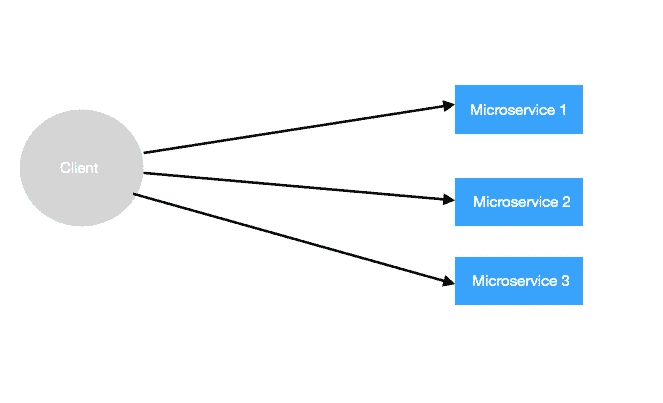

# 如何使用 Spring 云网关动态发现微服务

> 原文：<https://medium.com/javarevisited/how-to-use-spring-cloud-gateway-to-dynamically-discover-microservices-194c0c3869c6?source=collection_archive---------1----------------------->

要了解一个网关，我们先试着了解一个没有网关的微服务。

根据上面的图表，客户端必须直接访问服务。这意味着客户端必须知道每个微服务的端点，并将其存储在客户端。