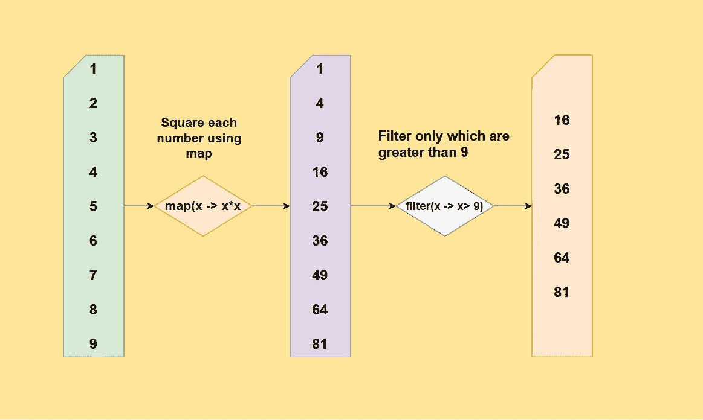
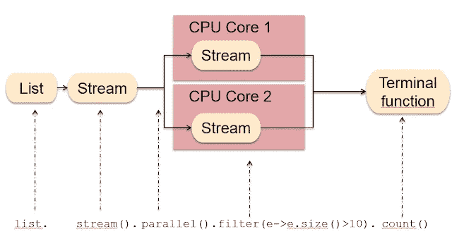
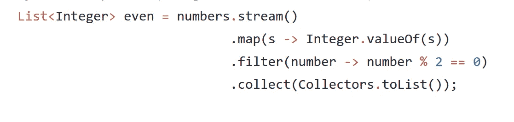

# 如何在 Java Stream 中使用 map，filter，collect 方法？示例教程

> 原文：<https://medium.com/javarevisited/how-to-use-streams-map-filter-and-collect-methods-in-java-1e13609a318b?source=collection_archive---------0----------------------->

你们好，伙计们！如果你正在学习 Java 中的函数式编程，并且想学习如何在 Java 中使用 map、filter 和 collect 方法，那么你来对地方了。

过去，我曾分享过[最佳 Java 函数式编程课程](https://javarevisited.blogspot.com/2020/04/top-5-courses-to-learn-functional-programming-in-java-with-lambda-and-stream.html)以及一些[关于 Lambda 和 Stream 的 Java 书籍](/javarevisited/7-best-java-tutorials-and-books-to-learn-lambda-expression-and-stream-api-and-other-features-3083e6038e14)，今天，我将教你如何使用 map、filter 和 collect()方法创建流管道，将数据从一种形式转换为另一种形式。

尽管我之前已经在博客上发表了关于 map() 和 [filter()](http://www.java67.com/2016/08/java-8-stream-filter-method-example.html) 的文章，但我再次写这篇文章是为了用通俗的语言来阐述这个概念，以便让我的读者和 Java 开发人员更好地理解这个概念。

**map()** 函数是 Stream 类中的一个方法，表示函数式编程概念。简而言之，map()用于通过应用函数将一个对象转换成另一个对象。

这就是`Stream.map(Function mapper)`将函数作为参数的原因。例如，通过使用`map()`函数，您可以将 [Integer.valueOf()](https://javarevisited.blogspot.sg/2011/08/convert-string-to-integer-to-string.html) 方法应用于输入列表中的每个字符串，从而将字符串列表转换为整数列表。

您所需要的只是一个映射函数，将一个对象转换成另一个对象。然后， [map()](https://javarevisited.blogspot.sg/2016/03/difference-between-map-and-flatmap-in-java8.html) 函数会帮你做转换。它还是一个中间流操作，这意味着您可以调用其他流方法，比如过滤器，或者在此基础上收集以创建一个转换链。

现在，到了[过滤](http://www.java67.com/2018/03/java-8-stream-find-first-and-filter-example.html)方法，顾名思义，**它根据你给的条件**过滤元素。例如，如果列表中包含数字，而您只需要数字，则可以使用 filter 方法只选择能被 2 整除的数字。

filter 方法本质上是根据您提供的条件选择元素。这就是过滤器(`Predicate` condition)接受谓词对象的原因，它提供了一个应用于条件的函数。如果条件评估为真，则选择该对象。否则，它将被忽略。

与 map 类似，filter 也是一个中间操作，这意味着您可以在调用 filter 之后调用其他流方法。

这个`filter()`方法也是 **lazy** 这意味着直到你调用一个 reduction 方法，比如 collect，它才会被求值，一旦到达目标，它就会停止。

如果您不熟悉流行为，我建议您查看 Udemy 上 Rang Rao Karnam 的[**用 Lambdas & Streams**](https://click.linksynergy.com/deeplink?id=JVFxdTr9V80&mid=39197&murl=https%3A%2F%2Fwww.udemy.com%2Fcourse%2Ffunctional-programming-with-java%2F) 学习 Java 函数式编程，其中详细解释了流的基本原理。

<https://click.linksynergy.com/deeplink?id=JVFxdTr9V80&mid=39197&murl=https%3A%2F%2Fwww.udemy.com%2Fcourse%2Ffunctional-programming-with-java%2F>  

# 1.如何在 Java 8 中使用映射和过滤方法

你需要一个好的例子来理解任何新概念。这就是为什么你在读这篇文章。由于 [String](http://www.java67.com/2012/12/how-to-reverse-string-in-java-stringbuffer-stringbuilder.html) 和 [Integer](https://javarevisited.blogspot.sg/2011/08/convert-string-to-integer-to-string.html) 是 Java 中最常见的数据类型，我选择了一个既简单又有趣的例子。

我有一个字符串列表:像`{“1”, “2”, “3”, “4”, “5”, “6”}`这样的数字。我想处理这个列表，需要另一个只有偶数的整数列表。

为了找到偶数，我首先需要将一个字符串列表转换成一个整数列表。为此，我可以使用 java.util.Stream 类的 [map()](http://www.java67.com/2016/09/map-reduce-example-java8.html) 方法。但是，在此之前，我们需要一个[流](http://www.java67.com/2014/04/java-8-stream-examples-and-tutorial.html)作为 map()，如 java.util.stream 类中所定义的。

这一点也不难，因为您可以通过调用 stream()方法从任何集合中获取流，例如 [List](http://www.java67.com/2012/07/sort-list-ascending-descending-order-set-arraylist.html) 或 [Set](http://javarevisited.blogspot.sg/2018/02/java-9-example-factory-methods-for-collections-immutable-list-set-map.html) ，该方法在`java.util.Collection`接口中定义。

`map(Function mapper)`方法接受一个[函数](https://javarevisited.blogspot.sg/2018/01/what-is-functional-interface-in-java-8.html)，从技术上讲，是 java.util.function.Function 接口的一个对象。然后，这个函数被应用到 Stream 的每个元素，将它转换成您想要的类型。

由于我们需要将字符串转换成整数，我们可以将`Integer.parseInt()` 或`Integer.valueOf()`方法传递给 [map()函数](https://www.java67.com/2015/01/java-8-map-function-examples.html)。

我选择了`valueOf()`方法，因为我在 parseInt vs valueOf 文章中提到的原因，即性能和缓存。对了，不光是我。甚至 Joshua Bloch 也建议在 [*有效 Java*](https://www.amazon.com/Effective-Java-3rd-Joshua-Bloch/dp/0134685997/?tag=javamysqlanta-20) 中更喜欢静态工厂方法，比如`valueOf()`而不是构造函数。

然后, `map()`将返回一个包含偶数和奇数的整数流。要选择偶数，我们可以使用 filter()方法。

它需要一个[谓词](http://javarevisited.blogspot.sg/2015/02/how-to-filter-collections-in-java-8.html)对象，从技术上来说**是一个函数，将一个对象转换成一个布尔值**。我们传递一个对象，它将返回 true 或 false。然后，过滤器使用该信息将对象包含在结果流中。

所以，为了只包括偶数，我们调用`filter( number -> number%2==0)`，这意味着每个数字将被除以 2，如果没有余数，那么它将被选中。这与我们在 Java 中解决编码问题时使用的逻辑相同，即[检查给定的数字是偶数还是奇数](http://www.java67.com/2018/05/top-75-programming-interview-questions-answers.html)。

我们差不多完成了。但是，到目前为止，我们只有偶数整数流，没有偶数整数列表，这就是为什么我们需要使用它们。

由于我们需要一个列表，我调用了`**collect(Collectors.toList())**` **，**将所有偶数累加到一个列表中并返回。

现在，你可能会想:它怎么知道返回整数列表呢？嗯，我们需要通过类型推断来获取这些信息，因为我们已经通过将结果存储到一个`List<Integer>`中来指定这些信息。

如果您想了解更多关于 lambda 表达式中的类型推断，完整的 Java master class**是一个很好的起点。**

****

# **2.Java 8 映射+过滤器+收集示例**

**下面是一个 Java 程序来实现我在上一节中所说的内容。您可以在 [IDE](/javarevisited/7-best-courses-to-learn-intellij-idea-for-beginners-and-experienced-java-programmers-2e9aa9bb0c05) 中或从命令行运行该程序，并查看结果。**

**您还可以尝试使用更多的`map()`函数或更多的`filter()`调用来使合成更长更复杂。您甚至可以使用`collect()`方法将结果收集到[列表](https://javarevisited.blogspot.com/2011/05/example-of-arraylist-in-java-tutorial.html)、[集合](https://javarevisited.blogspot.com/2016/01/3-ways-to-loop-over-set-or-hashset-in-java.html)、[地图](http://www.java67.com/2017/08/top-10-java-hashmap-interview-questions.html)或任何其他集合中。**

**可以看到原始列表包含 1 到 6 的数字，过滤后的列表只包含[偶数](http://javarevisited.blogspot.sg/2013/04/how-to-check-if-number-is-even-or-odd.html)，即 2、4、6。**

**本例中最重要的代码是以下四行流处理代码:**

****

**这段代码从地图开始，然后是过滤器，最后是 collect。你可能想知道顺序是否重要。的确如此。**

**由于我们的过滤条件需要一个 int 变量，我们首先需要将字符串的**流转换为整数**的**流。这就是为什么我们首先调用了 **map()** 函数。****

**一旦我们有了整数流，我们就可以应用数学找出偶数。我们将该条件传递给 filter 方法。如果我们需要过滤字符串，比如选择所有带有 `length > 2`的字符串，那么我们应该在映射之前调用 filter。**

**以上就是**如何在 Java 8** 中使用 map 和 filter。我们已经看到了一个有趣的例子，如何使用映射将一个对象转换为另一个对象，以及如何使用过滤器根据条件选择一个对象。我们还学习了如何在流上组合操作来编写既清晰又简洁的代码。**

****进一步学习**
[完整的 Java MasterClass](https://click.linksynergy.com/fs-bin/click?id=JVFxdTr9V80&subid=0&offerid=323058.1&type=10&tmpid=14538&RD_PARM1=https%3A%2F%2Fwww.udemy.com%2Fjava-the-complete-java-developer-course%2F)
[从集合到流在 Java 8 中使用 Lambda 表达式](https://pluralsight.pxf.io/c/1193463/424552/7490?u=https%3A%2F%2Fwww.pluralsight.com%2Fcourses%2Fjava-8-lambda-expressions-collections-streams)
[Java SE 8 for Programmers(book)](https://www.amazon.com/Java-SE8-Programmers-Deitel-Developer/dp/0133891380?tag=javamysqlanta-20)
[重构到 Java 8 Streams and Lambdas 自学工作坊](https://learning.javaspecialists.eu/courses/refactoring2j8?affcode=92815_johrd7r8)

其他 **Java 教程**如果您有兴趣了解更多关于 Java 8 的新特性，您可能会喜欢** 

*   **完整的 Java 开发者路线图([参见](https://javarevisited.blogspot.com/2019/10/the-java-developer-roadmap.html#axzz64YOHJ2TL))**
*   **Java 8 中五月如何按值排序？([例](http://www.java67.com/2017/07/how-to-sort-map-by-values-in-java-8.html)**
*   **Java 8 中 map()和 flatMap 的区别([答](https://javarevisited.blogspot.com/2016/03/difference-between-map-and-flatmap-in-java8.html))**
*   **Java 8 中如何使用 Stream 类([教程](http://www.java67.com/2014/04/java-8-stream-examples-and-tutorial.html))**
*   **深入学习 Java 的 10 门课程([课程](/javarevisited/top-5-java-online-courses-for-beginners-best-of-lot-1e1e240a758))**
*   **Java 8 中如何用 LocalDateTime 格式化/解析日期？([教程](http://javarevisited.blogspot.sg/2017/08/how-to-format-parse-dates-with-LocalDateTime-Java-8.html))**
*   **从头开始学习 Java 8 的 5 本书([本书](http://javarevisited.blogspot.sg/2016/10/best-books-to-learn-java-8.html))**
*   **Java 8 中默认的方法是什么？([例](http://www.java67.com/2017/08/java-8-default-methods-on-interface-example.html))**
*   **如何在 Java 8 中连接字符串([示例](http://www.java67.com/2016/08/java-8-stringjoin-example.html))**
*   **Java 8 中抽象类和接口的区别？([回答](http://www.java67.com/2017/08/difference-between-abstract-class-and-interface-in-java8.html))**
*   **Java 8 中日期和时间的 20 个例子([教程](https://javarevisited.blogspot.com/2015/03/20-examples-of-date-and-time-api-from-Java8.html))**
*   **Java 8 中如何按键对地图进行排序？([例子](http://javarevisited.blogspot.sg/2017/07/how-to-sort-map-by-keys-in-java-8.html#axzz4pXFCC65F))**
*   **15 Java 流和函数式编程面试问题([列表](https://www.java67.com/2018/10/java-8-stream-and-functional-programming-interview-questions-answers.html))**
*   **Java 8 中如何将列表转换为映射([解](http://javarevisited.blogspot.com/2016/04/10-examples-of-converting-list-to-map.html))**
*   **Java 8 中可选的 10 个例子？([例](http://javarevisited.blogspot.sg/2017/04/10-examples-of-optional-in-java-8.html#axzz4pXFCC65F))**

**感谢您阅读本文。如果你觉得这个 Java 教程有用，那么请与你的朋友和同事分享。如果您有任何问题或反馈，请留言。**

****P.S. —** 如果你真的想提高你的 Java 函数式编程技能，并且想学习更多关于 Java 流 API 的知识，我强烈推荐你去看看 Udemy 上 Rang Rao Karnam 的 [**学习 Java 函数式编程与 Lambdas &流**](https://click.linksynergy.com/deeplink?id=JVFxdTr9V80&mid=39197&murl=https%3A%2F%2Fwww.udemy.com%2Fcourse%2Ffunctional-programming-with-java%2F) **课程**，该课程详细解释了流的基础知识。**

**<https://click.linksynergy.com/deeplink?id=JVFxdTr9V80&mid=39197&murl=https%3A%2F%2Fwww.udemy.com%2Fcourse%2Ffunctional-programming-with-java%2F>  

> 如果你不是媒体成员，我强烈推荐你加入媒体，阅读不同领域伟大作家的精彩故事。你可以在这里**加入介质**</@somasharma_81597/membership>**