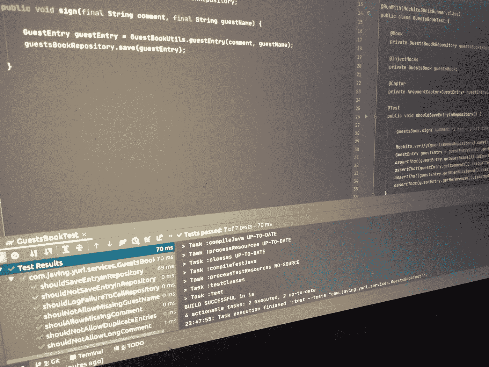

# 如何验证 void 方法是使用 Mockito 调用的

> 原文：<https://medium.com/javarevisited/how-to-verify-that-void-methods-were-called-using-mockito-f439bfa347be?source=collection_archive---------1----------------------->

ockito 是最流行的 java 模仿框架。这个故事很简单，我将向你展示如何模拟和验证一个 void 方法调用。

有时，当我们测试一个 void 方法的调用时，我们只想确保在它的生命周期中的某个时刻，会用某些参数调用另一个方法。让我们看下面的例子:

SomeClass.java

在上面这段遗留代码中，最重要的部分是一个叫做 *someMethod()* 的方法。我们必须确保以正确的方式调用它，但不幸的是，它属于一个我们无法访问的依赖项，而且更复杂的是，它在一个私有方法中。

[Mockito 框架](/javarevisited/top-10-courses-to-learn-eclipse-junit-and-mockito-for-java-developers-4de1e8d62b96)可以帮助我们模拟和验证方法调用。
我们可以这样做:

SomeClassTest.java

本测试课程中最重要的重点是:

*   被测试的类永远不会被嘲笑。
*   需要模拟被测试类的依赖关系。
*   通过调用模拟对象上的方法，我们将模拟该方法调用
*   在您的测试中，首先执行测试中的动作，然后调用 *verify()* ，而不是相反。
*   通过使用 *verify()* 方法，我们将测试在某一点上使用完全相同的参数调用了来自模拟的方法。
*   在我们的代码中使用受保护的方法是很好的实践。测试类可以访问受保护的方法，因为包名是相同的。(当然，在你的项目中，结构测试将在 *src/test/java* 下进行，而生产代码在 *src/main/java* 下进行)。

您可能喜欢的其他 **Java 测试文章和资源**

 [## 面向 Java 开发人员的 10 多个测试自动化库

### 最近写了一些关于 Java 开发者今年应该学什么的文章，比如编程语言…

medium.com](/javarevisited/10-test-automation-libraries-for-java-developers-e40cb61dcd49)  [## 深入学习 JUnit 和 Mockito 的 5 门课程—最佳选择

### 今天，我们将讨论 JUnit 和单元测试，这是任何软件开发人员的关键技能之一。你可以…

medium.com](/javarevisited/5-courses-to-learn-junit-and-mockito-in-2019-best-of-lot-f217d8b93688) 

如果你喜欢这个并且发现它很有用，请不要忘记关注 [Javing](/@javing.uk) 并给我们一些掌声:)

> 如果你不是媒体成员，我强烈推荐你加入媒体，阅读不同领域伟大作家的精彩故事。你可以在这里**加入中等**

***最初发布于*[http://javing . blogspot . com/2013/05/how-to-verify-that-void-methods-were . html](http://javing.blogspot.com/2013/05/how-to-verify-that-void-methods-were.html)**