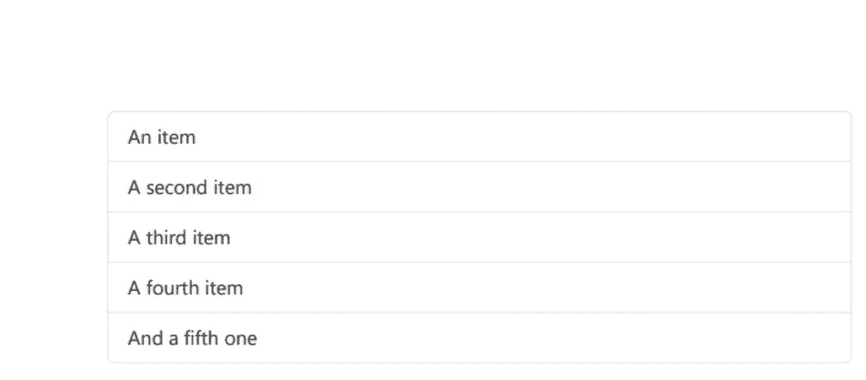

# HTML 到 PDF — Java

> 原文：<https://medium.com/javarevisited/html-to-pdf-java-9f46288faeb?source=collection_archive---------1----------------------->

## ironPDF 解决方案

# 用例

2020 年初，我妻子想重做她的简历，所以我主动给了她一个小工具，她只需告知她的培训、文凭和经历，然后谁会把它们放在一个文件里。

起初我想创建一个 word 格式的文档，但我对渲染不满意，前端的 HTML 看起来比最终的文档更好，这时候我想知道是否有办法将这个 HTML 转换成 PDF。
这导致了 itext pdf**html 2 pdf**(itext Java 库)解决方案的使用，我的前端发送给我一个对应于她的简历的对象，我只需将其格式化，然后生成 pdf 文档。

但是使用这个解决方案来处理复杂的 css 文件，比如 Bootstrap，会导致我的控制台出现很多警告，有时转换后的 html 内容会丢失一些格式。
在寻找一个将 html 转换成 pdf 的新解决方案时，发现了 ironPDF 解决方案，并决定尝试测试它。

# 什么是 PDF？

> **可移植文档格式** ( **PDF** ，标准化为 **ISO 32000** ，是由 [Adobe](https://en.wikipedia.org/wiki/Adobe_Systems) 于 1992 年开发的[文件格式](https://en.wikipedia.org/wiki/File_format)，以独立于[应用软件](https://en.wikipedia.org/wiki/Application_software)、[硬件](https://en.wikipedia.org/wiki/Computer_hardware)和[操作系统](https://en.wikipedia.org/wiki/Operating_system)的方式呈现[文档](https://en.wikipedia.org/wiki/Document)，包括文本格式和图像。基于 [PostScript](https://en.wikipedia.org/wiki/PostScript) 语言，每个 PDF 文件封装了一个固定版式平面文档的完整描述，包括文本、[字体](https://en.wikipedia.org/wiki/Font)、[矢量图形](https://en.wikipedia.org/wiki/Vector_graphics)、[光栅图像](https://en.wikipedia.org/wiki/Raster_images)以及其他需要显示的信息。PDF 源于 Adobe 联合创始人约翰·沃诺克于 1991 年发起的“卡米洛特计划”。

# IronPDF 解决方案

使用以前的解决方案处理复杂的 css 文件，比如 Bootstrap，会导致我的控制台出现很多警告，有时转换后的 html 内容会丢失一些格式。在寻找一个新的将 html 转换为 pdf 的解决方案时，我发现了 ironPDF 解决方案，并决定尝试测试它。

## 什么是 ironPDF？

> [***Iron PDF for Java***](https://ironpdf.com/java/)*是 Iron Software 开发和维护的一个库，帮助软件工程师在 Java 8+、Kotlin、Scala 项目中创建、编辑和提取 PDF 内容。*
> 
> *IronPDF for Java 建立在* [*IronPDF for。*](https://ironpdf.com/) 网*。*

为了获得所有可用特性的完整列表，我邀请 tou 去查看 java 库的文档。

## 依赖性

使用 maven，在您的 *pom.xml* 中导入以下依赖项

使用 gradle，将它添加到你的*版本中*

## 履行

## **将 html 转换成 pdf 文件**

因此，让我们从 ironPDF 工具的最基本的 java api 开始，将 html 字符串转换为 PDF 文件，为此，我首先需要注册我的许可证密钥。

在这个例子中，为了防止我提交代码时泄露秘密，我将许可证密钥放在一个环境变量中。

然后我只需要调用 PdfDocument 类的正确方法 renderHtmlAsPdf，用我的 html 的字符串表示作为参数。

这是简单而有效的，并且呈现的 PDF 文件尊重格式。

以 pdf 格式呈现 html

因此，在我制作 CV 生成器的最初用例中，我可以很容易地用一个字符串生成器替换字符串参数，该生成器将我的所有对象转换为字符串方法，然后生成 PDF。

好的，但是样式怎么样？在今天的 html 文件中，我们有一些样式，你知道，CSS。

## **添加样式和 javascript**

知道你可以在你的字符串中包含 style，比如 bootstrap，生成的 pdf 会在你的浏览器 IHM 中呈现。

正如你所看到的，我甚至在字符串中添加了一些 javascript，结果如下:

完成的 pdf 转换器可以很好地将 html 转换成 pdf 并保留所有的 css。

如果我读取转换的日志，我还可以看到转换的所有步骤和关于渲染器的所有信息。

在前面的例子中，我使用 Stringbuilder 来创建我的 html 结构，但是这个库也允许我们将 html 文件转换成 pdf 文档，您只需要更改在 pdf document:**pdf document . renderhtmlfileaspdf**中调用的方法，并将要转换的 html 文件作为参数传递。

# 利弊

## **优点**

*   转换 html 内容或 html 文件非常容易
*   使用像 bootstrap 这样的复杂 css 不会像 itext pdf java 库那样产生警告或错误
*   html 内容中的样式在生成 pdf 时被保存。

## **缺点**

*   macOS 上尚不支持。