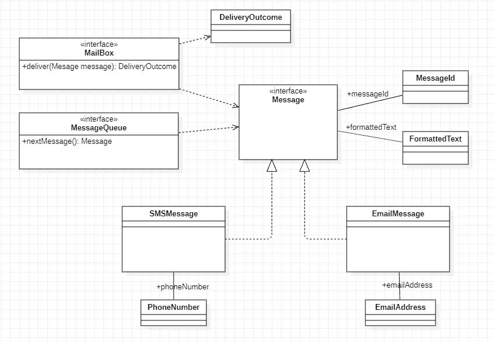
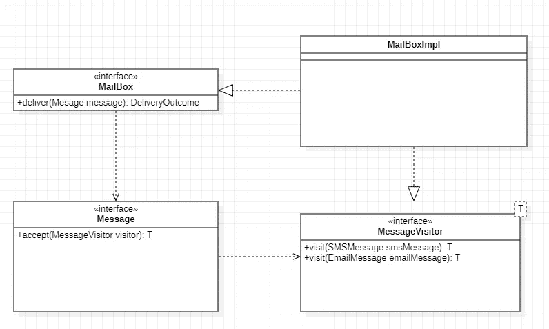

# 如果你用面向对象的语言开发软件，你需要“双重调度”:这是为什么(这到底是什么)

> 原文：<https://medium.com/javarevisited/if-you-develop-software-with-an-oop-language-you-need-double-dispatch-heres-why-and-what-the-19b33a0df857?source=collection_archive---------0----------------------->

罗斯·芬登在 [Unsplash](https://unsplash.com?utm_source=medium&utm_medium=referral) 上的照片

当使用面向对象的语言——如 Java——开发软件时，可能存在各种情况，在这些情况下，根据更通用的接口来操作一些对象是有效的，而在同一程序中，在其他情况下，需要根据更专用的接口来访问相同的对象。

例如，考虑这样一种情况，在某个软件架构中，我们必须操作`Messages`(例如发送给移动应用程序或 Web 服务用户的通知):对于处理`Messages`的组成或传输的架构部分，它“可见”仅仅是对`Messages`的一般描述是必要的和充分的；而对于处理实际发送的架构部分，有必要正确管理*每种不同类型的*`Message`(例如，SMS 或电子邮件，或移动设备的推送通知)。

下面是一个(简化的)UML 类图，它描述了一个对应于前面例子的系统:

考虑从队列中获取并交付一个`Message`的用例；下面是一个可能的(简化的)Java 实现:

`mailBox`对象必须能够根据它实际上是一个`SMSMessage`还是一个`EmailMessage`来处理不同的消息发送。

因此，我们可以编写下面的单元测试(总是用 Java):

在这项测试中:

*   我们从队列中取出一个`Message`——假设我们收到一条短信(通过嘲讽)
*   我们通过`MailBox`交付`Message`
*   我们检查发送结果——在测试的情况下，必须证明 SMS 已经发送

`deliver()`方法的最佳实现是什么？

## 错误的实现(在 Java 中)

一种自然的方法是利用所谓的“双重调度”。

“双重分派”是某些面向对象语言的特征，使得在运行时用于响应某个调用的实际方法的选择不仅基于其方法被调用的实例的“特征”(在我们的例子中为`mailBox`)，而且基于方法的参数——在它们在某个类层次结构中实现的有效类的特定含义(在我们的例子中为`message`变量)。

因此，我们可以想象，有两个`deliver(Message)`的实现:

然而，由于`MailBox`类必须能够在泛型`Messages`上被调用，我们还必须添加一个类型的方法:

不幸的是，由于 Java 并没有*而不是*原生支持“双重分派”，所以这种幼稚的方法行不通:`mailBox.deliver(message)`会不会*总是*导致`deliver(Message)`(即参数最“抽象”接口的方法)的实际调用——返回`null`。

## 工作实现——通过“反模式”

更有效的方法是使用一个`instanceOf`和一系列`ifs`:

测试现在开始了。

但是代码的质量并不是最佳的。

的确，有些“代码气味”很容易被注意到；如果有人会添加一个新的`Message`(比如说一个`MobilePushNotification`):

*   不容易知道代码库中是否存在这一点(或其他点),需要添加一条语句来正确处理新类型的`Message`
*   此外，在确定该代码时，为了增加新`Message`的管理，有必要修改现有的工作代码，该代码在此期间可能会因其他干预措施而变得更加复杂，因此其修改可能会导致意外问题
*   一个“造型”被应用到一个`message`中:如果代码将被重构，那么造型可能被移动到一个不再合适的位置

## 最后，好的那个！

更有效的方法是使用访问者模式实现“双重分派”。

让我们创建一个`MessageVisitor`:

然后我们修改`Messages`以便他们接受它:

最后，我们确保`MailBox`实现了`MessageVisitor<DeliveryOutcome>`，并且我们以下面简单的方式实现了`deliver(Message)`:

并且一个`Message`，比如说一个`SMSMessage`，将如下实现`accept()`:

这个 UML 图总结了一个`MailBox`实现的新设计:

这样，当我们添加一个新类型的`Message`时，编译器会立即通知我们`MessageVisitor`需要一个新的合适的方法，随后，编译器会一直通知我们`MailBox`的实现也需要新方法的实现:

*   系统的知识由编译器管理——而不是由拥有代码库的团队的口头或书面记忆来管理
*   需求的变化(例如新的`Message`)将通过扩展系统(使用新的方法)来实现，而不修改现有的方法

超级整洁！

## 结论

我们已经看到，当我们必须在通过 OOP 编码的软件系统中交替使用通用接口和特定实现时，使用“双重调度”是多么必要。

此外，我们已经看到了如何使用 Visitor 模式在 Java 中有效地实现双重分派。

你可以在我的 GitHub 项目资源库[double-dispatch-Java-example](https://github.com/PiercarloSlavazza/double-dispatch-java-example)中找到完整的代码(所有情况的实现，包括单元测试)。

</javarevisited/10-oop-design-principles-you-can-learn-in-2020-f7370cccdd31>  

## 你可能喜欢的其他文章

[2020 年 Java 程序员应该学会的 10 件事](https://javarevisited.blogspot.com/2017/12/10-things-java-programmers-should-learn.html#axzz5atl0BngO)
[每个程序员必读的 10 本书](http://www.java67.com/2015/03/10-books-every-programmer-and-software-engineer-read.html)
[提高编程技能的 10 个技巧](http://javarevisited.blogspot.sg/2014/01/10-tips-to-improve-programming-skill-become-better-programmer.html#axzz553pz1hYh)
[10 个工具每个软件开发人员应该知道的](http://javarevisited.blogspot.sg/2018/01/10-tools-every-software-developer-know.html#axzz559dyoLSA)
[深入学习软件架构的 5 门课程](https://javarevisited.blogspot.com/2019/03/5-courses-programmers-can-join-to-learn.html#axzz5jKqbGRcg)
[20 个库和 APIS Java 程序员应该知道的](https://javarevisited.blogspot.com/2018/01/top-20-libraries-and-apis-for-java-programmers.html)
[2020 年要学习的 10 大编程语言](http://www.java67.com/2017/12/10-programming-languages-to-learn-in.html)

<https://javarevisited.blogspot.com/2019/10/the-java-developer-roadmap.html#123> 