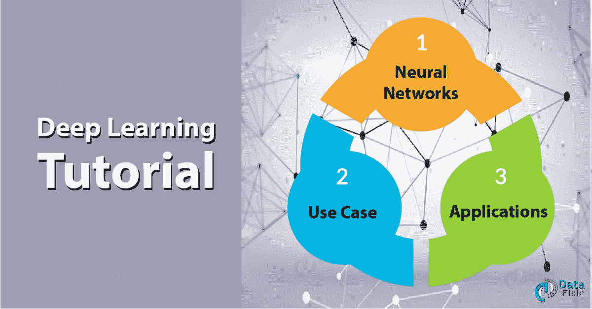
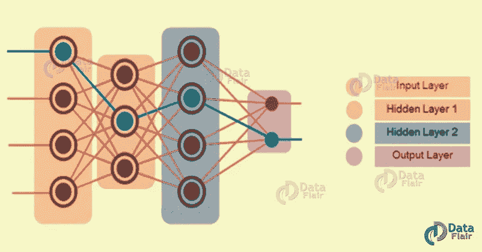
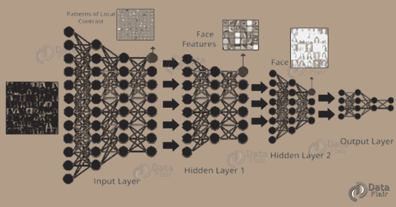

# 如果你想成为赢家，现在就改变你的深度学习理念吧！

> 原文：<https://medium.com/javarevisited/if-you-want-to-be-a-winner-change-your-deep-learning-philosophy-now-cd2f3e91e7a1?source=collection_archive---------0----------------------->

[机器学习](https://data-flair.training/blogs/machine-learning-tutorial/)只专注于解决现实世界的问题。同样，它需要一些关于人工智能的想法。此外，机器学习通过神经网络做到了。旨在模仿人类的决策能力。

机器学习工具和技术是两个关键的狭窄子集。只会更加关注深度学习。此外，我们需要应用它来解决任何问题。这需要思考——人类的或人工的。

任何深度神经网络都将由三种类型的层组成:

*   输入层
*   隐藏层
*   输出层

**1。输入层**

它接收所有的输入，最后一层是输出层，提供所需的输出。

**2。隐藏图层**

这些层之间的所有层称为隐藏层。可以有 n 个隐藏层。隐藏层和每层中的感知器将取决于您试图解决的用例。

**3。输出层**

它提供所需的输出。

看看[顶级机器学习软件](https://data-flair.training/blogs/machine-learning-software/)

为了向计算机系统输入大量数据，我们使用深度学习。然后，系统使用这些数据对其他数据做出决定。这种数据输入是通过神经网络进行的。

此外，深度学习至关重要，因为它专注于开发这些网络。因此，它们被称为深度神经网络。

# 什么是神经网络？

*   这是一个美丽的生物编程范例。也使计算机能够从观察数据中学习。
*   此外，它还为许多问题提供了最佳解决方案。即图像识别、语音识别和自然语言处理。

# 用例

这里，在这个用例中，我们将高维数据传递到输入层。

*   为了匹配输入数据的维度，将需要输入图层。这包含了感知的多个子层，因此它可以消耗整个输入。
*   输入层将包含从输出接收的模式。此外，它还能够根据对比度识别图像的边缘
*   该输出将被馈送到隐藏层 1。在这一层，它将能够识别各种面部特征，如眼睛，鼻子，耳朵等。
*   现在，这将被馈送到隐藏层 2，在那里它将能够形成整个面。然后，第 2 层的输出被发送到输出层。
*   最后，输出层执行分类。这是基于从先前获得的结果并预测名称。

阅读更多关于[你必须知道的 20 个深度学习术语](https://data-flair.training/blogs/deep-learning-terminologies/)

# 应用程序

我们来讨论一些深度学习的应用。

## a.自动驾驶汽车的导航

虽然现在抓到有人边开车边看报纸还为时过早，但这是将来的事。为了识别汽车学习的障碍，我们可以使用传感器和车内分析。并使用深度学习对它们做出适当的反应。

## b.回忆黑白图像

这时候就需要计算机来识别物体了。此外，还要了解它们在人类看来应该是什么样子。基本上，计算机可以被用来学习返回颜色。此外，它需要返回黑白图片和视频。

看到彩色的德夫达斯(1955)会不会很神奇？

## c.预测法律诉讼的结果

英美研究人员开发了一个系统。他们用这个系统来预测法院的判决。

## d.精确医学

我们使用深度学习来开发药物。此外，这些基因是根据个人的基因组定制的。

## e.自动化分析和报告

我们太感谢深度学习技术了。正如我们看到的，系统现在可以分析数据。此外，报告其自然声音和人类语言的见解。

## f.产前护理

我们使用图像识别和[深度学习](https://dev.to/javinpaul/10-data-science-and-machine-learning-courses-for-programmers-looking-to-switch-career-57kd)技术来解读标志。此外，这项技术也被英国和澳大利亚的研究人员使用。还有，指导术前策略。

## g.天气预报和事件检测

因此，计算流体动力学代码与神经网络相匹配。此外，其他遗传[算法](https://dev.to/javinpaul/10-data-structure-algorithms-sql-and-java-courses-to-crack-any-programming-job-interview-11f6)方法检测气旋活动。

## h.金融

通常，我们使用流行的技术指标来产生买入和卖出信号。这是针对每只股票和股票组合的。

## 一.自动机器翻译

深度学习在以下领域取得了惊人的成果:

1.  文本自动翻译
2.  图像的自动翻译

我们使用卷积神经网络来识别图像。有字母和字母在场景中的位置。了解更多[机器学习的应用](https://data-flair.training/blogs/machine-learning-applications/)。

这就是深度学习教程。希望你喜欢我们的解释。

# 结论

我希望这个博客能帮助你在现实生活中理解深度学习的概念。此外，如果你有任何疑问，请在评论区提问。

**相关文章-**

[机器学习中快速学习 XGBoost 的方法？](/p/84a0b6b5b896?source=post_stats_page---------------------------)
[神经网络学习规则简易指南](/p/7e4fb3111428?source=post_stats_page---------------------------)
[机器学习 by 吴恩达](https://click.linksynergy.com/deeplink?id=JVFxdTr9V80&mid=40328&murl=https%3A%2F%2Fwww.coursera.org%2Flearn%2Fmachine-learning)
[AI For Every One](https://click.linksynergy.com/deeplink?id=JVFxdTr9V80&mid=40328&murl=https%3A%2F%2Fwww.coursera.org%2Flearn%2Fai-for-everyone)by[吴恩达](https://medium.com/u/592ce2a67248?source=post_page-----cd2f3e91e7a1--------------------------------)
[Top 8 Python 机器学习库](https://javarevisited.blogspot.com/2018/10/top-8-python-libraries-for-data-science-machine-learning.html)
[5 门免费课程学习机器学习 R 编程](http://www.java67.com/2018/09/top-5-free-R-programming-courses-for-Data-Science-Machine-Learning-Programmers.html)
[2018 年 5 门免费课程学习 Python](http://www.java67.com/2018/02/5-free-python-online-courses-for-beginners.html)
[Top 5 数据科学与机器学习课程 TensorFlow 和机器学习课程](https://hackernoon.com/top-5-data-science-and-machine-learning-course-for-programmers-e724cfb9940a)
[2018 年程序员可以学习的 10 项技术](http://www.java67.com/2018/01/top-10-web-mobile-and-big-data-framework-libraries-technologies-programmers-should-learn-in-2018.html)
[更好地学习 Python 的前 5 门课程](http://javarevisited.blogspot.sg/2018/03/top-5-courses-to-learn-python-in-2018.html)
[一个日本黄瓜农如何利用深度学习和 TensorFlow](https://cloud.google.com/blog/products/gcp/how-a-japanese-cucumber-farmer-is-using-deep-learning-and-tensorflow)

**P. S.** — —如果你需要一些免费的资源开始，你可以查看这个免费的课程 [***学习机器学习算法、软件、深度学习***](http://bit.ly/2DNKMdZ) 开始你的准备。