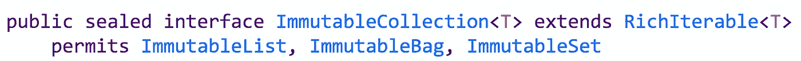
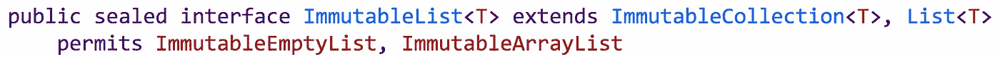
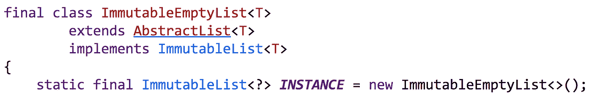
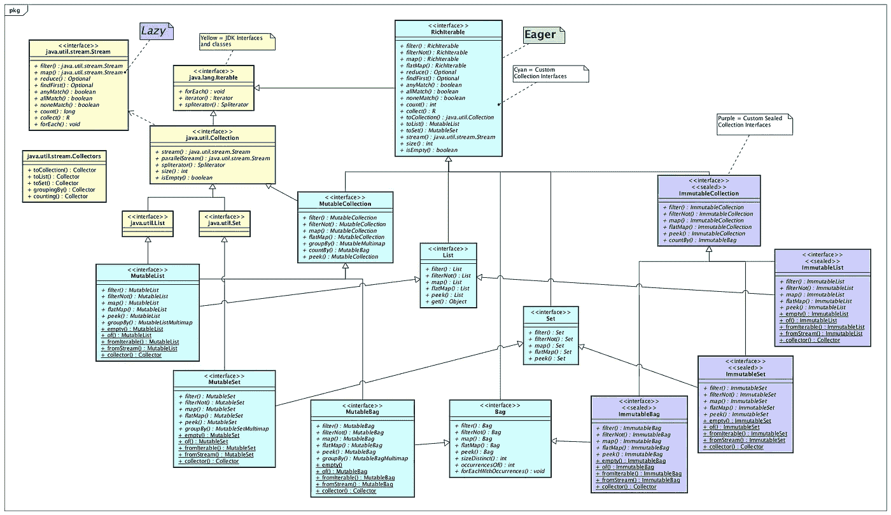

# 使用密封类型的 Java 不可变集合

> 原文：<https://medium.com/javarevisited/immutable-collections-in-java-using-sealed-types-ae8eb580fc1e?source=collection_archive---------0----------------------->

如何定义约定的、结构化的、可验证的不可变 Java 集合？

在 JDK 15 中使用密封类型设计不可变集合

# 引入密封类型

JDK 15 号于 2020 年 9 月 15 日发布。 [JEP 360](https://openjdk.java.net/jeps/360) 密封类型作为预览功能包含在此版本中。密封类型是琥珀项目[的一部分。密封类或接口可用于限制允许扩展它们的接口或类。这是通过使用`sealed`、`non-sealed`和`permits`修改器完成的。](https://openjdk.java.net/projects/amber/)

# 什么是契约不变性？

如果可用的公共方法不允许实例在构造后发生变化，则接口或类在契约上是不可变的。一个契约式的[不可变集合](https://javarevisited.blogspot.com/2018/02/java-9-example-factory-methods-for-collections-immutable-list-set-map.html)不应该公开类似`add`、`addAll`、`remove`、`removeAll`、`clear`和可变`Iterator`的方法。这些方法在 Java 中的`Collection`、`List`和`Set`类型上可用。实现这些接口的不可变集合不是契约不可变的。

# 什么是结构不变性？

如果一个对象的所有数据成员都是 [private](https://javarevisited.blogspot.com/2012/10/difference-between-private-protected-public-package-access-java.html#axzz6JDcu0RhH) 、 [final](https://javarevisited.blogspot.com/2016/09/21-java-final-modifier-keyword-interview-questions-answers.html) ，那么这个对象在结构上就是不可变的，并且在对象被构造之后不能被修改。`String`是 Java 中结构不变的类的一个很好的例子。一旦构造了一个`String`，它就不能被改变。像`String`这样的不可变对象有时会有像`StringBuilder`这样的可变对应物。

# 什么是可验证的不变性？

如果所有的实现在契约上和结构上都是不可变的，并且被限制在一组特定的可以被验证的类中，那么这个类或接口就是可验证的不可变的。这是一个功能，现在可以通过 JDK 15 中的密封类型更容易地实现。使用密封类型，开发人员可以将接口和类的实现限制为一组指定的类型。

# Java 中密封类型的完美用例

Java 的不可变集合实现在 Java 集合框架(从 JDK 9 开始)、Google Guava 和 Eclipse 集合中可用。如今，没有一个不可变集合替代方案提供了*结构*、*契约*和*可验证*不变性的组合。

## Java 9+版本

通过`List.of()`、`Set.of()`、`Map.of()`，在 Java 集合框架中有*结构上的*不可变集合可用。JDK 不可变集合在合同上不是不可变的，因为它们实现了可变的接口。

## 谷歌番石榴

番石榴的集合类型在结构上*是不可变的，但在契约上*不是不可变的。Guava 中的不可变集合实现了可变的 JDK 接口— `List`、`Set`、`Map`。Guava 通过使用带有`package`私有构造函数的`abstract`类来限制不可变集合类型的实现，这要求所有实现都在同一个包中。这种限制是一种新颖的设计方法，也是*可验证*不变性的关键组成部分，但仍然缺乏*契约*不变性。**

## Eclipse 集合

[Eclipse 集合](https://github.com/eclipse/eclipse-collections)具有契约上*和结构上*不可变的集合类型。不幸的是，Java 8 中没有办法限制像`ImmutableCollection`、`ImmutableList`、`ImmutableSet`这样的接口的实现，从而提供*可验证的*不变性。可以在 Eclipse 集合之外实现`ImmutableCollection`接口及其子类型，因为它们是公共接口。从理论上讲，一个“坏角色”可能会实现`ImmutableCollection`接口，并将一个可变的实现传递给一个期望有`ImmutableCollection`的方法调用。在实践中，这可能是个问题，但这种可能性确实存在。**

## 密封类型

JDK 15 中的密封类型预览版使开发人员能够最终在集合框架中提供三重功能:T21、契约性、结构性、可验证性和不变性。使用密封类型预览特性，我们可以使用`sealed`和`permits`修饰符来限制`ImmutableCollection`接口的实现。

类似地，我们可以限制`ImmutableList`的实现。

然后将`ImmutableList`的`ImmutableEmptyList`实现声明为`final`。

在 JDK 15 号进行密封类型的实验很有趣，也很令人鼓舞。我希望十年前我们第一次在 Eclipse 集合中定义 ImmutableCollection 层次结构时就有这个特性。我已经能够扩展我们几年前在 Eclipse 集合中实现的设计思想，用一个特性提供更具限制性的建模能力。

## 纸牌卡塔:定制收藏

一个集合框架的实验性实现的源代码可以在[卡牌卡塔回购](https://github.com/BNYMellon/CodeKatas/tree/master/deck-of-cards-kata)中找到。这套卡形可以用来熟悉多种集合框架，包括最新版本的 [Java 集合+流框架](/javarevisited/7-best-java-collections-and-stream-api-courses-for-beginners-in-2020-3ad18d52c38)，Apache Commons 集合，Google Guava 和 Eclipse 集合。

定制集合框架接口和实现可以在线浏览[这里](https://github.com/BNYMellon/CodeKatas/tree/master/deck-of-cards-kata/src/main/java/bnymellon/codekatas/deckofcards/custom/collections)。下面的类图显示了框架中的接口，包括利用密封类型的不可变集合接口。

扑克牌中的自定义收藏框架

kata 中的实验收藏框架已经发展到使用[琥珀项目](https://openjdk.java.net/projects/amber/)的特性，因为它们在 JDK 中可以作为预览特性使用。卡塔在发行当天就升级到了 JDK 15。该框架现在使用 Amber 项目的以下功能:

*   局部变量式推理( [JEP 286](https://openjdk.java.net/jeps/286) )
*   实例的模式匹配( [JEP 375](https://openjdk.java.net/jeps/375) )
*   密封类型( [JEP 360](https://openjdk.java.net/jeps/360) )

此外，默认方法和静态接口方法被广泛用于构建框架中的丰富接口。

# 对 Java 集合未来的展望

定制集合框架最初的开发是为了探索和演示使用类似于 [Java Streams](https://javarevisited.blogspot.com/2018/08/top-5-java-8-courses-to-learn-online.html) 的 API 名称在可变集合接口上直接拥有 eager 方法会是什么样子。

其目的是使用 Java 最新版本中被证明有用的最新特性。最新的发展显示了利用密封类型实现不可变集合类型的可能性。到目前为止，这个专题的结果让我很受鼓舞。我希望这个用例可以作为密封类型特性实际应用的一个例子来使用和讨论。

以下博客解释了定制集合框架设计在过去六个月中的演变。

 [## Java 流很棒，但现在是更好的 Java 集合的时候了

### 25 年后，Java 是时候进行集合升级了。

medium.com](/javarevisited/java-streams-are-great-but-its-time-for-better-java-collections-42d2c04235d1)  [## 渴望是容易的，懒惰是迷宫

### 从初始化到迭代，学渴望比学懒惰容易。

medium.com](/javarevisited/eager-is-easy-lazy-is-labyrinthine-b12605f13048) 

我希望你觉得这个博客有用。检查源代码，并尝试回购中包含的卡片组和其他代码。

尽情享受吧！

*我是*[*Eclipse Collections*](https://github.com/eclipse/eclipse-collections)*OSS 项目在*[*Eclipse Foundation*](https://projects.eclipse.org/projects/technology.collections)*的项目负责人。* [*月食收藏*](https://github.com/eclipse/eclipse-collections) *是开投* [*投稿*](https://github.com/eclipse/eclipse-collections/blob/master/CONTRIBUTING.md) *。如果你喜欢这个库，你可以在 GitHub 上让我们知道。*