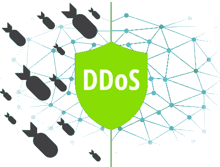
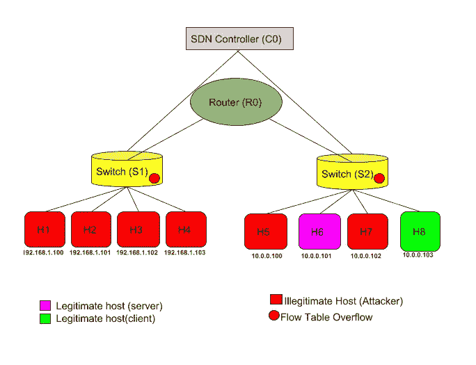
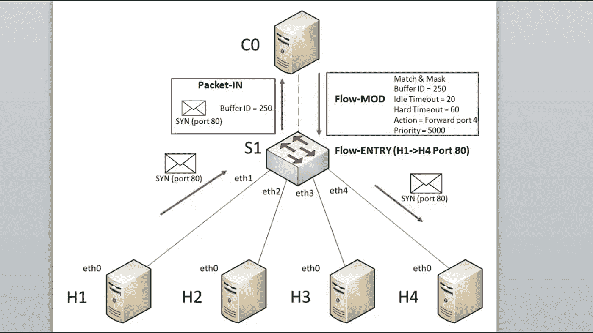

# 通过仿真评估 DDoS 攻击对 SDN 的影响

> 原文：<https://medium.com/javarevisited/impact-of-ddos-attack-in-sdn-through-simulation-b2012638ed73?source=collection_archive---------3----------------------->

2018 年 9 月 12 日 16 时 12 分 15 秒

> **简介:**

在软件定义的网络中，控制平面(控制器)和数据
平面(交换机)是分离的。它支持开放、可扩展、安全和可编程的网络基础设施。Openflow 协议在两个平面之间建立通信。控制器可以查看整个网络，交换机具有用于流条目的流表。

控制器是集中的，并为开关提供流量表。每当有新的数据包到达并且流表条目不匹配时，该数据包就被发送到控制器进行处理。流表的大小是有限的，这导致了可扩展性问题，从而导致 DDoS 攻击中的严重安全问题。现在，攻击者可以生成欺骗数据包并将其发送到主机。这使中央控制器过载。因此，表溢出，新规则的安装被拒绝，导致数据包丢失或延迟(DDoS)。

使用 Mininet 和 Pox 模拟流表溢出攻击。根据延迟和带宽分析其效果
。

> **高层设计及其说明:**

有一个 SDN 控制器(C0)(可以查看整个网络)。两个开关
(S1，S2)连接到它。S1 通过路由器(R0)连接到 S2。每台交换机都连接有四台主机。总共有 8 台主机(H1 到 H8)。

图 1-高级设计

H6(服务器)，H8(客户端)是合法的主机。
H1、H2、H3、H4、H5、H7 都是非法宿主。

非法主机开始淹没交换机的流表，结果，
H6 和 H8 之间的通信受到不利影响。

> **Openflow 流程表:**

每当流表中有缺失时，交换机通过发送数据包输入消息向
控制器询问信息。它包括整个分组(通过提及缓冲器 ID)或分组的一部分。然后，控制器回复一个分组输出消息，该消息是流表中的一个条目。

> **流程表的组成部分:**

I)规则匹配模式部分(IP 地址、MAC 地址、端口号
等)

ii)相关动作:
1)转发数据包(特定输出端口或所有输出端口)
2)丢弃数据包
3)修改数据包报头

iii)统计:
规则被使用的次数

图 2-流表如何获得它的流条目

> **流程条目超时:**

基于两个因素来刷新流表中的流条目。
**空闲超时:**

如果流条目在给定的秒数(n)内没有被匹配(使用)，
那么它将在 n 秒后被清除。

**硬超时:**

在给定的
秒(n)后，流条目被自动清除，而不管其使用情况如何。我们使用 Pox 控制器，我们可以在其中修改超时值。

> **流量表条目内容:**

1)in _ port 2)eth _ src 3)eth _ dst 4)eth _ type
5)VLAN _ vid 6)VLAN _ PCP 7)IP _ src 8)IP _ dst
9)NW _ proto 10)NW _ tos 11)TCP _ src 12)TCP _ ds

> **淹没流量表:**

1)在无限循环中生成大量数据包
2)置换源和目的 IP 地址
3)置换源和目的端口

这里，我们通过置换源端口和目的端口来生成欺骗数据包。

> **泛滥的后果:**

每个交换机都有数量有限的流表条目。如果洪泛发生，
新规则无法安装(拒绝服务)，导致数据包丢失。

> **实验:**

**欺骗数据包生成逻辑:**
我们有五个随机源端口和二十个随机目的地
端口。这里，每 0.1 秒生成一个数据包。每台主机每秒大约生成 1000 个数据包。

**如何计算每秒生成的欺骗数据包数量:**

> **Packet _ Count = N * S _ P * D _ P**

N — ->攻击主机数量
S_P — - >源端口数
D_P — - >目的端口数
这里每秒产生 6000 个欺骗数据包。它可以通过
增加源端口和目的端口以及减少数据包生成的时间间隔来增强。

> **淹没逻辑:**

默认流表大小为 1000000。我们把它减到 100。

由于溢流，流量表很快达到其极限(100)并导致
溢出。由于欺骗数据包会不断生成，而交换机没有与之匹配的规则，因此每次交换机都会将其转发给控制器，并且它会一直被占用(资源攻击)。

> **延迟和带宽实验:**

1)启用 Pox 控制器并运行 Python 代码来设置拓扑。
2)将建立前述拓扑。在 H6 和 H8 之间执行 ping 命令。ICMP 数据包将从 H6 发送到 H8。第一个数据包将花费 21 毫秒
秒，其余数据包将花费 0.0535 毫秒(平均)到达目标
。

5)现在，在剩余的主机上运行攻击者代码。因此，所用的时间将乘以一个巨大的因子(平均时间为 12700 毫秒)并且
最终将会有数据包丢失。它会导致
带宽显著降低。

> **分析:**

根据攻击主机的数量和流条目的超时，
影响成比例地变化。影响与流表大小成反比。

> **结论:**

控制器和流表是 SDN 的重要组成部分。所以它非常容易受到攻击。超时值越大，攻击的可能性就越高。对流表的攻击会严重影响 SDN 的性能。应研究如何减轻此类攻击，超时时间应尽可能短。

> **参考文献:**

1)、游、钱凯，“Openflow 流表溢出
攻击及对策”，IEEE