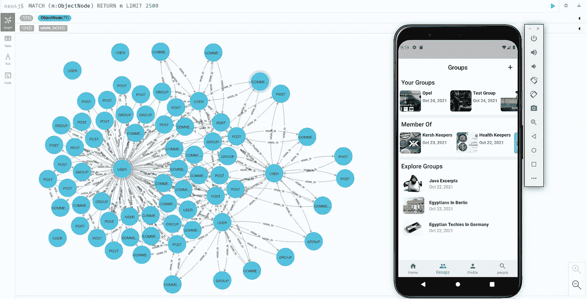

# 用 Spring 和 Neo4j 实现脸书社交图

> 原文：<https://medium.com/javarevisited/implementing-facebook-social-graph-using-spring-and-neo4j-81c1b67351b7?source=collection_archive---------0----------------------->

图是一种数据结构，它允许表示一组节点以及将这些节点链接在一起的关系。对于脸书，我们可以把节点想象成用户、组、页面、文章和评论。边缘可以是朋友，比如，评论和加入。

脸书把节点称为对象，把关系称为关联。