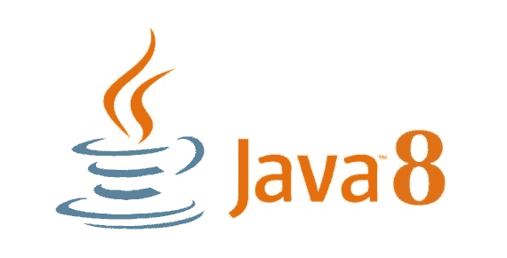

# Java 8 的重要特性

> 原文：<https://medium.com/javarevisited/important-java-8-features-e52c8d8e8662?source=collection_archive---------2----------------------->



Java 8 于 2014 年 3 月 18 日发布。对于软件开发平台来说，这是一个革命性的版本，对 Java 编程、JVM、工具和库进行了各种增强。以下是 Java 8 的一些重要且有用的特性:

## **功能接口:**

函数接口是 Java 8 中引入的新概念。只有一个抽象方法的接口成为函数接口，但是，它可以有任意数量的默认或静态方法，它也可以声明一个对象类的方法(例如:toString())。

我们不需要使用 [@functionalInterface 注释](https://javarevisited.blogspot.com/2018/01/what-is-functional-interface-in-java-8.html)来将一个接口标记为函数接口，但是这个注释是一个避免在函数接口中意外添加[抽象方法](https://www.java67.com/2017/07/can-you-make-abstract-class-method-final-in-java.html)的工具。`**java.lang.Runnable**`用单一抽象方法 run()是函数接口的一个很好的例子。λ表达式可以用来表示函数接口的实例

## **1。λ表达式:**

Lambda 表达式提供了一种精确的方法，通过使用表达式来实现单一抽象方法(函数接口)。由于函数接口只有一个方法， [lambda 表达式](https://www.java67.com/2020/03/how-to-write-clean-code-using-java-8.html)可以很容易地提供方法实现，我们只需要提供方法参数和业务逻辑。它在集合库中也非常有用，可以帮助迭代，[过滤](https://www.java67.com/2016/08/java-8-stream-filter-method-example.html)和提取数据。

例如，以下面实现 runnable 接口的代码为例

```
**Runnable r = new Runnable(){
@Override 
public void run() { 
System.out.println(“My Runnable”); 
}};**
```

*用*[*λ表达式*](https://javarevisited.blogspot.com/2014/02/10-example-of-lambda-expressions-in-java8.html#axzz6ieZZarMY) *，上面的代码可以缩短为仅仅单行:*

```
**Runnable r1 = () -> { System.out.println(“My Runnable”); };**
```

*Lambda 表达式被视为一个函数，因此编译器不会单独创建一个. class 文件。*

## **2。方法参考**

[方法引用](https://javarevisited.blogspot.com/2017/03/what-is-method-references-in-java-8-example.html)帮助我们通过方法的名字来指向它们。使用 **::** 符号描述，可以用于静态或实例方法，也可以用于使用 new 运算符的构造函数，如 **TreeSet::new** 。方法引用是调用方法的 lambda 表达式的简写符号。

```
**str -> System.out.println(str)**
```

你可以[用类似 *System.out::println* 的方法引用](https://javarevisited.blogspot.com/2017/08/how-to-convert-lambda-expression-to-method-reference-in-java8-example.html#axzz5gKl3DykI)替换上面的 lambda 表达式。

示例:

```
**public class Abc {
public static void thrd(){
System.out.println(“Thread is running !”);
}
public static void main(String[] args) {
Thread t2=new Thread(Abc::thrd);
t2.start(); }}**
```

## **3。forEach:**

Java 8 提供了一个新方法 [forEach()](https://www.java67.com/2016/01/how-to-use-foreach-method-in-java-8-examples.html) 来迭代集合和流。它在 Iterable 和 Stream 接口中定义。
每当我们需要遍历一个集合时，我们需要创建一个 [**迭代器**](https://www.java67.com/2013/02/java-iterator-example.html) ，在这个过程中，如果迭代器使用不当，我们可能会得到[ConcurrentModificationException](https://www.java67.com/2015/10/how-to-solve-concurrentmodificationexception-in-java-arraylist.html)。

扩展 Iterable 接口的集合类可以使用 forEach()方法来迭代元素。该方法采用单个参数，该参数是一个函数接口。所以，我们可以通过一个[λ表达式](/javarevisited/7-best-java-tutorials-and-books-to-learn-lambda-expression-and-stream-api-and-other-features-3083e6038e14?source=---------14------------------)作为自变量。
例如:

```
**public static void main(String[] args) {
 List<String> list= new ArrayList<String>();
 list.add(“Apple”);
 list.add(“Orange”);
 list.add(“Banana”);
//lambda expression in forEach Method 
 list.forEach(str->System.out.println(str));
//above line can also be written using method reference as
 list.forEach(System.out::println));
}**
```

## **4。流 API**

Stream 是 Java 8 中引入的抽象层。有了流，我们可以像 Sql 语句一样以声明的方式处理数据。它表示来自支持集合函数的源的对象序列。流 API 将允许顺序和并行执行。

集合接口已经用 ***stream()*** 和 ***parallelStream()*** 默认方法进行了扩展，以获得用于顺序和并行执行的流。我们可以使用流来[过滤、收集、打印、](/javarevisited/how-to-use-streams-map-filter-and-collect-methods-in-java-1e13609a318b)以及从一个[数据结构](/javarevisited/top-10-free-data-structure-and-algorithms-courses-for-beginners-best-of-lot-ad807cc55f7a)转换到另一个数据结构，等等。

流在本质上是功能性的。对流执行的操作不会修改它的源。例如，[过滤从集合中获得的流](https://javarevisited.blogspot.com/2018/05/java-8-filter-map-collect-stream-example.html#axzz5gKl4TfLR)会产生一个没有过滤元素的新流，而不是从源集合中删除元素。

与需要显式迭代的集合相比，流操作在内部对源元素进行迭代。
流过滤器示例:

```
**public static void main(String[] args) { 
 List<Product> products = new ArrayList<Product>(); 
 //Adding Products 
 products.add(new Product(1,”Fruits”,20000f)); 
 products.add(new Product(2,”Vehicle”,33000f)); 
 products.add(new Product(3,”Household”,25000f)); 

 List<Float> priceList =products.stream() 
  .filter(p -> p.price > 30000) // filtering data 
  .map(p->p.price)              // fetching price 
  .collect(Collectors.toList()); // collecting as list 
  System.out.println(priceList); // will print [33000.0]
 }**
```

更多例子和 Java 8 Stream API 支持的所有方法可以查看[这个](https://www.java2novice.com/java-8/streams/map-method-example/)。

**5。接口** 中的默认和静态方法 Java 8 允许接口拥有[默认](https://www.java67.com/2017/08/java-8-default-methods-faq-frequently-questions-answers.html)和[静态方法](https://www.java67.com/2019/02/can-you-add-non-abstract-method-on-interface-in-java.html)。在接口中使用默认方法的原因是允许开发人员在不影响实现这些接口的类的情况下向接口添加新方法，这使得接口向后兼容。

向后兼容性是在不破坏旧代码的情况下添加新功能。

接口中的静态方法类似于默认方法，除了我们不能在实现这些接口的类中覆盖这些方法。

```
**interface ParentInt{  
    default void defaultMet(){  
        System.out.println("default method");  
    }  
    static void staticMet(){
     System.out.println("static method");
    }
    void existingMet(String str);  
}  
public class child implements ParentInt{ 

    public void existingMet(String str){           
        System.out.println("String is: "+str);  
    }  
    public static void main(String[] args) {  
     Example obj = new Example();

     //calling the default method of interface
        obj.defaultMet();     
        //calling the static method of interface
        ParentInt.staticMet();
        //calling the abstract method of interface
        obj.existingMet("Java 8 Features "); 
    }  
}**
```

输出:

```
**default method
static method
String is: Java 8 Features**
```

## 6。Base64 编解码:

Java 8 中引入的另一个特性是 [Base64 编码](https://javarevisited.blogspot.com/2016/10/base64-encoding-example-in-java-8.html#axzz5HKrGFmPU)和[解码](https://javarevisited.blogspot.com/2012/02/how-to-encode-decode-string-in-java.html#axzz54LFhfNxy)。它提供了一个 Base64 类来处理加密和解密。我们需要在源文件中导入 java.util.Base64 类来使用它的方法。
在 Java 8 之前，我们需要添加外部 jar，如 Apache Commons `Codec’s Base64.encodeBase64(byte[])` 和 Base64.decodeBase64(byte[])，如这里的[所示](http://javarevisited.blogspot.sg/2012/02/how-to-encode-decode-string-in-java.html)，或者 Sun 的内部 Base64 编码器和解码器 sun.misc.BASE64Encoder()。encode()和 sun.misc.BASE64Decoder()。解码()

以上是 Java 8 中引入的一些重要特性。希望你觉得有用。

谢谢！！:)