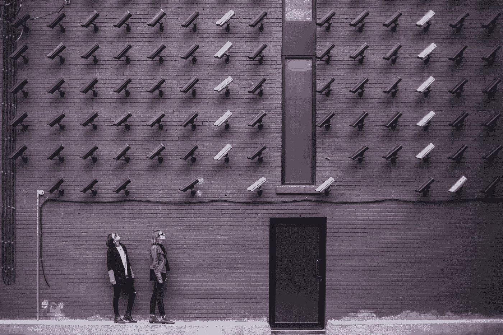

# OpenCV 的重要库

> 原文：<https://medium.com/javarevisited/important-libraries-of-opencv-56b14705bf0e?source=collection_archive---------1----------------------->

## 关于 OpenCV 的工作和学习将会非常好。

OpenCV 是一个**跨平台库**，用于开发实时计算机视觉应用。OpenCV 主要致力于图像处理、视频捕获和分析，包括人脸检测和物体检测。

要在 java 中使用 OpenCV，程序员应该先了解一下 [Java 编程语言](/javarevisited/top-5-java-online-courses-for-beginners-best-of-lot-1e1e240a758)和用于 GUI 的 [JavaFX](https://javarevisited.blogspot.com/2020/06/top-5-courses-to-learn-java-fx-in-2020.html) 。

## OpenCV 库有很多特性，如下:

1.  读写图像。
2.  捕捉和保存图像。
3.  图像处理。
4.  执行特征检测。

还有很多。

## OpenCV 可用于许多领域，如:

## 医学应用。

分类和检测可用于细胞分类和肿瘤检测。

## 安全应用。

在监视程序检测可疑活动时非常有用。生物计量，如人脸检测、虹膜、眼睛和指纹。

## 工业自动化应用。

条形码和包装标签读取。OCR，即**用于文件理解的光学字符识别**。OCR 主要用于将打字文本、手写或印刷文本的图像电子或手动转换成机器编码文本。

## 机器人应用

导航、避障、焊接、喷漆等装配工作。

自动确定机器人位置。人类机器人互动。

## OpenCV 的一些重要且常用的模块是:

## 1.org。OpenCV.core

这个包包含了库的核心信息。

在这个模块中，基本的数据结构如点、标量等。被使用。多维数组 Mat 也用于存储图像。

## 2.org。OpenCV.imgproc

这个包包含了图像处理功能或方法的库。

这将有助于执行图像过滤、色彩空间转换、直方图、几何图像变换等操作。

## 3.org。OpenCV.video

这个包包含了图书馆的视频分析方法。

该模块将有助于视频分析，如运动估计，背景减除和目标跟踪。

## 4.org。OpenCV .视频

这个包包含了视频捕获和视频编解码方法的库。

该类提供了用于捕获视频或读取视频文件和图像序列的方法。

视频文件本身就是一个容器，编解码器有助于确定容器的类型。因为容器的类型在文件扩展名中表示。容器是由视频饲料，音频饲料或其他轨道文件如字幕。

对于音频馈送，使用的编解码器是 *mp3 或 acc* 。对于视频馈送，常用的编解码器有 *H264、XVID、DIVX 等*。

## 5.org。OpenCV.imgcodecs

这个包对读取和写入图像很有用。

有一个 ***read()*** 的方法，用来使用 [OpenCV](https://www.java67.com/2020/07/top-5-courses-to-learn-computer-vision-opencv-python.html) 读取一个图像。

*即 imread(文件名)；*

有一个 ***write()*** 方法，用来将一个图像文件保存到指定的文件夹中。

**要在 java IDE 中使用 OpenCV，您必须相应地配置您的系统。**

**查看本文下载、安装和配置 IDE。请点击下面的链接..**

[*https://medium . com/@ prithvidevkanojia 1/setting-up-opencv-for-Java-44c 6 EB 6 AE 7 e 1*](/@prithvidevkanojia1/setting-up-opencv-for-java-44c6eb6ae7e1)