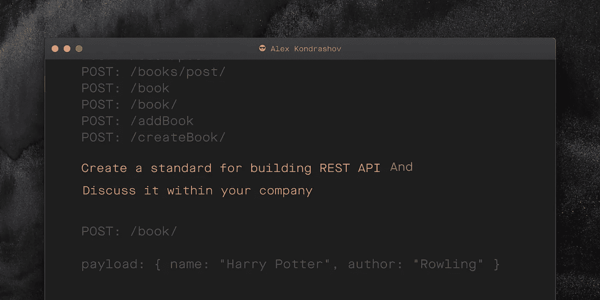

# 按照这个简单的步骤改进您的 API 设计——第 2 部分

> 原文：<https://medium.com/javarevisited/improve-your-api-design-by-following-this-simple-step-part-2-8d92bd6991e0?source=collection_archive---------1----------------------->



我的部门经历了从 5 名到 25 名软件工程师的转变。随着越来越多的开发人员加入公司，团队的数量也在增加。这带来了许多挑战，包括跨不同团队构建一致的 REST API。我们一起制作了一个 **REST 资源命名指南**来消除团队内部的混乱和不确定性。

# REST 资源命名指南

理想情况下，所有的设计决策都应该被记录下来，并作为公司内部的常识。在我的[上一篇文章](/@kondrashov/what-is-the-best-name-for-your-rest-api-get-endpoint-878ace7606cd)中，我们为 GET endpoint 想出了一个好名字。我们还记录了我们的决策过程。我们称之为 REST 资源命名指南。到目前为止，它由两条规则组成:

> *1。所有休止符端点的末尾都应该有斜杠*
> 
> *2。所有的 REST 端点在名称中应该有单数形式的名词*

我建议在本文中进一步扩展这个指南。

## 例子

让我们从[上一篇文章](/@kondrashov/what-is-the-best-name-for-your-rest-api-get-endpoint-878ace7606cd)来看看书店 web 应用程序。我们需要能够通过 REST API 创建书籍。因此，我们希望为 POST 端点定义一个好的名称。我们将集体讨论 POST 端点的所有可能的名称，然后我们将改进这个列表。

## 集体讨论发布端点的所有可能名称

在集思广益为我们的帖子端点想出了所有可能的名称后，我想到了:

```
POST: /books/add
POST: /Books/add
POST: /Book/
POST: /Book
POST: /book/add
POST: /book/create/
POST: /books/create/
POST: /books
POST: /books/
POST: /book/post
POST: /books/post/
POST: /book
POST: /book/
POST: /addBook
POST: /createBook/
```

现在让我们细化这个列表。

## **使用我们的命名指南**过滤掉不良名称

为了从上面的列表中过滤掉错误的名称，我们应用了 REST 资源命名指南中的两条规则。这就是我们剩下的:

```
POST: /Book/
POST: /book/
```

正如我们所看到的，我们需要选择外壳。让我们想象一下，我们只希望在我们的端点小写。我们将在指南中添加一条新规则来记录这一决定。

> 3.所有 REST 端点都应该是小写的

添加这条规则后，我们可以选择获胜者。

```
POST: /book/payload: { name: "Harry Potter", author: "Rowling" }
```

## 补丁端点

通过我们的命名指南，我们可以轻松地提出补丁端点:

```
POST: /book/payload: { author: "J.K. Rowling" }// author is a property of the book
```

## 有效载荷

在图书的补丁请求的有效负载中，我们希望指定图书上存在的属性，如姓名和作者。将其他变量放入有效载荷会令人困惑。

```
POST: /book/payload: { pageNumbersToDelete: [1, 2, 3] }// *pageNumbersToDelete is not a property of the book*
```

## 结论

记录设计决策可能是一个非常好的实践。随着团队的成长，它可以帮助其他开发人员选择正确的命名，并消除设计 REST API 时的不确定性。文档可以有多种形式。我们在本文中讨论的形状之一——REST 资源命名指南。

**你可能喜欢的其他 REST 文章**

</javarevisited/why-spring-is-the-best-framework-for-developing-rest-apis-in-java-784590e484a4>  </javarevisited/how-to-perform-http-calls-using-spring-resttemplate-d29116cd4b5a> 