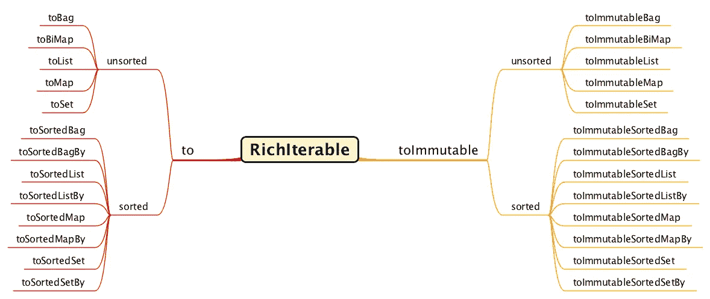

# 改进 Eclipse 集合中转换器方法的对称性

> 原文：<https://medium.com/javarevisited/improving-the-symmetry-of-converter-methods-in-eclipse-collections-922d74a3f065?source=collection_archive---------2----------------------->

由对称性驱动的 API 的一致性、清晰性和便利性


旧金山湾的一扇窗户

# 致力于 API 对称

我们通过响应和满足在金融服务和其他行业的应用程序中遇到的真实用例的需求，推动了 API 在 [Eclipse Collections](https://github.com/eclipse/eclipse-collections) 中的发展，这些应用程序是由开源社区的开发人员提供服务的。我们使用对称性来指导 Eclipse 集合的设计和实现。我们的集体经验告诉我们，对称是改进 API 设计的好向导。

# 可变转换器方法

从该产品的 1.0 版本开始，Eclipse 集合中就有了主要可变的[转换器方法](https://github.com/eclipse/eclipse-collections/blob/master/docs/guide.md#converting-collections)。


RichIterable 上大多数可变的转换器方法(toString 是一个不可变的异常)

除了可变的转换器方法，我们还有一个名为`toImmutable`的转换器方法，可以用来将任何可变的集合类型转换为不可变的集合类型。

让我们看看下面这个来自[卡式](https://github.com/BNYMellon/CodeKatas/tree/master/deck-of-cards-kata)的例子:

```
private ImmutableList<Card> cards;
private ImmutableListMultimap<Suit, Card> cardsBySuit;public EclipseCollectionsDeckOfCardsAsList()
{
    this.cards = Card.*lazyCards*().toList().toImmutable();
    this.cardsBySuit = this.cards.groupBy(Card::suit);
}
```

在这个例子中，我们需要从一个`LazyIterable<Card>`创建一个`ImmutableList<Card>`，它是`Rank`和`Suit`的笛卡尔积。我们首先调用`Card.lazyCards`，它返回一个`LazyIterable<Card>`。然后我们调用返回一个`MutableList<Card>`的`toList`，最后我们调用返回一个`ImmutableList<Card>`的`toImmutable`。

很长一段时间以来，我发现在 Eclipse 集合中从一种类型转换到另一种类型的不可变版本的两步过程是一个微小但持续的烦恼。我还必须向使用 Eclipse 集合的开发人员解释，没有名为`toImmutableList`、`toImmutableSet`、`toImmutableBag`等的等价方法。

这将在 Eclipse 集合 11.0 中改变。我们现在将能够编写以下代码。

```
public EclipseCollectionsDeckOfCardsAsImmutableList()
{
    this.cards = Card.*lazyCards*().toImmutableList();
    this.cardsBySuit = this.cards.groupBy(Card::suit);
}
```

在 Eclipse 集合 11.0 中，我们将在`RichIterable`上有`toImmutableList`、`toImmutableSet`和`toImmutableBag`。这只是通往更好的对称之旅的开始。

# 可视化转换器方法的对称性

下面是 Eclipse Collections converter 方法 API 将来的样子。



转换器方法 API 的未来对称性

到目前为止，我已经在`RichIterable`界面中添加了`toImmutableList`、`toImmutableSet`和`toImmutableBag`。上图向我们展示了一条清晰的路径，我们必须在`toImmutable`端遵循这条路径来改善转换器方法 API 的对称性。

# 走在路上

> 我喜欢说对称就像重力。当我看到缺失或不相似的图案时，我感觉到对称的重量。这是一项尚未完成的工作。

这是我的第一个媒体博客中的一段话，标题是[对称同情](https://donraab.medium.com/symmetric-sympathy-2c59d4541d60?source=friends_link&sk=8b4083e03ea4a56a993328fe63ab2951)。虽然在一个像 Eclipse 集合那样丰富完整的 API 中拥有完美的对称性可能不太现实，但是当我们发现缺乏清晰性、一致性和便利性时，我们可以继续改进。这是在走自己的路。满足 Eclipse 集合用户社区的需求和期望是很重要的。我见过开发人员试图在 Eclipse 集合中的类型上调用`toImmutableList`和`toImmutableSet`，并发现对于不可变类型没有与`to`(可变)方法等价的方法，这令人困惑。现在，他们一直在寻找的 API 将满足他们的期望。

请继续关注，对称性正在不断改善。

# 招聘广告

如果您想在这个改进之旅中帮助我们，请加入我们的开源贡献者社区。下面是一个很棒的博客，作者是一个决定走自己的路，并首次对 Eclipse 集合做出开源贡献的开发人员。

<https://mydeveloperplanet.com/2021/01/20/how-to-start-contributing-to-open-source/>  

这个博客记录了一个开发者成为开源贡献者的历程。当其他开发人员开始或继续他们自己的旅程时，它可能是一个灵感和参考。

*我是*[*Eclipse Collections*](https://github.com/eclipse/eclipse-collections)*OSS 项目在*[*Eclipse Foundation*](https://projects.eclipse.org/projects/technology.collections)*的项目负责人。* [*月食收藏*](https://github.com/eclipse/eclipse-collections) *是开投* [*投稿*](https://github.com/eclipse/eclipse-collections/blob/master/CONTRIBUTING.md) *。如果你喜欢这个库，你可以在 GitHub 上让我们知道。*

**你可能喜欢的其他 Java 文章**

</javarevisited/9-things-java-programmers-should-learn-in-2018-3f0b2207dfc4>  </javarevisited/5-essential-frameworks-every-java-developer-should-learn-6ed83315f1fb>  </javarevisited/50-java-collections-interview-questions-for-beginners-and-experienced-programmers-4d2c224cc5ab> 