# WSO2 上 OAuth 2.0 和 OIDC 的入站身份验证是🥷🏼

> 原文：<https://medium.com/javarevisited/inbound-authentication-with-oauth-2-0-and-oidc-on-wso2-is-55a197d270b4?source=collection_archive---------3----------------------->

OAuth 2.0 和 OIDC 是 WSO2 IS 的两种主要认证类型。简单来说，

*   OAuth 2.0 是一种协议，它控制对受保护资源(如 web 应用程序、本机应用程序或 API 服务)的访问授权。
*   OIDC 或 OpenID Connect 是一种建立在 OAuth 2.0 上的协议，有助于对用户进行身份验证并传递有关他们的信息。

在本文中，我们将看看这两者是如何在 WSO2 IS 5.11 中用于入站认证的。

## 理解术语

## OAuth 2.0

OAuth 2.0 是用于向客户端应用程序提供访问标准。如果我们希望以一种安全的方式授权访问我们的应用程序数据，那么我们希望使用 OAuth 2.0 协议。

OAuth 2.0 规范有四个重要的角色。

*   ***授权服务器*** —发布接入令牌的服务器。在这种情况下，WSO2 是授权服务器。
*   ***资源所有者*** —通常是应用程序的最终用户，他授予使用访问令牌访问资源服务器的权限。
*   ***客户端*** —向 WSO2 请求访问令牌的应用程序，然后将其传递给资源服务器。
*   ***资源服务器*** —接受访问令牌，并且必须验证其有效性。在这种情况下，这是您的应用程序。

其他重要术语有:

*   ***OAuth 2.0 grant***—用户给予客户端的授权。授权的例子是授权码和客户凭证。
*   ***访问令牌*** —授权服务器(WSO2 IS)为换取授权而颁发的令牌。
*   ***刷新令牌*** —可选令牌，如果访问令牌已经过期，则该令牌被交换为新的访问令牌。

通常的 OAuth 2.0 授权流如下所示

1.  客户端向资源所有者(通常是用户)请求授权。
2.  如果用户给予授权，客户机将授权传递给授权服务器(在本例中是 WSO2)
3.  如果授权有效，授权服务器返回一个访问令牌，可能还有一个刷新令牌。
4.  客户端现在使用该访问令牌来访问资源服务器。

[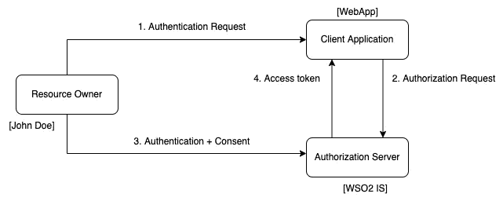](https://javarevisited.blogspot.com/2021/02/spring-security-interview-questions-answers-java.html)

OAuth 2.0 流程

## OpenID 连接

OpenID Connect 是建立在 OAuth 2.0 之上的认证标准。它添加了一个称为 ID 令牌的额外令牌。OpenID Connect 还标准化了 OAuth 2.0 留给用户选择的领域，比如作用域、端点发现和客户端的动态注册。

[](https://www.java67.com/2012/08/spring-interview-questions-answers.html)

OIDC 流

正如您在上图中所注意到的，与 OAuth 2.0 流程相比，OIDC 流程有两个基本的增加。第一个是由客户端应用程序随授权请求一起发送到授权服务器的范围。这里， ***openid*** 被添加到范围中以表示这是 OIDC 流。在接收时，授权服务器知道这是一个 OIDC 流，并在认证后发送一个 ID 令牌。这是一个包含用户信息的 JSON web 令牌。

## OAuth 授权类型

谈到 OAuth，最重要的术语之一是授权类型。授权类型基本上意味着您的应用程序获得访问令牌的一种方式。OAuth 2.0 有一些不同类型的授权类型，扩展也能够定义新的授权类型。WSO2 IS 中使用的 OAuth 授权类型如下所述。

**授权码授予**

这里，客户端应用程序将资源所有者指向授权服务器(WSO2 IS ),以直接从资源所有者那里获得授权。则资源所有者被重定向回具有授权码的客户端应用程序，该授权码将被客户端应用程序获取并在后台被提交用于访问令牌。

[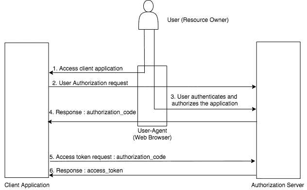](https://javarevisited.blogspot.com/2017/06/3-best-spring-security-online-training-courses-java-programmers.html)

获取授权码的 URL 如下所示。

```
https://localhost:9443/oauth2/authorize?response_type=code&client_id=<CLIENT_ID>&redirect_uri=<REDIRECT_URI>
```

之后，使用下面的 [cURL 命令](https://javarevisited.blogspot.com/2017/03/10-examples-of-curl-command-in-unix-and-Linux.html)我们可以获得访问令牌。

```
curl -v -X POST --basic -u <CLIENT_ID>:<CLIENT_SECRET> -H "Content-Type:application/x-www-form-urlencoded;charset=UTF-8" -k -d "grant-type=authorization_code&code=<AUTHORIZATION_CODE>&redirect_uri=<REDIRECT_URI>" <TOKEN_ENDPOINT>
```

**隐性授予**

隐式授权类型适用于不能对客户端凭据保密的公共客户端。这类似于授权码授权，但不是用授权码重定向，而是用访问令牌重定向。此外，这种授权类型不发布刷新令牌，该刷新令牌可用于使用刷新令牌授权来获得新的访问令牌。

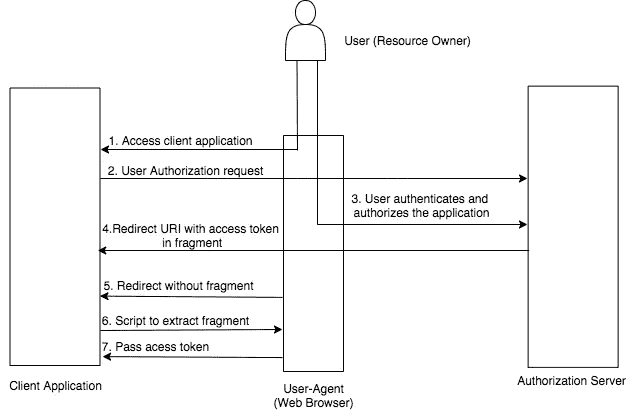

以下 URL 可用于尝试此授权类型。

```
https://localhost:9443/oauth2/authorize?response_type=token&client_id=<CLIENT_ID>&redirect_uri=<REDIRECT_
URI>
```

**资源所有者密码凭证授予**

客户端应用程序本身会提示资源所有者输入用户名和密码，而不是将用户重定向到授权服务器。然后，客户端会将它们和客户端应用程序凭证一起发送到授权服务器。


以下 cURL 命令可用于尝试客户机凭证授权类型。

```
curl -v -X POST -H "Authorization: Basic <Base64Encoded(CLIENT_ID:CLIENT_SECRET)>" -k -d "grant_type=client_credentials" -H "Content-Type:application/x-www-form-urlencoded" <TOKEN_ENDPOINT>curl -u <CLIENT_ID>:<CLIENT_SECRET> -k -d "grant_type=client_credentials" -H "Content-Type:application/x-www-form-urlencoded" <TOKEN_ENDPOINT>
```

**刷新令牌授权**

这可以在当前访问令牌过期或需要新的访问令牌时使用。在这种情况下，刷新令牌充当凭证，由授权服务器颁发给客户端。

要使用刷新令牌，必须首先通过使用授权码授权或客户端凭证/密码授权类型来获得它。使用获得的刷新令牌，可以获得新的访问令牌。

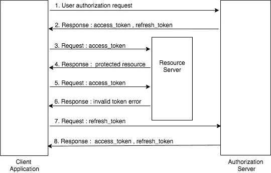

下面的 cURL 命令可以用来尝试这种授权类型。

```
curl -k -d "grant_type=refresh_token&refresh_token=<REFRESH_TOKEN>" -H "Authorization: Basic <Base64Encoded(CLIENT_ID:CLIENT_SECRET)>" -H "Content-Type: application/x-www-form-urlencoded" <TOKEN_ENDPOINT>
```

除了上述四种主要的授权类型之外，WSO2 IS 还可以使用这些授权类型的四种扩展。

*   设备流授权类型
*   JWT 无记名授权类型
*   SAML2 不记名声明配置文件。
*   Kerberos 授权类型

## WSO2 IS 和 OAuth 2.0/ OIDC

## OAuth 2.0/OIDC 入站身份验证

为了了解 WSO2 如何与 OAuth 2.0/OIDC 协议一起工作，我们将使用 WSO2 IS 5.11.0。要下载 WSO2 IS 5.11.0，请到[https://wso2.com/identity-server/](https://wso2.com/identity-server/)下载最新的 WSO2 IS zip 存档(我将使用 5.11.0)。下载 IS 后，解压到`bin`目录。然后在终端中键入`sh wso2server.sh`来运行它。

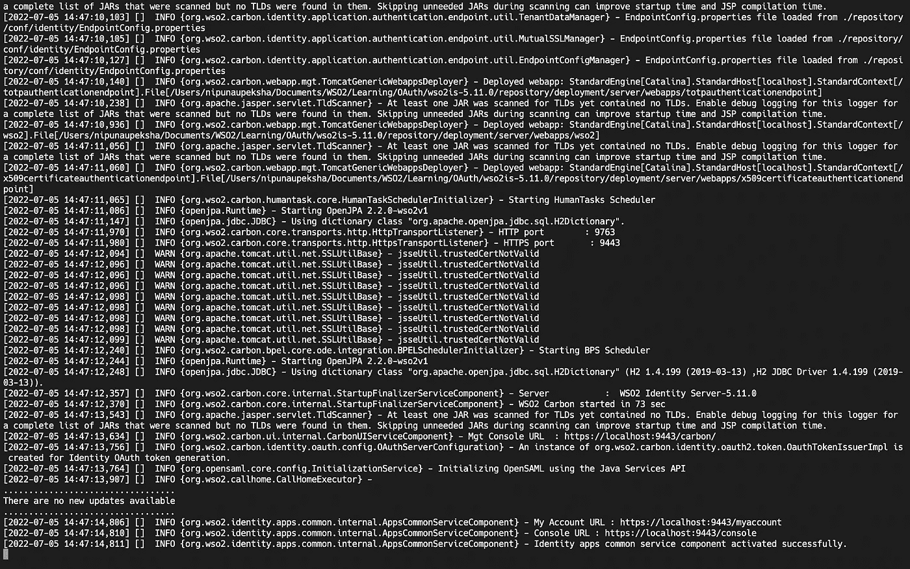

WSO2 正在运行

启动 IS 后，你可以打开浏览器，输入`https://localhost:9443/carbon`进入管理控制台。之后，您可以通过输入默认用户名`admin`和默认密码`admin`登录管理控制台

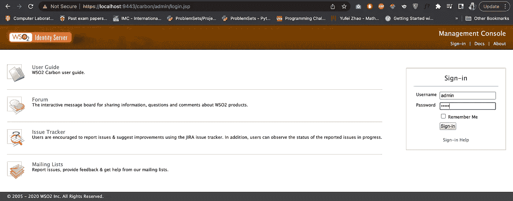

WSO2 是管理控制台

登录管理控制台后，进入`Service Providers` → `Add`添加新的服务提供商。

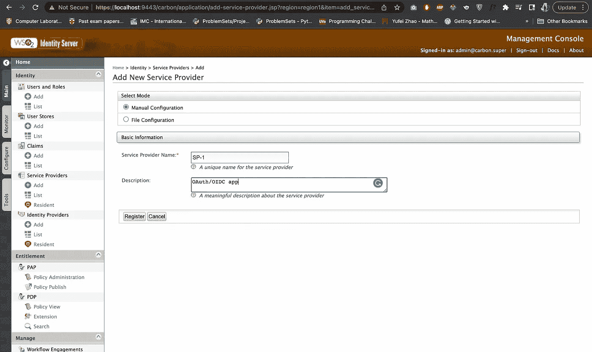

添加新 SP

之后，系统会提示您进入一个新页面来配置您的应用程序。在那里，您可以通过进入`Inbound Authentication Configuration` → `OAuth/ OpenID Connect Configuration`并点击`configure`将应用配置为 OAuth/OIDC 应用


OAuth/OIDC 配置

在这里，你可以看到我只添加了回调 URL `http://localhost:8080/pickup-dispatch/oauth2client`，其他的都是默认的。

要了解所有这些复选框和其他东西，请参考[这个](https://is.docs.wso2.com/en/5.10.0/learn/configuring-oauth2-openid-connect-single-sign-on/)。

## 在 Tomcat 中配置 Webapp

现在，让我们来使用一个示例 web 应用程序，我们可以将其配置为服务提供商。要做到这一点，你需要有 Tomcat，你可以从官方的 [tomcat 网站](https://tomcat.apache.org/)下载。下载 tomcat zip 文件后，解压并使用终端打开目录。如果您使用`ls`命令查看`bin`文件夹，您可以看到有一个名为`startup.sh`的`.sh`文件，它将启动 tomcat。但是要运行它，你需要给另一个名为`catalina.sh`的`.sh`文件执行权限。

```
chmod +x catalina.sh
```

然后用`sh startup.sh`启动 tomcat 服务器

这将只启动 tomcat 服务器，而不显示任何日志文件。要查看日志文件，请在终端中打开一个新标签，并运行以下命令。

```
tail -100f <TOMCAT_HOME>/logs/catalina.out
```

现在，如果你打开浏览器，进入`localhost:8080`，你可以看到 tomcat 正在运行，没有任何问题。

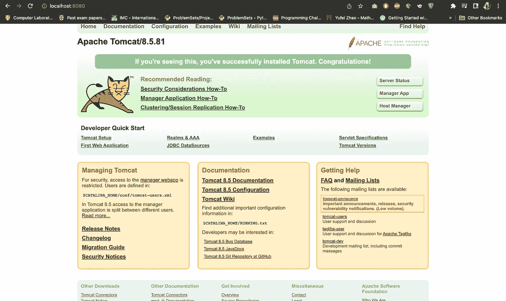

要停止 tomcat 服务器，您可以运行以下命令。

```
sh <TOMCAT_HOME>/bin/shutdown.sh
```

(或者，您可以使用`sh catalina.sh run`运行带有日志的 tomcat 服务器，然后按`command/ctrl + c`停止它。)

现在，让我们下载一个示例 web 应用程序，并在 tomcat 中运行它。为此，请转到此[链接](https://github.com/wso2/samples-is/releases)并下载`pickup-dispatch.war`文件。

下载完`pickup-dispatch.war`文件后，将其复制并粘贴到`<TOMCAT_HOME>/webapps`目录中。现在，如果您启动 tomcat 服务器，您可以看到在`<TOMCAT_HOME>/webapps`目录中创建了一个名为`pickup-dispatch`的目录。打开`<TOMCAT_HOME>/webapps/WEB-INF/classes/dispatch.properties`，用我们服务提供商的`OAuth Client Key`和`OAuth Client Secret`更改`consumerKey`和`consumerSecret`的值。

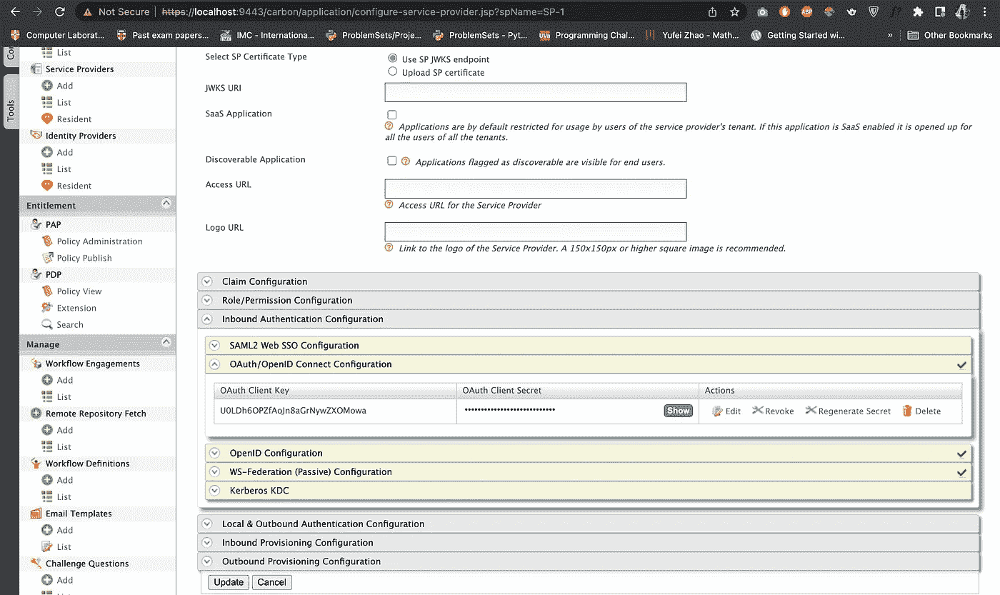

此外，还有另一个名为`callBackUrl`的属性名，我们用它来配置 WSO2 IS 中的服务提供者。

因为我们在 WSO2 IS 中创建 SP-1 时已经允许了所有的授权类型，并且在 tomcat 中配置了服务提供者，所以我们可以理解 WSO2 IS 提供的 OAuth/OIDC 流了。

**乌斯/OIDC 演示**

在本演示中，我们将使用授权代码授权类型。由于我们已经知道授权码授权 URL 类型，我们可以替换这些值并为我们的服务提供商生成授权码授权 URL，`https://localhost:9443/oauth2/authorize?response_type=code&scope=openid internal_login&redirect_uri=http://localhost:8080/pickup-dispatch/oauth2client&client_id=U0LDh6OPZfAoJn8aGrNywZXOMowa`

使用 URL 中的 scope 参数，我们可以定义客户端应用程序需要授权的几个范围。如果您想获得可用于 OAuth 2.0 和 OIDC 的作用域的完整列表，可以执行以下 cURL 命令。(这里，cURL 中的基本授权是作为一个基本的 auth token，你可以使用这个[链接](https://www.blitter.se/utils/basic-authentication-header-generator/)生成基本的 auth token。)

```
curl --location --request GET 'https://localhost:9443/api/identity/oauth2/v1.0/scopes' --header 'Authorization: Basic YWRtaW46YWRtaW4='curl --location --request GET 'https://localhost:9443/api/server/v1/oidc/scopes' --header 'Authorization: Basic YWRtaW46YWRtaW4='
```

现在，让我们在浏览器中运行`https://localhost:9443/oauth2/authorize?response_type=code&scope=openid internal_login&redirect_uri=http://localhost:8080/pickup-dispatch/oauth2client&client_id=U0LDh6OPZfAoJn8aGrNywZXOMowa`。


正如您在浏览器中看到的，我们已被重定向到另一个页面，其 URL 为`https://localhost:9443/authenticationendpoint/login.do...`，有效负载包含`sessionDataKey(6b6e7d2f-e3a4-4dc8-9bce-cfa00c04e3b6)`，如果我们在该页面上给出正确的凭证，我们将被重定向到具有相同`sessionDataKey(6b6e7d2f-e3a4-4dc8-9bce-cfa00c04e3b6)`的`commonauth`端点，然后我们将被要求授权我们在`consent.do`端点请求的权限。需要记住的重要一点是`sessionDataKey`仅在用户认证完成后才可用(当到达`consent.do`时`sessionDataKey`已经过期)。)

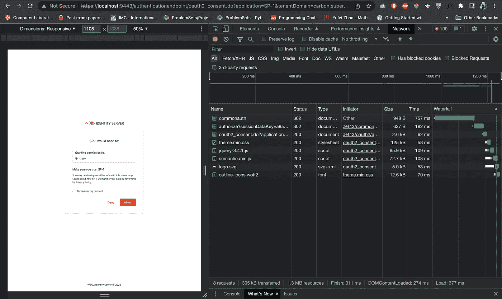

如果我们授予客户端应用程序此权限，我们将被重定向到客户端应用程序，并带有包含授权代码和会话状态的有效负载。

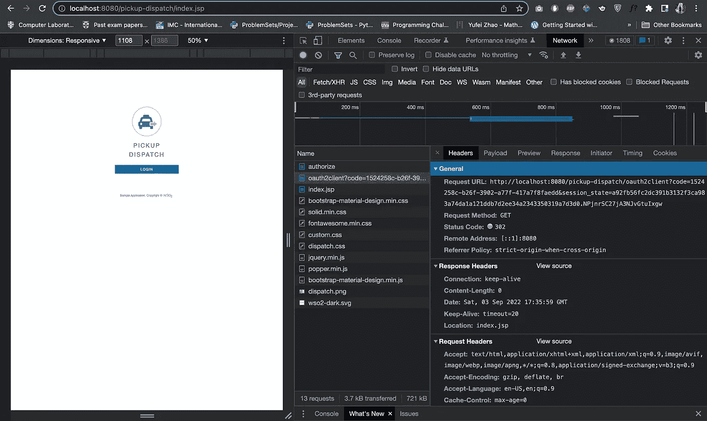

现在我们有了授权码，它允许我们登录到应用程序。在这个 OAuth/OIDC 流中，我们遇到了来自`commonauth`端点的`commonAuthId` cookie 和来自`commonauth`端点之后的`authorize`端点的`obps` cookie。这两个 cookies 都用于 SSO 会话管理。例如，如果我们删除了`opbs` cookie，将会生成另一个`obps` cookie，因为`commonAuthId` cookie 存在于会话中。如果我们删除`commonAuthId`，我们仍然可以访问在浏览器中打开的页面，但无法打开更多页面，因为网络应用/服务提供商会要求登录。但是，如果我们删除了这两个 cookies，我们将从 web 应用程序中注销。

回头看看我们的申请，我们看到，我们同意`Login`，那么`Login`是如何进入同意流程的呢？它伴随着我们对`scopes`的`authorization`调用而来，因为我们提到`internal_login`是一个范围，所以它在同意页面上。

为了突出这一点，我们可以使用另一个范围，再次检查流量。如果我们发送下面的请求，`https://localhost:9443/oauth2/authorize?response_type=code&scope=openid internal_event_publish&redirect_uri=http://localhost:8080/pickup-dispatch/oauth2client&client_id=U0LDh6OPZfAoJn8aGrNywZXOMowa`我们将在`consent.do`端点得到下面的消息。

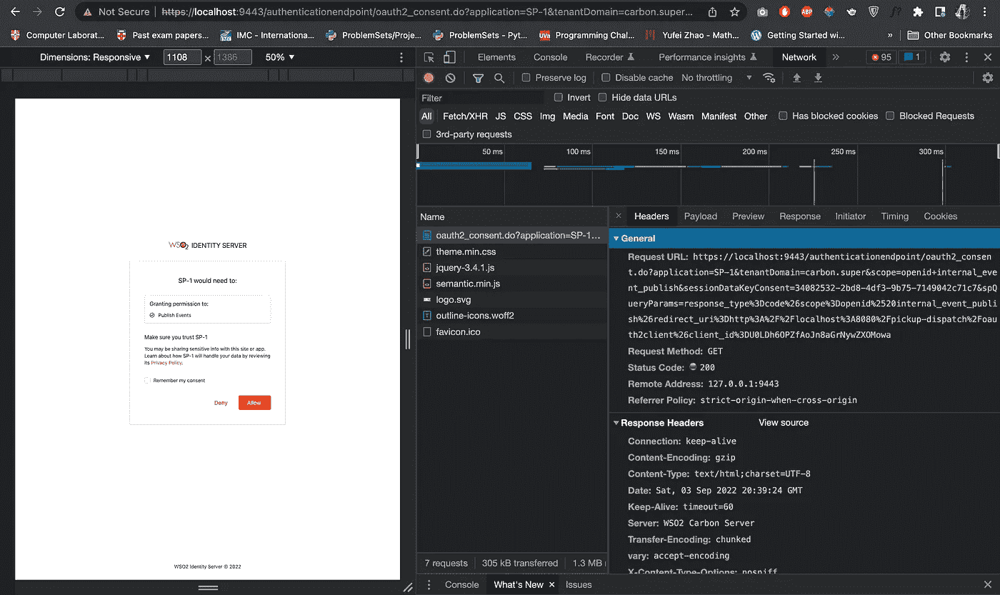

由于我们使用授权许可类型检查了 OAuth/OIDC 流程，我们可以将流程总结如下。

*   `https://localhost:9443/oauth2/authorize?response_type=code&scope=openid internal_login&redirect_uri=http://localhost:8080/pickup-dispatch/oauth2client&client_id=U0LDh6OPZfAoJn8aGrNywZXOMowa`
    -初始授权请求。
    - `sessionNonceCookie`被创造出来(`sessionNonceCookie`被创造出来是为了躲避 CSRF 的攻击。此 cookie 包含与使用 HMAC 加密哈希加密的会话相关的重要数据。
*   `https://localhost:9443/authenticationendpoint/login.do...`
    -有效载荷`relyingParty`有了`OAuth Client Key`-
    -`sessionDataKey`就创造出来了。
*   `https://localhost:9443/commonauth`
    -有效载荷包含`username`和`password` (OIDC JSON web token 用户信息)
    - `commonAuthId` cookie 被创建。
*   `https://localhost:9443/oauth2/authorize?sessionDataKey=2b500ada-1a34-42dc-b7bc-0e045be1c0cd`
*   有效载荷中`https://localhost:9443/authenticationendpoint/oauth2_consent.do...`-
    -`sessionDataKeyConsent`。
*   `https://localhost:9443/oauth2/authorize`
    - `obps` cookie 创建完毕。
*   `https://localhost:8080/pickup-dispatch/oauth2client?code=ed96beb8-1e09-3e42-b91c-5b...`
    ——授权`code`和`session_state`在有效载荷中。
*   `https://localhost:8080/pickup-dispatch/index.jsp`

原来就是这样！这就是结局！希望你理解了入站认证在 WSO2 和 OAuth 2.0 以及 OIDC 中是如何工作的！

## 参考

1.  [https://frontegg.com/blog/oauth-grant-types](https://frontegg.com/blog/oauth-grant-types)
2.  [https://wso2.com/blogs/thesource/2019/08/oauth-2-basics/](https://wso2.com/blogs/thesource/2019/08/oauth-2-basics/)
3.  [https://developer.okta.com/docs/concepts/oauth-openid/](https://developer.okta.com/docs/concepts/oauth-openid/)
4.  [https://is . docs . WSO 2 . com/en/latest/references/concepts/authorization/grant-types/](https://is.docs.wso2.com/en/latest/references/concepts/authorization/grant-types/)
5.  [https://reqbin.com/curl](https://reqbin.com/curl)