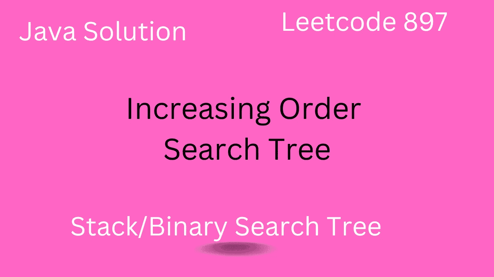

# 递增顺序搜索树— Leetcode 897

> 原文：<https://medium.com/javarevisited/increasing-order-search-tree-leetcode-897-9850083d34d6?source=collection_archive---------1----------------------->

## Leetcode 897 的 Java 解决方案

## 介绍

*   在本文中，我们将解决主要处理[二分搜索法树](https://javarevisited.blogspot.com/2021/12/how-to-check-if-tree-is-binary-search.html)的 leetcode 897。
*   如果你想知道我们如何操作二分搜索法树中的指针/引用，那么这个问题很好。
*   我们将会看到[递归](/javarevisited/7-best-courses-to-learn-recursion-for-programming-and-coding-interviews-1f8b0bcfd44)和…