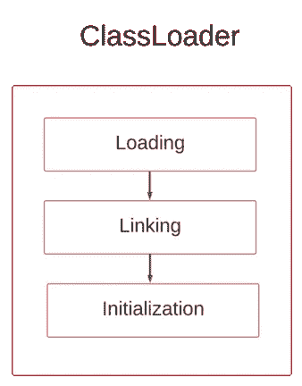

# JVM 内部—第 2 部分(类加载器)

> 原文：<https://medium.com/javarevisited/inside-the-jvm-part-02-classloader-e893edf64c00?source=collection_archive---------2----------------------->


照片由[海燕](https://unsplash.com/@petrebels?utm_source=medium&utm_medium=referral)在 [Unsplash](https://unsplash.com?utm_source=medium&utm_medium=referral) 上拍摄

*“正直是做正确的事，即使没有人看着。”刘易斯*

现在让我们回顾一下 JVM，基本上，JVM 有三个主要功能，分别是 ***加载*** 编译后的类文件， ***存储*** 它，然后 ***执行*** 它。为了完成这个过程，JVM 有三个独立的组件。

加载过程由 ***类加载器完成，*** 存储由 ***内存区*** 完成，程序执行由 ***执行引擎*** 处理。现在让我们详细讨论每一个问题。

现在我们来谈谈 ***类加载器。***

当 JVM 实例开始运行时，classloader 的基本职责是在运行时将编译好的类加载到 JVM 中。如果类找不到它就会抛出***ClassNotFoundException****。**最重要的是要知道每一个定制的类加载器都是通过 ***扩展****" class loader "*类(抽象)来实现的，这些类位于 *"java.lang"* 包中，而不是 Boostrap 类加载器(细节见下文)。*

*每个类装入器都应该遵守一些原则。*

***可见性原则** —子类装入器可以看到由它们的父类装入器生成的其他类装入器，但是父类装入器看不到它的子类装入器生成的是什么类装入器(祖父母不知道孙子辈😉)*

***唯一性原则**——确保一个类只加载一次，并确保子类不会加载其父类已经加载的同一个类。*

***委托原则** —这遵循一种分层的方法来寻找和加载适当的类当一个请求来加载类(*example class loader . load class(" com . org . pkg ")*)时，它将把请求从最低层传递到较高层(应用程序类加载器>扩展类加载器>引导类加载器)来寻找类， 如果在那里没有找到它，那么它将返回到扩展类加载器来查找它在自定义路径中的位置，如果最后应用程序类加载器也失败了，那么如果没有找到，则抛出一个"***ClassNotFoundException "***。*

***无卸载原则** —已加载的类不能从类加载器中卸载，只能删除并创建一个新的类加载器。*

*JVM 中有几种不同的类装入器，它们是*

## *1.引导类装入器*

*为了运行 Java 程序，必须加载必要的库和核心 Java APIs，引导类加载器也称为原始类，负责加载这些类。Boostrap ClassLoader 认为是用 JRE 实现中使用的本机代码编写的 JVM 的核心部分( [C，C++](/javarevisited/10-best-c-and-c-programming-books-for-beginners-and-experienced-programmers-eb5ee8dbdc5a) )和类加载器的最终父类。*

## *2.扩展类加载器*

*这个类加载器是 Boostrap 类加载器的子类加载器，负责加载标准类的所有扩展类。*

## *3 应用程序类加载器*

*这也被称为 ***系统类加载器*** ，以及扩展类加载器的子类，这个负责在编译程序时加载***class path(-CP)***中提到的与应用相关的所有应用级类文件。*

*classloader 本身由三个子进程组成，分别是****链接******初始化*** 。现在让我们来详细讨论其中的每一个。**

****

**类加载器子进程**

# **1.装货**

**当加载到其中的类第一次从类中读取一些信息时，这些信息是，
完全限定的类名(例如“java.lang.String”)。
直接父类信息。
实例和静态变量，
找出它是类、接口还是枚举。**

**得到这些信息后，*第一次运行它的 JVM 的*从*文件 *("java.lang.Class ")，*中创建一个对象，最重要的是这个对象不是使用应用程序中创建的类文件创建的(例如——User，Employee)。***

```
**Class class = new AdminUser();**
```

**并将它放入堆中。**

# **2.连接**

**链接分为三个子过程，即 ***验证*** 、 ***准备、*** 和 ***解析。*****

****2.1 验证** —该过程确保字节码的安全性，验证过程用于决定给定的类文件是否可以安全执行，以及它是否从其原始形式被改变。在字节码验证器的帮助下，这个过程遵循几个标准，即**

*   **检查编译后的类文件是否来自有效的编译器，是否符合 JVM 规范。**
*   **检查它是否具有正确的类文件结构和正确的语言格式，是否符合语法规则和其他规则。**

**如果其中任何一个失败，它将抛出 *VerifyException* 。**

****2.2 准备** —如果类有实例级或者静态变量，在这个阶段会提供 [*默认值*](https://chamalwr.medium.com/inside-the-jvm-part-01-90c841abfd81) (不是用户指定的值)。**

****2.3 解析** —当程序员编写 Java 程序时，他们使用*符号名称*来表示基于应用程序域的对象，例如 Payment、Student、Course 等类。但是当它到达 JVM 时，那些没有被 JVM 识别的或者在机器级别的，在这个阶段，它将搜索方法区域来定位被引用的实体，并且*用引用*替换它们，在那里它们实际上驻留在堆中。**

# **3.初始化**

**作为类加载器的最后一步，它将决定类或静态变量是否有任何活动的使用，如果有任何活动的使用，那么它将进行初始化过程，选择它是否有活动用例的标准很少。**

*   **如果使用*【new】*关键字(new Student())创建一个类。**
*   **调用一个类中的静态方法会将驻留其方法的类视为活动使用。**
*   **为静态字段赋值。这里需要注意的重要一点是，如果字段是静态的，那么将决定活动的情况，如果它被定义为*【最终】*或*【静态最终】*，则不认为它是活动的使用。**
*   **如果该类是初始类，这意味着它包含了*" public static void main(String[]args)"*方法。**
*   **举例来说，如果一个类不具有这些属性中的任何一个，但是另一个类具有一个或多个扩展该类的属性，那么父类也被认为是一个活跃的使用，它可以经历初始化**

```
**public class Student{...} public class FullTimeStudent extends Student { ... }public class Main {  
      FullTimeStudent ftStudentGrd = new FullTimeStudent();
}//Both the Student and FullTimeStudent classes considered as active use**
```

## **参考**

**Java 类加载器—[https://www.youtube.com/watch?v=CQQzYCjNdIw](https://www.youtube.com/watch?v=CQQzYCjNdIw)**

**[](https://www.baeldung.com/java-classloaders) [## Java 中的类装入器| Baeldung

### 类加载器负责在运行时将 Java 类动态加载到 JVM (Java 虚拟机)中…

www.baeldung.com](https://www.baeldung.com/java-classloaders) [](https://www.javatpoint.com/classloader-in-java) [## Java-Java point 中的类加载器

### Java ClassLoader 是一个抽象类。它属于一个 java.lang 包。它从不同的资源加载类…

www.javatpoint.com](https://www.javatpoint.com/classloader-in-java)**