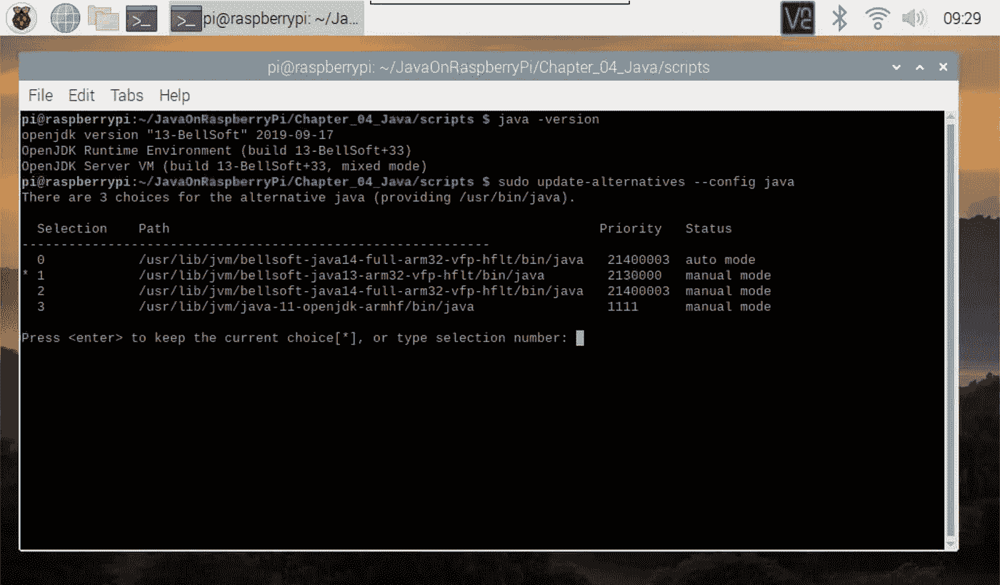

# 在 Raspberry Pi 上安装 Java JDK 和 JavaFX

> 原文：<https://medium.com/javarevisited/installing-java-and-javafx-on-the-raspberry-pi-d68d0ad7b484?source=collection_archive---------0----------------------->

Java 仍然是排名第一的编程语言(见[https://www.tiobe.com/tiobe-index/](https://www.tiobe.com/tiobe-index/))，它是完整的 Raspbian 操作系统(默认的 Raspberry Pi 操作系统)的一部分，你可以从[的 Raspberry 网站](https://www.raspberrypi.org/downloads/)下载。但是如果你想在 Raspberry Pi 上使用 JavaFX 来构建漂亮的用户界面，你可以切换到本文中描述的其他 SDK 版本。

声明:本文仅适用于采用 ARMv7 或 ARMv8 处理器的 Raspberry Pi。在维基百科的 [Raspberry Pi 规格表中，您可以清楚地了解该处理器的 Pi 类型:](https://en.wikipedia.org/wiki/Raspberry_Pi#Specifications)

*   型号 A+，版本 3
*   型号 B，版本 2、3 和 4
*   计算模块，版本 3

# 带 Java 11 的 Raspbian 操作系统

在 Raspbian 的[发行说明中可以看到 2019–06–20 版本包含 OpenJDK Java 11:](http://downloads.raspberrypi.org/raspbian/release_notes.txt)

```
2019-06-20:
* Based on Debian Buster
* Oracle Java 7 and 8 replaced with OpenJDK 11
```

因此，如果我们从一个全新的 Raspbian 操作系统开始，我们确实会得到这个 Java 版本的结果:

```
$ java -version
openjdk version "11.0.6" 2020-01-14
OpenJDK Runtime Environment (build 11.0.6+10-post-Raspbian-1deb10u1)
OpenJDK Server VM (build 11.0.6+10-post-Raspbian-1deb10u1, mixed mode)
```

这意味着我们已经可以开始任何基于 Java 11 的程序了！

# LibericaJDK 运行 JavaFX 程序

由于 JavaFX 不再是 Java JDK 的一部分(从版本 11 开始)，在 Raspberry Pi 上运行 JavaFX 程序将不能开箱即用。

幸运的是，我们可以使用 [BellSoft](https://bell-sw.com/) 提供的 LibericaJDK。他们有一个包含 JavaFX 的专用于 Raspberry Pi 的版本，因此您将能够使用一个简单的“java -jar yourapp.jar”启动命令来运行 JavaFX 应用程序。

# 安装 LibericaJDK

我们只需要从他们的网站下载链接来安装一个替代的 Java JDK，如下所示:

```
$ cd /home/pi
$ wget https://download.bell-sw.com/java/13/bellsoft-jdk13-linux-arm32-vfp-hflt.deb
$ sudo apt-get install ./bellsoft-jdk13-linux-arm32-vfp-hflt.deb
$ sudo update-alternatives --config javac
$ sudo update-alternatives --config java
```

完成后，我们可以再次检查版本，它应该是这样的:

```
$ java --version
openjdk version "13-BellSoft" 2019-09-17
OpenJDK Runtime Environment (build 13-BellSoft+33)
OpenJDK Server VM (build 13-BellSoft+33, mixed mode)
```

在我的 test-Pi 上，我甚至保留了不同版本的 LibericaJDK，通过“更新-替换”切换非常容易。



在不同的 Java JDK 版本之间切换

# 在 GitHub 上安装脚本

在 [Github 上，在我的书](https://github.com/FDelporte/JavaOnRaspberryPi/tree/master/Chapter_04_Java/scripts)[“Raspberry Pi 上的 Java 入门”](https://webtechie.be/books/)的源代码中，你可以找到 LibericaJDK 多个版本的安装脚本，其中已经包含了每个版本的正确下载链接。


存储库中可用的脚本

如果你喜欢视频，这里有来自【Java 访问 Youtube 频道关于[如何在 Raspberry PI 上安装 Java](https://www.youtube.com/watch?v=QVkSSeoW8QI)的视频

而且，如果你喜欢这个视频并想了解更多，你也可以在这里查看完整的课程— [**在树莓派上使用 Java 和 Java FX**](https://bit.ly/3jrtns3)

您可能喜欢的其他**编程文章**

[2020 年 Web 开发者路线图](https://hackernoon.com/the-2019-web-developer-roadmap-ab89ac3c380e)
[2020 年学习 Python 的 10 个理由](https://javarevisited.blogspot.com/2018/05/10-reasons-to-learn-python-programming.html)
[2020 年可以学习的 10 种编程语言](http://www.java67.com/2017/12/10-programming-languages-to-learn-in.html)
[每个 Java 开发者都应该知道的 10 个工具](http://www.java67.com/2018/04/10-tools-java-developers-should-learn.html)
[学习 Java 编程语言的 10 个理由](http://javarevisited.blogspot.sg/2013/04/10-reasons-to-learn-java-programming.html)
[2020 年 Java 和 Web 开发者应该学习的 10 个框架](http://javarevisited.blogspot.sg/2018/01/10-frameworks-java-and-web-developers-should-learn.html)
[10](http://javarevisited.blogspot.sg/2018/05/10-tips-to-become-better-java-developer.html)

[](/javarevisited/what-java-programmers-should-learn-in-2020-648050533c83) [## 2020 年 Java 程序员该学什么？

### 2020 年 Java 程序员可以学习的有用工具、技术、框架和库

medium.com](/javarevisited/what-java-programmers-should-learn-in-2020-648050533c83) [](/javarevisited/what-next-for-senior-developers-in-tech-project-manager-technical-architect-or-a-devops-engineer-b532a80c9ba1) [## 高科技领域的高级开发人员下一步会做什么？项目经理、技术架构师或 DevOps 工程师

### 是时候考虑职业生涯的下一个层次了。

medium.com](/javarevisited/what-next-for-senior-developers-in-tech-project-manager-technical-architect-or-a-devops-engineer-b532a80c9ba1) [](/javarevisited/top-5-java-online-courses-for-beginners-best-of-lot-1e1e240a758) [## 2020 年学习 Java 的 10 大课程

### 如果你是计算机科学专业的毕业生，或者想学习 Java 并且正在寻找一些很棒的资源，比如…

medium.com](/javarevisited/top-5-java-online-courses-for-beginners-best-of-lot-1e1e240a758)