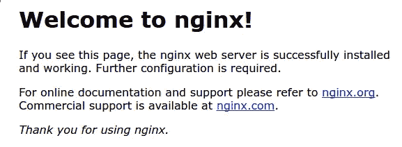

# 安装 Nginx 并通过命令管理(第 2 部分)

> 原文：<https://medium.com/javarevisited/installing-nginx-and-managed-by-command-part-2-b6b32b90b62d?source=collection_archive---------2----------------------->


# 介绍

在本文中，我将在一台机器上安装 Nginx，在本系列的第 3 部分中，您将解释关于 Nginx 文件系统的内容，以便进行成功的配置，并查看任何请求或错误的 Nginx 日志。

我们需要在本地机器或虚拟服务器上安装 Nginx 来处理 HTTP 请求，并对我们的服务进行配置。

在本文中，我们将看到 Nginx 以及在哪里可以找到配置文件。

我们可以通过 docker 把 Nginx 作为一个容器来安装，但是这篇文章将会谈到在 Ubuntu 20.04 LTS 操作系统中安装原始的应用程序。

**Nginx 文章的所有部分:**

*   [Nginx Web 服务器介绍(第一部分)](/javarevisited/intro-to-nginx-web-server-part-1-bb590fad7035)
*   这是 Nginx 系列的第二部分
*   [Nginx 文件配置和日志(第三部分)](/p/62e71ad1c3a0)

# 安装 Nginx

让我们开始在我们的机器上安装 Nginx。

Ubuntu 中有 Nginx，这意味着我们可以使用 apt 来安装它。

```
sudo apt updat
sudo apt install nginxe
```

# 我们需要调整防火墙

防火墙软件需要调整以允许访问该服务，Nginx 在安装时将自己注册为 ufw 的服务。

现在我们需要使用“ufw”的列表配置。

```
sudo ufw app list
```

在那之后你必须看到这个结果。

```
OutputAvailable applications:
 Nginx Full
 Nginx HTTP
 Nginx HTTPS
 xOpenSSH
```

从这个结果中，您可以看到 Nginx 提供了三个配置文件。

1.  Nginx Full:此配置文件使用端口 80(正常、未加密的 web 流量)和端口 443 (TLS/SSL 加密的流量)打开
2.  Nginx HTTP:这个配置文件只开放 80 端口
3.  Nginx HTTPS:此配置文件只开放端口 443 (TLS/SSL 加密流量)

# 我如何通过 Ubuntu 使用 nginx 启用配置文件

您可以在终端中编写以下代码

*   启用配置文件。

```
sudo ufw allow 'Nginx HTTP'
```

*   我们需要通过下面的代码来改变。

```
You can verify the change by typing:
```

*   写完上面的代码后，你必须显示这个结果

```
Output
Status: active

To              Action  From
--              ------  ----
OpenSSH         ALLOW   Anywhere         
Nginx HTTP      ALLOW   Anywhere         
OpenSSH (v6)    ALLOW   Anywhere (v6)      
Nginx HTTP (v6) ALLOW   Anywhere (v6)
```

# 现在我们需要检查一下网络服务器

在这个过程中，必须显示 Nginx 已经启动并准备好，但是我们需要通过下面的代码来检查它是否启动并准备好。

```
systemctl status nginx
```

写完上面的代码后，你会看到下面的结果

```
Output
● nginx.service - A high performance web server and a reverse proxy server
 Loaded: loaded (/lib/systemd/system/nginx.service; enabled; vendor preset: enabled)
 Active: active (running) since Fri 2020-04-20 16:08:19 UTC; 3 days ago
  Docs: man:nginx(8)
 Main PID: 2369 (nginx)
 Tasks: 2 (limit: 1153)
 Memory: 3.5M
 CGroup: /system.slice/nginx.service
     ├─2369 nginx: master process /usr/sbin/nginx -g daemon on; master_process on;
     └─2380 nginx: worker process
```

现在，服务已经成功启动，没有任何问题

但是我们需要更多的检查，如果 Nginx 准备好了，我们可以在 Nginx 中调用任何页面时完成这个过程

# 如何在 Nginx 中向默认登录页面发送请求？

您可以通过向您的 IP 地址发送请求来访问默认的登录页面，以检查 Nginx 启动是否没有任何问题

如果不知道您的服务 IP 地址，您可以编写以下代码

```
curl -4 icanhazip.com
```

> *icanhazip.com 是工具提供商你的公共 IP 地址*

当编写上述代码时，您可以从浏览器向以下地址发送请求

```
[http://your_server_ip](http://your_server_ip)
```

之后，你必须显示这一页。



现在 Nginx 运行没有任何问题

如何通过命令行管理 Nginx:

当在您的终端中应用命令时，我们可以管理 Nginx 进程

*   要在启动后停止 Nginx，请编写以下命令

```
sudo systemctl stop nginx
```

*   要在停止后启动 Nginx，请编写以下命令。

```
sudo systemctl start nginx
```

*   要重启 Nginx，请编写以下代码

```
sudo systemctl restart nginx
```

*   如果您有新的配置并想要应用它，您可以使用以下命令。

```
sudo systemctl reload nginx
```

*   默认情况下，Nginx 在启动 web 服务时启动配置。如果不需要或不想运行配置，您可以在应用此命令时禁用配置。

```
sudo systemctl disable nginx
```

*   但是，如果我们已经重新启用了配置，我们可以使用此命令来完成

```
sudo systemctl enable nginx
```

# 结论:

在本文中，我们安装了 Nginx，并看到了一些帮助管理 Nginx 的命令，如启动、停止和重启。

在下一篇文章中，我们将解释 Nginx 文件系统，并讨论 Nginx 文件作业。

**Nginx 文章的所有部分:**

*   [Nginx Web 服务器介绍(第一部分)](/javarevisited/intro-to-nginx-web-server-part-1-bb590fad7035)
*   这是 Nginx 系列的第二部分
*   [Nginx 文件配置和日志(第三部分)](/p/62e71ad1c3a0)

> **别忘了拍文章，每篇文章可以拍 50 次。**

# 参考资料:

*   [https://kinsta.com/knowledgebase/what-is-nginx/](https://kinsta.com/knowledgebase/what-is-nginx/)
*   [https://medium . com/devopscury/what-is nginx-understanding-the-basics-of-nginx-in-2021-f8e E0 F3 D3 d 54](/devopscurry/what-is-nginx-understanding-the-basics-of-nginx-in-2021-f8ee0f3d3d54)
*   [https://www . digital ocean . com/community/tutorials/how-to-install-nginx-on-Ubuntu-20-04](https://www.digitalocean.com/community/tutorials/how-to-install-nginx-on-ubuntu-20-04)