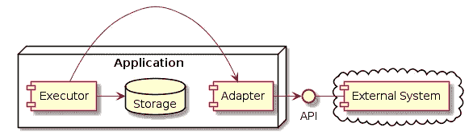

# instanceof 应该是您的最后手段

> 原文：<https://medium.com/javarevisited/instanceof-should-be-your-last-resort-4b8b3667cd17?source=collection_archive---------0----------------------->

由[抽象的](https://pixabay.com/users/ractapopulous-24766/)

有时候，在 Java 中会出现这样的情况，一个方法接收一个非常通用类型的对象，并且需要对它进行操作。通常情况下，你会用`if`链式调用`[instanceof](https://javarevisited.blogspot.com/2015/12/10-points-about-instanceof-operator-in-java-example.html)`来获取接收到的对象的具体类型，将这个对象转换为具体类型，并对具体类型进行操作。

听起来很熟悉？嗯，如果你的代码中有很多这样的项目，你可能会对 Java 模式匹配项目感到兴奋。但是我要说，你有重大的设计缺陷，并且没有利用你所使用的语言的面向对象的特性。[多态性](https://www.tutorialspoint.com/java/java_polymorphism.htm)，大多。

我们来看一个例子。

比方说，您正在开发一个系统，该系统与许多其他系统进行通信，并存储一些以内部格式获取的数据。某种带有许多适配器的聚合系统。其中一个适配器的组件视图如下所示:

图 1:组件视图

所有获取数据的系统都以该系统的特定格式提供数据。系统与系统之间是如此的不同，以至于每一个都被映射到一个特定的类。

假设有五个外部数据提供者，每个都有一个响应对象:`ResponseFromSystem1`、`ResponseFromSystem2`、`ResponseFromSystem3`、`ResponseFromSystem4`、`ResponseFromSystem5`。

我们需要某种实现来请求所有这些外部系统，收集数据并将其存储在内部。让我们假设每个系统都可以用描述系统类型的唯一整数来标识。

实现可能如下所示:

代码片段 1:初始实现

因此，这里我们有一个 API 方法，它根据提供的类型 id 调用外部系统，并在内部存储数据。由于外部系统以及它们的响应各不相同，因此在为调用使用合适的[适配器](http://javarevisited.blogspot.sg/2016/08/adapter-design-pattern-in-java-example.html#axzz5B6EWE6M7)之后，`callExternal`只提供一个`Object`作为结果。这个`Object`用`convert2Internal` a 方法转换成内部表示，并且这个表示被存储。

这是`convert2Internal`方法，所有的乐趣都在这里！

由于`callExternal`简单地返回`Object`，我们不知道调用了什么系统，必须检查每一个可能的选项。也是不可能的。看到这个`throw new IllegalArgumentException(“No such external system!”)`？它永远不会被调用，因为在这个上下文中`Object`有这么多可能的值。*但是编译器不知道这一点，也不会对它采取任何措施。*

在这种情况下具有讽刺意味的是，您知道对象是什么， [**Java 运行时**](https://javarevisited.blogspot.com/2011/12/jre-jvm-jdk-jit-in-java-programming.html) **也知道**。只是编译器没那么容易被说服。

这里的问题(编译器没有被说服是正确的)是我们在一个过于宽泛的抽象上操作。这是一种糟糕的抽象。除非我们知道*的具体类型*并能对其进行*具体操作*，否则它并不能告诉我们关于该对象的太多信息。

我们需要的是一个好的抽象。这将抽象出所有不必要的具体内容，留下所需的抽象内容，足以让我们说服编译器。

让我们通过引入名为`Convertible`的接口来做到这一点:

代码片段 2:可转换接口

它告诉我们的是，任何实现这个接口的对象都可以将自己转换成`InternalRepresentation`。我们真的不需要知道更多！

让我们用外部系统响应来实现这个接口。比如`ResponseFromSystem1`。让它只包含一个从外部系统返回的某个数字或某个东西的字段。在我们可以存储这个响应之前，它应该被转换成我们拥有的内部表示。所以我们告诉编译器`ResponseFromSystem1`实现了`Convertible`接口，并为转换提供了实现:

片段 3:来自系统 1 的响应

除了为`provideInternalResRepresentation()`添加实现，我们没有改变内部表示。而且很酷。`ResponseFromSystem1`知道它的内部内容，并且知道如何将它映射到我们系统中使用的表示。

现在，如果我们用`Convertible`的实现扩展来自所有其他系统的所有其他响应，我们(你、我和编译器)将**确定**外部调用只能返回`Convertible`。

所以我们可以这样重写`callExternal`方法:

代码片段 4:代码调整

此外，我们现在可以放弃这个丑陋的`if — else`链方法与转换。在那之后，我们会看到这样的内容:

代码片段 5:最终的实现

嗯，真不错！现在，在`callExternal`之后，我们有了一个好的抽象。它抽象掉了所有不必要的信息，如响应的具体类型，但给我们留下了有用的信息，即这个响应可以转换为内部表示。我们只需要在上面调用`provideInternalResRepresentation`！

Java 运行时现在将为我们计算出实际的类型，并在具体对象上调用实际的实现。[多态性](https://www.tutorialspoint.com/java/java_polymorphism.htm)，耶！

此外，我们的系统响应对象现在更接近于[域对象](https://en.wikipedia.org/wiki/Domain_model)，而远离[贫血域对象](https://en.wikipedia.org/wiki/Anemic_domain_model)(请参见关于[贫血域模型](https://martinfowler.com/bliki/AnemicDomainModel.html)的精彩文章)。这太好了！这些对象不仅仅是数据的持有者，还封装了逻辑。这就是整个 OOP 的目的！

总结一下:

> `instaceof`用法应该认为是代码气味。

过度使用它可能表示以下情况之一:

*   你在使用 [**不好的抽象**](https://javarevisited.blogspot.com/2017/04/difference-between-abstraction-and-encapsulation-in-java-oop.html) 。它比它应该隐藏的更多。
*   你试图统一属于不同领域的事物。您操作的实体之间没有有用的抽象点。

# 抽象的经验法则是，它本身就足以让你在任务的上下文中操作它背后的实体。

它不应该要求公开太多的内部实现(这样它就不太灵活)，也不应该公开太少(所以你需要转换成具体的类型)。

*好吧，就这样。如果有任何反馈或问题，我将非常高兴！请随意将它们贴在这里的回复或个人笔记中。*

学习 Java 的其他**有用资源**你可能喜欢的
[2019 年 Java 程序员应该学习的 10 件事](https://javarevisited.blogspot.com/2017/12/10-things-java-programmers-should-learn.html#axzz5atl0BngO)
[从零开始学习 Java 的 10 门免费课程](http://www.java67.com/2018/08/top-10-free-java-courses-for-beginners-experienced-developers.html)
[深入学习 Java 的 10 本书](https://medium.freecodecamp.org/must-read-books-to-learn-java-programming-327a3768ea2f)
[10 个工具每个 Java 开发人员都应该知道的](http://www.java67.com/2018/04/10-tools-java-developers-should-learn.html)
[学习 Java 编程语言的 10 个理由](http://javarevisited.blogspot.sg/2013/04/10-reasons-to-learn-java-programming.html)
[Java 和 Web 开发人员应该学习的 10 个框架 成为 2019 年更优秀的 Java 开发者](http://javarevisited.blogspot.sg/2018/01/10-frameworks-java-and-web-developers-should-learn.html)
[2019 年要学习的 5 大 Java 框架](http://javarevisited.blogspot.sg/2018/04/top-5-java-frameworks-to-learn-in-2018_27.html)
[每个 Java 开发者都应该知道的 10 个测试库](https://javarevisited.blogspot.sg/2018/01/10-unit-testing-and-integration-tools-for-java-programmers.html)

 [## 面向初学者的 10 大 Java 在线课程

### 如果你是计算机科学专业的毕业生，或者想学习 Java 并且正在寻找一些很棒的资源，比如…

medium.com](/javarevisited/top-5-java-online-courses-for-beginners-best-of-lot-1e1e240a758)