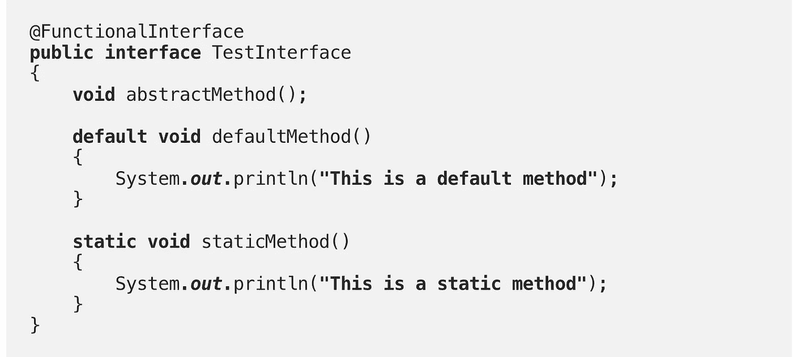
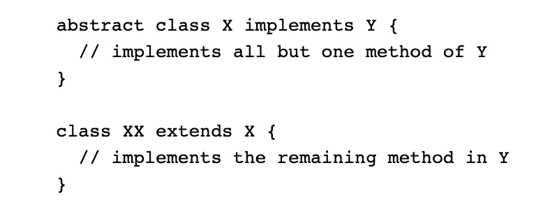
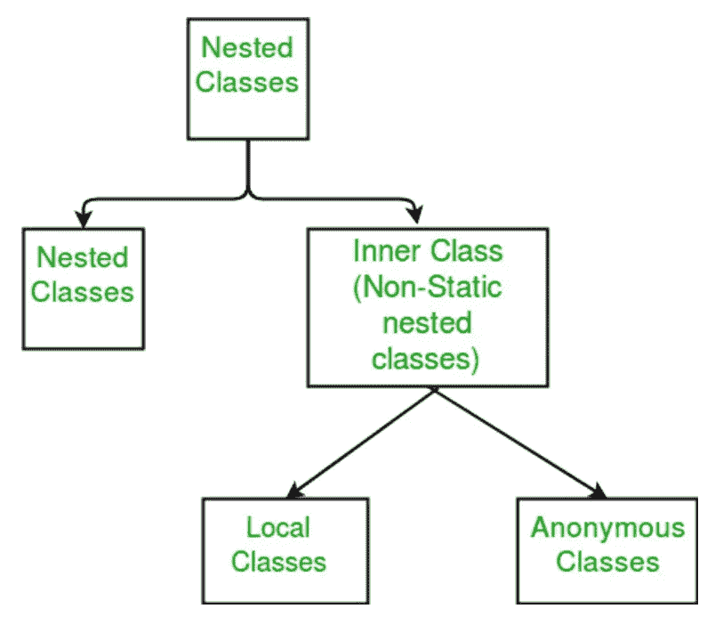
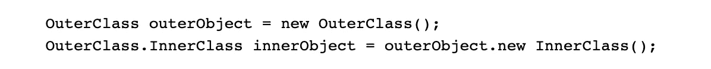

# 中级 Java 8:函数接口和嵌套类

> 原文：<https://medium.com/javarevisited/intermediate-java-eaeb920d0d8b?source=collection_archive---------4----------------------->

# **抽象方法**

*   抽象方法是声明时没有实现的方法(没有大括号，后跟分号)。
*   “abstract”关键字必须在此方法声明中使用。(但是在接口中声明时是多余的，如下所述)

# **界面**

*   要实现接口，类必须提供接口所需的完整方法集。
*   接口旨在支持运行时的动态方法解析。
*   **田地**:
*   界面中的所有字段默认为[公共](https://javarevisited.blogspot.com/2012/10/difference-between-private-protected-public-package-access-java.html#axzz6j8KhisSX)、[静态](https://javarevisited.blogspot.com/2011/11/static-keyword-method-variable-java.html)和[最终](https://javarevisited.blogspot.com/2016/09/21-java-final-modifier-keyword-interview-questions-answers.html)。
*   所以在变量声明的时候提到这些关键字是多余的。
*   编译器抛出一个错误，使字段成为非公共的或[非静态的](https://javarevisited.blogspot.com/2013/11/difference-between-static-vs-non-static-method-java.html#axzz5Y4KkQFHS)或非最终的。
*   **方法**:
*   默认情况下，接口中的所有方法都是公共的。
*   使方法[私有](https://javarevisited.blogspot.com/2012/03/private-in-java-why-should-you-always.html)或[受保护](http://www.java67.com/2012/12/what-is-public-private-protected-package-default-private-access-modifier-java.html)会产生编译错误。
*   为没有主体的方法提及抽象关键字是多余的。
*   **定义接口:**

*   **默认方法**:
*   Java 8 中引入。默认方法必须有一个主体。
*   此方法定义必须使用关键字“default”。
*   接口中没有必要有默认方法。实现接口的类可以选择重写它们。
*   **静态法**:
*   在 [Java 8](/hackernoon/top-5-java-8-courses-to-learn-online-2db57d9dfb8d) 中引入。类似于默认方法，除了我们不能在实现类中覆盖它们。
*   它们用于提供一个通用的或编写良好的实现，我们不希望我们的实现类改变它。

# **功能界面**:

*   在 [Java 8](/javarevisited/top-5-courses-to-learn-new-features-of-java-8-to-java-13-107eb51d2a13) 中引入。这是一个只有一个[抽象方法](http://javarevisited.blogspot.sg/2017/07/is-it-possible-to-have-abstract-method-in-final-class-java.html#axzz4xXS86IVo)的接口。
*   它可以包含来自 Object 类的默认方法、静态方法或重写方法，但仅限于使用一个抽象方法。
*   这样做的一个主要原因是通过λ表达式来支持功能接口的实例化。
*   **@FunctionalInterface** 注释用来表示一个函数接口，如果它的抽象方法少于 1 个，或者多于 1 个，就会抛出编译时错误。
*   下面是一个正确的[功能接口](https://javarevisited.blogspot.com/2018/01/what-is-functional-interface-in-java-8.html)的例子。

*   Java 8 在 java.util.function 包中提供了以下功能接口:
*   Function <t r="">:表示 lambda epression，它接受一个 T 类型的参数并返回 r 类型的单个值，例如:Function <integer float="">fun = (a，b，c，d)-> { a+= 2；返回 a/2.0 }；</integer></t>
*   消费者<t c="">con = x-> system . out . println(x)；</t>
*   其他接口有谓词、双函数、双消费、双预测等

# **抽象类**

*   一个 [*抽象类*](https://javarevisited.blogspot.com/2013/05/difference-between-abstract-class-vs-interface-java-when-prefer-over-design-oops.html#axzz6uGbTSBhL) 是一个被声明为“抽象”的类——它可能包含也可能不包含抽象方法。
*   抽象类不能实例化，但可以子类化。
*   如果这个类包含抽象方法，那么这个类必须被声明为抽象的。
*   当抽象类被子类化时，子类通常为其父类中的所有抽象方法提供实现。但是，如果没有，那么子类也必须声明为`abstract`。
*   **字段**:抽象类可以有非[静态](https://www.java67.com/2014/10/difference-between-static-and-non-static-method-java-programming.html)和[最终](https://www.java67.com/2017/06/10-points-about-final-modifier-in-java.html)的字段。
*   **方法**:抽象类可以有公共的、受保护的和私有的具体方法。
*   一个抽象类可能有`static`字段和`static`方法。

# **抽象类还是接口？**

你应该使用哪个，抽象类还是接口？

**如果这些陈述中的任何一个适用于您的情况，请考虑使用抽象类**:

*   您希望在几个密切相关的类之间共享代码。
*   您期望扩展您的抽象类的类具有许多公共方法或字段，或者需要除 public 之外的访问修饰符(例如 protected 和 private)。
*   您想要声明[非静态](http://www.java67.com/2012/10/nested-class-java-static-vs-non-static-inner.html)或非最终字段。这使您能够定义能够访问和修改其所属对象状态的方法。

**如果这些陈述中的任何一项适用于您的情况，请考虑使用界面:**

*   您希望不相关的类会实现您的接口。例如，接口[可比](https://www.java67.com/2019/06/top-5-sorting-examples-of-comparator-and-comparable-in-java.html)和[可克隆](https://javarevisited.blogspot.com/2013/09/how-clone-method-works-in-java.html#axzz5Y4Ks1BbR)由许多不相关的类实现。
*   您希望指定特定数据类型的行为，但不关心谁实现了它的行为。
*   您希望利用类型的多个继承。

# **实现接口的抽象类**

抽象类[没有必要实现所有接口的方法。](https://www.java67.com/2017/08/difference-between-abstract-class-and-interface-in-java8.html)

# **嵌套类**

*   在另一个类中定义的类称为[嵌套类](https://javarevisited.blogspot.com/2012/12/inner-class-and-nested-static-class-in-java-difference.html#axzz5caMgsIIs)。

*   嵌套类分为两类:非静态类和静态类。非静态嵌套类称为 [***内部类***](https://www.java67.com/2013/08/can-we-override-private-method-in-java-inner-class.html)***s***。声明为`static`的嵌套类称为*静态嵌套类*。

*   嵌套类是其封闭类的成员。
*   非静态嵌套类(内部类)可以访问封闭类的其他成员，即使它们被声明为私有。[静态嵌套类](https://javarevisited.blogspot.com/2017/04/can-we-declare-class-static-in-java.html)不能访问封闭类的其他成员。
*   作为`OuterClass`的成员，嵌套类可以声明为`private`、`public`、`protected`或*包私有*。(回想一下，外部类只能声明为`public`或*包私有*。)
*   这是一种对只在一个地方使用的类进行逻辑分组的方法:如果一个类只对另一个类有用，那么将它嵌入到那个类中并把两个类放在一起是合乎逻辑的。嵌套这样的“助手类”使得它们的[包](https://www.java67.com/2018/06/a-beginners-guide-to-package-in-java.html)更加精简。
*   **它增加了封装**:考虑两个顶级类 A 和 B，其中 B 需要访问 A 的成员，否则这些成员将被声明`private`。通过将类 B 隐藏在类 A 中，A 的成员可以被声明为私有的，B 可以访问它们。另外，B 本身也可以对外界隐藏。

## **内部类**:

*   因为内部类与一个实例相关联，所以它本身不能定义任何静态成员[。](http://www.java67.com/2016/05/difference-between-static-and-nonstatic-member-variable-in-java.html)
*   `InnerClass`的实例只能存在于`OuterClass`的实例中，并且可以直接访问其封闭实例的方法和字段。
*   要实例化内部类，必须首先实例化外部类。然后，使用以下语法在外部对象中创建内部对象

## 本地类

*   在块中定义的内部类称为局部类。块是平衡参数之间的一组 0 个或多个语句。
*   局部内部类的范围被限制在定义它们的块中。
*   局部内部类不能从创建它的块外部进行实例化。
*   当编译包含局部内部类的程序时，编译器生成 2。类文件——一个用于内部类，它引用外部类，另一个用于外部类。
*   局部类确实可以访问其封闭类的成员

## 匿名类

*   它就像一个没有名字的局部内部类。
*   如果只打算使用一次，应该用它来代替局部内部类。
*   有助于使代码简洁。它们使您能够同时声明和实例化类。
*   局部类是类声明，而匿名类是表达式，这意味着在另一个表达式中定义类
*   匿名类表达式/语法包括以下内容

1.  新操作员
2.  要实现的接口或要扩展的类的名称
3.  包含构造函数参数的圆括号，就像普通的类实例创建表达式一样

*   在下面的例子中，comp 是匿名类的对象，它扩展了 Comparator 类

